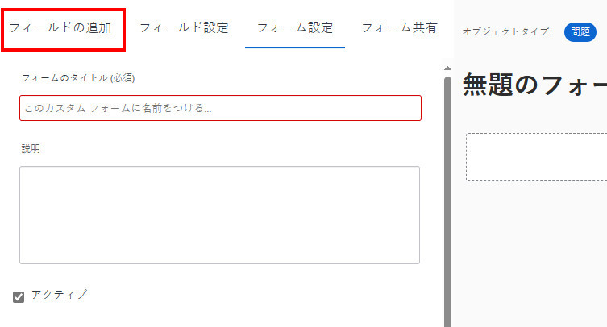
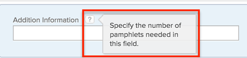

# 従来のフォームビルダーを使用したカスタムフォームへのカスタムフィールドの追加

カスタムフォームの作業を行っている場合、新規カスタムフィールドを作成してカスタムフォームに追加できます。

また、別のカスタムフォームに既に追加されているカスタムフィールドを追加することもできます。その手順については、[カスタムフォームでのカスタムフィールドまたはウィジェットの再利用](../../../administration-and-setup/customize-workfront/create-manage-custom-forms/reuse-an-existing-field.md)を参照してください。

カスタムフォームへのアセットウィジェットの追加（カスタムフィールドの追加と似たプロセス）については、[カスタムフォームでのアセットウィジェットの追加または編集](../../../administration-and-setup/customize-workfront/create-manage-custom-forms/add-widget-or-edit-its-properties-in-a-custom-form.md)を参照してください。

>[!NOTE]
>
>カスタムフォームに多数のカスタムフィールドが含まれている場合や、カスタムフォームのカスタムフィールドに多数の複数選択オプションがある場合は、ユーザーがこれらのフィールドの値を追加または変更する際にパフォーマンスが低下する可能性があります。例えば、100 個のカスタムフィールドや、200 個を超える選択肢を持つ複数選択カスタムフィールドを含んだフォームをユーザーが操作すると、処理に時間がかかる場合があります。

## アクセス要件

この記事の手順を実行するには、以下を保有している必要があります。

<table style="table-layout:auto"> 
 <col> 
 <col> 
 <tbody> 
  <tr data-mc-conditions=""> 
   <td role="rowheader"> 
Adobe Workfront プラン*
 </td> 
   <td>任意</td> 
  </tr> 
  <tr> 
   <td role="rowheader">Adobe Workfront ライセンス*</td> 
   <td>プラン</td> 
  </tr> 
  <tr data-mc-conditions=""> 
   <td role="rowheader">アクセスレベル設定*</td> 
   <td> 
カスタムフォームへの管理アクセス権
 
Workfront 管理者がこのアクセス権を付与する方法について詳しくは、<a href="../../../administration-and-setup/add-users/configure-and-grant-access/grant-users-admin-access-certain-areas.md" class="MCXref xref">特定のエリアに対する管理者アクセス権をユーザーに付与</a>を参照してください。
 </td> 
  </tr>  
 </tbody> 
</table>

&#42;ご利用のプラン、ライセンスタイプまたはアクセスレベル設定を確認するには、Workfront 管理者にお問い合わせください。

## カスタムフォームへのカスタムフィールドの追加

1. [カスタムフォームの作成または編集](../../../administration-and-setup/customize-workfront/create-manage-custom-forms/create-or-edit-a-custom-form.md)の説明に従って、カスタムフォームの作成または編集を開始します。
1. 「**フィールドの追加**」タブをを開きます。

   

1. 「**新しいフィールド**」 を選択したうえで、次のいずれかのフィールドタイプを選択します。

   <table style="table-layout:auto"> 
    <col> 
    </col> 
    <col> 
    </col> 
    <tbody> 
     <tr> 
      <td role="rowheader">1 行のテキストフィールド</td> 
      <td>フィールドに 1 行のテキストを入力できます。</td> 
     </tr> 
     <tr> 
      <td role="rowheader">段落テキストフィールド</td> 
      <td>フィールドに複数行のテキストを入力できます。</td> 
     </tr> 
     <tr data-mc-conditions=""> 
      <td role="rowheader">書式付きテキストフィールド</td> 
      <td>フィールドに複数行のテキストを入力し、太字、斜体、下線、箇条書き、番号付きリスト、ハイパーリンクおよびブロック引用符でテキストを書式設定できます。これは、Workfront オブジェクトのホーム、更新エリア、リストおよび詳細エリアで使用できます。文字数の上限が 15,000 字なので、たくさんのテキストと書式設定を入力できます。
 
API を使用したこのフィールドへのアクセスについては、<a href="../../../administration-and-setup/customize-workfront/create-manage-custom-forms/rich-text-field-storage-in-the-api.md" class="MCXref xref">API でのリッチテキストフィールドの保存</a>を参照してください。
 
<b>メモ</b>：書式付きテキストフィールドは、Workfront モバイルアプリでは利用できません（今後のリリースで利用可能になる予定）。 
 </td> 
     </tr> 
     <tr> 
      <td role="rowheader">ドロップダウン</td> 
      <td>ドロップダウン選択肢のリストを表示します。</td> 
     </tr> 
     <tr> 
      <td role="rowheader">先行入力 </td> 
      <td>Workfront に存在するオブジェクトの名前を入力できます。ユーザーが入力し始めると、候補のリストが表示されます。
このフィールドタイプでは、次のオブジェクトをサポートしています。
      <ul><li>ユーザー</li>
      <li>グループ</li>
      <li>担当業務</li>
      <li>ポートフォリオ</li>
      <li>プログラム</li>
      <li>プロジェクト</li>
      <li>チーム</li>
      <li>テンプレート</li>
      <li>会社</li>
      </ul>      
      </td> 
     </tr> 
     <tr> 
      <td role="rowheader">計算済み</td> 
      <td>式を定義し、結果をカスタムフォームに表示できます。詳しくは、<a href="../../../administration-and-setup/customize-workfront/create-manage-custom-forms/add-calculated-data-to-custom-form.md" class="MCXref xref">計算データをカスタムフォームに追加</a>を参照してください。</td> 
     </tr> 
     <tr> 
      <td role="rowheader">日付</td> 
      <td>ユーザーが日時を選択できるカレンダーを表示します。</td> 
     </tr> 
     <tr> 
      <td role="rowheader">チェックボックス</td> 
      <td>ユーザーが複数選択できるようにします。</td> 
     </tr> 
     <tr> 
      <td role="rowheader">ラジオボタン</td> 
      <td>ユーザーは選択肢を 1 つだけ選ぶ必要があります。</td> 
     </tr> 
     <tr> 
      <td role="rowheader">説明テキスト</td> 
      <td>Workfront の外部のページに手順とリンクを含めることができます。</td> 
     </tr> 
     <tr> 
      <td role="rowheader">セクション区切り</td> 
      <td>セクション区切りは、実際にはフィールドではありません。セクション区切りを使用して、カスタムフィールドとウィジェットをセクションに整理し、必要に応じて、セクションごとに異なる表示および編集権限を設定できます。セクション区切りの追加と設定については、<a href="../../../administration-and-setup/customize-workfront/create-manage-custom-forms/add-a-section-break-to-a-custom-form.md" class="MCXref xref">カスタムフォームにセクション区切りを追加</a>を参照してください。</td> 
     </tr> 
    </tbody> 
   </table>

   >[!NOTE]
   >
   >チェックボックスやドロップダウンなど、複数の選択が可能なフィールドは、レポートでグラフ化やグループ化が困難です。 レポートでのグラフ作成とグループ化を容易にするために、各選択肢に対して個別のフィールド（1 行のテキストフィールドなど）を作成できます。

1. 「**フィールド設定**」タブで、追加するカスタムフィールドのタイプに使用できるオプションを設定します。

   <table style="table-layout:auto"> 
    <col> 
    </col> 
    <col> 
    </col> 
    <tbody> 
     <tr> 
      <td role="rowheader">ラベル</td> 
      <td> 
（必須）カスタムフィールドの上に表示する説明ラベルを入力します。ラベルはいつでも変更できます。
 
<b>重要</b>：このラベルでは特殊文字を使用しないでください。レポートでは正しく表示されません。
 </td> 
     </tr> 
     <tr> 
      <td role="rowheader">名前</td> 
      <td> 
（必須）カスタムフィールドを Workfront 全体の様々なエリア（レポート、ホーム、API の操作など）に追加した場合、この名前は、システムでカスタムフィールドを識別するために使われます。
 
初めてカスタムフィールドを設定してラベルを入力すると、それに一致するように、名前フィールドが自動的に入力されます。ただし、ラベルフィールドと名前フィールドは同期されません。これにより、システムで表示される名前を変更することなく、ユーザーに表示されるラベルを自由に変更できます。
 
      
<b>重要</b>：   
      <ul> 
      <li>こうすることは可能ですが、ご自身や他のユーザーが Workfront でカスタムフォームを使用し始めた後は、この名前を変更しないことをお勧めします。変更してしまうと、Workfront の他の領域で参照される可能性のあるカスタムフィールドが認識されなくなります。 
例えば、カスタムフィールドをレポートに追加し、後で名前を変更した場合、Workfront はレポート内のフィールドを認識せず、新しい名前でレポートに再追加しない限り、正しく機能しなくなります。
 </li>
      <li> 
組み込みの Workfront フィールドに既に使用されている名前は、入力しないことをお勧めします。
 </li>
      <li>
Workfront の様々なエリアでフィールドを使用する際のエラーを防止するため、カスタムフィールド名にはピリオドやドット「.」を使用しないことをお勧めします。
</li>
      </ul> 
それぞれのカスタムフィールド名は、組織の Workfront インスタンス内で一意である必要があります。これにより、既に作成されたものを別のカスタムフォームに再利用できます。詳しくは、<a href="#Add" class="MCXref xref">カスタムフォームにカスタムフィールドを追加</a>を参照してください。
 </td>
     </tr> 
     <tr> 
      <td role="rowheader">手順</td> 
      <td> 
カスタムフィールドに関する追加情報を入力します。ユーザーがカスタムフォームに入力する際に、疑問符アイコンの上にポインタを合わせると、ここに入力した情報を含むツールヒントが表示されます。
 
      
  

      </td> 
     </tr> 
     <tr> 
      <td role="rowheader">形式</td> 
      <td> 
カスタムフィールドに取り込むデータのタイプを選択します。フォームの保存後に形式の選択を変更できますが、新しい形式は入力値に対応している必要があります。

   
<strong>例：</strong>1 つ以上のオブジェクトにテキスト形式のフィールドの数値を保存し、後でその形式を数値または通貨に変更した場合、エラーは発生しません。 

      
ただし、1 つ以上のオブジェクトで、テキスト形式のフィールドに英数字の値を保存し、その形式を数値または通貨に変更しようとすると、保存された英数字の値が数値形式や通貨形式と互換性がないため、エラーが発生します。 

   </td> 
     </tr> 
     <tr> 
      <td role="rowheader">表示タイプ</td> 
      <td>（ドロップダウン、チェックボックス、ラジオボタンのみ）フィールドに必要なオプション選択のタイプを切り替えます。</td> 
     </tr> 
     <tr> 
      <td role="rowheader">サイズ</td> 
      <td>（テキストフィールドのみ）フィールドの幅を選択します。</td> 
     </tr> 
     <tr> 
      <td role="rowheader">時刻の表示</td> 
      <td>（日付フィールドのみ）日付と共に時刻をフィールドに表示する場合は、このオプションを選択します。</td> 
     </tr> 
     <tr> 
      <td role="rowheader">参照オブジェクト タイプ</td> 
      <td> 
（先行入力フィールドのみ）フィールドに関連付けるオブジェクトのタイプを選択します。
 
「適用」または「保存して閉じる」をクリックした後は、フィールドのオブジェクトのタイプを変更できません。
 
<b>メモ</b>：   
        <ul> 
         <li>Workfront 管理者が Workfront ユーザーインターフェイスでポートフォリオ、プログラム、またはプロジェクトの名前をカスタマイズした場合、このドロップダウンリストには、カスタマイズされた名前ではなく、オブジェクトのデフォルトの Workfront 名が表示されます。これについてサポートが必要な場合は、Workfront 管理者にお問い合わせください。 </li> 
         <li>iOS および Android Workfront Mobile アプリでは、ユーザー、会社、グループ、担当業務、ポートフォリオ、プログラム、プロジェクト、テンプレートの各オブジェクトタイプがサポートされています。</li> 
        </ul> 
 </td> 
     </tr> 
     <tr data-mc-conditions=""> 
      <td role="rowheader">フィルターの追加</td> 
      <td> 
（先行入力フィールドのみ）オブジェクトタイプにフィルターを追加して、ユーザーがフィールドを使用する際に選択できるオブジェクトを制限します。 
 
例えば、以下の条件を満たすユーザー名のみを選択できるようにフィールドを制限することができます。
 
       <ul> 
        <li>自分が指定した 1 つ以上のグループに属している</li> 
        <li>自分が指定した役割または職位に関連付けられている</li> 
        <li>フィールドを使用するユーザーと同じグループに属している</li> 
       </ul> 
テキストモードの構文を使用して、選択したオブジェクトタイプのフィルターを定義する必要があります。テキストモードを使用したフィルターの作成に関する詳細情報は、<a href="../../../reports-and-dashboards/reports/text-mode/understand-text-mode.md" class="MCXref xref">テキストモードの概要</a>の記事にある<a href="../../../reports-and-dashboards/reports/text-mode/understand-text-mode.md#editing2" class="MCXref xref">フィルターでテキストモードを編集</a>の節を参照してください。 
 
<b>メモ</b>：   
        <ul> 
         <li>既存のカスタムフォームを編集している場合、先行入力フィールドにフィルターを追加しても、ユーザーがフィールドを使用して既に追加した（フィルターの範囲外の）オブジェクトは削除されません。</li> 
         <li>このフィルターは、モバイルデバイスでは使用できません。先行入力フィールドにフィルターを使用すると、このフィールドは、フィルターの影響を受けずに、ユーザーのモバイルデバイスに表示されます。</li> 
        </ul> 
 </td> 
     </tr> 
     <tr> 
      <td role="rowheader">説明テキスト</td> 
      <td>（説明テキストフィールドのみ）カスタムフォーム上の手順やリンクを提供するために表示するテキストを入力します。 </td> 
     </tr> 
     <tr> 
      <td role="rowheader">ハイパーリンク</td> 
      <td>（説明テキストフィールドのみ）入力した説明テキストにハイパーリンクを適用する場合は、ここに追加します。</td> 
     </tr> 
     <tr> 
      <td role="rowheader">必須フィールドを作成</td> 
      <td>ユーザーにカスタムフォームを完了させるために、このフィールドを必須にしたい場合は、このオプションを選択します。 </td> 
     </tr> 
     <tr> 
      <td role="rowheader">更新フィードでフィールドの変更を追跡</td> 
      <td>
ドロップダウンリストをクリックし、フィールドの値の変更を自動的に追跡するオブジェクトタイプを選択します。
 
      
<b>メモ</b>：このオプションは、以下の場合は使用できません。
 
      <ul> 
      <li>費用、会社、イテレーション、請求記録、グループのオブジェクトタイプに関連付けられたカスタムフォーム。</li> 
      <li>計算済み、説明テキストおよびセクション区切りのフィールドタイプ</li> 
      </ul>
      
<b>重要</b>：ここでオブジェクトタイプの選択または選択解除を行うと、選択したオブジェクトタイプに関連付けられ、このフィールドを含むすべてのカスタムフォームに影響します。例えば、ここでオブジェクトタイプを選択解除し、カスタムフォームを保存すると、このフィールドを含むカスタムフォームでは、そのオブジェクトタイプに対するフィールドの値の変更は追跡されなくなります。

       
ここでフィールドのオブジェクトタイプを選択し、カスタムフォームを保存すると、このフィールドは、「設定」のフィードのアップデートエリアにある「カスタムフィールド」タブに表示されます。
 
       
逆に、「設定」のフィードのアップデートエリアでこのフィールドを削除した場合、この設定のオブジェクトタイプは、そのオブジェクトタイプに関連付けられ、このフィールドを含むすべてのカスタムフォームで選択解除されます。
 
       
詳しくは、<a href="../../../administration-and-setup/set-up-workfront/system-tracked-update-feeds/configure-system-updates.md" class="MCXref xref">システムアップデートを設定</a>の記事にある <a href="../../../administration-and-setup/set-up-workfront/system-tracked-update-feeds/configure-system-updates.md#adding-fields-to-the-update-feeds" class="MCXref xref">Workfront で追跡するフィールドを追加</a>の節を参照してください。
 </td> 
     </tr> 
     <tr> 
      <td role="rowheader">ロジックを追加</td> 
      <td>ユーザーが既存のフィールドで行った選択に基づいて、フォームに表示するフィールドを指定します。詳しくは、<a href="../../../administration-and-setup/customize-workfront/create-manage-custom-forms/display-or-skip-logic-custom-form.md" class="MCXref xref">表示ロジックの追加とカスタムフォームへのロジックのスキップ</a>を参照してください。</td> 
     </tr> 
     <tr> 
      <td role="rowheader">選択肢 </td> 
      <td> 
（ドロップダウン、チェックボックス、ラジオボタンのみ。オプション）
 
       <ol> 
        <li> 
<b>オプション</b>をクリックし、以下のいずれかを有効にします。
 
           <ul> 
            <li><strong>値を表示</strong>：それぞれの選択値をフィールドに表示します。それぞれの選択のラベルは、デフォルトで表示されます。</li> 
            <li><strong>A～Z で順に選択肢を並べ替える</strong>：フィールドに追加した選択肢をアルファベット順に並べ替えます。</li> 
           </ul> 
        </li> 
        <li> 
ユーザーに追加するそれぞれの選択肢に対して、「歯車」アイコンをクリックし、以下のオプションのいずれかを選択します。
 
           <ul> 
            <li><strong>デフォルトで選択</strong>：フィールドでデフォルトの選択肢を選択します。</li> 
            <li> 
<strong>選択肢を非表示</strong>：フィールドで選択肢を非表示にします。非表示された選択肢は、レポート内で引き続きアクセスできます。
 </li> 
            <li> 
<strong>選択肢を削除</strong>：フィールドから選択肢を削除します。
 
<b>警告</b>：この選択肢を使用する現在のオブジェクトがある場合は、フィールドから削除しないでください。削除すると、履歴データが失われる可能性があります。その代わりに、非表示にするオプションを選択します。これにより、ユーザーは今後このオプションを選択できなくなります。
 </li> 
           </ul> 
        </li> 
       </ol> </td> 
     </tr> 
    </tbody> 
   </table>

1. （条件付き）カスタムフォーム上のフィールドの表示タイプを変更するには、**表示タイプ**&#x200B;ドロップダウンメニューをクリックし、目的のタイプをクリックします。

   次のフィールド表示タイプ間で切り替えることができます。

   * **選択タイプのフィールド**：チェックボックス、ドロップダウン、ラジオボタン。
   * **テキストタイプのフィールド**：1 行のテキストフィールド、段落テキストフィールド。（書式設定のあるテキストフィールドを別の表示タイプに切り替えることはできません。ただし、削除して別のタイプのフィールドを追加することはできます。）

   例えば、「チェックボックス」フィールドを作成した場合は、そのフィールドを「ドロップダウン」フィールドまたは「ラジオボタン」フィールドに変更できます。また、1 行のテキストフィールドを作成した場合は、そのフィールドを段落テキストフィールドに変更できます。

   >[!NOTE]
   >
   >フィールドの表示タイプを、チェックボックスフィールドまたは複数選択ドロップダウンフィールド（複数のオプションを選択できるドロップダウン）から単一選択フィールドタイプに変更する場合には、以下の点を考慮してください。
   >
   >* ラジオボタンに変更した場合、Workfront は、ユーザーがフォームの任意の部分でデータを変更して保存するまで、フィールドに入力した複数選択値を保持します。この時点で、複数選択タイプのフィールドを使用して選択された値は、選択されたラジオボタンの値に置き換えられます。
   >* 単一選択ドロップダウンに変更した場合、Workfront は、ユーザーがフィールドの値を変更して保存するまで、ユーザーがフィールドに入力した複数選択値を保持します。この時点で、複数選択タイプのフィールドを使用して選択した値は、選択したドロップダウン値に置き換えられます。

1. （オプション）手順 2～6 を繰り返して、他のカスタムフィールドを追加します。

   または

   [カスタムフォームでカスタムフィールドまたはウィジェットを再利用する](../../../administration-and-setup/customize-workfront/create-manage-custom-forms/reuse-an-existing-field.md#add)の説明に従って、組織用に既に作成されているフィールドを追加します。

   >[!NOTE]
   >
   >1 つのカスタムフォームに最大 500 個のフィールドやウィジェットを追加できます。ただし、フォームに 100 を超えるフィールドやウィジェットが存在する場合は、その複雑さに応じてパフォーマンスの低下が生じる可能性があります。複雑なフォームの例としては、カスケードパラメーターを含むフォーム、計算済みカスタムデータフィールドを含むフォーム、単一のフィールドに複数の値オプションを含むフォームなどがあります。

1. 「**適用**」をクリックします。
1. 他の方法でカスタムフォームの作成を続ける場合は、以下の記事のいずれかに進みます。

   * [カスタムフォーム内にカスタムフィールドおよびウィジェットを配置](../../../administration-and-setup/customize-workfront/create-manage-custom-forms/position-fields-in-a-custom-form.md)
   * [カスタムフォーム内でアセットウィジェットを追加または編集](../../../administration-and-setup/customize-workfront/create-manage-custom-forms/add-widget-or-edit-its-properties-in-a-custom-form.md)
   * [計算データをカスタムフォームに追加](../../../administration-and-setup/customize-workfront/create-manage-custom-forms/add-calculated-data-to-custom-form.md)
   * [カスタムフォームにセクション区切りを追加](../../../administration-and-setup/customize-workfront/create-manage-custom-forms/add-a-section-break-to-a-custom-form.md)
   * [カスタムフォームで既存の計算カスタムフィールドを再利用](../../../administration-and-setup/customize-workfront/create-manage-custom-forms/use-existing-calc-field-new-custom-form.md)
   * [表示ロジックの追加とカスタムフォームへのロジックのスキップ](../../../administration-and-setup/customize-workfront/create-manage-custom-forms/display-or-skip-logic-custom-form.md)
   * [カスタムフォームのプレビューと完了](../../../administration-and-setup/customize-workfront/create-manage-custom-forms/preview-and-complete-a-custom-form.md)
