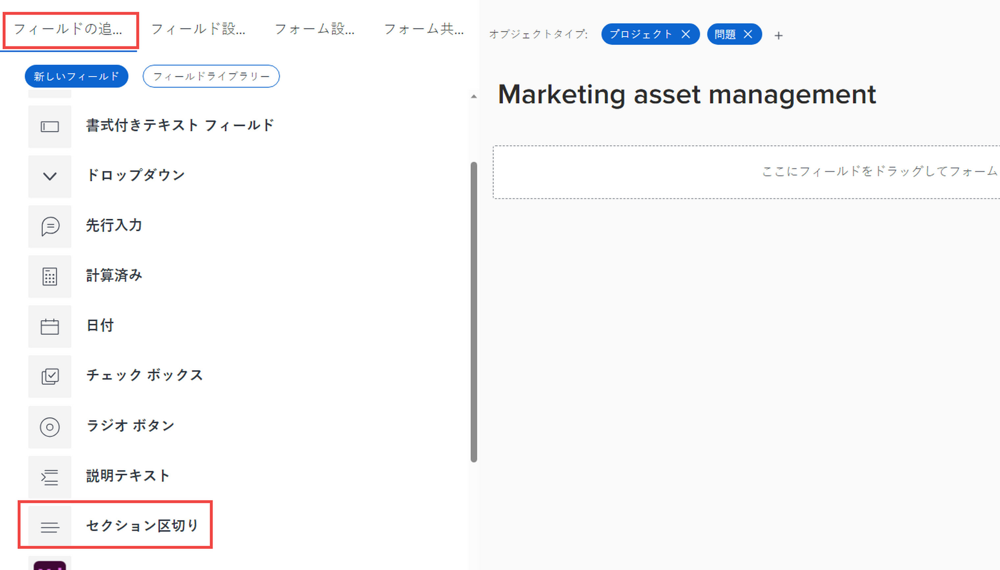

# レガシーフォームビルダーを使用したカスタムフォームへのセクション区切りの追加

カスタムフォームのカスタムフィールドとウィジェットを、見出し付きのセクションにグループ化できます。これは、フォームに入力するユーザーに、整理されたエクスペリエンスを提示する場合に役立ちます。また、特定のカスタムフィールドとウィジェットへのアクセスを特定のユーザーに制限する必要がある場合は、それらをセクションに配置し、そのセクションへのアクセス権をそれらのユーザーにのみ付与することができます。

例えば、システム管理者だけが表示または編集できる機密情報を追跡する必要がある場合は、「管理者のみ」の権限を持つセクション区切りを作成し、そのセクションに機密フィールドを配置できます。

セクションに選択するアクセス設定は、カスタムフォームが添付される Workfront オブジェクトに対してユーザーが持つ権限に直接関連付けられます。ユーザーがそのオブジェクトの表示、投稿、管理に対するアクセス権を持っているかどうかに基づいて、セクションの表示と非表示を切り替えることができます。また、セクションを「管理者のみ」に設定して、システム管理者のアクセスレベルを持つユーザーのみにアクセスを制限することもできます。

オブジェクトに対する権限については、[オブジェクトに対する権限の共有の概要](../../../workfront-basics/grant-and-request-access-to-objects/sharing-permissions-on-objects-overview.md)を参照してください。

カスタムフォームのカスタムフィールドおよびウィジェットについては、[カスタムフォームへのカスタムフィールドの追加](../../../administration-and-setup/customize-workfront/create-manage-custom-forms/add-a-custom-field-to-a-custom-form.md)と[カスタムフォームのアセットウィジェットの追加または編集](../../../administration-and-setup/customize-workfront/create-manage-custom-forms/add-widget-or-edit-its-properties-in-a-custom-form.md)を参照してください。

<!--
>[!TIP]
>
>Section breaks that you add to custom forms are saved in your system for re-use. For information about listing them, see [List and edit custom forms and widgets added to custom forms](../../../administration-and-setup/customize-workfront/create-manage-custom-forms/list-edit-share-custom-forms-and-custom-fields.md).
-->

## アクセス要件

この記事の手順を実行するには、以下を保有している必要があります。

<table style="table-layout:auto"> 
 <col> 
 <col> 
 <tbody> 
  <tr data-mc-conditions=""> 
   <td role="rowheader"> 
Adobe Workfront プラン
 </td> 
   <td>任意</td> 
  </tr> 
  <tr> 
   <td role="rowheader">Adobe Workfront ライセンス</td> 
   <td>
   
新規：標準

   
現在：プラン
</td> 
  </tr> 
  <tr data-mc-conditions=""> 
   <td role="rowheader">アクセスレベル設定</td> 
   <td> 
カスタムフォームへの管理アクセス権
</td> 
  </tr>  
 </tbody> 
</table>

この表の情報の詳細については、 [Workfrontドキュメントのアクセス要件](/help/quicksilver/administration-and-setup/add-users/access-levels-and-object-permissions/access-level-requirements-in-documentation.md).

## カスタムフォームのセクションにアクセス権を作成および設定する

1. [カスタムフォームの作成または編集](../../../administration-and-setup/customize-workfront/create-manage-custom-forms/create-or-edit-a-custom-form.md)の説明に従って、カスタムフォームの作成または編集を開始します。
1. [カスタムフォームへのカスタムフィールドの追加](../../../administration-and-setup/customize-workfront/create-manage-custom-forms/add-a-custom-field-to-a-custom-form.md)と[カスタムフォームのアセットウィジェットの追加または編集](../../../administration-and-setup/customize-workfront/create-manage-custom-forms/add-widget-or-edit-its-properties-in-a-custom-form.md)の説明に従って、フォームにカスタムフィールドおよびウィジェットを追加します。

1. カスタムフォームの作成または編集中に、「**フィールドの追加**」タブで「**セクション区切り**」をクリックします。

   

1. 「**フィールド設定**」タブで、セクションに必要な次のオプションを設定します。

   <table style="table-layout:auto"> 
    <col> 
    </col> 
    <col> 
    </col> 
    <tbody> 
     <tr> 
      <td role="rowheader">ラベル</td> 
      <td> 
（必須）セクションの上に表示する説明的なラベルを入力します。ラベルはいつでも変更できます。
 
<b>重要</b>：このラベルでは特殊文字を使用しないでください。レポートでは正しく表示されません。
 </td> 
     </tr> 
     <tr> 
      <td role="rowheader">説明</td> 
      <td>ユーザーにセクションの目的を説明する場合は、テキストを入力します。このテキストは、カスタムフォームのセクションのラベルの下に表示されます。</td> 
     </tr> 
     <tr> 
      <td role="rowheader">
ロジックを追加
</td> 
      <td>
表示ロジックを使用して、ユーザーがフォームに入力する際に複数選択カスタムフィールドで行った選択に基づいて、セクションをフォームに表示するかどうかを指定します。

<strong>注意：</strong> セクション区切りの下の個々のフィールドに適用された表示ロジックがすべて適用され、ロジックの結果としてすべて非表示になった場合、セクション全体がカスタムフォームで非表示になります。 これは、表示ロジックが断面分割に適用されていない場合でも発生します。

詳しくは、<a href="../../../administration-and-setup/customize-workfront/create-manage-custom-forms/display-or-skip-logic-custom-form.md" class="MCXref xref">カスタムフォームへの表示ロジックとスキップロジックの追加</a>を参照してください。
</td> 
     </tr> 
     <tr> 
      <td role="rowheader"> 
アクセスを許可
 </td> 
      <td> 
 このセクションを表示し、そのフィールド値を編集するために、カスタムフォームが添付されるオブジェクトに対してユーザーが必要とする権限を選択します。
       
次の権限は、「<b>オブジェクトに対してこのアクセス権を持つユーザーは、次のフィールド値を表示できます :</b>」で利用できます。
 
         <ul>
          <li><strong>表示</strong>：オブジェクトに対する権限の表示</li>
          <li>
<b>制限付き編集</b>：（オブジェクトがプロジェクト、タスク、イシュー、またはユーザーの場合にのみ使用できます）。
 
          
プロジェクト、タスク、またはイシューの場合、ユーザーがオブジェクトに投稿できるようにします。

          
ユーザーがプロファイルを編集したり、オブジェクト（ユーザーの場合）に対するプロファイル権限を所有したりできます。
</li> 
          <li><b>編集</b>：オブジェクトに対する管理権限 </li> 
          <li><b>管理者のみ</b>：システム管理者のアクセスレベル</li> 
         </ul> </li> 
        
次の権限は、「<b>オブジェクトに対してこのアクセス権を持つユーザーは、次のフィールド値を表示できます :</b>」で利用できます。 
 
         <ul> 
          <li> 
<b>制限付き編集</b>：（オブジェクトがプロジェクト、タスク、イシュー、またはユーザーの場合にのみ使用できます）。
 
           
オブジェクトがプロジェクト、タスク、またはイシューの場合、この権限を持つユーザーはオブジェクトに投稿できる

          
オブジェクトがユーザーの場合、この権限を持つユーザーは、プロファイルを編集したり、そのオブジェクトに対するプロファイル権限を所有したりできます。
 
          <li><b>編集</b>：オブジェクトに対する管理権限 </li> 
          <li><b>管理者のみ</b>：システム管理者のアクセスレベル</li> 
         </ul> </li> 
       </ul> 
       
オブジェクトに対する権限について詳しくは、<a href="../../../workfront-basics/grant-and-request-access-to-objects/sharing-permissions-on-objects-overview.md" class="MCXref xref">オブジェクトに対する共有権限の概要</a>を参照してください。
 
       
<b>メモ</b>：  
       <ul> 
       <li> 
ここで指定した権限を持たないユーザーは、セクションのカスタムフィールドとウィジェットを表示できません。 
 
これは、フィールドの値をレポートに表示する場合や、テキストモードのレポートの計算フィールドで使用する場合にも当てはまります。
 </li> 
       <li> 
複数のオブジェクトタイプをフォームに関連付けると、これらの手順で使用できる表示および編集権限が変更される場合があります。詳しくは、この記事内の<a href="#how-multiple-object-types-can-affect-section-break-permissions-in-a-custom-form" class="MCXref xref">複数のオブジェクトタイプが、カスタムフォームのセクション区切り権限に与える影響</a>を参照してください。
 </li> 
        </ul> 
 </td> 
     </tr> 
    </tbody> 
   </table>

1. 1 つ以上のカスタムフィールドまたはウィジェットを新しいセクションにドラッグまたは追加します。

   これは、セクションを保存する前に必要です。

1. 「**完了**」をクリックします。

   >[!TIP]
   >
   >カスタムフォームの作成中に「**適用**」をクリックすると、変更内容を保存してフォームを開いたままにすることができます。

1. 他の方法でカスタムフォームの作成を続ける場合は、以下の記事のいずれかに進みます。

   * [カスタムフォームへのカスタムフィールドの追加](../../../administration-and-setup/customize-workfront/create-manage-custom-forms/add-a-custom-field-to-a-custom-form.md#add2)
   * [カスタムフォームでのアセットウィジェットの追加または編集](../../../administration-and-setup/customize-workfront/create-manage-custom-forms/add-widget-or-edit-its-properties-in-a-custom-form.md)
   * [カスタムフォームへの計算データの追加](../../../administration-and-setup/customize-workfront/create-manage-custom-forms/add-calculated-data-to-custom-form.md)
   * [カスタムフォーム内でのカスタムフィールドおよびウィジェットの配置](../../../administration-and-setup/customize-workfront/create-manage-custom-forms/position-fields-in-a-custom-form.md)
   * [カスタムフォームへの表示ロジックとスキップロジックの追加](../../../administration-and-setup/customize-workfront/create-manage-custom-forms/display-or-skip-logic-custom-form.md)
   * [カスタムフォームのプレビューと完了](../../../administration-and-setup/customize-workfront/create-manage-custom-forms/preview-and-complete-a-custom-form.md)

<!--
DRAFTED IN FLARE:
<h2>Configure access for fields without section breaks</h2>

************This section might get added later. Team decided not to implement.

In a custom form, you can also control users' access to custom fields
and image widgets that are not placed inside a defined section.

<ol>
<li value="1">Begin creating or editing a custom form, as described in <a href="../../../administration-and-setup/customize-workfront/create-manage-custom-forms/create-or-edit-a-custom-form.md" class="MCXref xref">Create or edit a custom form</a>.</li>
<li value="2">Add custom fields

and widgets

to the form, as described in <a href="../../../administration-and-setup/customize-workfront/create-manage-custom-forms/add-a-custom-field-to-a-custom-form.md" class="MCXref xref">Add a custom field to a custom form</a>.</li>
<li value="3"> 
While still creating or editing the custom form, open the <b>Form settings</b> tab.
 
SHOW THIS 
 </li>
<li value="4"> 
Under <b>Grant access</b>, configure the permissions that users need on an object where the custom form is attached, in order to view and edit values in fields not placed under a section break. 
 
If you need information about permissions on objects, see <a href="../../../workfront-basics/grant-and-request-access-to-objects/sharing-permissions-on-objects-overview.md" class="MCXref xref">Overview of sharing permissions on objects</a>.
 <note type="note">
<ul>
<li> 
Users without the permissions you specify here can't see the values of the fields
and image widgets that are not placed in a defined section in the custom form. This is also true if you display the values in reports or use them in calculated fields in text mode reporting.
 </li>
<li> 
Associating multiple object types with your form can change the viewing and editing permissions that are available in these steps. For more information, see <a href="#how-multiple-object-types-can-affect-section-break-permissions-in-a-custom-form" class="MCXref xref">How multiple object types can affect section break permissions in a custom form</a> in this article.
 </li>
</ul>
</note>
<table style="table-layout:auto">
<col>
<col>
<tbody>
<tr>
<td role="rowheader"><b>Users with this access to the object can view field values</b> </td>
<td>
<ul>  
<li> 
<b>Limited Edit</b>: (Available only if the object is a project, task, issue, or user):

<ul>
<li> 
Contribute permission to the object if it's a project, task, or issue
 </li>
<li> 
Edit the profile or own the profile permission to the object if it's a user (profile)
 </li>
</ul> </li>
<li><b>Edit</b>: Manage permissions to the object </li>
<li><b>Admin only</b>: System Administrator access level</li>
</ul> </td>
</tr>
<tr>
<td role="rowheader">Users with this access to the object can edit field values</td>
<td>
<ul>
<li> 
<b>Limited Edit</b>: (Available only if the object is a project, task, issue, or user):

<ul>
<li> 
Contribute permission to the object if it's a project, task, or issue
 </li>
<li> 
Edit the profile or own the profile permission to the object if it's a user (profile)
 </li>
</ul> </li>
<li><b>Edit</b>: Manage permissions to the object </li>
<li><b>Admin only</b>: System Administrator access level</li>
</ul> </td>
</tr>
</tbody>
</table> </li>
<li value="5"> 
Click Done.
 <note type="tip">
You can click
<strong>Apply</strong> at any point while you are creating a custom form to save your changes and keep the form open.
</note> </li>
<li value="6"> 
If you want to continue building your custom form in other ways, continue on to one of the following articles:

<ul>
<li><a href="../../../administration-and-setup/customize-workfront/create-manage-custom-forms/add-a-custom-field-to-a-custom-form.md#add2" class="MCXref xref">Add a custom field to a custom form</a> </li>
<li><a href="../../../administration-and-setup/customize-workfront/create-manage-custom-forms/add-widget-or-edit-its-properties-in-a-custom-form.md" class="MCXref xref">Add or edit an asset widget in a custom form</a> </li>
<li><a href="../../../administration-and-setup/customize-workfront/create-manage-custom-forms/add-calculated-data-to-custom-form.md" class="MCXref xref">Add calculated data to a custom form</a> </li>
<li><a href="../../../administration-and-setup/customize-workfront/create-manage-custom-forms/position-fields-in-a-custom-form.md" class="MCXref xref">Position custom fields and widgets in a custom form</a> </li>
<li><a href="../../../administration-and-setup/customize-workfront/create-manage-custom-forms/display-or-skip-logic-custom-form.md" class="MCXref xref">Add display logic and skip logic to a custom form</a> </li>
<li><a href="../../../administration-and-setup/customize-workfront/create-manage-custom-forms/preview-and-complete-a-custom-form.md" class="MCXref xref">Preview and complete a custom form</a> </li>
</ul> </li>
</ol>

-->

## 複数のオブジェクトタイプがセクション区切り権限に与える影響 {#how-multiple-object-types-can-affect-section-break-permissions-in-a-custom-form}

カスタムフォームセクションセクション区切りの制限付き編集権限は、プロジェクト、タスク、イシューおよびユーザーのオブジェクトタイプに対してのみ使用できます。

制限付き編集権限を持つセクション区切り付きのカスタムフォームでは、他のオブジェクトタイプ（ポートフォリオ、プログラム、ドキュメント、会社、請求記録、イテレーション、費用またはグループ）をフォームに追加すると、そのオブジェクトタイプとフォーム上の既存のオブジェクトタイプの両方との互換性のある編集権限に切り替えるように指示が表示されます。

>[!INFO]
>
>**例：**&#x200B;プロジェクトオブジェクトタイプに関連付けられたカスタムフォームでは、セクション区切りは、制限付き編集権限を持つように設定されます。
>
>ポートフォリオオブジェクトタイプをフォームに追加すると、フォーム内のセクション区切りに対して「制限付き編集」権限オプションを使用できなくなります。
>
>画面上のメッセージで、編集権限に切り替えるように指示が表示されます。この権限は、プロジェクトオブジェクトタイプとポートフォリオオブジェクトタイプの両方に対応する、制限付き編集に最も類似する権限です。
