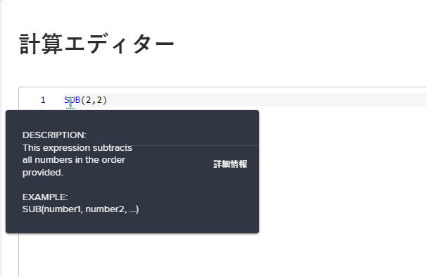
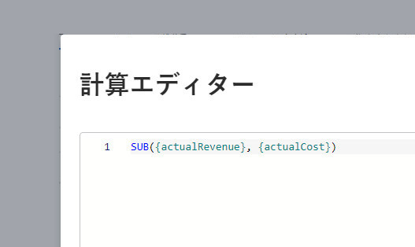
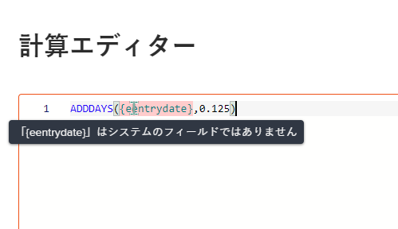
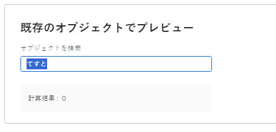

# レガシーフォームビルダーを使用して計算データをカスタムフォームに追加する

カスタムフォームでは、カスタムフォームがオブジェクトに添付される際に、既存のデータを使用して新しいデータを生成する計算済みカスタムフィールドを追加できます。

計算カスタムフィールドには、次の値を含めることができます。

* 単一の組み込みフィールドへの単純な参照です。

   >[!INFO]
   >
   > **例：** プロジェクトやタスクによって生み出される売上高を計算するには、組み込みフィールドの [ 実際の売上高 ] を含む計算済みカスタムフィールドを作成します。 ユーザーがカスタムフォームをプロジェクトまたはタスクに添付すると、そのプロジェクトまたはタスクの売上高が「 」フィールドに表示されます。

* 1 つ以上のフィールドを参照する式。 これには、カスタムフィールド、その他の計算カスタムフィールド、組み込みフィールドを使用できます。

   >[!INFO]
   >
   >**例：** プロジェクトとタスクによって生成された利益を計算するには、収益からコストを引く数式を含む、[ 利益 ] という計算カスタムフィールドを作成します。
   >
   >これを行うには、組み込みのWorkfrontフィールド（「実績コスト」と「実績売上高」）に数式 SUB （減算）を使用します。
   >
   >以下の手順で、この例の実行方法を確認できます。

組織のカスタムフォームの作成と、それらに関連付けることができるフィールドのタイプについて詳しくは、 [カスタムフォームの作成または編集](../../../administration-and-setup/customize-workfront/create-manage-custom-forms/create-or-edit-a-custom-form.md).

## アクセス要件

この記事の手順を実行するには、次の手順を実行する必要があります。

<table style="table-layout:auto"> 
 <col> 
 <col> 
 <tbody> 
  <tr data-mc-conditions=""> 
   <td role="rowheader"> 
Adobe Workfront plan*
 </td> 
   <td>任意</td> 
  </tr> 
  <tr> 
   <td role="rowheader">Adobe Workfront license*</td> 
   <td>計画</td> 
  </tr> 
  <tr data-mc-conditions=""> 
   <td role="rowheader">アクセスレベル設定*</td> 
   <td> 
カスタムフォームへの管理アクセス
 
Workfront管理者がこのアクセス権を付与する方法について詳しくは、 <a href="../../../administration-and-setup/add-users/configure-and-grant-access/grant-users-admin-access-certain-areas.md" class="MCXref xref">特定の領域に対する管理者アクセス権をユーザーに付与する</a>.
 </td> 
  </tr>  
 </tbody> 
</table>

&#42;保有しているプラン、ライセンスタイプ、アクセスレベル設定を確認するには、Workfront管理者に問い合わせてください。

## カスタムフォームに計算フィールドを追加する {#add-a-calculated-field-to-a-custom-form}

組み込みのWorkfrontフィールドと、作成済みのカスタムフィールドの両方を使用できます。

>[!IMPORTANT]
>
>新しい計算カスタムフィールドを作成する前に、計算に必要なデータがWorkfrontに確実に存在するように、含める既存のフィールドを指定します。

1. カスタムフォームの作成または編集を開始します ( [カスタムフォームの作成または編集](../../../administration-and-setup/customize-workfront/create-manage-custom-forms/create-or-edit-a-custom-form.md).

1. の **フィールドを追加** タブ、クリック **計算済み**.

   右側の表示領域に、フィールドが表示されます *12345*. これは、カスタムフォームの作成中または編集中に、そのフィールドが計算済みカスタムフィールドであることを示す単なる指標です。 フォームがオブジェクトに添付され、ユーザーがフォームに入力すると、計算の結果が「 」フィールドに表示されます。 *12345* 指標。

1. 計算フィールドに次の情報を指定します。

   <table style="table-layout:auto"> 
    <col> 
    </col> 
    <col> 
    </col> 
    <tbody> 
     <tr> 
      <td role="rowheader">ラベル</td> 
      <td>フィールドのラベルを入力します。 ユーザーがカスタムフォームを使用すると、次のような画面が表示されます。 フィールド <b>名前</b>は、自動的に入力され、Workfrontによってレポートで参照されます。</td> 
     </tr> 
     <tr> 
      <td role="rowheader" id="instructions">指示</td> 
      <td> デフォルトでは、フィールド用に作成した数式がここに格納されます。 テキストを追加して、フィールドおよびその中の数式に関する追加情報を入力できます。 これは、次の 2 つの方法で役立ちます。 
       <ul> 
        <li> 
数式の内容と仕組みを確認するために使用します。 これは、複数のフォームでこの計算済みカスタムフィールドを使用する予定がある場合に特に便利です。
 </li> 
        <li> 
フィールドの上にマウスポインターを置くと、ツールチップとしてが表示されます。 ここにテキストを追加し、ツールチップに表示させます。
 
ツールチップに数式が表示されないようにしたい場合は、数式を非表示にできます。 手順については、セクションのテーブル行「手順に数式を表示する」を参照してください <a href="#build-the-calculation-for-your-calculated-custom-field" class="MCXref xref">計算されたカスタムフィールドの計算を作成する</a> 」を参照してください。
 </li> 
       </ul> 
新しいフォームで同じ計算済みカスタムフィールドを使用する方法について詳しくは、 <a href="../../../administration-and-setup/customize-workfront/create-manage-custom-forms/use-existing-calc-field-new-custom-form.md#using-an-existing-calculated-custom-field-on-a-new-form" class="MCXref xref">カスタムフォームで既存の計算済みカスタムフィールドを再利用する</a>.
 </td> 
     </tr> 
     <tr> 
      <td role="rowheader">形式</td> 
      <td> 
フィールドの結果を保存および表示する形式です。
 
フィールドを数学計算で使用する場合は、常に <strong>数値</strong> または <strong>通貨</strong> 形式 「数値」または「通貨」を選択すると、0 から始まる数値が自動的に切り捨てられます。
 
      
<b>重要</b>:形式を選択する前に、新しいフィールドの正しい形式を考慮してください。 カスタムフォームを保存した後は、形式フィールドを編集できません。 また、誤った形式を選択すると、今後の計算や集計値がレポートやリストのグループ化に影響を受ける可能性があります。
 </td> 
     </tr> 
    </tbody> 
   </table>

1. 続行： [計算されたカスタムフィールドの計算を作成する](#build-the-calculation-for-your-calculated-custom-field) 」を参照してください。

## 計算されたカスタムフィールドの計算を作成する {#build-the-calculation-for-your-calculated-custom-field}

1. 計算済みカスタムフィールドの作成を開始します。詳しくは、「 」の節を参照してください。 [カスタムフォームに計算フィールドを追加する](#add-a-calculated-field-to-a-custom-form) 」を参照してください。

1. クリック **最大化** 開く **計算エディタ** 計算を構築します。

   >[!INFO]
   >
   >**例：** この記事の紹介の例を使用して、プロジェクトとタスクのカスタムフォームで Profit という計算済みカスタムフィールドを作成できます。 このフィールドには、実際の売上高と実際のコストの違いを表示する計算を含めることができます。
   >
   >`SUB({actualRevenue},{actualCost})`
   >
   >この例では、 `SUB` が式で、参照されるフィールドが `actualRevenue` および `actualCost`.

   演算は、通常、式で始まり、カスタムフォームがオブジェクトに添付される際に参照するフィールドを含む括弧が続きます。 使用可能な式について詳しくは、 [計算データ式](../../../reports-and-dashboards/reports/calc-cstm-data-reports/calculated-data-expressions.md).

   各フィールドは中括弧で囲む必要があります。詳しくは、 [計算カスタムフィールドに必要な構文](#syntax-required-in-calculated-custom-fields) 」を参照してください。 フィールドの名前を入力し始めると、候補が表示され、選択して計算に挿入できます。

   計算では、書式設定タイプが「テキストフィールド」と「説明テキスト」の 2 つを除き、任意の種類のカスタムフィールドを参照できます。 カスタムフィールドのタイプについて詳しくは、 [カスタムフォームにカスタムフィールドを追加する](../../../administration-and-setup/customize-workfront/create-manage-custom-forms/add-a-custom-field-to-a-custom-form.md)

1. 大きいテキストボックスをクリックし、 **式** および **フィールド** 計算に追加できます。

   また、大きなテキストボックスに式やフィールドを入力し、表示されたときに選択することもできます。 各項目は、フィールドには「F」、式には「E」が表示されます。

   始め丸括弧を入力すると、終わり丸括弧が自動的に追加されます。

   >[!TIP]
   >
   >次の操作を実行して、計算に関するヘルプを取得できます。
   > 
   >* 計算式の上にマウスポインターを置くと、説明、使用方法を示す例、記事の詳細情報への「詳細」リンクが表示されます [計算データ式](../../../reports-and-dashboards/reports/calc-cstm-data-reports/calculated-data-expressions.md).
      >  
   >* 追加したコンポーネントを識別するには、色分けを使用します。 式は青で表示され、フィールドは緑で表示されます。
      >  
   >* 計算エラーを見つけます。計算エラーはピンク色で強調表示されます。 強調表示されたエラーの上にマウスポインターを置くと、その原因に関する簡単な説明が表示されます。
      >  
   >* 計算の下の領域で、既存のWorkfrontオブジェクトの結果をプレビューします。
      ><!--or by providing test values (NOT READY YET; CHANGE THIS SCREENSHOT WHEN IT IS)-->

      >  
   >* 左側に表示される行番号を使用して長い計算で式を参照します。

1. クリック **最小化** 計算カスタムフィールドの計算を完了したとき。

   >[!NOTE]
   >
   >右側の表示領域に、フィールドが表示されます *12345.* これは、カスタムフォームの作成中または編集中に、そのフィールドが計算済みカスタムフィールドであることを示す単なる指標です。 フォームがオブジェクトに添付され、ユーザーがフォームに入力すると、計算の結果が「 」フィールドに表示されます。 *12345* 指標。

1. （オプション）次のいずれかのオプションを使用して、計算済みカスタムフィールドをさらに設定します。

   <table style="table-layout:auto"> 
    <col> 
    <col> 
    <tbody> 
     <tr> 
      <td role="rowheader">ロジックの追加</td> 
      <td>表示ロジックを追加して、フォームの入力時にユーザーが先行する複数選択フィールド（ドロップダウン、チェックボックス、ラジオボタン）で選択した項目を 1 つ以上選択した場合に、計算フィールドを表示するかどうかを決定できます。 詳しくは、 <a href="../../../administration-and-setup/customize-workfront/create-manage-custom-forms/display-or-skip-logic-custom-form.md" class="MCXref xref">表示ロジックの追加とカスタムフォームへのロジックのスキップ</a>. 
これは、フォーム上の計算済みカスタムフィールドの前に、少なくとも 1 つのチェックボックス、ラジオボタン、またはドロップダウンフィールドがある場合にのみ使用できます。 
 
計算カスタムフィールドには「論理をスキップ」を使用できません。
 </td> 
     </tr> 
     <tr> 
      <td role="rowheader">以前の計算を更新</td> 
      <td>既存の計算済みカスタムフィールドを編集している場合、このオプションをトリガーすると、カスタムフォームを保存する際に計算で更新を選択できます。 これは、カスタムフォームを保存するときに 1 回だけ発生します。 その後、「 」オプションは無効状態に戻ります。</td> 
     </tr> 
     <tr> 
      <td role="rowheader">指示内に式を表示する</td> 
      <td>カスタムフォームに入力するユーザーがフィールドの上にマウスポインターを置いたときにそのフィールドの数式を表示する場合は、このオプションを有効のままにします。 詳しくは、 <a href="#instructions" class="MCXref xref">説明</a> この表の前の説明</td> 
     </tr> 
    </tbody> 
   </table>

1. クリック **完了** すべての変更が計算カスタムフィールドで完了したら、

   または、 **適用** をクリックして、これまでにカスタムフィールドの追加を続行する場合にフォームに変更を適用します。

   または、 **保存して閉じる** すべての変更がカスタムフォームで完了したら、
1. 計算されたカスタムフィールドが正しく機能することを確認するには、カスタムフォームをオブジェクトに添付し、計算されたカスタムフィールドで結果を確認します。

   カスタムフォームを添付する手順については、 [オブジェクトへのカスタムフォームの追加](../../../workfront-basics/work-with-custom-forms/add-a-custom-form-to-an-object.md).

   他の方法でカスタムフォームの作成を続ける場合は、次の記事のいずれかに進んでください。

   * [カスタムフォームにカスタムフィールドを追加する](../../../administration-and-setup/customize-workfront/create-manage-custom-forms/add-a-custom-field-to-a-custom-form.md)
   * [カスタムフォーム内でのカスタムフィールドおよびウィジェットの配置](../../../administration-and-setup/customize-workfront/create-manage-custom-forms/position-fields-in-a-custom-form.md)
   * [カスタムフォームでのアセットウィジェットの追加または編集](../../../administration-and-setup/customize-workfront/create-manage-custom-forms/add-widget-or-edit-its-properties-in-a-custom-form.md)
   * [カスタムフォームで既存の計算済みカスタムフィールドを再利用する](../../../administration-and-setup/customize-workfront/create-manage-custom-forms/use-existing-calc-field-new-custom-form.md)
   * [表示ロジックの追加とカスタムフォームへのロジックのスキップ](../../../administration-and-setup/customize-workfront/create-manage-custom-forms/display-or-skip-logic-custom-form.md)
   * [カスタムフォームのプレビューと完了](../../../administration-and-setup/customize-workfront/create-manage-custom-forms/preview-and-complete-a-custom-form.md)

## 計算カスタムフィールドに必要な構文

各フィールドは、以下に説明する構文を使用する必要があります。各フィールド名は波括弧で囲みます。 フィールドの名前を入力し始めると、候補が表示され、選択して計算に挿入できます。 計算に誤ったデータを入力すると、警告メッセージが表示されます。 有効なフィールドと有効な計算式を含むように計算式を編集しない限り、フォームを保存できません。

>[!NOTE]
>
>現在、カスタムフォームを添付するオブジェクトで参照するフィールドの名前を入力し始めたときにのみ候補が表示されます。オブジェクトの親では表示されません。

### フィールド名を中括弧で囲む

* 計算で組み込みフィールドを参照する場合は、フィールド名を中括弧で囲む必要があります。

例： `{actualRevenue}`

フィールド名では大文字と小文字が区別され、Workfrontシステムでの表示方法を正確に計算に含める必要があります。

* 計算でカスタムフィールドを参照する場合は、フィールド名を中括弧で囲み、先頭に `DE:` を指定します。

例： `{DE:Profit}`

入力時に選択できるすべてのカスタムフィールドが一覧表示されます `DE:`.

* 計算で、 *親* オブジェクトを選択する場合は、フィールド名の前に親オブジェクトのオブジェクト型を付ける必要があります。また、中括弧で囲む必要があります。

   例えば、タスクを操作するようにカスタムフォームを設定し、フォームがタスクに添付されたときにフィールドで親オブジェクトの実際の売上高を計算する場合は、次のように指定する必要があります。 `Project` をフィールドのオブジェクトタイプとして使用します。

   `{project}.{actualRevenue}`

   また、カスタムフィールドの場合は、次のようになります。

   `{project}.{DE:profit}`

   のカスタムが複数のオブジェクトタイプに対して設定されているので、親オブジェクトのオブジェクトタイプが不明な場合は、ワイルドカードフィルタ変数を使用できます `$$OBJCODE` を使用すると、使用可能な各タイプに対して計算が機能します。 詳しくは、 [複数オブジェクトカスタムフォームの計算済みカスタムフィールド](#calculated-custom-fields-in-multi-object-custom-forms) 」を参照してください。

### 項目をピリオドで区切る

計算カスタムフィールドで関連オブジェクトを参照する場合は、オブジェクト名と属性をピリオドで区切る必要があります。

例えば、Portfolioタイプのカスタムフォームで、計算されたカスタムフィールドにタスクの所有者の名前を表示するには、次のように入力します。

`{project}.{porfolio}.{owner}`

これにより、次のことが決まります。カスタムフォームのオブジェクト（タスク）から、タスク（プロジェクト）に関連する次のオブジェクトにアクセスできます。 ここから、次の関連オブジェクト（ポートフォリオ）にアクセスし、次の関連オブジェクト（ポートフォリオ）にアクセスします。

### カスタムフィールドを参照するための名前構文

計算カスタムフィールドで別のカスタムフィールドを参照する場合は、Workfrontユーザーインターフェイスに表示されるフィールドの名前を入力する必要があります。

例えば、エグゼクティブスポンサーというラベルの付いたカスタムフィールドで選択したオプションを参照するには、次のように入力します。

`{DE:Executive sponsor}`

>[!NOTE]
>
>typeahead フィールドの構文は、他のタイプのフィールドの構文とは少し異なります。これは、 `:name` 最後に
>
>例えば、「エグゼクティブスポンサー」という名前のカスタム typeahead フィールドで選択したオプションを参照するには、次のように入力します。
>
>`{DE:Executive sponsor:name}`

## 複数オブジェクトカスタムフォームの計算済みカスタムフィールド {#calculated-custom-fields-in-multi-object-custom-forms}

複数オブジェクトのカスタムフォームでは、選択したオブジェクトタイプが、フォームの計算カスタムフィールドで参照されるすべてのフィールドと互換性を持っている必要があります。 非互換性がある場合は、調整を行うように警告するメッセージが表示されます。

>[!INFO]
>
>**例:**
>
>Task オブジェクトタイプと連携するように設定されたカスタムフォームでは、In Charge という名前の計算カスタムフィールドを作成します。 このフィールドで組み込みフィールドを参照するように設定し、フォームがタスクに添付されるたびに、担当の主な担当者の名前を表示できるようにします。
>
>`{assignedTo}.{name}`
>
>後で、カスタムフォームにプロジェクトオブジェクトタイプを追加します。 Project オブジェクトの種類が計算されたカスタムフィールドと互換性がないことを示す警告メッセージが表示されます。

この場合、次のいずれかの操作を実行できます。

* カスタムフォームから互換性のない 2 つの項目（オブジェクトタイプまたは参照先の計算カスタムフィールド）の 1 つを削除します。
* 両方の項目を保持し、ワイルドカードフィルター変数を使用します `$$OBJCODE` を IF 式の条件として使用して、「請求額」フィールドの 2 つの異なるバージョンを作成します。 これにより、フォームが関連付けられているオブジェクトの種類に関係なく、フィールドが正常に機能します。

>[!INFO]
>
>**例：** 割り当て先はありませんが、次の場所に割り当てられます。プロジェクトの「名前」フィールドには、組み込みの「所有者」フィールドがあります（手動で変更しない限り、プロジェクトを作成した人の名前が自動的に入力されます）。
>
>そのため、カスタムの「請求」フィールドで、 `$$OBJCODE` 以下に示すように、カスタムフォームがプロジェクトに添付され、「割り当て先」が次の場合に「所有者」フィールドを参照します。フォームがタスクに添付される際の名前フィールド：
>
>`IF($$OBJCODE="PROJ",{owner}.{name},{assignedTo}.{name})`

次のような変数について詳しくは、 `$$OBJCODE,` 参照 [ワイルドカードフィルター変数](../../../reports-and-dashboards/reports/reporting-elements/understand-wildcard-filter-variables.md).

## 計算済みカスタムフィールドの自動更新

オブジェクトの計算済みカスタムフィールドは、次の場合に自動的に再計算されます。

* 日次タイムライン計算など、オブジェクト上の何かが変化します。
* オブジェクト上の計算済みカスタムフィールドで参照されている別のフィールドを他のユーザーが編集しました。
* 計算式が空で、フィールドに値が含まれている — 値を null に設定します。

   >[!NOTE]
   >
   >
オブジェクトに関連付けられたカスタムフォームでは、計算されたカスタムフィールドの日付と時刻のステートメントは、組織のインスタンスとユーザープロファイルに設定されたタイムゾーン設定ではなく、協定世界時 (UTC) で計算および保存されます。 カスタムフォームの計算では、各ユーザーの個々のタイムゾーンに基づいて生成されます。

