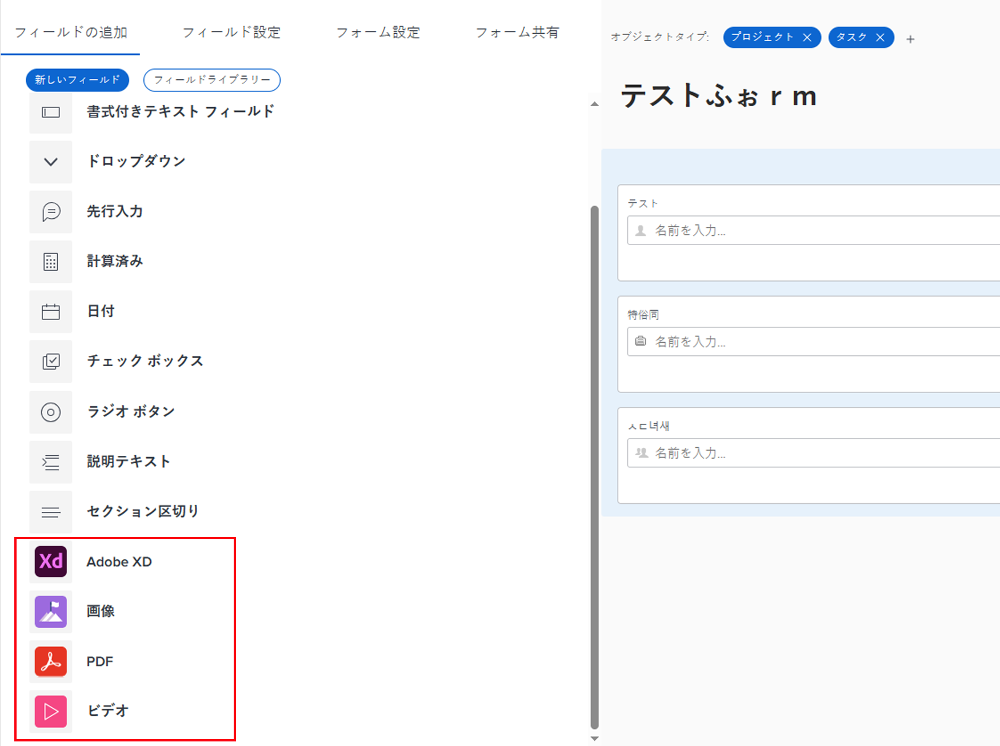

# 従来のフォームビルダーを使用した、カスタムフォームでの画像などのアセットウィジェットの追加または編集

カスタムフォームで次のアセットウィジェットのプロパティを追加または編集できます。

* 画像
* ビデオ
* PDF ファイル
* Adobe XD ファイル

これは、アプリをデザインする際、ブランディング画像、説明ビデオ、インタラクティブプロトタイプなどのビジュアルコンテンツを含める必要がある場合に役立ちます。

ウィジェットを含むカスタムフォームがオブジェクトに添付されている場合、そのオブジェクトを操作するユーザーは、次の領域でそのウィジェットを確認できます。

* そのオブジェクトの詳細エリア（例えば、プロジェクトの場合はプロジェクト詳細エリア）
* 新しい Adobe Workfront エクスペリエンスのルックアンドフィールがある場合は、そのオブジェクトの編集ボックス（プロジェクトの編集ボックスやタスクの編集ボックスなど）。

現在、ユーザーは次のエリアでウィジェットを確認できません。

* リストとレポート
* ホームと概要
* 新しい Adobe Workfront エクスペリエンスのルックアンドフィール（「費用の編集」など）がない場合は、そのオブジェクトの「編集」ボックス。
* Workfront モバイルアプリ

## アクセス要件

この記事の手順を実行するには、以下を保有している必要があります。

<table style="table-layout:auto"> 
 <col> 
 <col> 
 <tbody> 
  <tr data-mc-conditions=""> 
   <td role="rowheader"> 
Adobe Workfront プラン*
 </td> 
   <td>任意</td> 
  </tr> 
  <tr> 
   <td role="rowheader">Adobe Workfront ライセンス*</td> 
   <td>プラン</td> 
  </tr> 
  <tr data-mc-conditions=""> 
   <td role="rowheader">アクセスレベル設定*</td> 
   <td> 
カスタムフォームへの管理アクセス権
 
Workfront 管理者がこのアクセス権を付与する方法について詳しくは、<a href="../../../administration-and-setup/add-users/configure-and-grant-access/grant-users-admin-access-certain-areas.md" class="MCXref xref">特定のエリアに対する管理者アクセス権をユーザーに付与</a>を参照してください。
 </td> 
  </tr>  
 </tbody> 
</table>

&#42;ご利用のプラン、ライセンスタイプまたはアクセスレベル設定を確認するには、Workfront 管理者にお問い合わせください。

## カスタムフォームでアセットウィジェットを追加または編集

1. [カスタムフォームを作成または編集](../../../administration-and-setup/customize-workfront/create-manage-custom-forms/create-or-edit-a-custom-form.md)の説明に従って、カスタムフォームの作業を開始します。
1. 「**フィールドを追加**」タブを開き、次のいずれかの操作を行います。

   * 新しいウィジェットを追加する場合は、**画像**、**PDF** または&#x200B;**ビデオ**&#x200B;をクリックしてフォームの下部に追加するか、フォーム上の目的の場所にドラッグします。

     

   * 別のカスタムフォームに既に追加されているウィジェットを追加する場合は、「**フィールドライブラリ**」をクリックし、表示されるリスト内のウィジェットの名前をクリックします。詳しくは、[カスタムフォームでカスタムフィールドまたはウィジェットを再利用](../../../administration-and-setup/customize-workfront/create-manage-custom-forms/reuse-an-existing-field.md)を参照してください。

   * カスタムフォームに既に追加されているウィジェットを編集する場合は、そのウィジェットを選択します。

1. ウィジェットの次のいずれかのプロパティを入力または編集します。

   <table style="table-layout:auto"> 
    <col> 
    <col> 
    <tbody> 
     <tr> 
      <td role="rowheader">ラベル</td> 
      <td> 
（必須）ウィジェットの上に表示する説明ラベルを入力します。ラベルはいつでも変更できます。
 
<b>重要</b>：このラベルでは特殊文字を使用しないでください。レポートでは正しく表示されません。
 </td> 
     </tr> 
     <tr> 
      <td role="rowheader">名前</td> 
      <td> 
（必須）この名前は、システムによるウィジェットの識別方法です。
 
初めてウィジェットを設定してラベルを入力すると、それに一致するように、名前フィールドが自動的に入力されます。ただし、ラベルフィールドと名前フィールドは同期されません。これにより、システムで表示される名前を変更することなく、ユーザーに表示されるラベルを自由に変更できます。
 
<b>重要</b>：こうすることは可能ですが、ご自身や他のユーザーがウィジェットでカスタムフォームを使用し始めた後は、この名前を変更しないことをお勧めします。変更してしまうと、Workfront の他のエリアで参照される可能性のあるウィジェットが認識されなくなります。 
 
それぞれのウィジェット名は、組織の Workfront インスタンス内で一意である必要があります。これにより、既に作成されたものを別のカスタムフォームに再利用できます。 
 </td> 
     </tr> 
     <tr> 
      <td role="rowheader">URL</td> 
      <td> 
（必須）インターネット上に保存されているウィジェットの URL を入力するか貼り付けます。
 
       
<strong>重要</strong>：URL は、公開 URL である必要があります。 

      
ビデオウィジェットを追加する場合は、現在、URL ボックスに次の内容を追加して実行できます。
 
      <ul> 
      <li> 
YouTube または Vimeo リンク
 </li> 
      <li> 
Google Drive ビデオリンク
 </li> 
      <li> 
MP4 および MOV 拡張子を持つビデオへのリンク
 </li> 
      <li> 
Workfront インスタンスのドキュメントエリアに既にアップロードされているビデオへのリンク。手順については、この記事の<a href="#add-a-video-widget-to-a-custom-form-from-the-documents-area" class="MCXref xref">ドキュメントエリアからのカスタムフォームへのビデオウィジェットの追加</a>を参照してください。
 
      </li> 
      </ul> 
       </td> 
     </tr> 
     <tr> 
      <td role="rowheader">手順</td> 
      <td> 
ウィジェットに関する追加情報を入力します。ユーザーがカスタムフォームに入力する際に、疑問符アイコンの上にポインタを合わせると、ここに入力した情報を含むツールヒントが表示されます。
 </td> 
     </tr> 
     <tr> 
      <td role="rowheader">サイズ</td> 
      <td>必要に応じてウィジェットの表示サイズを変更します。</td> 
     </tr> 
    </tbody> 
   </table>

1. 「**適用**」をクリックします。
1. 他の方法でカスタムフォームの作成を続ける場合は、以下の記事のいずれかに進みます。

   * [カスタムフォーム内でのカスタムフィールドおよびウィジェットの配置](../../../administration-and-setup/customize-workfront/create-manage-custom-forms/position-fields-in-a-custom-form.md)
   * [カスタムフォームへのカスタムフィールドの追加](../../../administration-and-setup/customize-workfront/create-manage-custom-forms/add-a-custom-field-to-a-custom-form.md)
   * [カスタムフォームでのカスタムフィールドまたはウィジェットの再利用](../../../administration-and-setup/customize-workfront/create-manage-custom-forms/reuse-an-existing-field.md)
   * [カスタムフォームへの計算データの追加](../../../administration-and-setup/customize-workfront/create-manage-custom-forms/add-calculated-data-to-custom-form.md)
   * [カスタムフォームでの既存の計算カスタムフィールドの再利用](../../../administration-and-setup/customize-workfront/create-manage-custom-forms/use-existing-calc-field-new-custom-form.md)
   * [表示ロジックの追加とカスタムフォームへのロジックのスキップ](../../../administration-and-setup/customize-workfront/create-manage-custom-forms/display-or-skip-logic-custom-form.md)
   * [カスタムフォームのプレビューと完了](../../../administration-and-setup/customize-workfront/create-manage-custom-forms/preview-and-complete-a-custom-form.md)

## カスタムフォームへの PDF ファイルの追加

1. [カスタムフォームを作成または編集](../../../administration-and-setup/customize-workfront/create-manage-custom-forms/create-or-edit-a-custom-form.md)の説明に従って、カスタムフォームの作業を開始します。
1. 「**フィールドを追加**」タブが開いた状態で、「**Adobe XD**」を選択します。
1. ウィジェットの次のいずれかのプロパティを入力または編集します。

   <table style="table-layout:auto"> 
    <col> 
    <col> 
    <tbody> 
     <tr> 
      <td role="rowheader">ラベル</td> 
      <td> 
（必須）ウィジェットの上に表示する説明ラベルを入力します。ラベルはいつでも変更できます。
 
<b>重要</b>：このラベルでは特殊文字を使用しないでください。レポートでは正しく表示されません。
 </td> 
     </tr> 
     <tr> 
      <td role="rowheader">名前</td> 
      <td> 
（必須）この名前は、システムによるウィジェットの識別方法です。
 
初めてウィジェットを設定してラベルを入力すると、それに一致するように、名前フィールドが自動的に入力されます。ただし、ラベルフィールドと名前フィールドは同期されません。これにより、システムで表示される名前を変更することなく、ユーザーに表示されるラベルを自由に変更できます。
 
<b>重要</b>：変更することは可能ですが、ご自身や他のユーザーがウィジェットでカスタムフォームを使用し始めた後は、この名前を変更しないことをお勧めします。変更してしまうと、Workfront の他のエリアで参照される可能性のあるウィジェットが認識されなくなります。 
 
それぞれのウィジェット名は、組織の Workfront インスタンス内で一意である必要があります。これにより、既に作成されたものを別のカスタムフォームに再利用できます。 
 </td> 
     </tr> 
     <tr> 
      <td role="rowheader">URL</td> 
      <td> 
（必須）有効な XD プロトタイプリンクを入力するかペーストします。
 
      
メモ：Adobe XD の「共有」タブのリンクアクセスの設定は、リンクを知っているすべてのユーザーに設定する必要があります。そうしないと、ユーザーはプロトタイプを表示できなくなります。 
   </td> 
     </tr> 
     <tr> 
      <td role="rowheader">手順</td> 
      <td> 
（オプション）ウィジェットに関する追加情報を入力します。ユーザーがカスタムフォームに入力する際に、疑問符アイコンの上にポインタを合わせると、ここに入力した情報を含むツールヒントが表示されます。
 </td> 
     </tr> 
     <tr> 
      <td role="rowheader">サイズ</td> 
      <td>（オプション）必要に応じてウィジェットの表示サイズを変更します。</td> 
     </tr> 
    </tbody> 
   </table>

1. 他の方法でカスタムフォームの作成を続ける場合は、以下の記事のいずれかに進みます。

   * [カスタムフォーム内でのカスタムフィールドおよびウィジェットの配置](../../../administration-and-setup/customize-workfront/create-manage-custom-forms/position-fields-in-a-custom-form.md)
   * [カスタムフォームへのカスタムフィールドの追加](../../../administration-and-setup/customize-workfront/create-manage-custom-forms/add-a-custom-field-to-a-custom-form.md)
   * [カスタムフォームでのカスタムフィールドまたはウィジェットの再利用](../../../administration-and-setup/customize-workfront/create-manage-custom-forms/reuse-an-existing-field.md)
   * [カスタムフォームへの計算データの追加](../../../administration-and-setup/customize-workfront/create-manage-custom-forms/add-calculated-data-to-custom-form.md)
   * [カスタムフォームでの既存の計算カスタムフィールドの再利用](../../../administration-and-setup/customize-workfront/create-manage-custom-forms/use-existing-calc-field-new-custom-form.md)
   * [カスタムフォームへの表示ロジックとスキップロジックの追加](../../../administration-and-setup/customize-workfront/create-manage-custom-forms/display-or-skip-logic-custom-form.md)
   * [カスタムフォームのプレビューと完了](../../../administration-and-setup/customize-workfront/create-manage-custom-forms/preview-and-complete-a-custom-form.md)

## ドキュメント領域からカスタムフォームにビデオウィジェットを追加 {#add-a-video-widget-to-a-custom-form-from-the-documents-area}

>[!IMPORTANT]
>
>この方法でビデオをカスタムフォームに追加する場合、ユーザーがオブジェクトのフォームにアクセスするときは、カスタムフォームに設定された権限のみがビデオに適用され、ドキュメントエリアのビデオに設定された権限は適用されません。

1. [Web サイトまたはその他の Web コンテンツ用のインタラクティブなプルーフを作成](../../../review-and-approve-work/proofing/creating-proofs-within-workfront/generate-interactive-proof-for-website-or-other-web-content.md)の説明にあるように、ドキュメント領域のビデオに移動し、そのプルーフを生成します。
1. プルーフを開きます。
1. ビデオの任意の場所を右クリックし、「**ビデオアドレスをコピー**」を選択します。
1. ビデオウィジェットを追加するカスタムフォームで、コピーしたアドレスを **URL** ボックスにペーストします。
