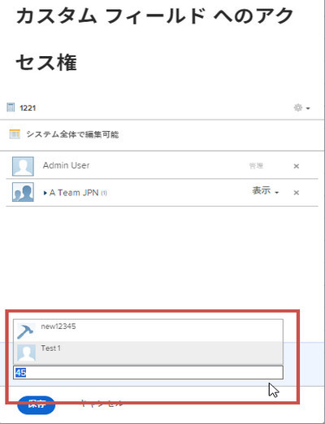
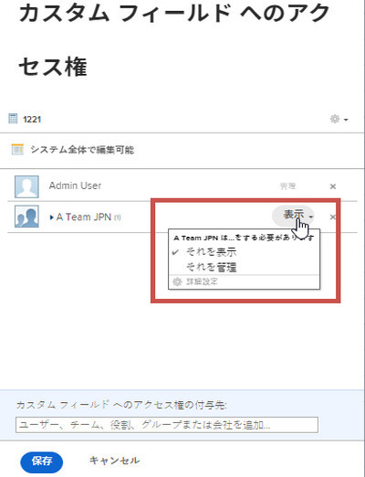

# レガシーフォームビルダーでカスタムフィールドとウィジェットの共有を設定する

デフォルトでは、新しいカスタムフィールドまたはウィジェットをカスタムフォームに追加すると、カスタムフォームにアクセスできるシステム内の誰でも、その項目のラベルや名前などのプロパティを編集できます。 これを変更するには、共有相手を制御します。

カスタムフォームのカスタムフィールドとウィジェットについて詳しくは、 [レガシーフォームビルダーを使用したカスタムフォームへのカスタムフィールドの追加](../../../administration-and-setup/customize-workfront/create-manage-custom-forms/add-a-custom-field-to-a-custom-form.md) および [レガシーフォームビルダーを使用したカスタムフォームでのアセットウィジェットの追加または編集](../../../administration-and-setup/customize-workfront/create-manage-custom-forms/add-widget-or-edit-its-properties-in-a-custom-form.md).

## アクセス要件

この記事の手順を実行するには、次の手順を実行する必要があります。

<table style="table-layout:auto"> 
 <col> 
 <col> 
 <tbody> 
  <tr data-mc-conditions=""> 
   <td role="rowheader"> 
Adobe Workfront plan*
 </td> 
   <td>任意</td> 
  </tr> 
  <tr> 
   <td role="rowheader">Adobe Workfront license*</td> 
   <td>計画</td> 
  </tr> 
  <tr data-mc-conditions=""> 
   <td role="rowheader">アクセスレベル設定*</td> 
   <td> 
カスタムフォームへの管理アクセス
 
Workfront管理者がこのアクセス権を付与する方法について詳しくは、 <a href="../../../administration-and-setup/add-users/configure-and-grant-access/grant-users-admin-access-certain-areas.md" class="MCXref xref">特定の領域に対する管理者アクセス権をユーザーに付与する</a>.
 </td> 
  </tr> 
 </tbody> 
</table>

&#42;保有しているプラン、ライセンスタイプ、アクセスレベル設定を確認するには、Workfront管理者に問い合わせてください。

## カスタムフィールドまたはウィジェットの共有を設定する

1. 次をクリック： **メインメニュー** アイコン  Adobe Workfrontの右上隅で、 **設定** .

1. 左側のパネルで、 **カスタムForms**.
1. 組織のWorkfrontインスタンスのカスタムフィールドまたはウィジェットの共有を設定する場合は、以下の手順を実行します。

   1. 次をクリック： **フィールド** タブをクリックします。
   1. 共有を設定する項目を選択し、「 **共有**.

   または、既存のカスタムフォームのカスタムフィールドまたはウィジェットの共有を設定する場合は、次の手順を実行します。

   1. カスタムフォームを選択し、「 **編集**.
   1. 右側のフォーム編集領域で、共有を設定する項目を選択します。
   1. 左側のパネルで、 **フィールドを共有**.

1. 内 **カスタムフィールドアクセス** 表示されるボックスで、項目を共有する相手と、その共有方法を指定します。

   1. の左下隅付近 **カスタムフィールドアクセス** ボックス、下 **カスタムフィールドに対するアクセス権を与える**&#x200B;をクリックし、アイテムを共有するユーザー、チーム、ジョブの役割、グループ、または会社の名前を入力し、表示されたらその名前をクリックします。

      

   1. 項目の共有方法をより具体的に指定する場合は、名前の右にあるドロップダウンリストをクリックし、次のいずれかのオプションを使用します。

      

      <table style="table-layout:auto"> 
       <col> 
       <col> 
       <tbody> 
        <tr> 
         <td role="rowheader">それを表示</td> 
         <td> 
次をクリックできます。 <strong>詳細設定</strong> を使用して、ユーザーまたはユーザーが自分のアクセス権を使用して、アイテムをカスタムフォームに追加したり、他のユーザーと共有したりできるようにするかどうかを指定します。
 </td> 
        </tr> 
        <tr> 
         <td role="rowheader">それを管理</td> 
         <td> 
カスタムフィールドを編集し、フィールドライブラリや、カスタムフォームを作成するページに表示するためのアクセスを許可します。
 
次をクリックできます。 <strong>詳細設定</strong> を使用して、ユーザーまたはユーザーが自分のアクセス権を使用して、アイテムをシステムから削除したり、他のユーザーと共有したりできるようにするかどうかを指定します。
 </td> 
        </tr> 
       </tbody> 
      </table>

1. （オプション）前の手順を繰り返して、リストに他の名前を追加し、そのオプションを設定します。
1. （オプション）歯車アイコン  をクリックします。

   このドロップダウンメニューには、以下のすべてのオプションが同時に表示されるわけではありません。 例えば、2 番目の 2 つ目は、他の 2 つのうち 1 つが選択された場合にのみ表示されます。

   * **この編集可能なシステム全体をWorkfrontの全員が編集できるようにする** （デフォルトのオプション）

      カスタムフィールドまたはウィジェットを追加し、共有を制限しない場合、カスタムフォームにアクセスできるシステム内のすべてのユーザーが、カスタムフォームを表示してプロパティを編集できます。

   * **システム全体での編集アクセスを削除します。**

      リストに追加したユーザーのみにアクセスを制限します。

   * **Workfront 内のすべてのユーザーが確認できるようシステム全体で表示する**

1. クリック **保存** または **保存して閉じる**.

## カスタムフォームが共有されたときにカスタムフィールドおよびウィジェットに継承されたアクセス

ユーザーがグループ、ジョブの役割、チーム、または会社とカスタムフォームを共有すると、受信者はフォーム上のカスタムフィールドとウィジェットに対してビューアクセス権を継承します。 フォーム上のこれらの項目に対するこのレベルのアクセス権は常に保持されるので、フォームは、作成者の意図に従って受信者に対して機能します。 これは、フォームに対する編集アクセス権を持つ受信者でも同じです。

カスタムフィールドまたはウィジェットへのアクセス権を継承したユーザーを確認し、そのアクセス権を削除できます。

>[!NOTE]
>
>受信者が共有カスタムフォーム上のカスタムフィールドまたはウィジェットへのアクセスを管理する権限を持っている場合、そのアクセス権は受信者に対して保持されます。

* [カスタムフィールドまたはウィジェットへのアクセス権を継承したユーザーを特定する](#find-out-who-has-inherited-access-to-a-custom-field-or-widget)
* [共有されたカスタムフォーム内のカスタムフィールドまたはウィジェットへのアクセスを削除する](#remove-access-to-a-custom-field-or-widget-in-a-custom-form-that-was-shared)

### カスタムフィールドまたはウィジェットへのアクセス権を継承したユーザーを特定する {#find-out-who-has-inherited-access-to-a-custom-field-or-widget}

1. 次をクリック： **メインメニュー** アイコン  Adobe Workfrontの右上隅で、 **設定** .

1. 左側のパネルで、 **カスタムForms**.
1. 次をクリック： **フィールド** 」タブをクリックし、フィールド、画像、またはアクセスウィジェットを選択します。
1. 表示されるボックスで、 **継承された権限** 表示される名前を表示します。
1. クリック **キャンセル**.

### 共有されたカスタムフォーム内のカスタムフィールドまたはウィジェットへのアクセスを削除する {#remove-access-to-a-custom-field-or-widget-in-a-custom-form-that-was-shared}

共有されたカスタムフォーム内のカスタムフィールドまたはウィジェットへのアクセスを削除する必要がある場合は、フォームの共有を解除する必要があります。 手順については、のを参照してください。 [カスタムフォームへのアクセスを削除する](../../../administration-and-setup/customize-workfront/create-manage-custom-forms/share-access-to-a-custom-form.md#unshare) 記事内 [カスタムフォームの共有](../../../administration-and-setup/customize-workfront/create-manage-custom-forms/share-access-to-a-custom-form.md).
