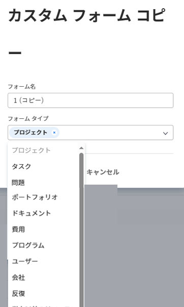

# カスタムフォームをコピーして、レガシービルダーで新しく作成する

既存のフォームに基づいて新しいカスタムフォームを作成できます。

## アクセス要件

この記事の手順を実行するには、次の手順を実行する必要があります。

<table style="table-layout:auto"> 
 <col> 
 <col> 
 <tbody> 
  <tr data-mc-conditions=""> 
   <td role="rowheader"> 
Adobe Workfront plan*
 </td> 
   <td>任意</td> 
  </tr> 
  <tr> 
   <td role="rowheader">Adobe Workfront license*</td> 
   <td>計画</td> 
  </tr> 
  <tr data-mc-conditions=""> 
   <td role="rowheader">アクセスレベル設定*</td> 
   <td> 
カスタムフォームへの管理アクセス
 
Workfront管理者がこのアクセス権を付与する方法について詳しくは、 <a href="../../../administration-and-setup/add-users/configure-and-grant-access/grant-users-admin-access-certain-areas.md" class="MCXref xref">特定の領域に対する管理者アクセス権をユーザーに付与する</a>.
 </td> 
  </tr> 
 </tbody> 
</table>

&#42;保有しているプラン、ライセンスタイプ、アクセスレベル設定を確認するには、Workfront管理者に問い合わせてください。

## カスタムフォームをコピーして新しいフォームを作成する

1. 次をクリック： **メインメニュー** アイコン  Adobe Workfrontの右上隅で、 **設定** .

1. クリック **カスタムForms。**
1. 新しいカスタムフォームの基礎として使用するカスタムフォームを選択し、 **コピー**.
1. 内 **カスタムフォームコピー** 表示されるボックスに、次の情報を入力します。

   <table style="table-layout:auto"> 
    <col> 
    <col> 
    <tbody> 
     <tr> 
      <td role="rowheader">フォーム名</td> 
      <td>コピーしたフォームの名前を入力します。</td> 
     </tr> 
     <tr> 
      <td role="rowheader"> 
フォームタイプ 
 </td> 
      <td> 
内 <b>フォームタイプ</b> ボックスで、カスタムフォームを使用するオブジェクトの種類を選択し、削除する種類の横にある X をクリックします。 既にフォームに関連付けられているタイプは、リストで無効になっています。
 
      

 
      
フォームは、少なくとも 1 つのオブジェクトタイプに関連付ける必要があります。
 
      </td> 
     </tr> 
    </tbody> 
   </table>

1. クリック **フォームをコピー**.

   元のフォームで、新しいフォームに追加したオブジェクトタイプと互換性のない計算フィールドが参照されている場合は、そのフィールドの計算を変更するよう求めるメッセージが表示されます。

   同様に、元のフォームのセクション区切りのアクセスオプションが、新しいフォームに追加するオブジェクトタイプと互換性がない場合は、オプションを調整するように求めるメッセージが表示されます。

1. 先ほどコピーしたフォームを選択し、「 **編集**.
1. 次の記事で説明するように、フォームに変更を加えます。

   * [カスタムフォームをコピーして、レガシーフォームビルダーで新しく作成する](#Add2)
   * [レガシーフォームビルダーを使用して計算データをカスタムフォームに追加する](../../../administration-and-setup/customize-workfront/create-manage-custom-forms/add-calculated-data-to-custom-form.md)
   * [従来のフォームビルダーを使用したカスタムフォーム内でのカスタムフィールドおよびウィジェットの配置](../../../administration-and-setup/customize-workfront/create-manage-custom-forms/position-fields-in-a-custom-form.md)
   * [レガシーフォームビルダーを使用したカスタムフォームでのアセットウィジェットの追加または編集](../../../administration-and-setup/customize-workfront/create-manage-custom-forms/add-widget-or-edit-its-properties-in-a-custom-form.md)
   * [既存の計算済みカスタムフィールドを、従来のフォームビルダーでカスタムフォーム内で再利用する](../../../administration-and-setup/customize-workfront/create-manage-custom-forms/use-existing-calc-field-new-custom-form.md)
   * [従来のフォームビルダーを使用して、表示ロジックを追加し、ロジックをカスタムフォームにスキップします](../../../administration-and-setup/customize-workfront/create-manage-custom-forms/display-or-skip-logic-custom-form.md)
   * [レガシーフォームビルダーを使用してカスタムフォームをプレビューし、完成させます](../../../administration-and-setup/customize-workfront/create-manage-custom-forms/preview-and-complete-a-custom-form.md)

1. （オプション） **保存して閉じる**&#x200B;を使用する場合は、使用するオブジェクトにフォームを添付します。詳しくは、 [オブジェクトへのカスタムフォームの追加](../../../workfront-basics/work-with-custom-forms/add-a-custom-form-to-an-object.md).
