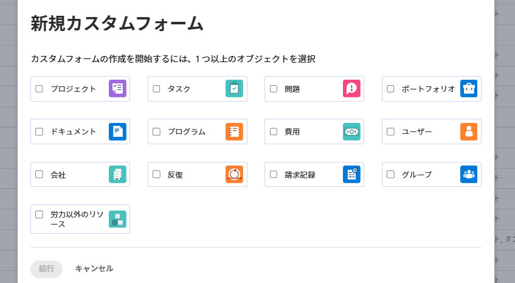
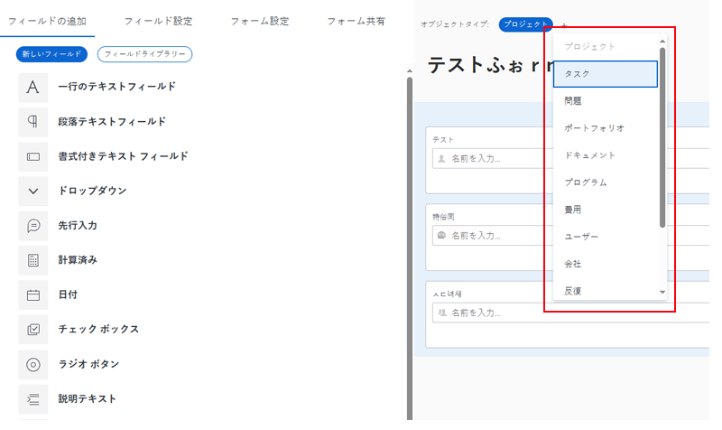

# カスタムフォームの作成または編集

新しいカスタムフォームを作成または編集できます。 両方のタスクについては、この記事で説明します。

既存のフォームから新しいカスタムフォームを作成する方法について詳しくは、 [カスタムフォームをコピーして新しいフォームを作成する](../../../administration-and-setup/customize-workfront/create-manage-custom-forms/copy-custom-form-to-create-a-new-one.md).

## アクセス要件

この記事の手順を実行するには、次の手順を実行する必要があります。

<table style="table-layout:auto"> 
 <col> 
 <col> 
 <tbody> 
  <tr data-mc-conditions=""> 
   <td role="rowheader"> 
Adobe Workfront plan*
 </td> 
   <td>任意</td> 
  </tr> 
  <tr> 
   <td role="rowheader">Adobe Workfront license*</td> 
   <td>計画</td> 
  </tr> 
  <tr data-mc-conditions=""> 
   <td role="rowheader">アクセスレベル設定*</td> 
   <td> 
カスタムフォームへの管理アクセス
 
Workfront管理者がこのアクセス権を付与する方法について詳しくは、 <a href="../../../administration-and-setup/add-users/configure-and-grant-access/grant-users-admin-access-certain-areas.md" class="MCXref xref">特定の領域に対する管理者アクセス権をユーザーに付与する</a>.
 </td> 
  </tr>  
 </tbody> 
</table>

&#42;保有しているプラン、ライセンスタイプ、アクセスレベル設定を確認するには、Workfront管理者に問い合わせてください。

## カスタムフォームの作成を開始

1. 次をクリック： **メインメニュー** アイコン  Adobe Workfrontの右上隅で、 **設定** .

1. クリック **カスタムForms** をクリックします。

   表示されるビューで、組織用に作成されたすべてのカスタムフォームおよびカスタムフィールドを確認できます。 また、各フォームの作成者や、各フォームに関連付けられているフィールドも確認できます。

1. クリック **新規カスタムフォーム。**
1. カスタムフォームに関連付けるオブジェクトの種類を少なくとも 1 つ選択し、 **続行**.

   

1. の **フォーム設定** 開いたタブに、 **フォームタイトル** およびオプション **説明** カスタムフォーム用。

1. （オプション）フォームにオブジェクトの種類を追加して他のオブジェクトに関連付ける場合は、[ オブジェクトの種類 ] の後のプラス記号をクリックし、表示されるメニューから目的のオブジェクトの種類を選択します。

   この操作を繰り返して、必要な数のオブジェクトタイプを追加できます。また、オブジェクトタイプの X をクリックして、フォームから削除することもできます。

   保存済みのカスタムフォームからオブジェクトタイプを削除する方法については、 [カスタムフォームのオブジェクトタイプの削除](../../../administration-and-setup/customize-workfront/create-manage-custom-forms/delete-object-type-on-a-custom-form.md).

1. クリック **完了**.

   >[!TIP]
   >
   >次をクリックできます。 **適用** カスタムフォームの作成中はいつでも、変更内容を保存し、フォームを開いたままにすることができます。

1. 新しいカスタムフィールドをフォームに追加する場合は、次に進みます。 [カスタムフォームにカスタムフィールドを追加する](../../../administration-and-setup/customize-workfront/create-manage-custom-forms/add-a-custom-field-to-a-custom-form.md) または [カスタムフォームでカスタムフィールドまたはウィジェットを再利用する](../../../administration-and-setup/customize-workfront/create-manage-custom-forms/reuse-an-existing-field.md).

   または

   他の方法でカスタムフォームの作成を続ける場合は、次の記事のいずれかに進みます。

   * [カスタムフォームでのアセットウィジェットの追加または編集](../../../administration-and-setup/customize-workfront/create-manage-custom-forms/add-widget-or-edit-its-properties-in-a-custom-form.md)
   * [カスタムフォーム内でのカスタムフィールドおよびウィジェットの配置](../../../administration-and-setup/customize-workfront/create-manage-custom-forms/position-fields-in-a-custom-form.md)
   * [カスタムフォームにセクション区切りを追加する](../../../administration-and-setup/customize-workfront/create-manage-custom-forms/add-a-section-break-to-a-custom-form.md)
   * [計算データをカスタムフォームに追加する](../../../administration-and-setup/customize-workfront/create-manage-custom-forms/add-calculated-data-to-custom-form.md)
   * [カスタムフォームで既存の計算済みカスタムフィールドを再利用する](../../../administration-and-setup/customize-workfront/create-manage-custom-forms/use-existing-calc-field-new-custom-form.md)
   * [表示ロジックの追加とカスタムフォームへのロジックのスキップ](../../../administration-and-setup/customize-workfront/create-manage-custom-forms/display-or-skip-logic-custom-form.md)

## カスタムフォームの編集を開始

カスタムフォームは、作成後いつでも編集できます。

>[!CAUTION]
>
>ユーザーがフィールドに入力したデータが失われることなく、カスタムフォームからフィールドを削除する方法については、「 [ユーザーが入力したデータが失われることなく、カスタムフィールドを削除します](../../../administration-and-setup/customize-workfront/create-manage-custom-forms/delete-a-custom-field.md#remove) 記事内 [システムからカスタムフィールドまたはウィジェットを削除する](../../../administration-and-setup/customize-workfront/create-manage-custom-forms/delete-a-custom-field.md).
>
>一般に、既に使用されているカスタムフォームを編集する回数は最小限に抑えることをお勧めします。 カスタムフォームを使用するユーザーに変更に関して警告を出す通知システムはありません。

1. 次をクリック： **メインメニュー** アイコン  Adobe Workfrontの右上隅で、 **設定** .

1. クリック **カスタムForms** をクリックします。

   表示されるビューで、組織用に作成されたすべてのカスタムフォームを確認できます。 また、各フォームの作成者、対象となるオブジェクトタイプ、アクティブかどうかも確認できます。

1. 編集するカスタムフォームを選択し、 **編集**.
1. （オプション）カスタムフォームのタイトルと説明を変更するには、 **フォーム設定** 「 」タブに **フォームタイトル** および **説明**.

1. （オプション）フォームに他の種類のオブジェクトを追加して、他のオブジェクトに添付できるようにする場合は、プラス記号+ () **オブジェクトタイプ**&#x200B;を選択し、表示されるメニューで目的のタイプを選択します。

   

   この操作を繰り返して、必要な数のオブジェクトタイプを追加できます。

   また、オブジェクトタイプの X をクリックして、フォームから削除することもできます。 この操作は、既に保存したカスタムフォームからオブジェクトタイプを削除する場合には、注意して行う必要があります。 詳しくは、 [カスタムフォームのオブジェクトタイプの削除](../../../administration-and-setup/customize-workfront/create-manage-custom-forms/delete-object-type-on-a-custom-form.md).

1. クリック **完了**.

   >[!TIP]
   >
   >次をクリックできます。 **適用** カスタムフォームの作成中はいつでも、変更内容を保存し、フォームを開いたままにすることができます。

1. 新しいカスタムフィールドをフォームに追加する場合は、次に進みます。 [カスタムフォームにカスタムフィールドを追加する](../../../administration-and-setup/customize-workfront/create-manage-custom-forms/add-a-custom-field-to-a-custom-form.md) または [カスタムフォームでカスタムフィールドまたはウィジェットを再利用する](../../../administration-and-setup/customize-workfront/create-manage-custom-forms/reuse-an-existing-field.md).

   または

   他の方法でカスタムフォームの作成を続ける場合は、次の記事のいずれかに進みます。

   * [カスタムフォームでのアセットウィジェットの追加または編集](../../../administration-and-setup/customize-workfront/create-manage-custom-forms/add-widget-or-edit-its-properties-in-a-custom-form.md)
   * [カスタムフォーム内でのカスタムフィールドおよびウィジェットの配置](../../../administration-and-setup/customize-workfront/create-manage-custom-forms/position-fields-in-a-custom-form.md)
   * [カスタムフォームにセクション区切りを追加する](../../../administration-and-setup/customize-workfront/create-manage-custom-forms/add-a-section-break-to-a-custom-form.md)
   * [計算データをカスタムフォームに追加する](../../../administration-and-setup/customize-workfront/create-manage-custom-forms/add-calculated-data-to-custom-form.md)
   * [カスタムフォームで既存の計算済みカスタムフィールドを再利用する](../../../administration-and-setup/customize-workfront/create-manage-custom-forms/use-existing-calc-field-new-custom-form.md)
   * [表示ロジックの追加とカスタムフォームへのロジックのスキップ](../../../administration-and-setup/customize-workfront/create-manage-custom-forms/display-or-skip-logic-custom-form.md)
