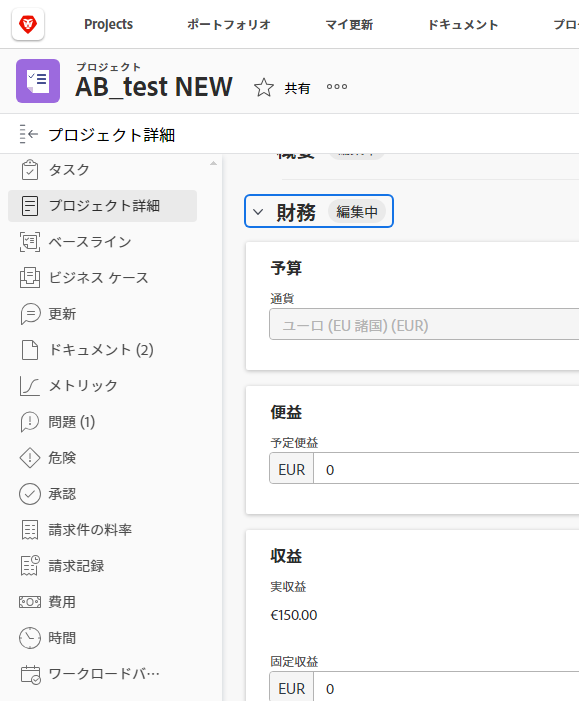

# カスタムフォームの概要

**ビデオ**:

カスタムフォームに関するこのビデオの概要を参照してください。

 [新しいWorkfrontエクスペリエンスのカスタムForms](https://one.workfront.com/s/learningpath2/custom-forms-in-the-new-workfront-experience-final-MCC2AF4MH6NRHKHJJBXO6T65DHUU)

ユーザーがWorkfrontオブジェクトに添付できるカスタムフォームを作成できます。 オブジェクトの操作を行うユーザーは、カスタムフォームに入力して、オブジェクトに関する情報を入力できます。

例えば、ユーザーがプロジェクトに次のカスタムフォームを添付して、プロジェクトのユーザーがプロジェクトのマーケティングコンテンツを要求できるようにすることができます。

## カスタムフィールドとウィジェット

Workfrontは、各オブジェクトタイプに対して多数の組み込みフィールドを提供します。 カスタムフォームでは、ワークフローに固有の情報をユーザーに求める追加のフィールドを作成できます。 これらのカスタムフィールドは、カスタムフォームの構成要素です。

Workfrontのカスタムフォームに、次のタイプのカスタムフィールドを追加できます。

* 1 行のテキストフィールド
* 段落テキストフィールド
* 書式設定を含むテキストフィールド
* ドロップダウン
* 計算済み
* 日付
* チェック ボックス
* ラジオボタン
* 説明テキスト

詳しくは、 [カスタムフォームにカスタムフィールドを追加する](../../../administration-and-setup/customize-workfront/create-manage-custom-forms/add-a-custom-field-to-a-custom-form.md).

また、カスタムフォームにビジュアルアセットウィジェットを追加することもできます。 これは、ブランディング画像や視覚的な指示などのコンテンツを含める必要がある場合に役立ちます。 詳しくは、 [カスタムフォームでのアセットウィジェットの追加または編集](../../../administration-and-setup/customize-workfront/create-manage-custom-forms/add-widget-or-edit-its-properties-in-a-custom-form.md).

カスタムフォームの作成手順については、 [カスタムフォームの作成または編集](../../../administration-and-setup/customize-workfront/create-manage-custom-forms/create-or-edit-a-custom-form.md).

## ユーザーがカスタムフォームを添付できるオブジェクト

ユーザーは、次の種類のオブジェクトにカスタムフォームを添付できます。

* プロジェクト（ビジネス事例を含む）
* タスク
* 問題
* 会社
* ドキュメント
* ユーザー
* プログラム
* ポートフォリオ
* 費用
* グループ

手順については、 [オブジェクトへのカスタムフォームの追加](../../../workfront-basics/work-with-custom-forms/add-a-custom-form-to-an-object.md).

カスタムフォームを作成するユーザーは、複数のオブジェクトタイプで動作するように設定できます。 詳しくは、 [カスタムフォームの作成または編集](../../../administration-and-setup/customize-workfront/create-manage-custom-forms/create-or-edit-a-custom-form.md).
