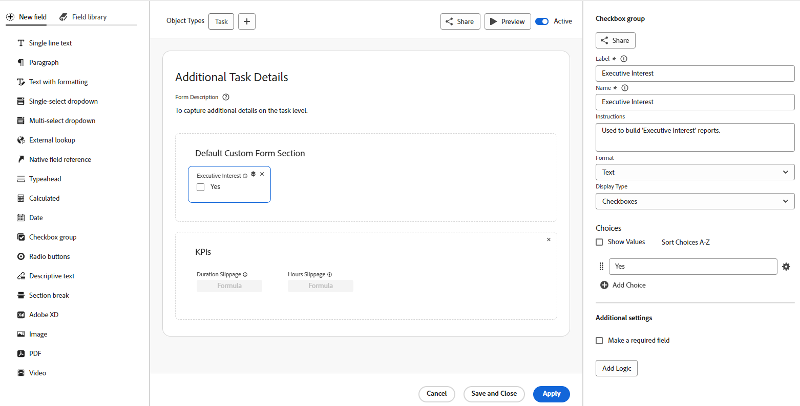

# カスタムフォームの概要

<!--Audited: 12/2023-->

Adobe Workfront オブジェクトに添付できるカスタムフォームを作成できます。オブジェクトの操作を行うユーザーは、カスタムフォームに入力して、オブジェクトに関する情報を提供できます。

例えば、「マーケティングコンテンツリサーチ」というカスタムフォームをプロジェクトに添付することで、プロジェクトのユーザーがプロジェクトのマーケティングコンテンツをリクエストできるようになります。

## カスタムフォームの作成方法

フォームデザイナーは、フィールド、キャンバス、フィールド設定をすべて同時に表示できるキャンバススタイルのワークスペースを持っています。 また、フォームをデザインする際に、セクション内でフィールドをドラッグ&amp;ドロップすることもできます。 画面の右側のサイズを変更して、フィールドオプションのスペースを広げることができます。

詳しくは、[ カスタムフォームの作成 ](/help/quicksilver/administration-and-setup/customize-workfront/create-manage-custom-forms/form-designer/design-a-form/design-a-form.md) を参照してください。

## カスタムフィールドとウィジェット

Workfront は、各オブジェクトタイプに対して多数の組み込みフィールドを提供します。

カスタムフォームでは、ワークフローに固有の情報をユーザーに求める追加のフィールドを作成できます。これらのカスタムフィールドは、カスタムフォームの構成要素です。

Workfront のカスタムフォームに、次のタイプのカスタムフィールドを追加できます。

* 1 行テキスト
* 段落
* 書式付きテキスト
* 単一選択ドロップダウン
* 複数選択ドロップダウン
* 外部ルックアップ
* ネイティブフィールド参照
* 先行入力
* 計算済み
* 日付
* チェックボックスグループ
* ラジオボタン
* 説明テキスト
* セクション区切り
* Adobe XD
* 画像
* PDF
* ビデオ

>[!NOTE]
>
>更新フィードでフィールドの変更を追跡するには、設定/インターフェイス/フィードを更新に移動します。 詳しくは、[システム更新の設定](/help/quicksilver/administration-and-setup/set-up-workfront/system-tracked-update-feeds/configure-system-updates.md)を参照してください。

## ユーザーがカスタムフォームを添付できるオブジェクト

カスタムフォームを作成するユーザーは、複数のオブジェクトタイプで動作するようにカスタムフォームを設定できます。

ユーザーは、次のタイプのオブジェクトにカスタムフォームを添付できます。

* プロジェクト（ビジネスケースを含む）
* タスク
* イシュー（リクエストキューを含む）
* 会社
* ドキュメント
* ユーザー
* プログラム
* ポートフォリオ
* 費用
* グループ
* イテレーション
* 請求記録

オブジェクトへのカスタムフォームの添付について詳しくは、[オブジェクトへのカスタムフォームの追加](../../../workfront-basics/work-with-custom-forms/add-a-custom-form-to-an-object.md)を参照してください。

オブジェクトを変換するときにユーザー設定フォームに何が起こるかを確認するには、「[ オブジェクトを変換する際にユーザー設定フォーム データを転送する ](/help/quicksilver/administration-and-setup/customize-workfront/create-manage-custom-forms/transfer-custom-form-data-larger-item.md)」を参照してください。

