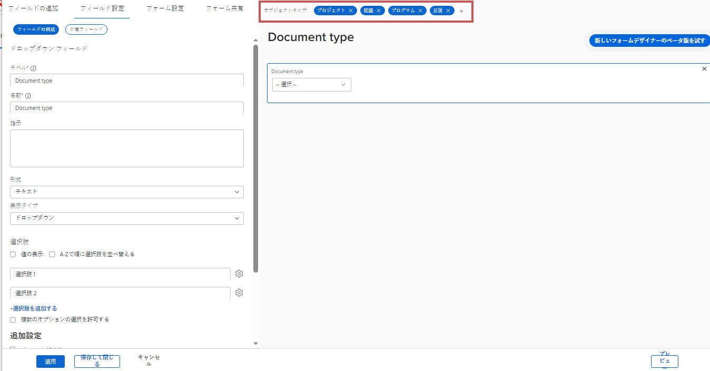

# カスタムフォームのオブジェクトタイプの削除

既存のカスタムフォームでは、フォームに関連付けられているオブジェクトタイプを削除できます。 この操作を行うと、ユーザーはその種類のオブジェクトにフォームを添付できなくなります。

## アクセス要件

この記事の手順を実行するには、次の手順を実行する必要があります。

<table style="table-layout:auto"> 
 <col> 
 <col> 
 <tbody> 
  <tr data-mc-conditions=""> 
   <td role="rowheader"> 
Adobe Workfront plan*
 </td> 
   <td>任意</td> 
  </tr> 
  <tr> 
   <td role="rowheader">Adobe Workfront license*</td> 
   <td>計画</td> 
  </tr> 
  <tr data-mc-conditions=""> 
   <td role="rowheader">アクセスレベル設定*</td> 
   <td> 
カスタムフォームへの管理アクセス
 
Workfront管理者がこのアクセス権を付与する方法について詳しくは、 <a href="../../../administration-and-setup/add-users/configure-and-grant-access/grant-users-admin-access-certain-areas.md" class="MCXref xref">特定の領域に対する管理者アクセス権をユーザーに付与する</a>.
 </td> 
  </tr>  
 </tbody> 
</table>

&#42;保有しているプラン、ライセンスタイプ、アクセスレベル設定を確認するには、Workfront管理者に問い合わせてください。

## カスタムフォームのオブジェクトタイプの削除

既存のカスタムフォームからオブジェクトタイプを削除できます。

カスタムフォームには、少なくとも 1 つのオブジェクトタイプが必要です。

>[!CAUTION]
>
>ユーザーが既に、削除する種類のオブジェクトにカスタムフォームを添付し、データを追加している場合、フォーム上でそのオブジェクトの種類を削除すると、そのデータは完全に削除されます。 ユーザーが後で必要とする履歴情報が含まれる場合があります。
>
>一般に、既に使用されているカスタムフォームを編集する回数は最小限に抑えることをお勧めします。 カスタムフォームを使用するユーザーに変更に関して警告を出す通知システムはありません。

1. 次をクリック： **メインメニュー** アイコン  Adobe Workfrontの右上隅で、 **設定** .

1. クリック **カスタムForms** をクリックします。
1. 編集するカスタムフォームを選択し、 **編集**.
1. 任意の **オブジェクトタイプ** 削除する項目をフォームから削除し、 **削除** をクリックします。

   

1. （オプション）フォームから削除する他のオブジェクトタイプに対して、前の手順を繰り返します。
1. クリック **完了**&#x200B;を選択し、次に **閉じて保存**.
