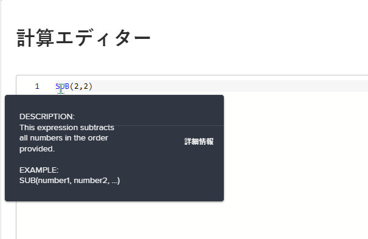
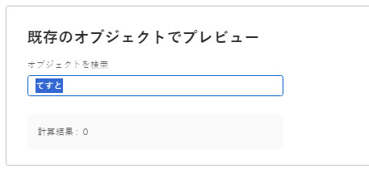

# フォームデザイナーで計算フィールドを追加する

カスタムフォームをオブジェクトに添付する際に、既存のデータを使用して新しいデータを生成する計算カスタムフィールドを追加できます。

計算カスタムフィールドには、次の値を含めることができます。

* 単一の組み込みフィールドへの単純な参照です。

  >[!INFO]
  >
  > **例：** プロジェクトやタスクによって生み出される売上高を計算するには、組み込みフィールドの [ 実際の売上高 ] を含む計算済みカスタムフィールドを作成します。 ユーザーがカスタムフォームをプロジェクトまたはタスクに添付すると、そのプロジェクトまたはタスクの売上高が「 」フィールドに表示されます。

* 1 つ以上のフィールドを参照する式。 これには、カスタムフィールド、その他の計算カスタムフィールド、組み込みフィールドを使用できます。

  >[!INFO]
  >
  >**例：** プロジェクトとタスクによって生成された利益を計算するには、収益からコストを引く数式を含む、[ 利益 ] という計算カスタムフィールドを作成します。
  >
  >これを行うには、組み込みのWorkfrontフィールド（「実績コスト」と「実績売上高」）に数式 SUB （減算）を使用します。
  >
  >以下の手順で、この例の実行方法を確認できます。

## アクセス要件

この記事の手順を実行するには、次の手順を実行する必要があります。

<table style="table-layout:auto"> 
 <col> 
 <col> 
 <tbody> 
  <tr data-mc-conditions=""> 
   <td role="rowheader"> 
Adobe Workfront plan*
 </td> 
   <td>任意</td> 
  </tr> 
  <tr> 
   <td role="rowheader">Adobe Workfront license*</td> 
   <td>計画</td> 
  </tr> 
  <tr data-mc-conditions=""> 
   <td role="rowheader">アクセスレベル設定*</td> 
   <td> 
カスタムフォームへの管理アクセス
 
Workfront管理者がこのアクセス権を付与する方法について詳しくは、 <a href="/help/quicksilver/administration-and-setup/add-users/configure-and-grant-access/grant-users-admin-access-certain-areas.md" class="MCXref xref">特定の領域に対する管理者アクセス権をユーザーに付与する</a>.
 </td> 
  </tr>  
 </tbody> 
</table>

&#42;保有しているプラン、ライセンスタイプ、アクセスレベル設定を確認するには、Workfront管理者に問い合わせてください。

## カスタムフォームで既存の計算済みカスタムフィールドを再利用する

異なるオブジェクトに属するカスタムフォームでも、同じ計算済みカスタムフィールドを使用できます。 例えば、タスクのカスタムフォームのプロジェクトのカスタムフォーム用に作成した [ 利益計算済み ] フィールドを使用できます。

既存の計算済みカスタムフィールドを使用する場合、計算は新しいフォームに転送されません。 同じフィールドの新しいカスタムフォームに計算を再度追加する必要があります。

また、新しいフォームの同じフィールドに対して異なる計算を使用することもできます。 計算されたカスタムフィールドに同じ名前を付けると、命名規則で一貫性と一貫性を保つことができます。

>[!IMPORTANT]
>
>計算式を変更すると、オブジェクトのフィールド値が古くなる場合があります。 これらのフィールドで常に最新の計算を表示するには、次のいずれかの操作を行います。
>
>* 添付されたカスタムフォームでデータを編集したオブジェクトを保存したら、「その他」アイコンをクリックします。  オブジェクトのメインページで、「カスタム式の再計算」を選択します。
>* オブジェクトを一括編集する際に、「カスタム式を再計算」オプションを選択します。
>* カスタムフォームで計算カスタムフィールドを編集する際に、「以前の計算を更新」オプションを選択します。

既存の計算済みカスタムフィールドを再利用するには：

1. 次をクリック： **メインメニュー** アイコン  Adobe Workfrontの右上隅で、 **設定** .

1. クリック **カスタムForms** をクリックします。

   <!-- >[!TIP]
    >
    >In the view that appears, you can review all custom forms and custom fields that have been created for your organization. You can also see who created each form and the fields that are associated with it. -->

1. クリック **新規カスタムフォーム。**
1. カスタムフォームを添付するオブジェクトの種類を選択し、 **続行**.

1. 画面の左上で、 **フィールドライブラリ**.

   

1. 検索ボックスを使用するか、 **計算済み** 「 」セクションで必要な計算フィールドを見つけ、カスタムフォームで表示する場所にフィールドをドラッグします。

1. （オプション）前の手順を繰り返して、他のフィールドを追加します。

   >[!NOTE]
   >
   >1 つのカスタムフォームに最大 500 個のフィールドとウィジェットを追加できます。 ただし、フォームの複雑さに応じて 100 を超える場合は、パフォーマンスの低下が生じる可能性があります。
   >
   >
   >複雑なフォームの例としては、カスケードパラメーターを持つフォーム、計算済みカスタムデータフィールド、単一のフィールドに複数の値を入力するオプションなどがあります。

1. 変更を保存するには、 **適用** フォームの作成を続行するには、別のセクションに移動します。

   または

   クリック **保存して閉じる**.

## 新しい計算フィールドを追加

>[!IMPORTANT]
>
>新しい計算カスタムフィールドを作成する前に、計算に必要なデータがWorkfrontに確実に存在するように、含める既存のフィールドを指定します。

1. 次をクリック： **メインメニュー** アイコン  Adobe Workfrontの右上隅で、 **設定** .

1. クリック **カスタムForms** をクリックします。

   <!-- >[!TIP]
    >
    >In the view that appears, you can review all custom forms and custom fields that have been created for your organization. You can also see who created each form and the fields that are associated with it. -->

1. クリック **新規カスタムフォーム。**
1. カスタムフォームを添付するオブジェクトの種類を選択し、 **続行**.

1. 画面の左側で、を探します。 **計算済み** をクリックし、キャンバス上のセクションにドラッグします。

   

1. 画面の右側で、追加するカスタムフィールドのタイプに使用できるオプションを設定します。

   <table style="table-layout:auto"> 
    <col> 
    </col> 
    <col> 
    </col> 
    <tbody> 
     <tr> 
      <td role="rowheader">ラベル</td> 
      <td>フィールドのラベルを入力します。 ユーザーがカスタムフォームを使用すると、次のような画面が表示されます。 フィールド <b>名前</b>は、自動的に入力され、Workfrontによってレポートで参照されます。</td> 
     </tr> 
     <tr> 
      <td role="rowheader" id="instructions">手順</td> 
      <td> デフォルトでは、フィールド用に作成した数式がここに格納されます。 テキストを追加して、フィールドおよびその中の数式に関する追加情報を入力できます。 これは、次の 2 つの方法で役立ちます。 
       <ul> 
      <li>
数式の内容と仕組みを確認するために使用します。 これは、複数のフォームでこの計算済みカスタムフィールドを使用する予定がある場合に特に便利です。
 </li> 
      <li> 
フィールドの上にマウスポインターを置くと、ツールチップとしてが表示されます。 ここにテキストを追加し、ツールチップに表示させます。
 
ツールチップに数式が表示されないようにしたい場合は、数式を非表示にできます。</li> 
       </ul> </td> 
     </tr> 
     <tr> 
      <td role="rowheader">形式</td> 
      <td> 
フィールドの結果を保存および表示する形式です。
 
フィールドを数学計算で使用する場合は、常に <strong>数値</strong> または <strong>通貨</strong> 形式を使用します。 「数値」または「通貨」を選択すると、0 から始まる数値が自動的に切り捨てられます。
 
      
<b>重要</b>：形式を選択する前に、新しいフィールドに適した形式を検討してください。 カスタムフォームを保存した後は、形式フィールドを編集できません。 また、誤った形式を選択すると、今後の計算や集計値がレポートやリストのグループ化に影響を受ける可能性があります。
 </td> 
     </tr> 
    </tbody> 
   </table>

1. Adobe Analytics の **計算** ボックスで、次の計算を作成します。
   1. クリック **最大化** をクリックして計算エディタを開き、計算を作成します。

演算は、通常、式で始まり、カスタムフォームがオブジェクトに添付される際に参照するフィールドを含む括弧が続きます。

      各フィールドは中括弧で囲む必要があります。 フィールドの名前を入力し始めると、候補が表示され、選択して計算に挿入できます。

+++ **計算カスタムフィールドに必要な構文を展開して確認します。**

      各フィールドは、以下に説明する構文を使用する必要があります。各フィールド名を中括弧で囲みます。 フィールドの名前を入力し始めると、候補が表示され、選択して計算に挿入できます。 計算に誤ったデータを入力すると、警告メッセージが表示されます。 有効なフィールドと有効な計算式を含むように計算式を編集しない限り、フォームを保存できません。

      >[!NOTE]
      >
      >現在、カスタムフォームを添付するオブジェクトで参照するフィールドの名前を入力し始めた場合にのみ、候補が表示されます。 親オブジェクトのフィールドは推奨されません。

      **フィールド名を中括弧で囲む**

      * 計算で組み込みフィールドを参照する場合は、フィールド名を中括弧で囲む必要があります。

        例： `{actualRevenue}`

        フィールド名では大文字と小文字が区別され、Workfrontシステムでの表示方法を正確に計算に含める必要があります。

        次に移動： [Workfront API エクスプローラー](https://developer.adobe.com/workfront/api-explorer/) ：計算で使用できるフィールド名を特定します。

      * 計算でカスタムフィールドを参照する場合は、フィールド名を中括弧で囲み、先頭に `DE:` を指定します。

        例： `{DE:Profit}`

        入力時に選択できるすべてのカスタムフィールドが一覧表示されます `DE:`.

         * 計算で、 *親* オブジェクトを選択する場合は、フィールド名の前に親オブジェクトのオブジェクト型を付ける必要があります。また、中括弧で囲む必要があります。

        例えば、タスクを操作するようにカスタムフォームを設定し、フォームがタスクに添付されたときにフィールドで親オブジェクトの実際の売上高を計算する場合は、次のように指定する必要があります。 `Project` をフィールドのオブジェクトタイプとして使用します。

        `{project}.{actualRevenue}`

        また、カスタムフィールドの場合は、次のようになります。

        `{project}.{DE:profit}`

        **項目をピリオドで区切る**

        計算カスタムフィールドで関連オブジェクトを参照する場合は、オブジェクト名と属性をピリオドで区切る必要があります。

        例えば、Portfolioタイプのカスタムフォームで、計算されたカスタムフィールドにタスクの所有者の名前を表示するには、次のように入力します。

        `{project}.{porfolio}.{owner}`

        これにより、次のことが判別されます。カスタムフォームのオブジェクト（タスク）から、タスク（プロジェクト）に関連する次のオブジェクトにアクセスできます。 ここから、プロジェクトの次の関連オブジェクト（ポートフォリオ）にアクセスし、ポートフォリオオブジェクト用に定義されたフィールド（所有者）を参照できます

        **カスタムフィールドを参照するための名前の構文**

        計算済みカスタムフィールドで別のカスタムフィールドを参照する場合は、Workfrontユーザーインターフェイスに表示されるフィールドの名前を入力する必要があります。

        例えば、エグゼクティブスポンサーというラベルの付いたカスタムフィールドで選択したオプションを参照するには、次のように入力します。

        `{DE:Executive sponsor}`

        >[!NOTE]
        >
        >typeahead フィールドの構文は、他のタイプのフィールドの構文とは少し異なります。これは、 `:name` 最後に
        >
        >例えば、「エグゼクティブスポンサー」という名前のカスタム typeahead フィールドで選択したオプションを参照するには、次のように入力します。
        >
        >`{DE:Executive sponsor:name}`

        **複数オブジェクトカスタムフォームの計算済みカスタムフィールド**

        複数オブジェクトのカスタムフォームでは、選択したオブジェクトタイプが、フォームの計算済みカスタムフィールドで参照されている 1 つ以上のフィールドと互換性を持つ必要があります。 このオブジェクトと互換性のないフィールドは、フォームに N/A と表示されます。

        すべてのオブジェクトタイプに対して計算フィールドで正しい結果が表示されるようにするには、 `$$OBJCODE` をクリックして、各オブジェクトタイプに対する計算を定義します。

        >[!INFO]
        >
        >**例:**
        >
        >プロジェクト、タスクおよびイシューを操作するように設定されたカスタムフォームでは、次の数式を使用してオブジェクトタイプを表示できます。
        >
        >`IF($$OBJCODE="PROJ","This is a project",IF($$OBJCODE="TASK","This is a task","This is an issue"))`
        >
        >プロジェクトでは、フィールドに「これはプロジェクトです」と、タスクでは「これはタスクです」と、タスクでは「これはイシューです」と表示されます。

        >[!INFO]
        >
        >**例：** プロジェクトには「割り当て先：名前」フィールドはありませんが、組み込みの「所有者」フィールドがあります（手動で変更しない限り、プロジェクトを作成した人の名前が自動的に入力されます）。
        >
        >そのため、カスタムの「請求」フィールドで、 `$$OBJCODE` 次に示すように、カスタムフォームがプロジェクトに添付されている場合は「所有者」フィールドを参照し、フォームがタスクに添付されている場合は「割り当て先：名前」フィールドを参照します。
        >
        >`IF($$OBJCODE="PROJ",{owner}.{name},{assignedTo}.{name})`

        次のような変数について詳しくは、 `$$OBJCODE,` 参照 [ワイルドカードフィルター変数](/help/quicksilver/reports-and-dashboards/reports/reporting-elements/understand-wildcard-filter-variables.md).

        **計算済みカスタムフィールドの自動更新**

        オブジェクトの計算済みカスタムフィールドは、次の場合に自動的に再計算されます。

         * 日次タイムライン計算など、オブジェクト上の何かが変化します。
         * オブジェクト上の計算済みカスタムフィールドで参照されている別のフィールドを他のユーザーが編集しました。
         * 計算式が空で、フィールドに値が含まれている — 値を null に設定します。

           >[!NOTE]
           >
           >
オブジェクトに関連付けられたカスタムフォームでは、計算されたカスタムフィールドの日付と時刻のステートメントは、組織のインスタンスとユーザープロファイルに設定されたタイムゾーン設定ではなく、協定世界時 (UTC) で計算および保存されます。 カスタムフォームの計算では、各ユーザーの個々のタイムゾーンに基づいて生成されます。

+++

   1. 大きいテキストボックスをクリックし、 **式** および **フィールド** 計算に追加できます。

      また、大きなテキストボックスに式やフィールドを入力し、表示されたときに選択することもできます。 各項目は、フィールドには「F」、式には「E」が表示されます。

      始め丸括弧を入力すると、終わり丸括弧が自動的に追加されます。

+++ **展開して役に立つヒントを確認**
      >[!TIP]
      >
      >次の操作を実行して、計算に関するヘルプを得ることができます。
      > 
      >* 計算式の上にマウスポインターを置くと、説明、使用方法を示す例、記事の詳細情報への「詳細」リンクが表示されます [計算データ式](/help/quicksilver/reports-and-dashboards/reports/calc-cstm-data-reports/calculated-data-expressions.md).
      >  
      >* 追加したコンポーネントを識別するには、色分けを使用します。 式は青で表示され、フィールドは緑で表示されます。
      >  
      >* 計算エラーを見つけます。計算エラーはピンク色で強調表示されます。 強調表示されたエラーの上にマウスポインターを置くと、その原因に関する簡単な説明が表示されます。
      >  
      >* 計算の下の領域で、既存のWorkfrontオブジェクトの結果をプレビューします。
      ><!--or by providing test values (NOT READY YET; CHANGE THIS SCREENSHOT WHEN IT IS)-->
      >  
      >* 左側に表示される行番号を使用して長い計算で式を参照します。

+++
   1. クリック **最小化** 計算カスタムフィールドの計算を完了したとき。

   1. （オプション）次のいずれかのオプションを使用して、計算済みカスタムフィールドをさらに設定します。

      <table style="table-layout:auto">
   <col> 
    <col> 
    <tbody> 
     <tr> 
      <td role="rowheader">ロジックの追加</td> 
      <td>表示ロジックを追加して、フォームの入力時にユーザーが先行する複数選択フィールド（ドロップダウン、チェックボックス、ラジオボタン）で選択した項目を 1 つ以上選択した場合に、計算フィールドを表示するかどうかを決定できます。 <!-- For more information, see <a href="Need to add link for new article when it's written" class="MCXref xref">Add display logic and skip logic to a custom form</a>.--> 
これは、フォーム上の計算済みカスタムフィールドの前に、少なくとも 1 つのチェックボックス、ラジオボタン、またはドロップダウンフィールドがある場合にのみ使用できます。 
 
計算カスタムフィールドには「論理をスキップ」を使用できません。
 </td> 
     </tr> 
     <tr> 
      <td role="rowheader">以前の計算を更新</td> 
      <td>既存の計算済みカスタムフィールドを編集している場合、このオプションをトリガーすると、カスタムフォームを保存する際に計算で更新を選択できます。 これは、カスタムフォームを保存するときに 1 回だけ発生します。 その後、「 」オプションは無効状態に戻ります。</td> 
     </tr> 
     <tr> 
      <td role="rowheader">指示内に式を表示する</td> 
      <td>カスタムフォームに入力するユーザーがフィールドの上にマウスポインターを置いたときにそのフィールドの数式を表示する場合は、このオプションを有効のままにします。 詳しくは、 <a href="#instructions" class="MCXref xref">説明</a> この表の前の説明</td> 
     </tr> 
    </tbody> 
   </table>

1. 変更を保存するには、 **適用** フォームの作成を続行するには、別のセクションに移動します。

   または

   クリック **保存して閉じる**.
