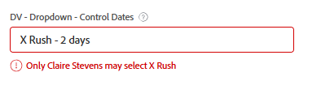
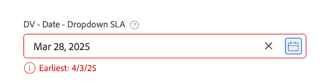
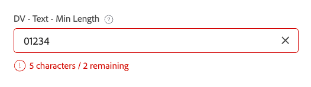
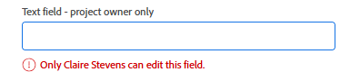
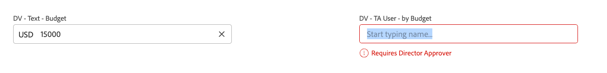
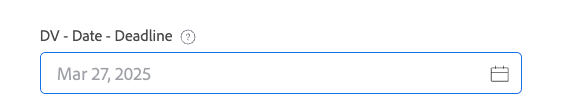

# カスタムフォームの高度なロジックの例

ロジックルールを使用すると、カスタムフォームのフィールドをさらにカスタマイズできます。

この記事では、カスタムフィールドで高度なロジックを構築するために使用される式の例を示します。

カスタムフォームへのロジックの追加について詳しくは、[&#x200B; カスタムフォームとフィールドへのロジックルールの追加](/help/quicksilver/administration-and-setup/customize-workfront/create-manage-custom-forms/form-designer/design-a-form/display-skip-logic-form-designer.md)を参照してください。

## アクセス要件

+++ 展開すると、この記事の機能のアクセス要件が表示されます。

<table style="table-layout:auto"> 
 <col> 
 <col> 
 <tbody> 
  <tr> 
   <td>Adobe Workfront パッケージ</td> 
   <td><p>任意</p></td> 
  </tr> 
  <tr> 
   <td>Adobe Workfront プラン</td> 
   <td><p>標準</p>
       <p>プラン</p></td>
  </tr> 
  <tr> 
   <td>アクセスレベル設定</td> 
   <td> <p>カスタムフォームへの管理アクセス権</p> </td> 
  </tr>  
 </tbody> 
</table>

詳しくは、[Workfront ドキュメントのアクセス要件](/help/quicksilver/administration-and-setup/add-users/access-levels-and-object-permissions/access-level-requirements-in-documentation.md)を参照してください。

+++

## 検証論理の例

検証ロジックは数式を使用して構築され、必要に応じてロジックを単純または複雑にすることができます。 検証は、他のフィールドの値またはオブジェクトのステータスに基づいて行うことができ、検証が失敗した場合のエラーメッセージを提供できます。

ユーザーがカスタムフォームに入力したときに、ロジックが適用されたフィールドが定義された検証条件を満たす場合、そのフィールドが強調表示され、エラーメッセージが表示されます。

検証ロジックは、次のフィールドタイプに適用できます。1行のテキスト、段落、単一選択ドロップダウン、複数選択ドロップダウン、外部参照、先行入力、日付、チェックボックスグループ、ラジオボタン。

### プロジェクト所有者のみが「ラッシュ」SLAを選択できるようにする

この例では、1つの選択ドロップダウンフィールドに、標準のSLA（14日間）、優先度（7日間）、およびラッシュ（2日間）の選択肢があります。

検証式：

```
IF({ownerID}!=$$USER&&{DE:DV - Dropdown - Control Dates}="2",CONCAT("Only ",{owner}.{name}," may select X Rush"))
```

プロジェクト所有者（システム管理者を含む）でないユーザーが&#x200B;**X Rush**&#x200B;を選択しようとすると、エラーが表示されます。

を選択できます

### 前のフィールドの選択に基づく日付の検証

SLAの例に続いて、前のドロップダウンフィールドの設定に基づいて検証される日付フィールドを追加できます。

検証式：

```
IF(
    DATEDIFF({DE:DV - Date - Dropdown SLA}, 
        ADDDAYS($$TODAY,{DE:DV - Dropdown - Control Dates})) < 0, 
    CONCAT("Earliest: ", 
        ADDDAYS($$TODAY,{DE:DV - Dropdown - Control Dates})))
```

ユーザーが許可された日付より前の日付を選択した場合、選択できる最も早い日付がメッセージに表示されます。

です

### 上書きするオプションを含む最小文字数

この例では、文字数が表示された状態で、テキストフィールドに最小文字数が適用されます。 また、文字数の検証を無効にするには、別のチェックボックスを設定します。

検証式：

```
IF({DE:DV - Override}!="Disable Validation"&&LEN({DE:DV - Text - Min Length})<"7",CONCAT(LEN({DE:DV - Text - Min Length})," characters / ",("7"-LEN({DE:DV - Text - Min Length}))," remaining"))
```

検証の適用は、次のチェックボックスを選択して上書きできます。


テキストフィールドには、実行中の文字数が含まれます。



### フィールドをロックして、所有者のみが編集できるようにします

この例では、フィールドはプロジェクト所有者のみが編集できます。 システム管理者でもフィールドを編集することはできません。

検証式：

```
IF({ownerID}!=$$USER,IF(ISBLANK({ownerID}),"Project Owner will provide this.",CONCAT("Only ",{owner}.{name}," can edit this.")))
```

プロジェクト所有者ではないユーザーがフィールドに入力しようとすると、プロジェクト所有者のみがフィールドを編集できることを示すメッセージが表示されます。



### Typeaheadは、他のフィールド値に基づいて値を許可または拒否します

この例では、先行入力フィールドは、フォームの別のフィールドに入力された値に基づいて、値を動的に許可または拒否します。

検証式：

```
IF({DE:DV - Text - Budget}>"10000",
   IF({DE:DV - TA User - by Budget}.{role}!="Director","Requires Director Approver")
)
```

予算フィールドの値が10,000 ドルを超える場合、タイプアヘッド設定でロールフィルターが有効になっていない場合でも、ディレクタの役割を持つユーザーのみがタイプアヘッドから選択できます。



### エントリ日から10日以内の値を許可しない

この例では、入力日から10日後の値のみを検証で使用できます。 検証を上書きするオプション（別のチェックボックスフィールド内）も、日付フィールドを空白にできるようにしながら、数式に含まれます。

検証式：

```
IF({DE:DV - Override}!="Disable Validation"&&ISBLANK({DE:DV - Date - Deadline})!="true"&&{DE:DV - Date - Deadline}<ADDDAYS({entryDate},"10"),CONCAT("Earliest: ",ADDDAYS({entryDate},"10")))
```

入力日トリガーの検証から10日以内の値：

です

空白の値は、検証メッセージをトリガーしません。



### 複数選択フィールドで正確/最小/最大の選択を適用

この例では、チェックボックスグループなどの複数選択フィールドでは、ユーザーは一定数のオプションを選択する必要があります。

検証式（2つだけ選択）:

```
IF({DE:DV - Override}!="Disable Validation"&&ARRAYLENGTH(ARRAY({DE:DV - Checkbox - Pick exactly 2},","))!="2","Pick Exactly 2 Options")
```

検証式（少なくとも2つ選択）:

```
IF({DE:DV - Override}!="Disable Validation"&&ARRAYLENGTH(ARRAY({DE:DV - Checkbox - Pick at least 2},","))<"2","Pick at least 2 choices")
```

検証式（2つ以上を選択してください）:

```
IF({DE:DV - Override}!="Disable Validation"&&ARRAYLENGTH(ARRAY({DE:DV - Checkbox - Pick no more than 2},","))>"2","Pick no more than 2 choices")
```

ユーザーが正しい数のオプションを選択しない場合、検証エラーが表示されます。


