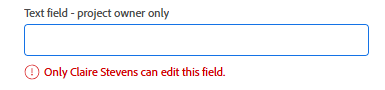
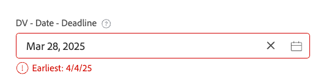

# カスタムフォームにおける高度なロジックの例

論理ルールを使用すると、カスタムフォームのフィールドをさらにカスタマイズできます。

この記事では、カスタムフィールドに対して高度なロジックを作成するために使用される式の例を示します。

カスタムフォームへのロジックの追加について詳しくは、[ カスタムフォームとフィールドへのロジックルールの追加 ](/help/quicksilver/administration-and-setup/customize-workfront/create-manage-custom-forms/form-designer/design-a-form/display-skip-logic-form-designer.md) を参照してください。

## アクセス要件

+++ 展開すると、この記事の機能のアクセス要件が表示されます。

<table style="table-layout:auto"> 
 <col> 
 <col> 
 <tbody> 
  <tr> 
   <td>Adobe Workfront パッケージ</td> 
   <td><p>任意</p></td> 
  </tr> 
  <tr> 
   <td>Adobe Workfront プラン</td> 
   <td><p>標準</p>
       <p>プラン</p></td>
  </tr> 
  <tr> 
   <td>アクセスレベル設定</td> 
   <td> <p>カスタムフォームへの管理アクセス権</p> </td> 
  </tr>  
 </tbody> 
</table>

詳しくは、[Workfront ドキュメントのアクセス要件](/help/quicksilver/administration-and-setup/add-users/access-levels-and-object-permissions/access-level-requirements-in-documentation.md)を参照してください。

+++

## 検証ロジックの例

検証ロジックは数式を使用して作成され、ロジックは必要に応じて単純にすることも、複雑にすることもできます。 検証は、他のフィールドの値やオブジェクトのステータスに基づくことができ、検証が失敗した場合のエラーメッセージを指定できます。

ユーザーがカスタムフォームに入力する際に、ロジックが適用されたフィールドが定義済みの検証条件を満たす場合、そのフィールドはハイライト表示され、エラーメッセージが表示されます。

検証ロジックを適用できるフィールドタイプは、1 行のテキスト、段落、単一選択ドロップダウン、複数選択ドロップダウン、外部検索、typeahead、日付、チェックボックスグループ、ラジオボタンです。

### プロジェクト所有者のみが「緊急」SLAを選択できます

この例では、単一選択ドロップダウンフィールドには、「標準 – 14 日」、「優先度 – 7 日」、「緊急 – 2 日」のSLAの選択肢があります。

検証式：

```
IF({ownerID}!=$$USER&&{DE:DV - Dropdown - Control Dates}="2",CONCAT("Only ",{owner}.{name}," may select X Rush"))
```

プロジェクト所有者でないユーザー（システム管理者を含む）が **X Rush** を選択しようとすると、次のエラーが表示されます。


### 前のフィールドでの選択に基づく日付の検証

SLAの例を続けて、前のドロップダウンフィールドの設定に基づいて検証される日付フィールドを追加できます。

検証式：

```
IF({DE:DV - Date - Dropdown SLA}<ADDDAYS($$TODAY,{DE:DV - Dropdown - Control Dates}),CONCAT("Earliest: ",ADDDAYS($$TODAY,{DE:DV - Dropdown - Control Dates})))
```

ユーザーが許可されている日付より前の日付を選択すると、選択できる最も古い日付がメッセージに表示されます。


### 上書きするオプションの最小文字数

この例では、文字数カウントの最小値がテキストフィールドに適用され、文字数カウントが表示されます。 また、文字数の検証を無効にするには、別のチェックボックスが設定されています。

検証式：

```
IF({DE:DV - Override}!="Disable Validation"&&LEN({DE:DV - Text - Min Length})<"7",CONCAT(LEN({DE:DV - Text - Min Length})," characters / ",("7"-LEN({DE:DV - Text - Min Length}))," remaining"))
```

検証の適用は、チェックボックスを選択して上書きできます。


次のテキストフィールドには、実行中の文字数が含まれます。


### 所有者のみが編集できるようにフィールドをロック

この例では、フィールドはプロジェクト所有者のみが編集できます。 システム管理者でもフィールドを編集できません。

検証式：

```
IF({ownerID}!=$$USER,IF(ISBLANK({ownerID}),"Project Owner will provide this.",CONCAT("Only ",{owner}.{name}," can edit this.")))
```

プロジェクト所有者以外のユーザーがフィールドに入力しようとすると、プロジェクト所有者のみがフィールドを編集できることを示すメッセージが表示されます。



### Typeahead は、他のフィールド値に基づいて値を許可または拒否します。

この例では、typeahead フィールドは、フォームの別のフィールドに入力された値に基づいて、値を動的に許可または拒否します。

検証式：

```
IF({DE:DV - Text - Budget}>"10000",
   IF({DE:DV - TA User - by Budget}.{role}!="Director","Requires Director Approver")
)
```

予算フィールドの値が$10,000 を超える場合、typeahead 設定で有効になっている役割フィルターがなくても、Director の役割を持つユーザーのみを typeahead から選択できます。


### エントリ日から 10 日未満の値を許可しない

この例では、検証で許可されるのは、エントリ日から 10 日後の値のみです。 検証を上書きするオプション（別のチェックボックスフィールド内）も式に含まれ、日付フィールドを空白にすることができます。

検証式：

```
IF({DE:DV - Override}!="Disable Validation"&&ISBLANK({DE:DV - Date - Deadline})!="true"&&{DE:DV - Date - Deadline}<ADDDAYS({entryDate},"10"),CONCAT("Earliest: ",ADDDAYS({entryDate},"10")))
```

エントリ日のトリガーの検証から 10 日未満の任意の値：



空白の値は、検証メッセージをトリガーにしません。


### 複数選択フィールドでの厳密/最小/最大の選択の強制

この例では、チェックボックス グループなどの複数選択フィールドを使用する場合、ユーザーは一定数のオプションを選択する必要があります。

検証式（正確に 2 つ選択）:

```
IF({DE:DV - Override}!="Disable Validation"&&ARRAYLENGTH(ARRAY({DE:DV - Checkbox - Pick exactly 2},","))!="2","Pick Exactly 2 Options")
```

検証式（少なくとも 2 つ選択）:

```
IF({DE:DV - Override}!="Disable Validation"&&ARRAYLENGTH(ARRAY({DE:DV - Checkbox - Pick at least 2},","))<"2","Pick at least 2 choices")
```

検証式（2 つ以下を選択）:

```
IF({DE:DV - Override}!="Disable Validation"&&ARRAYLENGTH(ARRAY({DE:DV - Checkbox - Pick no more than 2},","))>"2","Pick no more than 2 choices")
```

正しいオプション数を選択しないと、検証エラーが表示されます。


