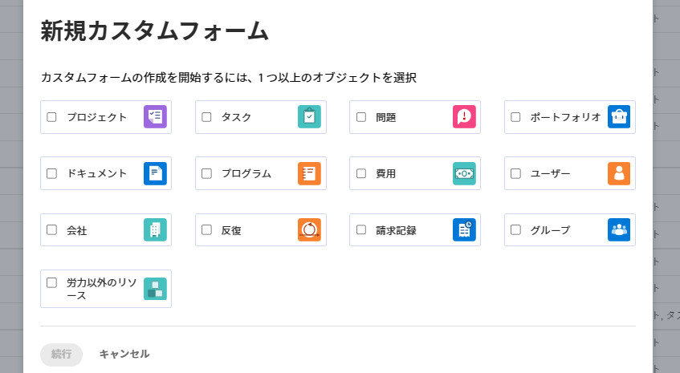
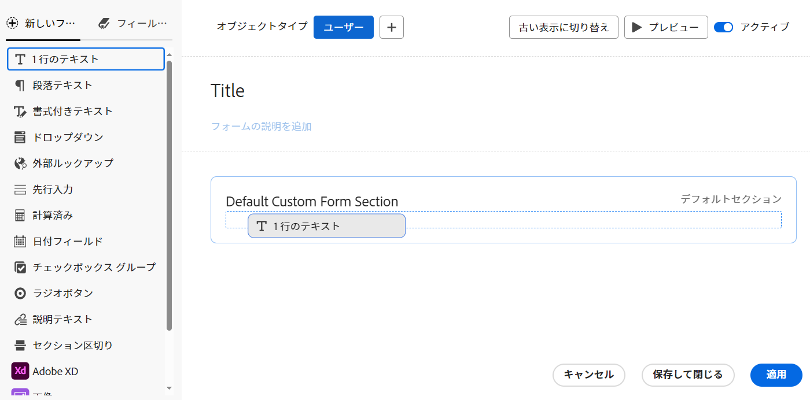
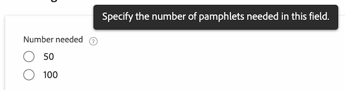
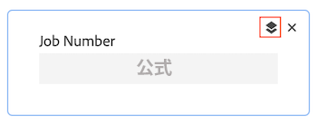

# フォームデザイナーでフォームをデザイン

{{highlighted-preview}}

フォームデザイナーを使用してカスタムフォームをデザインできます。カスタムフォームを様々な Workfront オブジェクトに添付して、これらのオブジェクトに関するデータを取り込むことができます。

## アクセス要件

この記事の手順を実行するには、以下を保有している必要があります。

<table style="table-layout:auto"> 
 <col> 
 <col> 
 <tbody> 
  <tr data-mc-conditions=""> 
   <td role="rowheader"> 
Adobe Workfront プラン
 </td> 
   <td>任意</td> 
  </tr> 
  <tr> 
   <td role="rowheader">Adobe Workfront ライセンス</td> 
   <td>
   
新規：標準

   
または

   
現在：プラン
</td> 
  </tr> 
  <tr data-mc-conditions=""> 
   <td role="rowheader">アクセスレベル設定</td> 
   <td> 
カスタムフォームへの管理アクセス権
 </td> 
  </tr>  
 </tbody> 
</table>

この表の情報の詳細については、 [Workfrontドキュメントのアクセス要件](/help/quicksilver/administration-and-setup/add-users/access-levels-and-object-permissions/access-level-requirements-in-documentation.md).

## カスタムフォームのデザインを開始する

{{step-1-to-setup}}

1. 左側のパネルで「**カスタムフォーム**」をクリックします。

   <!-- >[!TIP]
    >
    >In the view that appears, you can review all custom forms and custom fields that have been created for your organization. You can also see who created each form and the fields that are associated with it. -->

1. 「**新規カスタムフォーム**」をクリックします。
1. カスタムフォームを添付するオブジェクトタイプを選択し、「**続行**」をクリックします。

   

1. **タイトルが必要です**&#x200B;エリアに、カスタムフォームタイトルを入力します。
1. （オプション）フォームに他のオブジェクトタイプを追加して、より多くのオブジェクトに添付できるようにする場合は、**オブジェクトタイプ**&#x200B;の後にある&#x200B;**追加**&#x200B;アイコン  をクリックし、表示されるメニューから必要なタイプを選択します。この操作を繰り返して、必要な数のオブジェクトタイプを追加できます。

   また、オブジェクトタイプの X をクリックして、フォームから削除することもできます。

   >[!CAUTION]
   >
   >カスタムフォームを削除すると、フォームに関連付けられたオブジェクト上のすべてのカスタムデータも削除されます。削除したデータは復元できません。代わりに、カスタムフォームの非アクティブ化を検討してください。使用しなくなったカスタムフォームを非アクティブ化すると、関連するすべての履歴データが保持されます。
   >
   >詳しくは、[カスタムフォームのオブジェクトタイプを削除](/help/quicksilver/administration-and-setup/customize-workfront/create-manage-custom-forms/delete-object-type-on-a-custom-form.md)を参照してください。

1. 次に、カスタムフォームへのフィールドの追加を開始できます。次の節を参照してください。
   * [別のカスタムフォームで既に使用されている既存のフィールドまたはウィジェットの再利用](#reuse-an-existing-field-or-widget-already-used-in-another-custom-form)
   * [テキストフィールドの追加](#add-text-fields)
   * [計算フィールドの追加](#add-calculated-fields)
   * [ラジオボタン、チェックボックスグループ、ドロップダウンの追加](#add-radio-buttons-checkboxes-and-dropdowns)
   * [先行入力フィールドと日付フィールドの追加](#add-typeahead-and-date-fields)
   * [外部参照フィールドの追加](#add-external-lookup-fields)
   * [画像、PDF、ビデオの追加](#add-images-pdfs-and-videos)
   * [Workfrontネイティブフィールドの追加](#add-workfront-native-fields)
   * [Adobe XD ファイルの追加](#add-adobe-xd-files)

## 新規または既存のフィールドをカスタムフォームに追加する

カスタムフォームのデザイン時に、新規フィールドまたは既存のフィールドを使用できます。

## 別のカスタムフォームで既に使用されている既存のフィールドまたはウィジェットの再利用

1. 画面の左上で、「**フィールドライブラリ**」をクリックします。

1. カスタムフォームで必要なフィールドまたはウィジェットをここにドラッグします。
1. （オプション）前の手順を繰り返して、その他のフィールドやウィジェットを追加します。

   >[!NOTE]
   >
   >1 つのカスタムフォームに最大 500 個のフィールドやウィジェットを追加できます。ただし、フォームに 100 を超えるフィールドやウィジェットが存在する場合は、その複雑さに応じてパフォーマンスの低下が生じる可能性があります。
   >
   >
   >複雑なフォームの例としては、カスケードパラメーターを含むフォーム、計算済みカスタムデータフィールドを含むフォーム、単一のフィールドに複数の値オプションを含むフォームなどがあります。

1. 変更を保存するには「**適用**」をクリックし、別のセクションに移動してフォームの作成を続行します。

   または

   「**保存して閉じる**」をクリックします。

### テキストフィールドの追加

1 つのカスタムフォームに複数の異なるテキストフィールドを追加できます。

+++ **展開して、使用可能なテキストフィールドの説明を確認**

* **1 行のテキストフィールド**：ユーザーがフィールドに 1 行のテキストを入力できます。
* **段落テキストフィールド**：ユーザーがフィールドに複数行のテキストを入力できます。
* **書式付きテキストフィールド**：フィールドに複数行のテキストを入力し、太字、斜体、下線、箇条書き、段落番号、ハイパーリンク、ブロック引用符でテキストを書式設定できます。文字数の上限が 15,000 字なので、たくさんのテキストと書式設定を入力できます。

  API を使用したこのフィールドへのアクセスについて詳しくは、API のリッチテキストフィールドストレージを参照してください。

  >[!NOTE]
  >
  >書式付きテキストフィールドは、Workfront モバイルアプリ（今後のリリースで利用可能）では利用できません。

* **説明テキスト**：Workfront の外部のページに手順とリンクを含めることができます。

+++

テキストフィールドを追加するには、次の手順を実行します。

1. 画面の左側で、次のいずれかのテキストフィールドを探し、キャンバス上のセクションにドラッグします。

   * 1 行のテキスト
   * 段落テキスト
   * 書式付きテキストフィールド
   * 説明テキスト

   

1. 画面の右側で、追加するカスタムフィールドのタイプに使用できるオプションを設定します。

   <table>
    <tr>
    <td>次に入力</td>
    <td>説明</td>
    <td>次の用途で使用可能 </td>
    </tr>
    <tr>
    <td>サイズ</td>
    <td>
フォーム上のテキストフィールドのサイズを変更します。

   </td>
    <td><ul>
    <li>1 行テキスト</li>
    <li>段落テキスト</li>
    <li>書式付きテキスト</li>
    <li>説明テキスト - 近日公開予定</li>
    </ul></td>
    </tr>
    <tr>
    <td>ラベル</td>
    <td>
ウィジェットの上に表示する説明ラベルを入力します。ラベルはいつでも変更できます。

    
重要：このラベルでは特殊文字を使用しないでください。レポートでは正しく表示されません。
</td>
    <td><ul>
    <li>1 行テキスト</li>
    <li>段落テキスト</li>
    <li>書式付きテキスト</li>
    </ul></td>
    </tr>
    <tr>
     <td>名前</td>
    <td>
（必須）この名前は、システムによるフィールドの識別方法です。初めてウィジェットを設定してラベルを入力すると、それに一致するように、名前フィールドが自動的に入力されます。ただし、ラベルフィールドと名前フィールドは同期されません。これにより、システムで表示される名前を変更することなく、ユーザーに表示されるラベルを自由に変更できます。

    
<b>重要</b>：   
      <ul> 
      <li>こうすることは可能ですが、ご自身や他のユーザーが Workfront でカスタムフォームを使用し始めた後は、この名前を変更しないことをお勧めします。変更してしまうと、Workfront の他の領域で参照される可能性のあるカスタムフィールドが認識されなくなります。 
例えば、カスタムフィールドをレポートに追加し、後で名前を変更した場合、Workfront はレポート内のフィールドを認識せず、新しい名前でレポートに再追加しない限り、正しく機能しなくなります。
 </li>
      <li> 
組み込みの Workfront フィールドに既に使用されている名前は、入力しないことをお勧めします。
 </li>
      <li>
Workfront の様々なエリアでフィールドを使用する際のエラーを防止するため、カスタムフィールド名にはピリオドやドット「.」を使用しないことをお勧めします。
</li>
    </td>
    <td><ul>
    <li>1 行テキスト</li>
    <li>段落テキスト</li>
    <li>書式付きテキスト</li>
    <li>説明テキスト</li>
    </ul></td>
    </tr>
    <tr>
    <td>手順</td>
    <td>ウィジェットに関する追加情報を入力します。ユーザーがカスタムフォームに入力する際に、「疑問符」アイコンの上にポインタを合わせると、ここに入力した情報を含むツールヒントが表示されます。
    
    </td>
    <td><ul>
    <li>1 行テキスト</li>
    <li>段落テキスト</li>
    <li>書式付きテキスト</li>
    </ul></td>
    </tr>
    <tr>
    <td>形式</td>
    <td>
カスタムフィールドに取り込むデータのタイプを選択します。
 
<b>メモ</b>：   
    <ul> 
    <li>フォームを保存した後は、このフィールドを編集できません。数学計算でフィールドを使用する場合は、必ず「数値」または「通貨」フォーマットを選択してください。</li> 
    <li>「数値」または「通貨」を選択すると、0 から始まる数値が自動的に切り捨てられます。</li>
    <li>数値フィールドの文字数制限は 16 です。 また、テキストフィールドを使用して数値を入力し、制限を回避することもできます。</li>
     </ul>
</td> </td>
    <td><ul>
    <li>1 行テキスト</li>
    <li>段落テキスト</li>
    </ul></td>
    </tr>
    <tr>
    <td>表示タイプ</td>
    <td>1 行のテキストフィールドと段落のテキストフィールドを切り替えます。</td>
    <td><ul>
    <li>1 行テキスト</li>
    <li>段落テキスト</li>
    </ul></td>
    </tr>
    <tr>
    <td>ハイパーリンク</td>
    <td> 入力した説明テキストにハイパーリンクを適用する場合は、ここに追加します。説明テキストは、フォームが添付されるオブジェクト上のリンクとして表示されます。</td>
    <td><ul><li>説明テキスト</li></ul></td>
    </tr>
   </table>

1. （オプション）前の手順を繰り返して、その他のフィールドやウィジェットを追加します。

   または

   フィールドをコピーするには、フィールドの上にポインタを合わせて、コピーアイコンをクリックします。

   

1. 変更を保存するには、「**適用**」をクリックし、別のセクションに移動してフォームの作成を続けます。

   または

   「**保存して閉じる**」をクリックします。

### 計算フィールドの追加

カスタムフォームでは、カスタムフォームがオブジェクトに添付される際に、既存のデータを使用して新しいデータを生成する計算済みカスタムフィールドを追加できます。

計算済みフィールドを追加するには、[フォームデザイナーで計算済みフィールドを追加](/help/quicksilver/administration-and-setup/customize-workfront/create-manage-custom-forms/form-designer/design-a-form/add-a-calculated-field.md)を参照してください。

### ラジオボタン、チェックボックス、ドロップダウンを追加する

ラジオボタン、チェックボックス、ドロップダウンをカスタムフォームに追加できます。

+++ **展開して、使用可能なフィールドの説明を確認**

* **ラジオボタン**：ユーザーが 1 つの選択肢のみを選択する必要があります。
* **チェックボックスグループ**：ユーザーが複数選択できます。
* **ドロップダウン**：ドロップダウンの選択肢のリストを表示します。

+++

>[!NOTE]
>
>チェックボックスグループやドロップダウンなど、複数の選択が可能なフィールドは、レポートでグラフ化やグループ化が困難です。 レポートでのグラフ作成とグループ化を容易にするために、各選択肢に対して個別のフィールド（1 行のテキストフィールドなど）を作成できます。

ラジオボタンおよびチェックボックスを追加するには、以下の手順を実行します。

1. 画面の左側で、次のいずれかのフィールドを探し、キャンバス上のセクションにドラッグします。

   * ラジオボタン
   * チェックボックスグループ
   * ドロップダウン

   

1. 画面の右側で、追加するカスタムフィールドのタイプに使用できるオプションを設定します。

   <table style="table-layout:auto"> 
    <tbody> 
    <tr>
    <td>次に入力</td>
    <td>説明</td>
    <td>次の用途で使用可能 </td>
    </tr>
    <tr> 
     <td role="rowheader">ラベル</td> 
     <td> 
（必須）カスタムフィールドの上に表示する説明ラベルを入力します。ラベルはいつでも変更できます。
 
<b>重要</b>：このラベルでは特殊文字を使用しないでください。レポートでは正しく表示されません。
 </td> 
     <td><ul>
    <li>ラジオボタン</li>
    <li>チェックボックスグループ</li>
    <li>ドロップダウン</li>
    </ul></td>
     </tr> 
     <tr> 
    <td role="rowheader">名前</td> 
     <td> 
（必須）カスタムフィールドを Workfront 全体の様々なエリア（レポート、ホーム、API の操作など）に追加した場合、この名前は、システムでカスタムフィールドを識別するために使われます。
 
初めてカスタムフィールドを設定してラベルを入力すると、それに一致するように、名前フィールドが自動的に入力されます。ただし、ラベルフィールドと名前フィールドは同期されません。これにより、システムで表示される名前を変更することなく、ユーザーに表示されるラベルを自由に変更できます。
 
    
<b>重要</b>：   
     <ul> 
    <li>こうすることは可能ですが、ご自身や他のユーザーが Workfront でカスタムフォームを使用し始めた後は、この名前を変更しないことをお勧めします。変更してしまうと、Workfront の他の領域で参照される可能性のあるカスタムフィールドが認識されなくなります。 
例えば、カスタムフィールドをレポートに追加し、後で名前を変更した場合、Workfront はレポート内のフィールドを認識せず、新しい名前でレポートに再追加しない限り、正しく機能しなくなります。
 </li>
    <li> 
組み込みの Workfront フィールドに既に使用されている名前は、入力しないことをお勧めします。
 </li>
     <li>
Workfront の様々なエリアでフィールドを使用する際のエラーを防止するため、カスタムフィールド名にはピリオドやドット「.」を使用しないことをお勧めします。
</li>
     </ul> 
それぞれのカスタムフィールド名は、組織の Workfront インスタンス内で一意である必要があります。これにより、既に作成されたものを別のカスタムフォームに再利用できます。詳しくは、<a href="#Add" class="MCXref xref">カスタムフォームにカスタムフィールドを追加</a>を参照してください。
 </td>
     <td><ul>
    <li>ラジオボタン</li>
    <li>チェックボックスグループ</li>
    <li>ドロップダウン</li>
    </ul></td>
    </tr> 
    <tr> 
    <td role="rowheader">手順</td> 
    <td> 
カスタムフィールドに関する追加情報を入力します。ユーザーがカスタムフォームに入力する際に、疑問符アイコンの上にポインタを合わせると、ここに入力した情報を含むツールヒントが表示されます。
 
    
   

    </td> 
    <td><ul>
    <li>ラジオボタン</li>
    <li>チェックボックスグループ</li>
    <li>ドロップダウン</li>
    </ul></td>
    </tr> 
    <tr> 
    <td role="rowheader">形式</td> 
    <td> 
カスタムフィールドに取り込むデータのタイプを選択します。
 
<b>メモ</b>：   
     <ul> 
    <li>フォームを保存した後は、このフィールドを編集できません。数学計算でフィールドを使用する場合は、必ず「数値」または「通貨」フォーマットを選択してください。 </li> 
    <li>「数値」または「通貨」を選択すると、0 から始まる数値が自動的に切り捨てられます。</li>
    <li>数値フィールドの文字数制限は 16 です。 また、テキストフィールドを使用して数値を入力し、制限を回避することもできます。</li>
     </ul>
</td> 
     <td><ul>
    <li>ラジオボタン</li>
    <li>チェックボックスグループ</li>
    <li>ドロップダウン</li>
    </ul></td>
    </tr> 
    <tr> 
     <td role="rowheader">表示タイプ</td> 
    <td>ラジオボタン、チェックボックスグループ、ドロップダウン、またはフィールドの複数選択ドロップダウンを切り替えます。</td> 
    <td><ul>
    <li>ラジオボタン</li>
    <li>チェックボックスグループ</li>
    <li>ドロップダウン</li>
    </ul></td>
    </tr> 
     <tr> 
    <td role="rowheader">必須フィールドを作成</td> 
    <td>ユーザーにカスタムフォームを完了させるために、このフィールドを必須にしたい場合は、このオプションを選択します。 </td> 
    <td><ul>
    <li>ラジオボタン</li>
    <li>チェックボックスグループ</li>
    <li>ドロップダウン</li>
    </ul></td>
     </tr> 
    <tr> 
    <td role="rowheader">選択肢 </td> 
    <td> 
    <ol> 
    <li> 
「<b>オプション</b>」をクリックし、以下のいずれかを有効にします。
 
    <ul> 
    <li><strong>値を表示</strong>：それぞれの選択値をフィールドに表示します。それぞれの選択のラベルは、デフォルトで表示されます。</li> 
     <li><strong>A～Z で順に選択肢を並べ替える</strong>：フィールドに追加した選択肢をアルファベット順に並べ替えます。</li> 
    </ul> 
    </li> 
    <li> 
ユーザーに追加するそれぞれの選択肢に対して、「歯車」アイコンをクリックし、以下のオプションのいずれかを選択します。
 
    <ul> 
    <li><strong>デフォルトで選択</strong>：フィールドでデフォルトの選択肢を選択します。</li> 
    <li> 
<strong>選択肢を非表示</strong>：フィールドで選択肢を非表示にします。非表示された選択肢は、レポート内で引き続きアクセスできます。
 </li> 
    <li> 
<strong>選択肢を削除</strong>：フィールドから選択肢を削除します。
 
<b>警告</b>：この選択肢を使用する現在のオブジェクトがある場合は、フィールドから削除しないでください。削除すると、履歴データが失われる可能性があります。その代わりに、非表示にするオプションを選択します。これにより、ユーザーは今後このオプションを選択できなくなります。
 </li> 
    </ul> 
     </li> 
    </ol> </td> 
    <td><ul>
    <li>ラジオボタン</li>
    <li>チェックボックスグループ</li>
    <li>ドロップダウン</li>
    </ul></td>
     </tr> 
    </tbody> 
    </table>

1. （オプション）前の手順を繰り返して、その他のフィールドやウィジェットを追加します。

   または

   フィールドをコピーするには、フィールドの上にポインタを合わせて、コピーアイコンをクリックします。

   

1. 変更を保存するには、「**適用**」をクリックし、別のセクションに移動してフォームの作成を続けます。

   または

   「**保存して閉じる**」をクリックします。

### 先行入力フィールドと日付フィールドの追加

カスタムフォームに先読みと日付のフィールドを追加できます。

+++ **展開して、使用可能なフィールドの説明を確認**

* **先読み**：ユーザーは、Workfront に存在するオブジェクトの名前を入力できます。ユーザーが入力し始めると、候補のリストが表示されます。このフィールドタイプでは、次のオブジェクトをサポートしています。
   * ユーザー
   * グループ
   * 担当業務
   * ポートフォリオ
   * プログラム
   * プロジェクト
   * チーム
   * テンプレート
   * 会社
* **日付フィールド**：ユーザーが日時を選択できるカレンダーを表示します。

+++

先読み日付フィールドを追加するには、以下の手順を実行します。

1. 画面の左側で、次のいずれかのフィールドを探し、キャンバス上のセクションにドラッグします。

   * 先行入力
   * 日付フィールド

   

1. 画面の右側で、追加するカスタムフィールドのタイプに使用できるオプションを設定します。

   <table style="table-layout:auto"> 
    <tbody> 
     <tr>
    <td>フィールド設定</td>
    <td>説明</td>
    <td>次の用途で使用可能 </td>
    </tr>
     <tr> 
      <td role="rowheader">ラベル</td> 
      <td> 
（必須）カスタムフィールドの上に表示する説明ラベルを入力します。ラベルはいつでも変更できます。
 
<b>重要</b>：このラベルでは特殊文字を使用しないでください。レポートでは正しく表示されません。
 </td> 
       <td><ul>
    <li>先行入力</li>
    <li>日付フィールド</li>
    </ul></td>
     </tr> 
     <tr> 
      <td role="rowheader">名前</td> 
      <td> 
（必須）カスタムフィールドを Workfront 全体の様々なエリア（レポート、ホーム、API の操作など）に追加した場合、この名前は、システムでカスタムフィールドを識別するために使われます。
 
初めてカスタムフィールドを設定してラベルを入力すると、それに一致するように、名前フィールドが自動的に入力されます。ただし、ラベルフィールドと名前フィールドは同期されません。これにより、システムで表示される名前を変更することなく、ユーザーに表示されるラベルを自由に変更できます。
 
      
<b>重要</b>：   
      <ul> 
      <li>こうすることは可能ですが、ご自身や他のユーザーが Workfront でカスタムフォームを使用し始めた後は、この名前を変更しないことをお勧めします。変更してしまうと、Workfront の他の領域で参照される可能性のあるカスタムフィールドが認識されなくなります。 
例えば、カスタムフィールドをレポートに追加し、後で名前を変更した場合、Workfront はレポート内のフィールドを認識せず、新しい名前でレポートに再追加しない限り、正しく機能しなくなります。
 </li>
      <li> 
組み込みの Workfront フィールドに既に使用されている名前は、入力しないことをお勧めします。
 </li>
      <li>
Workfront の様々なエリアでフィールドを使用する際のエラーを防止するため、カスタムフィールド名にはピリオドやドット「.」を使用しないことをお勧めします。
</li>
      </ul> 
それぞれのカスタムフィールド名は、組織の Workfront インスタンス内で一意である必要があります。これにより、既に作成されたものを別のカスタムフォームに再利用できます。詳しくは、<a href="#Add" class="MCXref xref">カスタムフォームにカスタムフィールドを追加</a>を参照してください。
 </td>
         <td><ul>
    <li>先行入力</li>
    <li>日付フィールド</li>
    </ul></td>
     </tr> 
     <tr> 
      <td role="rowheader">手順</td> 
      <td> 
カスタムフィールドに関する追加情報を入力します。ユーザーがカスタムフォームに入力する際に、疑問符アイコンの上にポインタを合わせると、ここに入力した情報を含むツールヒントが表示されます。
 
      
  

      </td> 
         <td><ul>
    <li>先行入力</li>
    <li>日付フィールド</li>
    </ul></td>
     </tr> 
     <tr> 
      <td role="rowheader">時刻の表示</td> 
      <td>日付とともに時刻をフィールドに表示する場合は、このオプションを選択します。</td> 
         <td><ul>
    <li>日付フィールド</li>
    </ul></td>
     </tr> 
     <tr> 
      <td role="rowheader">参照オブジェクト タイプ</td> 
      <td> 
フィールドに関連付けるオブジェクトタイプを選択します。
 
「適用」または「保存して閉じる」をクリックした後は、フィールドのオブジェクトのタイプを変更できません。
 
<b>メモ</b>：   
        <ul> 
         <li>Workfront 管理者が Workfront ユーザーインターフェイスでポートフォリオ、プログラム、またはプロジェクトの名前をカスタマイズした場合、このドロップダウンリストには、カスタマイズされた名前ではなく、オブジェクトのデフォルトの Workfront 名が表示されます。これについてサポートが必要な場合は、Workfront 管理者にお問い合わせください。 </li> 
         <li>iOS および Android Workfront Mobile アプリでは、ユーザー、会社、グループ、担当業務、ポートフォリオ、プログラム、プロジェクト、テンプレートの各オブジェクトタイプがサポートされています。</li> 
        </ul> 
 </td> 
         <td><ul>
    <li>先行入力</li>
    </ul></td>
     </tr>
     <tr> 
      <td role="rowheader">必須フィールドを作成</td> 
      <td>ユーザーにカスタムフォームを完了させるために、このフィールドを必須にしたい場合は、このオプションを選択します。 </td> 
       <td><ul>
    <li>先行入力</li>
    <li>日付フィールド</li>
    </ul></td>
     </tr> 
    </tbody> 
   </table>

1. （オプション）前の手順を繰り返して、その他のフィールドやウィジェットを追加します。

   または

   フィールドをコピーするには、フィールドの上にポインタを合わせて、コピーアイコンをクリックします。

   

1. 変更を保存するには、「**適用**」をクリックし、別のセクションに移動してフォームの作成を続けます。

   または

   「**保存して閉じる**」をクリックします。

### 外部参照フィールドの追加

外部参照フィールドは、外部 API を呼び出し、値をドロップダウンフィールドのオプションとして返します。 カスタムフォームが添付されているオブジェクトを操作するユーザーは、ドロップダウンからこれらのオプションを 1 つ以上選択できます。 外部参照フィールドは、リストやレポートでも使用できます。

「外部参照」フィールドを使用してWorkfrontまたはパブリック API の同じインスタンスを呼び出す例については、 [カスタムフォームの「外部参照」フィールドの例](/help/quicksilver/administration-and-setup/customize-workfront/create-manage-custom-forms/form-designer/design-a-form/external-lookup-examples.md).

>[!NOTE]
>
>外部参照機能は、Document オブジェクトまたは User オブジェクトでは使用できません。

外部参照を追加する手順は、次のとおりです。

1. 画面の左側で、を探します。 **外部参照** をクリックし、キャンバス上のセクションにドラッグします。
1. 画面の右側で、カスタムフィールドのオプションを設定します。

   <table style="table-layout:auto"> 
    <col> 
    <col> 
    <tbody> 
     <tr> 
      <td role="rowheader">ラベル</td> 
      <td> 
（必須）カスタムフィールドの上に表示する説明ラベルを入力します。ラベルはいつでも変更できます。
 
<b>重要</b>：このラベルでは特殊文字を使用しないでください。レポートでは正しく表示されません。
 </td> 
     </tr> 
     <tr> 
      <td role="rowheader">名前</td> 
      <td> 
（必須）カスタムフィールドの識別方法はこの名前です。
 
初めてカスタムフィールドを設定してラベルを入力すると、それに一致するように、名前フィールドが自動的に入力されます。ただし、ラベルフィールドと名前フィールドは同期されません。これにより、システムで表示される名前を変更することなく、ユーザーに表示されるラベルを自由に変更できます。
 
      
<b>重要</b>：   
      <ul> 
      <li>こうすることは可能ですが、ご自身や他のユーザーが Workfront でカスタムフォームを使用し始めた後は、この名前を変更しないことをお勧めします。変更してしまうと、Workfront の他の領域で参照される可能性のあるカスタムフィールドが認識されなくなります。 
例えば、カスタムフィールドをレポートに追加し、後で名前を変更した場合、Workfront はレポート内のフィールドを認識せず、新しい名前でレポートに再追加しない限り、正しく機能しなくなります。
 </li>
      <li> 
組み込みの Workfront フィールドに既に使用されている名前は、入力しないことをお勧めします。
 </li>
      <li>
Workfront の様々なエリアでフィールドを使用する際のエラーを防止するため、カスタムフィールド名にはピリオドやドット「.」を使用しないことをお勧めします。
</li>
      </ul> 
それぞれのカスタムフィールド名は、組織の Workfront インスタンス内で一意である必要があります。これにより、既に作成されたものを別のカスタムフォームに再利用できます。詳しくは、<a href="#Add" class="MCXref xref">カスタムフォームにカスタムフィールドを追加</a>を参照してください。
 </td>
     </tr> 
      <td role="rowheader">手順</td> 
      <td> 
カスタムフィールドに関する追加情報を入力します。ユーザーがカスタムフォームに入力する際に、疑問符アイコンの上にポインタを合わせると、ここに入力した情報を含むツールヒントが表示されます。
 </td> 
     </tr> 
     <tr> 
      <td role="rowheader">形式</td>
      <td>
カスタムフィールドに取り込むデータのタイプを選択します。

      
<strong>注意：</strong>

      <ul><li>フォームの保存後に形式の種類を変更できます。ただし、1 つの制限があります。オブジェクト上の既存の値はすべて新しい種類に変換できる必要があります。 （例えば、書式タイプが「テキスト」で、オブジェクトが値「abc」を格納している場合、フィールドを変換できず、「abc」を数値/通貨に変換できないというエラーが表示されます）。 数学計算でフィールドを使用する場合は、必ず「数値」または「通貨」フォーマットを選択してください。</li>
      <li>「数値」または「通貨」を選択すると、0 から始まる数値が自動的に切り捨てられます。</li>
      <li>数値フィールドの文字数制限は 16 です。 また、テキストフィールドを使用して数値を入力し、制限を回避することもできます。</li>
      </ul></td>
     </tr> 
     <tr> 
      <td role="rowheader">ベース API の URL</td> 
      <td>
API の URL を入力または貼り付けます。

API URL は、ドロップダウンに表示するオプションの JSON コンテンツを返す必要があります。 「 JSON パス」フィールドを使用して、返された JSON からドロップダウンオプションに含まれる特定の値を選択できます。

API URL を入力する際に、オプションで次の値を URL に渡すことができます。

      <ul>
      <li>$$HOST — 現在のWorkfrontホストを表し、Workfront API に対する/search API 呼び出しをおこなうために使用できます。 このワイルドカードを使用する場合、認証が処理され、ユーザーは認証ヘッダーを送信する必要はありません。 （例えば、ユーザーはベース URL を使用してタスクを検索できます） <code>$$HOST/attask/api/task/search</code> タスクを検索し、返されたタスクのリストから値を選択できます )。</li>
      <li>
$$QUERY — エンドユーザーがフィールドに入力する検索テキストを表し、エンドユーザーに対してクエリフィルターを実装できます。 （ユーザーはドロップダウン内の値を検索します）。

      
参照している API で許可されている場合は、検索クエリに修飾子を含めて、検索の仕組みを識別することもできます。 例えば、次の API を Base URL として使用すると、特定のテキストを含む任意のWorkfrontプロジェクトをユーザーが検索できるようになります。 <code>$$HOST/attask/api/v15.0/proj/search?name=$$QUERY&name_Mod=contains</code>.

Workfrontの検索修飾子の詳細については、 <a href="/help/quicksilver/wf-api/general/api-basics.md">API の基本</a>.

      
<strong>注意：</strong> $$QUERY を使用せず、検索ボックスにテキストを入力した場合は、既に選択項目が絞り込まれます。 ただし、$$QUERY を使用し、ユーザーが何かを入力した場合は、API への新しいネットワーク呼び出しが実行されます。 したがって、API に 2,000 個を超える値があり、API がクエリをサポートしている場合、$$QUERY を使用して、既存の 2,000 個の値から検索するだけでなく、絞り込まれたオプションを持つ元の API から検索できます。
</li>
      <li>
{fieldName} - fieldName は、Workfrontの任意のカスタムフィールドまたはネイティブフィールドです。 この方法では、既に選択されているフィールドの値を「外部参照」フィールドに渡してオプションをフィルターダウンする際に、カスケードドロップダウンオプションフィルターを実装できます。 （例えば、「地域」フィールドが既にフォーム上に存在し、API から特定の地域に属する国のリストに国を絞り込むとします）。

      
他のフィールドに依存する外部参照フィールドの場合 ( {fieldName} 構文を参照 )、API から返されるオプションは、他のフィールドに入力された文字列や値と一致するオプションに制限されます。 （この機能は、リストとレポートではサポートされていません。）
</li>
      <li>{referenceObject}.{fieldName}  — フィールドがオブジェクトの一部である場所。 この構文は、カスタム式に似ています。 ( 例：portfolioID={project}.{portfolioID})</li></ul>
      
<strong>注意：</strong> 使用している API のドキュメントで、定義できる特定のクエリについて確認します。
</td>
     </tr>
     <tr> 
      <td role="rowheader">HTTP メソッド</td> 
      <td>選択 <strong>取得</strong>, <strong>投稿</strong>または <strong>Put</strong> メソッドの。</td> 
     </tr>
     <tr> 
      <td role="rowheader">JSON パス</td>
      <td>
API の JSON パスを入力または貼り付けます。
 
このオプションを使用すると、API URL から返される JSON からデータを抽出できます。 これは、JSON 内のどの値がドロップダウンオプションに表示されるかを選択する手段の役割を果たします。

例えば、API URL が次の形式で JSON を返す場合は、次のようになります。 
      <pre>
      { data: { { name: "USA"}, { name: "Canada"} } }
      </pre>
      

      
次に、「$.data[*].name」を使用して、「USA」と「Canada」をドロップダウンオプションとして選択できます。
 
JSON パスの詳細と、正しい JSON パスを記述するようにする方法については、 <a href="https://jsonpath.com/">https://jsonpath.com/</a>.
</td>
     </tr>
     <tr> 
      <td role="rowheader">ヘッダー</td>
      <td>
クリック <strong>ヘッダーを追加</strong>をクリックし、API での認証に必要なキーと値のペアを入力または貼り付けます。

<strong>注意：</strong> 「ヘッダー」フィールドは、資格情報を保存する安全な場所ではありません。入力して保存する内容に注意する必要があります。
</td>
     </tr>
     <tr> 
      <td role="rowheader">複数選択ドロップダウン</td>
      <td>
ユーザーがドロップダウンで複数の値を選択できるようにするには、このオプションを選択します。
</td>
     </tr>
     </tr>
     <tr> 
      <td role="rowheader">必須フィールドを作成</td>
      <td>
ユーザーにカスタムフォームを完了させるために、このフィールドを必須にしたい場合は、このオプションを選択します。
</td>
     </tr>       
    </tbody>
   </table>

1. 変更を保存するには「**適用**」をクリックし、別のセクションに移動してフォームの作成を続行します。

   または

   「**保存して閉じる**」をクリックします。

>[!NOTE]
>
>次の項目は、外部 API の呼び出しの技術的制限です。
>
>* オプションの最大数：2000（返される JSON からの最初の 2000 個の一意のオプションのみが表示されます）
>* タイムアウト： 3 秒
>* 再試行数： 3
>* 再試行間の待機時間：500 ミリ秒
>* 期待される応答ステータス：2xx

### 画像、PDF、ビデオの追加

カスタムフォームに画像、PDFおよびビデオを追加できます。 カスタムフォームが添付されるオブジェクトを操作するユーザーは、画像、PDF、またはビデオを次のエリアにのみ表示できます。

* そのオブジェクトの詳細エリア（例えば、プロジェクトの場合はプロジェクト詳細エリア）
* 新しい Adobe Workfront エクスペリエンスのルックアンドフィールがある場合は、そのオブジェクトの編集ボックス（プロジェクトの編集ボックスやタスクの編集ボックスなど）。

<!-- Do we need to tell them where they can't see it if we tell them where they can see it?
Currently, users cannot see the widget in the following areas:​
Lists and reports
Home and Summary
The Edit box for the object, if it doesn't have the new Adobe Workfront experience look and feel (for example, the Edit Expense box)
The Workfront Mobile app -->

+++ **展開して、使用可能なフィールドの説明を確認**

* **画像**：ユーザーが _____ 画像ファイルを追加できます。
* **PDF**：ユーザーが PDF を追加できます。
* **ビデオ**：ユーザーが ____ ビデオファイルを追加できます。

+++

画像、PDFまたはビデオを追加するには：

1. 画面の左側で、次のいずれかのフィールドを探し、キャンバス上のセクションにドラッグします。

   * 画像
   * PDF
   * ビデオ

   

1. ウィジェットの次のいずれかのプロパティを入力または編集します。

   <table style="table-layout:auto"> 
    <col> 
    <col> 
    <tbody> 
     <tr> 
      <td role="rowheader">ラベル</td> 
      <td> 
（必須）ウィジェットの上に表示する説明ラベルを入力します。ラベルはいつでも変更できます。
 
<b>重要</b>：このラベルでは特殊文字を使用しないでください。レポートでは正しく表示されません。
 </td> 
     </tr> 
     <tr> 
      <td role="rowheader">名前</td> 
      <td> 
（必須）この名前は、システムによるウィジェットの識別方法です。
 
初めてウィジェットを設定してラベルを入力すると、それに一致するように、名前フィールドが自動的に入力されます。ただし、ラベルフィールドと名前フィールドは同期されません。これにより、システムで表示される名前を変更することなく、ユーザーに表示されるラベルを自由に変更できます。
 
<b>重要</b>：これは可能ですが、Workfrontでカスタムフォームを使用し始めた後は、この名前を変更しないことをお勧めします。 変更してしまうと、Workfront の他のエリアで参照される可能性のあるウィジェットが認識されなくなります。 
 
それぞれのウィジェット名は、組織の Workfront インスタンス内で一意である必要があります。これにより、既に作成されたものを別のカスタムフォームに再利用できます。 
 </td> 
     </tr> 
     <tr> 
      <td role="rowheader">URL</td> 
      <td> 
（必須）インターネット上に保存されているウィジェットの URL を入力するか貼り付けます。
 
      
ビデオウィジェットを追加する場合は、現在、URL ボックスに次の内容を追加して実行できます。
 
      <ul> 
      <li> 
YouTube または Vimeo リンク
 </li> 
      <li> 
Google Drive ビデオリンク
 </li> 
      <li> 
MP4 および MOV 拡張子を持つビデオへのリンク
 </li> 
      <li> 
Workfront インスタンスのドキュメントエリアに既にアップロードされているビデオへのリンク。手順については、<a href="#add-a-video-widget-to-a-custom-form-from-the-documents-area" class="MCXref xref">ドキュメントエリアからカスタムフォームにビデオウィジェットを追加</a>を参照してください。
 </li> 
      </ul> 
       </td> 
     </tr> 
     <tr> 
      <td role="rowheader">手順</td> 
      <td> 
ウィジェットに関する追加情報を入力します。ユーザーがカスタムフォームに入力する際に、疑問符アイコンの上にポインタを合わせると、ここに入力した情報を含むツールヒントが表示されます。
 </td> 
     </tr> 
     <tr> 
      <td role="rowheader">サイズ</td> 
      <td>必要に応じてウィジェットの表示サイズを変更します。</td> 
     </tr> 
    </tbody> 
   </table>

1. （オプション）前の手順を繰り返して、その他のフィールドやウィジェットを追加します。

   または

   フィールドをコピーするには、フィールドの上にポインタを合わせて、コピーアイコンをクリックします。

   

1. 変更を保存するには、「**適用**」をクリックし、別のセクションに移動してフォームの作成を続けます。

   または

   「**保存して閉じる**」をクリックします。

#### ドキュメント領域からカスタムフォームにビデオウィジェットを追加{#add-a-video-widget-to-a-custom-form-from-the-documents-area}

>[!IMPORTANT]
>
>この方法でビデオをカスタムフォームに追加する場合、ユーザーがオブジェクトのフォームにアクセスするときは、カスタムフォームに設定された権限のみがビデオに適用され、ドキュメントエリアのビデオに設定された権限は適用されません。

1. [Web サイトまたはその他の web コンテンツ用のインタラクティブなプルーフの作成](/help/quicksilver/review-and-approve-work/proofing/creating-proofs-within-workfront/generate-interactive-proof-for-website-or-other-web-content.md)の説明にあるように、ドキュメントエリアのビデオに移動し、そのプルーフを生成します。
1. プルーフを開きます。
1. ビデオの任意の場所を右クリックし、「**ビデオアドレスをコピー**」を選択します。
1. ビデオウィジェットを追加するカスタムフォームで、コピーしたアドレスを「**URL**」ボックスにペーストします。
1. 変更を保存するには、「**適用**」をクリックし、別のセクションに移動してフォームの作成を続けます。

   または

   「**保存して閉じる**」をクリックします。

### Workfrontネイティブフィールドの追加

カスタムフォームにWorkfrontネイティブフィールドを追加できます。 カスタムフォームがオブジェクトに添付されると、そのフィールドにはオブジェクトデータが入力されます。 例えば、プロジェクトに添付されたカスタムフォームの「説明」フィールドが、プロジェクトの説明を取り込みます。 （利用可能なデータがない場合、フィールドに「N/A」と表示される場合があります）。

1. 画面の左側で、を探します。 **ネイティブフィールド** をクリックし、キャンバス上のセクションにドラッグします。
1. 画面の右側で、カスタムフィールドのオプションを設定します。

   <table style="table-layout:auto"> 
    <col> 
    <col> 
    <tbody> 
     <tr> 
      <td role="rowheader">ラベル</td> 
      <td> 
（必須）フィールドの上に表示する説明的なラベルを入力します。 ラベルはいつでも変更できます。
 
<b>重要</b>：このラベルでは特殊文字を使用しないでください。レポートでは正しく表示されません。
 </td> 
     </tr> 
     <tr> 
      <td role="rowheader">名前</td> 
      <td> 
（必須）この名前は、システムによるフィールドの識別方法です。

 初めてフィールドを設定し、ラベルを入力すると、「名前」フィールドに合わせて自動的に入力されます。 ただし、ラベルフィールドと名前フィールドは同期されません。これにより、システムで表示される名前を変更することなく、ユーザーに表示されるラベルを自由に変更できます。

      
<b>重要</b>：
      <ul> 
      <li>こうすることは可能ですが、ご自身や他のユーザーが Workfront でカスタムフォームを使用し始めた後は、この名前を変更しないことをお勧めします。読み込むと、Workfrontの他の領域で参照される可能性のあるフィールドが認識されなくなります。
 </li>
      <li> 
各フィールド名は、組織のWorkfrontインスタンス内で一意である必要があります。 これにより、既に作成されたものを別のカスタムフォームに再利用できます。
 </li>
      <li>
Workfront の様々なエリアでフィールドを使用する際のエラーを防止するため、カスタムフィールド名にはピリオドやドット「.」を使用しないことをお勧めします。
</td> 
     </tr> 
     <tr> 
      <td role="rowheader">手順</td> 
      <td> 
フィールドに関する追加情報を入力します。 ユーザーがカスタムフォームに入力する際に、疑問符アイコンの上にポインタを合わせると、ここに入力した情報を含むツールヒントが表示されます。</td> 
     </tr> 
     <tr> 
      <td role="rowheader">参照フィールド</td> 
      <td>
（必須）Workfrontネイティブフィールドを選択します。

フォームのオブジェクトのネイティブフィールドのみを使用できます。 例えば、フォームデザイナーの上部にある「オブジェクトの種類」リストに「プロジェクト」と表示されている場合、プロジェクトのネイティブフィールドを選択できますが、タスクに固有のフィールドは選択できません。
</td>
     </tr>
     <tr> 
      <td role="rowheader">サイズ</td> 
      <td>（オプション）必要に応じて、フィールドの表示サイズを変更します。</td> 
     </tr> 
    </tbody> 
   </table>

1. 変更を保存するには「**適用**」をクリックし、別のセクションに移動してフォームの作成を続行します。

   または

   「**保存して閉じる**」をクリックします。

### Adobe XD ファイルの追加

Adobe XD プロトタイプをカスタムフォームに直接追加できます。カスタムフォームが添付されるオブジェクトで作業するユーザーは、Adobe XD ファイルを以下のエリアにのみ表示できます。

* そのオブジェクトの詳細エリア（例えば、プロジェクトの場合はプロジェクト詳細エリア）
* 新しい Adobe Workfront エクスペリエンスのルックアンドフィールがある場合は、そのオブジェクトの編集ボックス（プロジェクトの編集ボックスやタスクの編集ボックスなど）。

Adobe XD ファイルを追加するには、以下のように行います。

1. 画面の左側で、**Adobe XD** を見つけ、キャンバス上のセクションにドラッグします。
1. ウィジェットの次のいずれかのプロパティを入力または編集します。

   <table style="table-layout:auto"> 
    <col> 
    <col> 
    <tbody> 
     <tr> 
      <td role="rowheader">ラベル</td> 
      <td> 
（必須）ウィジェットの上に表示する説明ラベルを入力します。ラベルはいつでも変更できます。
 
<b>重要</b>：このラベルでは特殊文字を使用しないでください。レポートでは正しく表示されません。
 </td> 
     </tr> 
     <tr> 
      <td role="rowheader">名前</td> 
      <td> 
（必須）この名前は、システムによるウィジェットの識別方法です。初めてウィジェットを設定してラベルを入力すると、それに一致するように、名前フィールドが自動的に入力されます。ただし、ラベルフィールドと名前フィールドは同期されません。これにより、システムで表示される名前を変更することなく、ユーザーに表示されるラベルを自由に変更できます。

    
<b>重要</b>：   
      <ul> 
      <li>こうすることは可能ですが、ご自身や他のユーザーが Workfront でカスタムフォームを使用し始めた後は、この名前を変更しないことをお勧めします。変更してしまうと、Workfront の他の領域で参照される可能性のあるカスタムフィールドが認識されなくなります。 
例えば、カスタムフィールドをレポートに追加し、後で名前を変更した場合、Workfront はレポート内のフィールドを認識せず、新しい名前でレポートに再追加しない限り、正しく機能しなくなります。
 </li>
      <li> 
組み込みの Workfront フィールドに既に使用されている名前は、入力しないことをお勧めします。
 </li>
      <li>
Workfront の様々なエリアでフィールドを使用する際のエラーを防止するため、カスタムフィールド名にはピリオドやドット「.」を使用しないことをお勧めします。
</td> 
     </tr> 
     <tr> 
      <td role="rowheader">URL</td> 
      <td> 
（必須）有効な XD プロトタイプリンクを入力するかペーストします。
 
      
メモ：Adobe XD の「共有」タブのリンクアクセスの設定は、リンクを知っているすべてのユーザーに設定する必要があります。そうしないと、ユーザーはプロトタイプを表示できなくなります。 
   </td> 
     </tr> 
     <tr> 
      <td role="rowheader">手順</td> 
      <td> 
ウィジェットに関する追加情報を入力します。ユーザーがカスタムフォームに入力する際に、疑問符アイコンの上にポインタを合わせると、ここに入力した情報を含むツールヒントが表示されます。
    
 </td> 
     </tr> 
     <tr> 
      <td role="rowheader">サイズ</td> 
      <td>（オプション）必要に応じてウィジェットの表示サイズを変更します。</td> 
     </tr> 
    </tbody> 
   </table>

1. （オプション）前の手順を繰り返して、その他のフィールドやウィジェットを追加します。

   または

   フィールドをコピーするには、フィールドの上にポインタを合わせて、コピーアイコンをクリックします。

   

1. 変更を保存するには、「**適用**」をクリックし、別のセクションに移動してフォームの作成を続けます。

   または

   「**保存して閉じる**」をクリックします。

## フォームデザイナーを使用したフォームの整理とプレビュー

フォームのプレビューを整理して表示する方法について詳しくは、[フォームデザイナーを使用したフォームの整理とプレビュー](/help/quicksilver/administration-and-setup/customize-workfront/create-manage-custom-forms/form-designer/design-a-form/organize-a-form.md)を参照してください。
