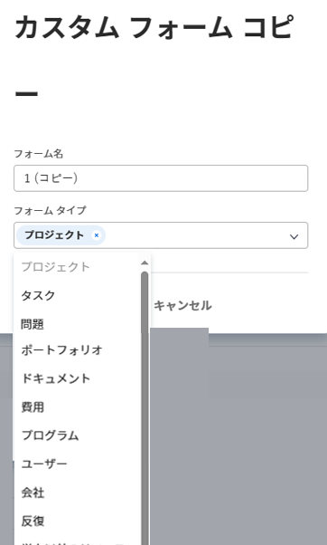

# フォームデザイナーを使用したコピーからのフォームのデザイン

既存のフォームに基づいて新しいカスタムフォームをデザインできます。 異なるWorkfrontオブジェクトにカスタムフォームを添付して、これらのオブジェクトに関するデータを取り込むことができます。

## アクセス要件

この記事の手順を実行するには、次の手順を実行する必要があります。

<table style="table-layout:auto"> 
 <col> 
 <col> 
 <tbody> 
  <tr data-mc-conditions=""> 
   <td role="rowheader"> 
Adobe Workfront plan*
 </td> 
   <td>任意</td> 
  </tr> 
  <tr> 
   <td role="rowheader">Adobe Workfront license*</td> 
   <td>
   
新規プラン：標準

   
または

   
現在のプラン：プラン
</td> 
  </tr> 
  <tr data-mc-conditions=""> 
   <td role="rowheader">アクセスレベル設定*</td> 
   <td> 
カスタムフォームへの管理アクセス
 
Workfront管理者がこのアクセス権を付与する方法について詳しくは、 <a href="/help/quicksilver/administration-and-setup/add-users/configure-and-grant-access/grant-users-admin-access-certain-areas.md" class="MCXref xref">特定の領域に対する管理者アクセス権をユーザーに付与する</a>.
 </td> 
  </tr>  
 </tbody> 
</table>

&#42;保有しているプラン、ライセンスタイプ、アクセスレベル設定を確認するには、Workfront管理者に問い合わせてください。

## カスタムフォームをコピーして新しいフォームを作成する

1. 次をクリック： **メインメニュー** アイコン  Adobe Workfrontの右上隅で、 **設定** .

1. クリック **カスタムForms。**
1. 新しいカスタムフォームの基礎として使用するカスタムフォームを選択し、 **コピー**.
1. Adobe Analytics の **カスタムフォームコピー** 表示されるボックスに、次の情報を入力します。

   <table style="table-layout:auto"> 
    <col> 
    <col> 
    <tbody> 
     <tr> 
      <td role="rowheader">フォーム名</td> 
      <td>コピーしたフォームの名前を入力します。</td> 
     </tr> 
     <tr> 
      <td role="rowheader"> 
フォームタイプ 
 </td> 
      <td> 
Adobe Analytics の <b>フォームタイプ</b> ボックスで、カスタムフォームを使用するオブジェクトの種類を選択し、削除する種類の横にある X をクリックします。 既にフォームに関連付けられているタイプは、リストで無効になっています。
 
      

 
      
フォームは、少なくとも 1 つのオブジェクトタイプに関連付ける必要があります。
 
      </td> 
     </tr> 
    </tbody> 
   </table>

1. クリック **フォームをコピー**.

   元のフォームで、新しいフォームに追加したオブジェクトタイプと互換性のない計算フィールドが参照されている場合は、そのフィールドの計算を変更するよう求めるメッセージが表示されます。

   同様に、元のフォームのセクション区切りのアクセスオプションが、新しいフォームに追加するオブジェクトタイプと互換性がない場合は、オプションを調整するように求めるメッセージが表示されます。

1. 先ほどコピーしたフォームを選択し、「 **編集**.
1. フォームに変更を加えます。変更については、 [フォームのデザイン](/help/quicksilver/administration-and-setup/customize-workfront/create-manage-custom-forms/form-designer/design-a-form/design-a-form.md) 記事：

* [別のカスタムフォームで既に使用されている既存のフィールドまたはウィジェットを再利用する](/help/quicksilver/administration-and-setup/customize-workfront/create-manage-custom-forms/form-designer/design-a-form/design-a-form.md#reuse-an-existing-field-or-widget-already-used-in-another-custom-form)
   * [テキストフィールドを追加](/help/quicksilver/administration-and-setup/customize-workfront/create-manage-custom-forms/form-designer/design-a-form/design-a-form.md#add-text-fields)
   * [計算フィールドを追加](/help/quicksilver/administration-and-setup/customize-workfront/create-manage-custom-forms/form-designer/design-a-form/design-a-form.md#add-calculated-fields)
   * [ラジオボタン、チェックボックスグループ、ドロップダウンの追加](/help/quicksilver/administration-and-setup/customize-workfront/create-manage-custom-forms/form-designer/design-a-form/design-a-form.md#add-radio-buttons-checkboxes-and-dropdowns)
   * [先読みと日付のフィールドを追加する](/help/quicksilver/administration-and-setup/customize-workfront/create-manage-custom-forms/form-designer/design-a-form/design-a-form.md#add-typeahead-and-date-fields)
   * [画像、PDF、ビデオの追加](/help/quicksilver/administration-and-setup/customize-workfront/create-manage-custom-forms/form-designer/design-a-form/design-a-form.md#add-images-pdfs-and-videos)
   * [Adobe XDファイルを追加](/help/quicksilver/administration-and-setup/customize-workfront/create-manage-custom-forms/form-designer/design-a-form/design-a-form.md#add-adobe-xd-files)

1. （オプション） **保存して閉じる**&#x200B;を使用する場合は、使用するオブジェクトにフォームを添付します。詳しくは、 [オブジェクトにカスタムフォームを追加する](/help/quicksilver/workfront-basics/work-with-custom-forms/add-a-custom-form-to-an-object.md).
