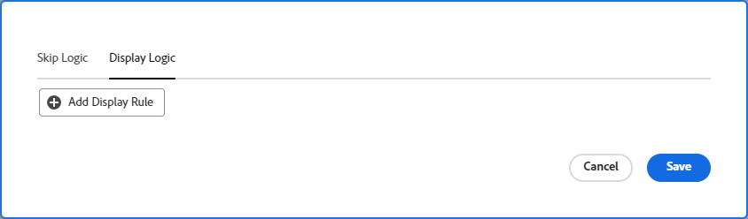

# フォームに表示ロジックとスキップロジックを追加する

カスタムフォームのどのセクションを表示またはスキップするかを、ユーザーが入力時に行った選択に基づいて決定できます。

>[!NOTE]
>
>ロジックは 1 つのフォーム内でしか適用できず、別のフォームからの選択に基づくことはできません。

## アクセス要件

この記事の手順を実行するには、以下を保有している必要があります。

<table style="table-layout:auto"> 
 <col> 
 <col> 
 <tbody> 
  <tr data-mc-conditions=""> 
   <td role="rowheader">Adobe Workfront プラン </td> 
   <td>任意</td> 
  </tr> 
  <tr> 
   <td role="rowheader">Adobe Workfront プラン</td> 
   <td>
   
新規：標準

   
または

   
現在：プラン
</td> 
  </tr> 
  <tr data-mc-conditions=""> 
   <td role="rowheader">アクセスレベル設定</td> 
   <td>カスタムフォームへの管理アクセス権 </td> 
  </tr>  
 </tbody> 
</table>

この表の情報の詳細については、[Workfront ドキュメントのアクセス要件](/help/quicksilver/administration-and-setup/add-users/access-levels-and-object-permissions/access-level-requirements-in-documentation.md)を参照してください。

## 論理アイコンを表示およびスキップ

カスタムフォームには、特定のフィールドに適用されるロジックを示すアイコンが表示されます。フォームデザイナーのフィールドのアイコンは、そのロジックがフィールドに適用されていることを示します。

| アイコン | フォームデザイナーのフィールド上の場所 | 定義 |
|--- |--- |--- |
|  | 左下 | このフィールドは、表示ロジックのターゲットフィールドです。フォーム上で特定の選択が行われた場合は、このフィールドが表示されます。 |
|  | 右下 | このフィールドは表示ロジックを定義します。このフィールドで特定の選択または値を指定すると、ターゲットフィールドが表示されます。 |
|  | 左下 | このフィールドは、スキップロジックのターゲットフィールドです。フォーム上で特定の選択を行った場合、フォームはこのフィールドまでスキップされ、その間のフィールドは非表示になります。 |
|  | 右下 | このフィールドはスキップロジックを定義します。このフィールドで特定の選択または値を指定すると、他のフィールドをスキップし、ターゲットフィールドに直接移動します。 |

ロジックが適用されたフィールドを選択すると、フィールド設定に既存のロジックルールが表示されます。

## 表示ロジックとスキップロジックの使用に関する考慮事項

* カスタムフィールド、ウィジェットまたはセクション区切りに表示ロジックを追加するには、フォーム上で、1 つ以上の複数選択フィールド（ラジオボタン、ドロップダウンまたはチェックボックス）をその前に配置する必要があります。
カスタムフォームのカスタムフィールドとウィジェットについて詳しくは、[フォームデザイナーを使用してフォームをデザイン](/help/quicksilver/administration-and-setup/customize-workfront/create-manage-custom-forms/form-designer/design-a-form/design-a-form.md)を参照してください。
* スキップロジックはウィジェットやセクション区切りに追加することはできません。追加できるのは、複数選択フィールド（ラジオボタン、ドロップダウンまたはチェックボックス）のみです。
* カスタムフィールドに関して、次の内容がすべてが該当する場合、カスタムフィールドには表示ロジックとスキップロジックの両方を追加できます。

   * 複数選択フィールド（ラジオボタン、ドロップダウンまたはチェックボックス）であること
   * 前に複数選択フィールドがあるもの
   * 後に別のカスタムフィールドがあるもの

* 表示ロジックまたはスキップロジックを含むフォームをコピーすると、ロジックは新しいカスタムフォームにコピーされます。
* オブジェクトを一括編集する場合、スキップまたは非表示にされたフィールドを含め、すべてのカスタムフィールドが「オブジェクトを編集」ボックスに表示されます。
* カスタムフォームで表示ロジックのルールを作成する際は、次の点に注意してください。

   * 表示ロジックのステートメントに含まれていないカスタムフィールドは、デフォルトで、カスタムフォームに表示されます。
   * 複数フィールドの表示ロジックステートメントを作成できます。
   * セクション区切りの下のすべてのフィールドに表示ロジックが適用されていて、そのロジックの結果としてフィールドがすべて非表示になっている場合、セクション全体がカスタムフォーム上で非表示になります。

## 表示ロジックをカスタムフォームに追加

ユーザーが複数選択フィールドで特定の値を選択した場合、表示ロジックはフォームに表示されるカスタムフィールドを定義します。ロジックはターゲットフィールドに追加され、値が選択されている場合にのみ表示されます。

{{step-1-to-setup}}

1. 「**カスタムフォーム**」をクリックします。
1. 新規カスタムフォームを作成するか、既存のフォームを開きます。詳しくは、[フォームデザイナーを使用してフォームをデザイン](/help/quicksilver/administration-and-setup/customize-workfront/create-manage-custom-forms/form-designer/design-a-form/design-a-form.md)を参照してください。
1. 必要に応じて、フォームにフィールドを追加します。少なくとも1つの複数選択フィールド（ラジオボタン、ドロップダウン、チェックボックス）が、表示されるターゲットフィールドの前に配置されていなければなりません。
1. ターゲットフィールドを選択し、「**ロジックを追加**」をクリックします。
1. 「**表示ロジック**」タブを選択します。
1. ロジックビルダー上の「**表示規則を追加**」をクリックします。

   

1. ビルダーで以下の手順に従って、ロジックステートメントを作成します。

   1. 1 つ目のオプションは、定義するフィールドを選択することです。これは、ターゲットを表示する選択値を含むフィールドです。複数選択フィールドにする必要があります。
   1. 2 つ目のオプションは、選択値を選択することです。そのフィールドに既に定義されている値のみを使用できます。
   1. 3 つ目のオプションは、**選択済み**&#x200B;または&#x200B;**未選択**&#x200B;です。「**選択済み**」を選択すると、この値が選択された場合に、ターゲットフィールドが表示されます。「**未選択**」を選択すると、定義フィールドで他の値が選択された場合に、ターゲットフィールドが表示されます。
   1. **AND** ルールをロジックステートメントに追加するには、作成したばかりのルールのすぐ下にある「**ルールを追加**」をクリックします。同じプロンプトに従って、ルールを作成します。ターゲットフィールドを表示するには、すべての AND ルールを満たす必要があります。

      

   1. **OR** ルールをロジックステートメントに追加するには、ロジックビルダーの下部付近にあ「**ルールを追加**」をクリックします。次に、OR エリア内の「**ルールを追加**」をクリックし、同じプロンプトに従ってルールを作成します。1 つの OR ルールが満たされると、ターゲットフィールドが表示されます。

1. ロジックステートメントの作成が完了したら、「**保存**」をクリックします。

   表示ロジックのアイコンがフォームデザイナーのターゲットフィールドと定義フィールドに追加されます。

## カスタムフォームにスキップロジックを追加

スキップロジックは、ユーザーが複数選択フィールドで特定の値を選択した場合に、スキップされるカスタムフォームフィールドを定義します。スキップされたフィールドは、フォーム上で非表示になります。このロジックは、スキップされるフィールドではなく、選択が行われる定義フィールドに適用されます。

{{step-1-to-setup}}

1. 「**カスタムフォーム**」をクリックします。
1. 新規カスタムフォームを作成するか、既存のフォームを開きます。詳しくは、[フォームデザイナーを使用してフォームをデザイン](/help/quicksilver/administration-and-setup/customize-workfront/create-manage-custom-forms/form-designer/design-a-form/design-a-form.md)を参照してください。
1. 必要に応じて、フォームにフィールドを追加します。スキップロジックの定義フィールドは、複数選択フィールド（ラジオボタン、ドロップダウン、チェックボックス）である必要があります。
1. 定義フィールドを選択し、画面左下の「**ロジックを追加**」をクリックします。
1. 「**ロジックをスキップ**」タブを選択します。
1. 「**スキップルールを追加**」をクリックします。

   

1. ビルダーで以下の手順に従って、ロジックステートメントを作成します。

   1. 定義フィールドがビルダーに表示されます。これは、スキップロジックを適用するために選択したフィールドです。
   1. 1 つ目のオプションは、選択値を選択することです。フィールドに対して既に定義されている値のみをが使用できます。
   1. 2 つ目のオプションは、**選択済み**&#x200B;または&#x200B;**未選択**&#x200B;です。「**選択済み**」を選択した場合、値が選択されるとターゲットフィールドが表示され、その間のフィールドがスキップされます。「**未選択**」を選択した場合、定義フィールドで他の値が選択されると、ターゲットフィールドが表示され、その間のフィールドがスキップされます。
   1. 3 つ目のオプションは、ターゲットフィールド、またはスキップ先のフィールドです。フィールド名または「**フォームの最後**」を選択します。オプションを選択する前に、「空白」という単語をクリックする必要が生じる場合があります。

      

   1. 次の手順で **OR** ルールをロジックステートメントに追加する場合は、論理ビルダーの下部付近にある「**ルールを追加**」をクリックします。次に、同じプロンプトに従ってオプションを選択し、ルールを作成します。1 つの **OR** ルールが満たされると、ターゲットフィールドが表示されます。

1. ロジックステートメントの作成が完了したら、「**保存**」をクリックします。

   スキップロジックアイコンが、フォームデザイナーのターゲットフィールドと定義フィールドに追加されます。

