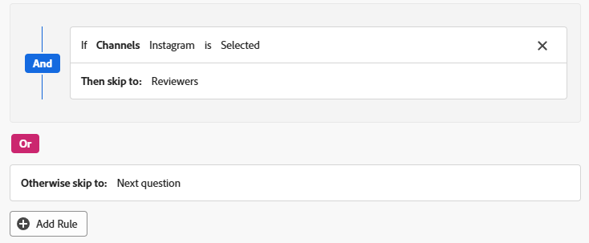

# カスタムフォームおよびフィールドへの論理ルールの追加

論理ルールを使用すると、フォーム上のフィールドをさらにカスタマイズできます。

例えば、ユーザーが入力時に選択した項目に基づいて、カスタムフォーム内のフィールドやセクションの表示やスキップを行うことができます。

>[!NOTE]
>
>ロジックは 1 つのフォーム内でしか適用できず、別のフォームからの選択に基づくことはできません。

## アクセス要件

+++ 展開すると、この記事の機能のアクセス要件が表示されます。

<table style="table-layout:auto"> 
 <col> 
 <col> 
 <tbody> 
  <tr> 
   <td>Adobe Workfront パッケージ</td> 
   <td><p>任意</p></td> 
  </tr> 
  <tr> 
   <td>Adobe Workfront プラン</td> 
   <td><p>標準</p>
       <p>プラン</p></td>
  </tr> 
  <tr> 
   <td>アクセスレベル設定</td> 
   <td> <p>カスタムフォームへの管理アクセス権</p> </td> 
  </tr>  
 </tbody> 
</table>

詳しくは、[Workfront ドキュメントのアクセス要件](/help/quicksilver/administration-and-setup/add-users/access-levels-and-object-permissions/access-level-requirements-in-documentation.md)を参照してください。

+++

## 論理アイコンを表示およびスキップ

カスタムフォームには、特定のフィールドに表示またはスキップロジックが適用されるタイミングを示すアイコンが表示されます。 フォーム designer のフィールドのアイコンは、そのロジックがフィールドに適用されていることを示します。

| アイコン | フォーム designer のフィールド上の場所 | 定義 |
|--- |--- |--- |
|  | 左下 | このフィールドは、表示ロジックのターゲットフィールドです。フォーム上で特定の選択が行われた場合は、このフィールドが表示されます。 |
|  | 右下 | このフィールドは表示ロジックを定義します。このフィールドで特定の選択または値を指定すると、ターゲットフィールドが表示されます。 |
|  | 左下 | このフィールドは、スキップロジックのターゲットフィールドです。フォーム上で特定の選択を行った場合、フォームはこのフィールドまでスキップされ、その間のフィールドは非表示になります。 |
|  | 右下 | このフィールドはスキップロジックを定義します。このフィールドで特定の選択または値を指定すると、他のフィールドをスキップし、ターゲットフィールドに直接移動します。 |


ロジックが適用されたフィールドを選択すると、フィールド設定に既存のロジックルールが表示されます。


## 表示ロジックとスキップロジックの使用に関する考慮事項

* カスタムフィールド、ウィジェットまたはセクション区切りに表示ロジックを追加するには、フォーム上で、1 つ以上の複数選択フィールド（ラジオボタン、ドロップダウンまたはチェックボックス）をその前に配置する必要があります。
カスタムフォームのカスタムフィールドとウィジェットについて詳しくは、[ カスタムフォームの作成 ](/help/quicksilver/administration-and-setup/customize-workfront/create-manage-custom-forms/form-designer/design-a-form/design-a-form.md) を参照してください。
* スキップロジックはウィジェットやセクション区切りに追加することはできません。追加できるのは、複数選択フィールド（ラジオボタン、ドロップダウンまたはチェックボックス）のみです。
* 表示またはスキップロジックを適用して、複数オプションのフィールドの選択肢の表示/非表示を切り替えることはできません。 例えば、ドロップダウン、チェックボックスグループ、ラジオボタンフィールドに表示される選択肢を、別のフィールドの表示またはスキップロジックに基づいて制限することはできません。
* カスタムフィールドに関して、次の内容がすべてが該当する場合、カスタムフィールドには表示ロジックとスキップロジックの両方を追加できます。

   * 複数選択フィールド（ラジオボタン、ドロップダウンまたはチェックボックス）であること
   * 前に複数選択フィールドがあるもの
   * 後に別のカスタムフィールドがあるもの

* 表示ロジックまたはスキップロジックを含むフォームをコピーすると、ロジックは新しいカスタムフォームにコピーされます。
* オブジェクトを一括編集する場合、スキップまたは非表示にされたフィールドを含め、すべてのカスタムフィールドが「オブジェクトを編集」ボックスに表示されます。
* カスタムフォームで表示ロジックのルールを作成する際は、次の点に注意してください。

   * 表示ロジックのステートメントに含まれていないカスタムフィールドは、デフォルトで、カスタムフォームに表示されます。
   * 複数フィールドの表示ロジックステートメントを作成できます。
   * セクション区切りの下のすべてのフィールドに表示ロジックが適用されていて、そのロジックの結果としてフィールドがすべて非表示になっている場合、セクション全体がカスタムフォーム上で非表示になります。

## 表示ロジックをカスタムフォームに追加

ユーザーが複数選択フィールドで特定の値を選択した場合、表示ロジックはフォームに表示されるカスタムフィールドを定義します。ロジックはターゲットフィールドに追加され、値が選択されている場合にのみ表示されます。

<!--
>[!NOTE]
>
><span class="preview">This procedure describes the basic mode for display logic. Advanced display logic is also available. For more information, see [Add advanced display logic to a custom form](#add-advanced-display-logic-to-a-custom-form), in this article.</span>
-->

{{step-1-to-setup}}

1. 「**カスタムフォーム**」をクリックします。
1. 新規カスタムフォームを作成するか、既存のフォームを開きます。詳しくは、[ カスタムフォームの作成 ](/help/quicksilver/administration-and-setup/customize-workfront/create-manage-custom-forms/form-designer/design-a-form/design-a-form.md) を参照してください。
1. 必要に応じて、フォームにフィールドを追加します。少なくとも1つの複数選択フィールド（ラジオボタン、ドロップダウン、チェックボックス）が、表示されるターゲットフィールドの前に配置されていなければなりません。
1. ターゲットフィールドを選択し、「**ロジックを追加**」をクリックします。
1. ロジックビルダーで「**表示**」タブを選択します。
1. 「**表示ルールを追加**」をクリックします。

   

1. ビルダーでロジックステートメントを作成するには、次の手順に従います。

   1. 1 つ目のオプションは、定義するフィールドを選択することです。これは、ターゲットを表示する選択値を含むフィールドです。複数選択フィールドにする必要があります。
   1. 2 つ目のオプションは、選択値を選択することです。そのフィールドに既に定義されている値のみを使用できます。
   1. 3 つ目のオプションは、**選択済み**&#x200B;または&#x200B;**未選択**&#x200B;です。「**選択済み**」を選択すると、この値が選択された場合に、ターゲットフィールドが表示されます。「**未選択**」を選択すると、定義フィールドで他の値が選択された場合に、ターゲットフィールドが表示されます。
   1. **AND** ルールをロジックステートメントに追加するには、作成したばかりのルールのすぐ下にある「**ルールを追加**」をクリックします。同じプロンプトに従って、ルールを作成します。ターゲットフィールドを表示するには、すべての AND ルールを満たす必要があります。

      

   1. **OR** ルールをロジックステートメントに追加するには、ロジックビルダーの下部付近にあ「**ルールを追加**」をクリックします。次に、OR エリア内の「**ルールを追加**」をクリックし、同じプロンプトに従ってルールを作成します。1 つの OR ルールが満たされると、ターゲットフィールドが表示されます。

1. 論理ステートメントの構築が完了したら、「**適用**」をクリックします。

   表示ロジックのアイコンがフォーム designer のターゲットフィールドと定義フィールドに追加されます。

<!--
<div class="preview">

## Add advanced display logic to a custom form

The advanced display logic for custom form fields allows you to build complex logic using formulas. You can apply this logic to the following field types: drop-down, radio button, checkbox, typeahead, single line text, paragraph text, date field, text with formatting, and calculated fields.

### Examples

You can use advanced display logic to control the visibility of custom form sections based on user roles and the visibility of a field based on another field's status.

No logic is applied to the default section on the form, so it is always visible to all users.

Using the following condition, the Resources Required section is only displayed when a user with the job role of Resource Manager views the form.

```IF($$USER.{roleID}="123abc", true)```

Note that ```123abc``` represents the role ID of the Resource Manager.


The same condition with a different role ID is applied to the Project Financial KPIs section to define that  only the Financial Advisor role can view the section.

Using the following condition, the Sold KPI field only becomes visible when the project is complete. This logic is applied directly to the field instead of to a form section. There is no need to specify which role can view the field, because that is already defined in the section that the field is in.

```IF({status}="CPL", true)```


### Define advanced display logic

{{step-1-to-setup}}

1. Click **Custom Forms**.
1. Create a new custom form or open an existing form. See [Create a custom form](/help/quicksilver/administration-and-setup/customize-workfront/create-manage-custom-forms/form-designer/design-a-form/design-a-form.md) for details.
1. Add fields to the form as needed.
1. Select the field to apply logic to, and click **Add Logic**.
1. Select the **Display** tab on the logic builder.
1. Turn on **Advanced mode**.
   
   This option might be turned on automatically, for fields that do not support the simple mode of display logic.

   

1. Build the display condition in the editor.

   For more information about calculations and expressions, see [Add calculated fields to a form](/help/quicksilver/administration-and-setup/customize-workfront/create-manage-custom-forms/form-designer/design-a-form/add-a-calculated-field.md) and [Overview of calculated data expressions](/help/quicksilver/reports-and-dashboards/reports/calc-cstm-data-reports/calculated-data-expressions.md).

1. Click **Apply**.
   
   The logic is applied to the field and the display logic icon is added in the form designer.

</div>
-->

## カスタムフォームにスキップロジックを追加

スキップロジックは、ユーザーが複数選択フィールドで特定の値を選択した場合に、スキップされるカスタムフォームフィールドを定義します。スキップされたフィールドは、フォーム上で非表示になります。このロジックは、スキップされるフィールドではなく、選択が行われる定義フィールドに適用されます。

{{step-1-to-setup}}

1. 「**カスタムフォーム**」をクリックします。
1. 新規カスタムフォームを作成するか、既存のフォームを開きます。詳しくは、[ カスタムフォームの作成 ](/help/quicksilver/administration-and-setup/customize-workfront/create-manage-custom-forms/form-designer/design-a-form/design-a-form.md) を参照してください。
1. 必要に応じて、フォームにフィールドを追加します。スキップロジックの定義フィールドは、複数選択フィールド（ラジオボタン、ドロップダウン、チェックボックス）である必要があります。
1. 定義フィールドを選択し、画面左下の「**ロジックを追加**」をクリックします。
1. Logic Builder で「**スキップ**」タブを選択します。
1. 「**スキップルールを追加**」をクリックします。

   

1. ビルダーでロジックステートメントを作成するには、次の手順に従います。

   1. 定義フィールドがビルダーに表示されます。これは、スキップロジックを適用するために選択したフィールドです。
   1. 1 つ目のオプションは、選択値を選択することです。フィールドに対して既に定義されている値のみをが使用できます。
   1. 2 つ目のオプションは、**選択済み**&#x200B;または&#x200B;**未選択**&#x200B;です。「**選択済み**」を選択した場合、値が選択されるとターゲットフィールドが表示され、その間のフィールドがスキップされます。「**未選択**」を選択した場合、定義フィールドで他の値が選択されると、ターゲットフィールドが表示され、その間のフィールドがスキップされます。
   1. 3 つ目のオプションは、ターゲットフィールド、またはスキップ先のフィールドです。フィールド名または「**フォームの最後**」を選択します。オプションを選択する前に、「空白」という単語をクリックする必要が生じる場合があります。

      

   1. 次の手順で **OR** ルールをロジックステートメントに追加する場合は、論理ビルダーの下部付近にある「**ルールを追加**」をクリックします。次に、同じプロンプトに従ってオプションを選択し、ルールを作成します。1 つの **OR** ルールが満たされると、ターゲットフィールドが表示されます。

1. 論理ステートメントの構築が完了したら、「**適用**」をクリックします。

   スキップロジックアイコンが、フォーム designer のターゲットフィールドと定義フィールドに追加されます。

## 検証ロジックをカスタムフォームに追加する

検証ロジックは数式を使用して作成され、ロジックは必要に応じて単純にすることも、複雑にすることもできます。 検証は、他のフィールドの値やオブジェクトのステータスに基づくことができ、検証が失敗した場合のエラーメッセージを指定できます。

ユーザーがカスタムフォームに入力する際に、ロジックが適用されたフィールドが定義済みの検証条件を満たす場合、そのフィールドはハイライト表示され、エラーメッセージが表示されます。

検証ロジックを適用できるフィールドタイプは、1 行のテキスト、段落、単一選択ドロップダウン、複数選択ドロップダウン、外部検索、typeahead、日付、チェックボックスグループ、ラジオボタンです。

### 例

次の条件では、トリガーとなる値を入力すると、[ 予算 ] フィールドの下にメッセージが表示されます。 例えば、入力した値が負の場合、最初のメッセージが表示されます。 ユーザーが予算値を入力する前にプロジェクトのステータスを「現在」に変更しようとすると、2 番目のメッセージが表示されます。

```
IF({DE:Budget Field} < 0,
     "Budget cannot be negative",
     IF({DE:Budget Field} == 0 && {status} == "CUR", "Budget must be specified before moving to Current status")
)
```

もう 1 つの簡単な例として、有効な電話番号フィールドには、特定の桁数を含める必要があります。

他のフィールドに基づく検証の追加の例として、会議室のサイズ （小、中、大）のフィールドと、会議出席者数の個別のフィールドがあります。 各部屋サイズの人数は、検証式に記述されます。 ユーザーが入力した出席者の数が、選択した会議室に対して多すぎる場合は、エラーメッセージが表示されます。

検証ロジックのその他の例については、[ カスタムフォームにおける高度なロジックの例 ](/help/quicksilver/administration-and-setup/customize-workfront/create-manage-custom-forms/form-designer/design-a-form/advanced-logic-examples.md) を参照してください。

### 検証ロジックの定義

{{step-1-to-setup}}

1. 「**カスタムフォーム**」をクリックします。
1. 新規カスタムフォームを作成するか、既存のフォームを開きます。詳しくは、[ カスタムフォームの作成 ](/help/quicksilver/administration-and-setup/customize-workfront/create-manage-custom-forms/form-designer/design-a-form/design-a-form.md) を参照してください。
1. 必要に応じて、フォームにフィールドを追加します。
1. ロジックを適用するフィールドを選択し、「**ロジックの追加**」をクリックします。
1. ロジックビルダーで「**検証**」タブを選択します。

   

1. エディターで検証条件を作成します。これには、検証が満たされない場合に表示するエラーメッセージが含まれます。

   計算と式について詳しくは、[ フォームに計算フィールドを追加する ](/help/quicksilver/administration-and-setup/customize-workfront/create-manage-custom-forms/form-designer/design-a-form/add-a-calculated-field.md) および [ 計算データ式の概要 ](/help/quicksilver/reports-and-dashboards/reports/calc-cstm-data-reports/calculated-data-expressions.md) を参照してください。

1. 「**適用**」をクリックします。

   ロジックは、フォームデザイナーのフィールドに適用されます。

   >[!NOTE]
   >
   >検証ロジックは、フォームデザイナーのプレビューモードではサポートされていません。

<!--
<div class="preview">

## Add formatting logic to a custom form

Formatting logic highlights a field value when it meets the defined conditions. The applied formatting will work on multiple fields at once.

You can apply formatting logic to the following field types: single line text, paragraph, single-select dropdown, multi-select dropdown, external lookup, typeahead, calculated, date, checkbox group, and radio buttons.

Formatting applied to custom forms is separate from formatting applied to lists and reports. For information on report formatting, see [Use conditional formatting in views](/help/quicksilver/reports-and-dashboards/reports/reporting-elements/use-conditional-formatting-views.md).

### Example

Using the following condition, the Budget field appears red when the user enters a value of 1000 or more. The field appears yellow when the user enters a value of 500 or more.

To add a hover-over definition of the formatting, use the Instructions field in the custom form. For example, a message on the Budget field could say "Please enter a budget within a reasonable range. Values over 500 are a warning notice, and above 1000 is considered too high."

```
IF(
     {DE:Budget Field} >=1000,
     FORMAT($$NEGATIVE),
     IF({DE:Budget Field} >= 500, FORMAT($$NOTICE))
)
```

### Define formatting logic

{{step-1-to-setup}}

1. Click **Custom Forms**.
1. Create a new custom form or open an existing form. See [Create a custom form](/help/quicksilver/administration-and-setup/customize-workfront/create-manage-custom-forms/form-designer/design-a-form/design-a-form.md) for details.
1. Add fields to the form as needed.
1. Select the field to apply logic to, and click **Add Logic**.
1. Select the **Formatting** tab on the logic builder.

   

1. Build the formatting condition in the editor.

   You can add up to five formatting rules per field.

   The field highlighting color options are:

   * `$$POSITIVE (green)`
   * `$$INFORMATIVE (blue)`
   * `$$NEGATIVE (red)`
   * `$$NOTICE (orange)`
   
   The text formatting options are:
   
   * `$$BOLD`
   * `$$ITALIC`
   * `$$UNDERLINE`

   Only one color option may be used per function, along with up to three additional text formatting options. If no color option is specified, the system's default color is applied.

   For more information about calculations and expressions, see [Add calculated fields to a form](/help/quicksilver/administration-and-setup/customize-workfront/create-manage-custom-forms/form-designer/design-a-form/add-a-calculated-field.md) and [Overview of calculated data expressions](/help/quicksilver/reports-and-dashboards/reports/calc-cstm-data-reports/calculated-data-expressions.md).

1. Click **Apply**.
   
   The logic is applied to the field in the form designer.

</div>
-->
