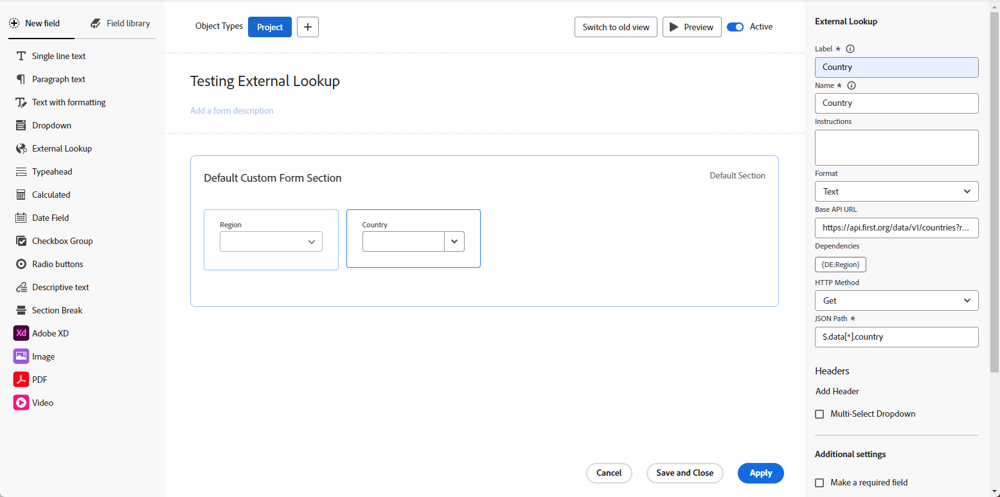
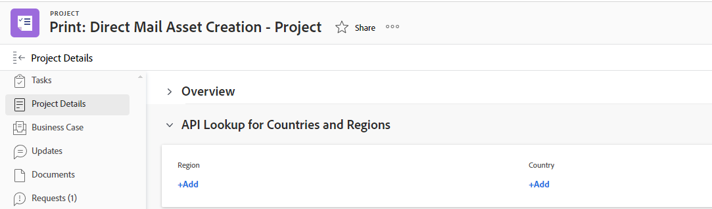

# カスタムフォームの「外部参照」フィールドの例

カスタムフォームの外部参照フィールドが外部 API を呼び出し、値をドロップダウンフィールドのオプションとして返します。 カスタムフォームが添付されているオブジェクトを操作するユーザーは、ドロップダウンからこれらのオプションを 1 つ以上選択できます。

この記事では、「外部参照」フィールドを使用してWorkfrontまたはパブリック API の同じインスタンスを呼び出す例を示します。 外部参照を使用して、Jira、Salesforce、ServiceNow などの外部システムと通信することもできます。

カスタムフォームに外部参照フィールドを追加する方法と、外部参照コンポーネントの追加定義について詳しくは、 [フォームデザイナーを使用したフォームのデザイン](/help/quicksilver/administration-and-setup/customize-workfront/create-manage-custom-forms/form-designer/design-a-form/design-a-form.md).

## Workfrontの同じインスタンスに対して外部参照フィールドを設定する

外部参照を使用して、Workfrontインスタンスからデータをカスタムフォームに取り込むことができます。

この例では、Workfront API を呼び出し、既存の「ステータスクエリ」フィールドからデータを「外部参照」フィールドに取り込む方法を示します。

1. カスタムフォームを開きます。
1. 画面の左側で、を探します。 **外部参照** をクリックし、キャンバス上のセクションにドラッグします。
1. 次を入力します。 **ラベル** および **名前** フィールドの。
1. を選択します。 **形式** フィールドの。
1. API URL 呼び出しを **ベース API URL** フィールドに入力します。

   * $$HOST を追加して同じインスタンスを参照できます。
   * $$QUERY を追加して、別のフィールドに対するクエリに基づいて結果をフィルタリングできます。

   **例**
   `$$HOST/attask/api/v15.0/project/search?status={DE:StatusQuery}&$$QUERY`

1. 以下を確認します。 **依存関係** API でこの参照フィールドが参照しているフィールドの場合。

   依存関係フィールドは、オブジェクトの詳細ページに存在する任意のカスタムフィールドまたはネイティブフィールドにすることができます。

   この例では、 `{DE:StatusQuery}` は、StatusQuery カスタムフィールドの値に置き換えられます。

1. を選択します。 **HTTP メソッド**.

   これは、ほとんどの場合、 **取得**.

1. 次を入力します。 **JSON パス** をクリックして、API 呼び出しから結果を取得します。

   **例**
   `$.data[*].name`

   >[!NOTE]
   >
   >**ヘッダー** 同じWorkfrontインスタンスへの呼び出しに関する情報は必要ありません。

1. 「**適用**」をクリックします。

   

   カスタムフォームをWorkfrontオブジェクト（この例ではプロジェクト）に追加すると、次のようになります。

   

   

## パブリック API 用の外部参照フィールドの設定

外部参照を使用して、外部のパブリック API を呼び出し、データを取得できます。

この例では、国の API( <https://api.first.org/data/v1/countries>) を使用して、ドロップダウンオプション内のすべての国名をハードコーディングする必要がなくなります。

1. カスタムフォームを開きます。
1. 画面の左側で、を探します。 **外部参照** をクリックし、キャンバス上のセクションにドラッグします。
1. 次を入力します。 **ラベル** および **名前** フィールドの。
1. を選択します。 **形式** フィールドの。
1. API URL 呼び出しを **ベース API URL** フィールドに入力します。

   * $$QUERY を追加して、エンドユーザーに対するクエリフィルターを実装できます。

   **例**
すべての国を一覧表示します。 <https://api.first.org/data/v1/countries>

   ユーザーがドロップダウンフィールド内の任意の国を検索できるようにします。 <https://api.first.org/data/v1/countries?q=$$QUERY>

   ユーザーが地域内の国を検索できるようにします。 <https://api.first.org/data/v1/countries?region={DE:Region}&q=$$QUERY>

   * 使用可能な地域は、Workfrontの別のカスタムフィールドで定義されます。
   * ユーザーがフォーム上の地域を選択すると、「外部参照」フィールドにその地域の国（API で地域が定義されている国）のみが表示されます。 また、選択した地域の国を検索することもできます。

1. 以下を確認します。 **依存関係** API でこの参照フィールドが参照しているフィールドの場合。

   依存関係フィールドは、オブジェクトの詳細ページに存在する任意のカスタムフィールドまたはネイティブフィールドにすることができます。

   この例では、 `{DE:Region}` は、地域カスタムフィールドの値に置き換えられます。

1. を選択します。 **HTTP メソッド**.

   これは、ほとんどの場合、 **取得**.

1. 次を入力します。 **JSON パス** をクリックして、API 呼び出しから結果を取得します。

   このオプションを使用すると、API URL から返される JSON からデータを抽出できます。 これは、JSON 内のどの値がドロップダウンオプションに表示されるかを選択する手段の役割を果たします。

   **例**
   `$.data[*].country`

1. （オプション）「 **ヘッダーを追加**&#x200B;をクリックし、API での認証に必要なキーと値のペアを入力または貼り付けます。

   >[!NOTE]
   >
   >「ヘッダー」フィールドは、資格情報を保存する安全な場所ではありません。入力して保存する内容に注意する必要があります。

1. （オプション）「 」を選択します。 **複数選択ドロップダウン** をクリックして、ドロップダウンで複数の値を選択できます。

1. 「**適用**」をクリックします。

   

   カスタムフォームをWorkfrontオブジェクト（この例ではプロジェクト）に追加すると、次のようになります。

   

   

