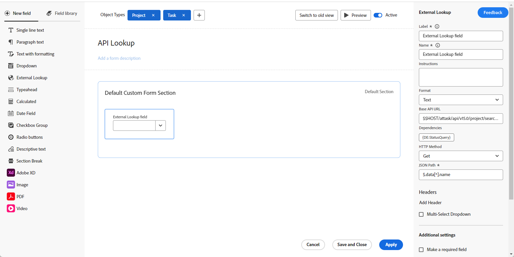
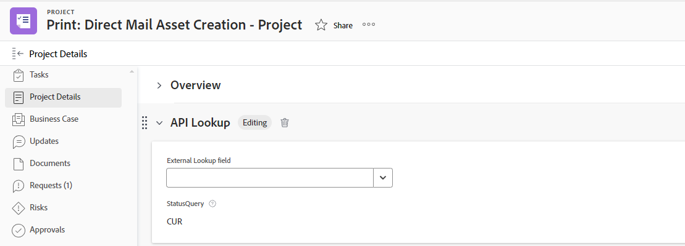
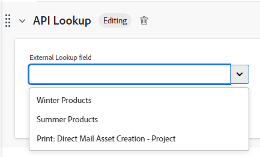
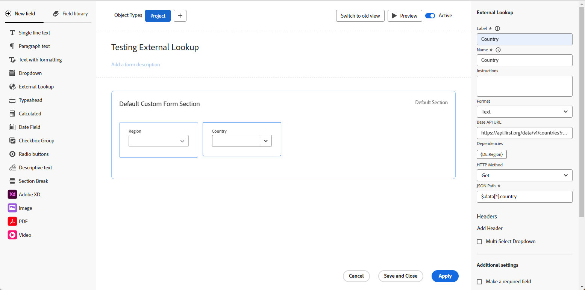
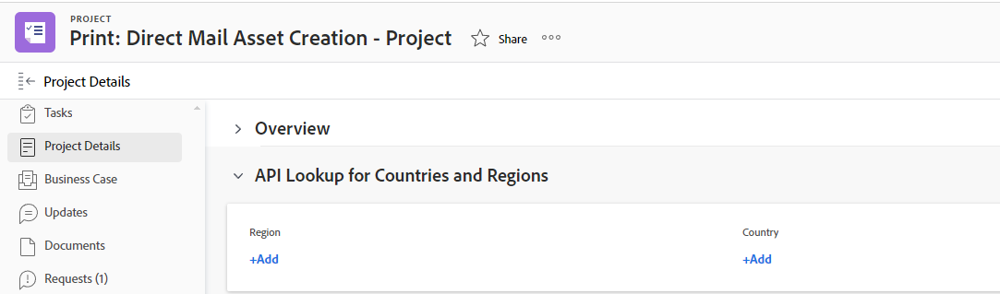
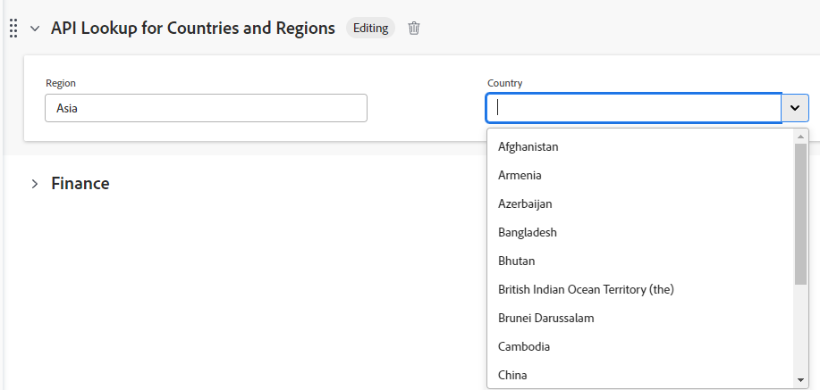

# カスタムフォームの外部ルックアップフィールドの例

カスタムフォームの外部参照フィールドは、外部APIを呼び出し、ドロップダウンフィールドのオプションとして値を返します。 カスタムフォームが添付されているオブジェクトを使用するユーザーは、ドロップダウンからこれらのオプションを 1 つ以上選択できます。

この記事では、外部ルックアップフィールドを使用して、Workfrontまたはパブリック APIの同じインスタンスを呼び出す例を紹介します。 また、外部参照を使用して、Jira、Salesforce、ServiceNowなどの外部システムと通信することもできます。

外部参照フィールドをカスタムフォームに追加することと、外部参照コンポーネントの追加の定義について詳しくは、[ カスタムフォームの作成](/help/quicksilver/administration-and-setup/customize-workfront/create-manage-custom-forms/form-designer/design-a-form/design-a-form.md)を参照してください。

## アクセス要件

+++ 展開すると、この記事の機能のアクセス要件が表示されます。

<table style="table-layout:auto"> 
 <col> 
 <col> 
 <tbody> 
  <tr> 
   <td>Adobe Workfront パッケージ</td> 
   <td>
任意
</td> 
  </tr> 
  <tr> 
   <td>Adobe Workfront プラン</td> 
   <td>
標準

       
プラン
</td>
  </tr> 
  <tr> 
   <td>アクセスレベル設定</td> 
   <td> 
カスタムフォームへの管理アクセス権
 </td> 
  </tr>  
 </tbody> 
</table>

詳しくは、[Workfront ドキュメントのアクセス要件](/help/quicksilver/administration-and-setup/add-users/access-levels-and-object-permissions/access-level-requirements-in-documentation.md)を参照してください。

+++

## Workfrontの同じインスタンスに対する外部ルックアップフィールドの設定

外部参照を使用すると、Workfront インスタンスからカスタムフォームにデータを取り込むことができます。

カスタムフォーム内のフィールドにアクセスすると、Workfrontで表示する権限を持つ項目のみがオプションのリストに表示されます。 例えば、プロジェクトのリストを表示する場合、ユーザーには自分と共有されているプロジェクトのみが表示されます。

### 外部ルックアップでネイティブ Workfront フィールド値を使用する

この例では、Workfront APIを呼び出して、外部ルックアップフィールドにプロジェクトのリストを入力する方法を示します。このフィールドは、「ステータスクエリ」カスタムフィールドの値と$$QUERYを介した検索語を使用して、ステータスでフィルタリングされます。

1. カスタムフォームを開きます。
1. 画面の左側で、「**外部ルックアップ**」を見つけて、キャンバス上のセクションにドラッグします。
1. フィールドに「**ラベル**」と「**API名**」を入力します。
1. フィールドの&#x200B;**形式**&#x200B;を選択します。
1. 「**Base API URL**」フィールドにAPI呼び出しを入力します。

   * $$HOSTを使用して、カスタムフォームと同じWorkfrontのインスタンスを参照します。
   * $$QUERYを使用して、ユーザー入力に基づいて結果を動的にフィルタリングします。

   **API呼び出しの例**
   `$$HOST/attask/api/v15.0/project/search?status={DE:Status Query}&description=$$QUERY`

1. API呼び出しで参照されているフィールドについて、**依存関係**&#x200B;を確認します。

   依存関係フィールドは、オブジェクトで使用可能な任意のカスタムフィールドまたはネイティブフィールドにすることができます。 例えば、外部参照フィールドを含むグループ用のカスタムフォームを作成する場合、依存関係フィールドには、グループで使用可能な任意のフィールドを含めることができます。

   この例では、`{DE:Status Query}`は、現在のグループの「ステータスクエリ」カスタムフィールドの値に動的に置き換えられます。 したがって、フォームがグループ Aに添付されると、`{DE:Status Query}`はそのグループの「ステータス クエリ」フィールドで設定された値に置き換えられます。

1. 「**HTTP メソッド**」を選択します。

   これは、ほとんどの場合、**Get** になります。

1. **JSON パス**&#x200B;を入力して、API 呼び出しの結果を取得します。

   **例**
   `$.data[*].name`

   >[!NOTE]
   >
   >同じ Workfront インスタンスに対して呼び出しを行う場合は、**ヘッダー**&#x200B;の情報は必要ありません。

1. 「**適用**」をクリックします。

   

   カスタムフォームが Workfront オブジェクト（この例ではプロジェクト）に追加されると、次のようになります。

   

   

### 外部ルックアップでのカスタムフィールド値の使用

この例では、Workfront APIを呼び出し、カスタムフィールドから外部ルックアップフィールドにデータを取り込む方法を示します。 例のカスタムフィールドは「カスタムカラー」と呼ばれます。

1. カスタムフォームを開きます。
1. 画面の左側で、「**外部ルックアップ**」を見つけて、キャンバス上のセクションにドラッグします。
1. フィールドに「**ラベル**」と「**API名**」を入力します。
1. フィールドの&#x200B;**形式**&#x200B;を選択します。
1. API の URL 呼び出しを「**ベース API の URL**」フィールドに入力します。

   **例**
   `$$HOST/attask/api/v18.0/PORT/search?ID={portfolioID}&fields=parameterValues`

1. このルックアップフィールドが API で参照しているフィールドの&#x200B;**依存関係**&#x200B;を確認します。

   「依存関係」フィールドには、オブジェクトの詳細ページに存在する任意のカスタムフィールドまたはネイティブフィールドを使用できます。

1. 「**HTTP メソッド**」を選択します。

   これは、ほとんどの場合、**Get** になります。

1. **JSON パス**&#x200B;を入力して、API 呼び出しの結果を取得します。

   **例**
   `$.data[*].parameterValues.["DE:Combo Colors"]`

   * 「parameterValues」は、現在のオブジェクトのWorkfrontのカスタムフィールドを指します。
   * この例では、「DE:Combo Colors」は、取得する値を含む特定のカスタムフィールドです。

   >[!NOTE]
   >
   >同じ Workfront インスタンスに対して呼び出しを行う場合は、**ヘッダー**&#x200B;の情報は必要ありません。

1. 「**適用**」をクリックします。

   カスタムフォームがWorkfront オブジェクトに追加されると、「コンボカラー」フィールドのすべての値が外部ルックアップフィールドのドロップダウンに表示されます。

## Workfront Planning API用の外部参照フィールドの設定

Workfront Planning APIでは、Get メソッドを使用してレコードタイプ IDでレコードを検索するエンドポイントを使用できます。 このエンドポイントを使用して、外部ルックアップフィールドでプランニングレコードを参照できます。

* **ベース API URL:** `$$HOST/maestro/api/v1/records/search?recordTypeId={recordTypeID}`
* **HTTP メソッド：**&#x200B;取得
* **JSON パス：** `$.records[*].data.{fieldID}`

  **{fieldID}**&#x200B;は、エンドユーザー向けのカスタムフォームの外部ルックアップ検索結果に表示されるフィールドです。

詳しくは、[Workfront Planning API](/help/quicksilver/planning/general/planning-api-basics.md)を参照してください。

## パブリック API用の外部ルックアップフィールドの設定

外部ルックアップを使用して、外部のパブリック APIを呼び出し、データを取得できます。

この例では、ドロップダウンオプションにすべての国名をハードコーディングする必要がないように、国の API（<https://api.first.org/data/v1/countries> など）を呼び出す方法を示します。

1. カスタムフォームを開きます。
1. 画面の左側で、「**外部ルックアップ**」を見つけて、キャンバス上のセクションにドラッグします。
1. フィールドに「**ラベル**」と「**API名**」を入力します。
1. フィールドの&#x200B;**形式**&#x200B;を選択します。
1. API の URL 呼び出しを「**ベース API の URL**」フィールドに入力します。

   * $$QUERY を追加すると、エンドユーザーに対するクエリフィルタリングを実装できます。

   **例**
すべての国を一覧表示：<https://api.first.org/data/v1/countries>

   ユーザーがドロップダウンフィールド内の任意の国を検索できるようにします。<https://api.first.org/data/v1/countries?q=$$QUERY>

   ユーザーが地域内の国を検索できるようにします。<https://api.first.org/data/v1/countries?region={DE:Region}&q=$$QUERY>

   * 使用可能なは、Workfront の別のカスタムフィールドで定義されます。
   * ユーザーがフォーム上の地域を選択すると、外部参照フィールドには、その地域の国（APIで定義されている国）のみが表示されます。 また、ユーザーは、選択した地域の国を検索することもできます。

1. このルックアップフィールドが API で参照しているフィールドの&#x200B;**依存関係**&#x200B;を確認します。

   「依存関係」フィールドには、オブジェクトの詳細ページに存在する任意のカスタムフィールドまたはネイティブフィールドを使用できます。

   この例では、`{DE:Region}` は、地域カスタムフィールドの値に置き換えられます。

1. 「**HTTP メソッド**」を選択します。

   これは、ほとんどの場合、**Get** になります。

1. **JSON パス**&#x200B;を入力して、API 呼び出しから結果を取得します。

   このオプションを使用すると、API URL から返された JSON からデータを抽出できます。 これは、JSON 内のどの値がドロップダウンオプションに表示されるかを選択する手段の役割を果たします。

   **例**
   `$.data[*].country`

1. （オプション）「**ヘッダーを追加**」をクリックし、API での認証に必要なキーと値のペアを入力するか貼り付けます。

   >[!NOTE]
   >
   >「ヘッダー」フィールドは、資格情報を保存する安全な場所ではないので、入力して保存する内容には注意する必要があります。

1. （オプション）ユーザーがドロップダウンで複数の値を選択できるようにするには、「**複数選択ドロップダウン**」を選択します。

1. 「**適用**」をクリックします。

   

   カスタムフォームが Workfront オブジェクト（この例ではプロジェクト）に追加されると、次のようになります。

   

   

## 外部ルックアップフィールドのその他のユースケース

外部参照を作成する場合は、他にも多くの使用例があります。

**使用例：**先行入力フィールドは、レポートに問題が発生する可能性があるため、置き換えます。
**解決策：** システム内の既存のオブジェクトにAPI呼び出しを使用します。

先行入力フィールドを置換するテンプレートのベース API URLの例：
`$$HOST/attask/api/v17.0/tmpl/search?isActive=true&name_Sort=asc`

**使用例：**より多くの機能を持つドロップダウンフィールドを作成します（例えば、外部参照フィールドに折り返し行があります）。
**解決策：** システム内の既存のオブジェクトに対するAPI呼び出しを使用するか、新しいオブジェクトを作成して、このオブジェクトに対するAPI呼び出しを使用します。

**使用例：** ユーザーがカスタムフォーム領域外で独自のフィールドを維持する方法を定義します。 外部ルックアップフィールドを設定すると、そのフィールドを構成するオブジェクトにユーザーを割り当てることができます。 このオプションは、高いメンテナンスフィールドやチームに適しています。
**解決策：**&#x200B;新しいオブジェクトを作成し、このオブジェクトに対するAPI呼び出しを使用します。

**使用例：** Workfront以外のオブジェクトとの統合。 例えば、別のシステムにアクセスして、先行入力フィールドで制限されるのではなく、すべてのユーザーの名前を取得します。
**解決策：** Webhook/Fusionの自動化による他のシステムへの接続。

