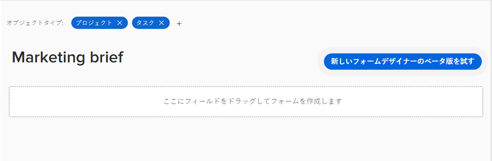

# フォームデザイナーの概要

新しいフォームデザイナーを使用すると、ユーザーがWorkfrontオブジェクトに添付できるカスタムフォームをデザインできます。 オブジェクトの操作を行うユーザーは、カスタムフォームに入力して、オブジェクトに関する情報を入力できます。

新しいフォームデザイナーには、フィールド、キャンバス、フィールドの設定をすべて同時に表示できる、新しいキャンバススタイルのワークスペースが追加されました。 また、フォームのデザイン中に、セクション内のフィールドをドラッグ&amp;ドロップすることもできます。

<!-- add screenshot when field settings empty state is ready -->

## 新しいフォームデザイナーへのアクセス方法

新しいフォームデザイナーとレガシーフォームビルダーの両方の上部に新しいボタンが表示されます。 このボタンを使用して、レガシービルダーと新しいデザイナーを切り替えることができます。

## フォームデザイナーで使用できる新機能

新しいフォームデザイナーでは、

* **フィールドのコピー**:フィールド上のコピーアイコンをキャンバスから直接クリックして、既存のフィールドをコピーできるようになりました。

* **説明テキストのサイズの変更**:「説明テキスト」フィールドに、小、中、大のサイズを割り当てることができるようになりました。 また、他のフィールドと同じ行で使用することもできます。

* **デフォルトセクションを使用**:フォーム作成者がフォームの上部にセクションを追加していない場合は、キャンバスに「デフォルト」セクションが表示されるので、カスタムセクションが割り当てられていないフィールドの権限をユーザーが調整できます。

   >[!NOTE]
   >
   >フォームがオブジェクトに添付されると、デフォルトのセクションはオブジェクト内に表示されなくなります。

## 機能は近日公開予定

次の項目は、現在フォームデザイナーでは使用できませんが、近日中に追加される予定です。

* 説明テキストのサイズを調整

* 論理の表示/スキップ

* 先頭入力フィールドのフィルター

>[!IMPORTANT]
>
>新しいフォームデザイナーを使用する場合、論理フィルターと typeahead フィルターの既存の設定は影響を受けません。

## フォームデザイナーから削除された機能

フォームデザイナー内から次の機能が削除されました。

* フォーム設定、フォーム共有、「フィールド共有」タブ

   * キャンバスの上部でフォーム設定を使用できるようになりました。

   * 「フォーム共有」のメインタブおよび「フィールド共有」サブタブ
   >[!NOTE]
   >
   >設定/カスタムForms/「Forms」または「フィールド」タブで、フォームとフィールドの共有を制御できます。

* 更新フィードでフィールドの変更を追跡
   >[!NOTE]
   >
   >これは、設定/インターフェイス/フィードを更新で確認できます。
