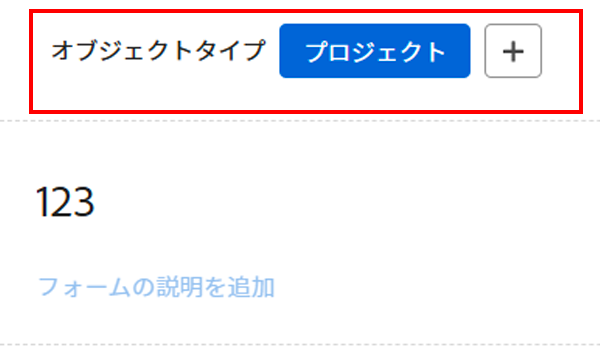
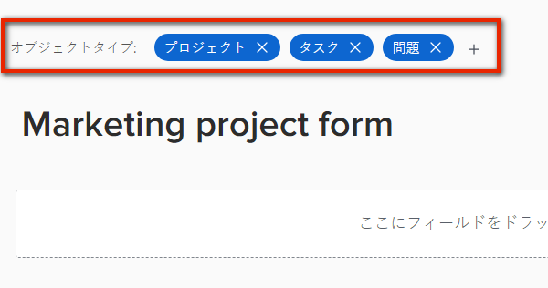

# フォームデザイナーを使用して既存のカスタムフォームにオブジェクトの種類を追加または削除する

{{highlighted-preview-article-level}}

フォームデザイナーを使用して、既存のカスタムフォームに対してオブジェクトの種類を追加または削除できます。

## アクセス要件

この記事の手順を実行するには、次の手順を実行する必要があります。

<table style="table-layout:auto"> 
 <col> 
 <col> 
 <tbody> 
  <tr data-mc-conditions=""> 
   <td role="rowheader"> 
Adobe Workfront plan*
 </td> 
   <td>任意</td> 
  </tr> 
  <tr> 
   <td role="rowheader">Adobe Workfront license*</td> 
   <td>
   
現在のプラン：標準

   
または

   
レガシープラン：プラン
</td> 
  </tr> 
  <tr data-mc-conditions=""> 
   <td role="rowheader">アクセスレベル設定*</td> 
   <td>
カスタムフォームへの管理アクセス
 
Workfront管理者がこのアクセス権を付与する方法について詳しくは、 <a href="/help/quicksilver/administration-and-setup/add-users/configure-and-grant-access/grant-users-admin-access-certain-areas.md" class="MCXref xref">特定の領域に対する管理者アクセス権をユーザーに付与する</a>.
</td> 
  </tr>  
 </tbody> 
</table>

&#42;保有しているプラン、ライセンスタイプ、アクセスレベル設定を確認するには、Workfront管理者に問い合わせてください。

## 既存のカスタムフォームにオブジェクトタイプを追加する

フォームにオブジェクトの種類を追加して、複数のオブジェクトに添付できるようにすることができます。

>[!NOTE]
>
>断面分割の権限は、オブジェクトタイプの影響を受ける場合があります。 カスタムフォームセクションの改ページに対する制限付き編集権限は、プロジェクト、タスク、問題、ユーザーの各オブジェクトタイプに対してのみ使用できます。
>
>詳しくは、 [複数のオブジェクトタイプが断面の分割権限に与える影響](/help/quicksilver/administration-and-setup/customize-workfront/create-manage-custom-forms/form-designer/design-a-form/organize-a-form.md#how-multiple-object-types-can-affect-section-break-permissions).

1. 次をクリック： **メインメニュー** アイコン  Adobe Workfrontの右上隅で、 **設定** .

1. クリック **カスタムForms** をクリックします。

   表示されるビューで、組織用に作成されたすべてのカスタムフォームを確認できます。 また、各フォームの作成者、対象となるオブジェクトタイプ、アクティブかどうかも確認できます。

1. オブジェクトタイプを追加するカスタムフォームを選択し、 **編集**.

1. フォームの上部で、プラス記号+の後をクリックします。 **オブジェクトタイプ**&#x200B;を選択し、表示されるメニューで目的のタイプを選択します。 この操作を繰り返して、必要な数のオブジェクトタイプを追加できます。

   

1. クリック **保存して閉じる**.

   >[!TIP]
   >
   >次をクリックできます。 **適用** カスタムフォームの作成中はいつでも、変更内容を保存し、フォームを開いたままにすることができます。

## カスタムフォームのオブジェクトタイプの削除

既存のカスタムフォームからオブジェクトタイプを削除できます。 カスタムフォームには、少なくとも 1 つのオブジェクトタイプが必要です。

>[!CAUTION]
>
>ユーザーが既に、削除する種類のオブジェクトにカスタムフォームを添付し、データを追加している場合、フォーム上でそのオブジェクトの種類を削除すると、そのデータは完全に削除されます。 ユーザーが後で必要とする履歴情報が含まれる場合があります。
>
>一般に、既に使用されているカスタムフォームを編集する回数は最小限に抑えることをお勧めします。 カスタムフォームを使用するユーザーに変更に関して警告を出す通知システムはありません。

オブジェクトタイプを削除するには：

1. 次をクリック： **メインメニュー** アイコン  Adobe Workfrontの右上隅で、 **設定** .

1. クリック **カスタムForms** をクリックします。
1. 編集するカスタムフォームを選択し、 **編集**.
1. いずれかの **オブジェクトタイプ** 削除する項目をフォームから削除し、 **削除** をクリックします。

   

1. （オプション）フォームから削除する他のオブジェクトタイプに対して、前の手順を繰り返します。
1. クリック **完了**&#x200B;を選択し、「 **閉じて保存**.
