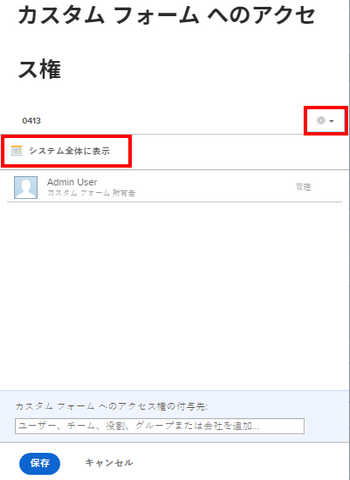

# カスタムフォームの共有

カスタムフォームへのアクセスを設定して、ユーザー、役割、グループ、チーム、会社などがフォームの表示、共有、編集を行えるユーザーを制御できます。

## アクセス要件

この記事の手順を実行するには、次の手順を実行する必要があります。

<table style="table-layout:auto"> 
 <col> 
 <col> 
 <tbody> 
  <tr data-mc-conditions=""> 
   <td role="rowheader"> 
Adobe Workfront plan*
 </td> 
   <td>任意</td> 
  </tr> 
  <tr> 
   <td role="rowheader">Adobe Workfront license*</td> 
   <td>計画</td> 
  </tr> 
  <tr data-mc-conditions=""> 
   <td role="rowheader">アクセスレベル設定*</td> 
   <td> 
カスタムフォームへの管理アクセス
 
Workfront管理者がこのアクセス権を付与する方法について詳しくは、 <a href="../../../administration-and-setup/add-users/configure-and-grant-access/grant-users-admin-access-certain-areas.md" class="MCXref xref" data-mc-variable-override="">特定の領域に対する管理者アクセス権をユーザーに付与する</a>.
 </td> 
  </tr> 
 </tbody> 
</table>

&#42;保有しているプラン、ライセンスタイプ、アクセスレベル設定を確認するには、Workfront管理者に問い合わせてください。

## カスタムフォームへのアクセス {#access-to-custom-forms}

デフォルトでは、新しいカスタムフォームを作成し、そのカスタムフォームをオブジェクトに添付すると、そのオブジェクトに割り当てられたすべてのユーザーがフォームの表示と入力を行うことができます。 これには、リクエストライセンスを持つユーザーと外部ユーザーが含まれます。

ただし、カスタムフォームがまだ添付されていないオブジェクトでは、次のいずれかに該当する場合を除き、ユーザー（Planner のアクセスレベルを持っている場合でも）は「カスタムForms」ドロップダウンメニューから添付できません。

* ユーザーとカスタムフォームを共有し、少なくとも選択されたカスタムデータに添付する表示権限を付与するユーザー、またはチーム、役割、グループ、または会社とカスタムフォームを共有したユーザー
* ユーザーはプランライセンスを持っており、そのアクセスレベルでカスタムフォームへの管理アクセスが可能です

## カスタムフォームの共有

カスタムフォームをデフォルトの共有状態のままにする代わりに ( [カスタムフォームへのアクセス](#access-to-custom-forms) この記事では、特定のユーザー、ジョブの役割、グループ、チーム、会社に対して、特定のレベルのフォームアクセスを設定できます。

1. 次をクリック： **メインメニュー** アイコン  Adobe Workfrontの右上隅で、 **設定** .

1. 左側のパネルで、 **カスタムForms**.
1. カスタムフォームを選択し、「 **共有**.
1. 表示されるボックスの下に、 **カスタムフォームに対するアクセス権の付与**&#x200B;で、カスタムフォームを共有するユーザー、チーム、ジョブの役割、グループまたは会社の名前を入力し、 **入力** 名前が表示されたら、
1. 先ほど追加したユーザー、チーム、ジョブの役割、グループまたは会社のアクセスを調整するには、名前の右にあるドロップダウンメニューをクリックし、次の使用可能なオプションのいずれかと、その詳細設定を指定します。

   <table style="table-layout:auto"> 
    <col> 
    <col> 
    <tbody> 
     <tr> 
      <td role="rowheader">それを表示</td> 
      <td> 
オブジェクトでカスタムフォームを表示し、入力する機能。
 
<b>注意</b>：作業、レビュー、リクエストのライセンスを持つユーザーにとって、これは利用可能な最高のオプションです。
 
クリック <strong>詳細設定</strong> を使用して、次のことを許可するかどうかを指定します。
 
       <ul> 
        <li><strong>カスタムデータに添付</strong>：アクセスを管理できるプロジェクト、タスクおよび問題にカスタムフォームを添付する機能</li> 
        <li> 
<strong>共有</strong>：カスタムフォームをシステム内の他のユーザーと共有する機能
 
作業、レビュー、またはリクエストのライセンスを持つユーザーは、API またはカスタムフォームレポートを通じてのみカスタムフォームを共有できます。 詳しくは、を参照してください。
 </li> 
       </ul> </td> 
     </tr> 
     <tr> 
      <td role="rowheader">それを管理</td> 
      <td> 
プランライセンスを持つユーザーのみ利用できます。 
 
ユーザーは、編集権限を持つオブジェクトにフォームを追加できるだけでなく、フィールドの追加、編集、削除など、カスタムフォームを完全に編集することもできます。
 
クリック <strong>詳細設定</strong> を使用して、次の操作を許可するかどうかを指定します。
 
       <ul> 
        <li> 
<strong>カスタムデータに添付</strong>：アクセスを管理できるプロジェクト、タスクおよび問題にカスタムフォームを添付する機能
 </li> 
        <li><strong>削除</strong>：カスタムフォームをシステムから削除します</li> 
        <li><strong>共有</strong>：カスタムフォームをシステム内の他のユーザーと共有します</li> 
       </ul> </td> 
     </tr> 
    </tbody> 
   </table>

1. （オプション）手順 4～5 を繰り返して、リストに他の名前を追加し、そのオプションを設定します。
1. （オプション）カスタムフォームへのアクセスを（アタッチされたオブジェクトに対して）前の手順で指定したフォームに制限する場合は、歯車アイコンをクリックします。  共有ボックスの右上隅にあるをクリックし、 **システム全体のアクセスを削除する**.

   気が変わったら、 **この機能をシステム全体で表示する** （デフォルトのオプション）。

   >[!NOTE]
   >
   >* カスタムフォームをシステム全体で表示する場合、ユーザーは割り当てられたオブジェクトに対してのみフォームを表示および入力でき、他のオブジェクトには添付できません。 手順 5 で説明した「カスタムデータに添付」オプションを使用して、カスタムフォームをオブジェクトに添付する機能を付与できます。
   >* ほとんどの組織では、作業対象のオブジェクトにフォームを添付し、そのデータをレポートに表示する際に、システム内のすべてのユーザーがカスタムフォームに必ず記入できるようにしたいと考えています。 これが貴社に当てはまる場合は、「**この機能をシステム全体で表示する**.&quot; このようにオプションを設定すると、ダイアログボックスに「システム全体の表示」が表示されます。
   >   
   >
   >   
   >特定のオブジェクトに添付されたときにユーザーが機密データを入力するカスタムフォームを使用した場合、それらの共有を制限する場合 *オブジェクト* フォーム自体へのアクセスを制限するよりも、むしろの方が効果的です。

1. 「**保存**」をクリックします。

## カスタムフォームへのアクセスを削除する

1. 次をクリック： **メインメニュー** アイコン  Adobe Workfrontの右上隅で、 **設定** .

1. 左側のパネルで、 **カスタムForms**.
1. カスタムフォームを選択し、「 **共有**.
1. 表示されるボックスで、フォームへの特別なアクセス権を持たなくなったユーザー、チーム、役割、グループまたは会社の名前の右にある X をクリックします。
1. （オプション）削除する他の名前について、前の手順をに繰り返します。
1. 「**保存**」をクリックします。
