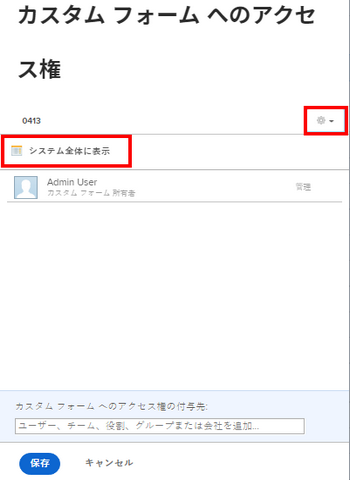

# カスタムフォームの共有

{{preview-fast-release-general}}

カスタムフォームへのアクセスを設定して、誰（人物、役割、グループ、チーム、企業、ビジネスプロファイル）が表示、共有、編集できるかを制御できます。

## アクセス要件

+++ 展開すると、この記事の機能のアクセス要件が表示されます。

<table style="table-layout:auto"> 
 <col> 
 <col> 
 <tbody> 
  <tr> 
   <td>Adobe Workfront パッケージ</td> 
   <td>
任意
</td> 
  </tr> 
  <tr> 
   <td>Adobe Workfront プラン</td> 
   <td>
標準

       
プラン
</td>
  </tr> 
  <tr> 
   <td>アクセスレベル設定</td> 
   <td> 
カスタムフォームへの管理アクセス権
 </td> 
  </tr>  
 </tbody> 
</table>

詳しくは、[Workfront ドキュメントのアクセス要件](/help/quicksilver/administration-and-setup/add-users/access-levels-and-object-permissions/access-level-requirements-in-documentation.md)を参照してください。

+++

## カスタムフォームへのアクセス {#access-to-custom-forms}

デフォルトでは、新しいカスタムフォームを作成し、そのカスタムフォームがオブジェクトに添付されると、そのオブジェクトに割り当てられたすべてのユーザーがフォームの表示と入力を行うことができます。 これには、コントリビューターライセンスまたはリクエストライセンスを持つユーザー、および外部ユーザーが含まれます。

ただし、カスタムフォームがまだ添付されていないオブジェクトでは、次のいずれかに該当する場合を除き、ユーザー（プランナーのアクセスレベルを持っている場合でも）はカスタムフォームドロップダウンメニューから添付できません。

*  ユーザーが「システム内のすべてのユーザーが表示して添付できる」というカスタムフォームを共有しました。
* ユーザーまたはチーム、担当業務、グループ、会社、またはビジネスプロファイルとカスタムフォームを共有し、少なくとも「カスタムデータに添付」を選択して「表示」権限を付与したユーザー
* ユーザーには標準ライセンスまたはプラン ライセンスがあり、そのアクセス レベルでは、カスタム フォームへの管理アクセスが許可されます

<!--

## Share a custom form from the list of forms

Rather than leaving a custom form in the default sharing state (described in [Access to custom forms](#access-to-custom-forms) in this article), you can configure specific levels of access to the form for certain users, job roles, groups, teams, and companies.

{{step-1-to-setup}}

1. In the left panel, click **Custom Forms**.
1. Select the custom form, then click .
1. In the box that displays, under **Give custom form access to**, start typing the name of the user, team, job role, group, company, or business profile you want to share the custom form with, then press **Enter** when the name displays.
1. To adjust access for the user, team, job role, group, company, or business profile you just added, click the drop-down menu to the right of the name, then configure one of the following available options and any of its advanced settings:

   <table style="table-layout:auto"> 
    <col> 
    <col> 
    <tbody> 
     <tr> 
      <td role="rowheader">View it</td> 
      <td> 
This option provides the ability to view and fill out the custom form on objects. At the object level, users must also have at least Contribute access with the <strong>Edit custom form</strong> advanced setting enabled. For example, if the form is attached to a project, users must have Contribute access to that project, or they will not be able to fill out the form.

      
      
<b>NOTE</b>: For users with Light and Contributor licenses (or Work, Review, and Request licenses), this is the highest available option.

      
      
Click <strong>Advanced Settings</strong> to specify whether you want to allow the following:
 
       <ul> 
        <li><strong>Attach to custom data</strong>: Ability to attach the custom form to projects, tasks, and issues for which they have Manage access</li> 
        <li> 
<strong>Share</strong>: Ability to share the custom form with others in the system
 
Users with a Light or Contributor license (or Work, Review, or Request license) can share a custom form only through the API or a custom forms report.
 </li>
       </ul> </td> 
     </tr> 
     <tr> 
      <td role="rowheader">Manage it</td> 
      <td> 
This option available only for users with a Standard or Plan license. 
 
In addition to being able to add the form to objects they have access to edit, users can also fully edit the custom form, including adding, editing, and deleting fields.
 
Click <strong>Advanced Settings</strong> to specify whether you want to allow following:
 
       <ul> 
        <li> 
<strong>Attach to custom data</strong>: Ability to attach the custom form to projects, tasks, and issues for which they have Manage access
 </li> 
        <li><strong>Delete</strong>: Delete the custom form from the system</li> 
        <li><strong>Share</strong>: Share the custom form with others in the system</li> 
       </ul> </td> 
     </tr> 
    </tbody> 
   </table>

1. (Optional) Repeat Steps 4-5 to add other names to the list and configure their options.
1. (Optional) If you want to limit access to the custom form (on objects where it's attached) to those you have specified in the previous steps, click the gear icon  in the upper right corner of the sharing box, then click **Remove system-wide access**.

   If you change your mind, you can click **Make this visible system-wide** (the default option).

   >[!NOTE]
   >
   >* When you make a custom form visible system-wide, you allow users only to see and fill it out on objects they are assigned to, not to attach it to other objects. You can grant the ability to attach the custom form to objects using the option "Attach to custom data" explained under step 5.
   >* Most organizations want to ensure that everyone in the system can fill out a custom form when it's attached to objects they work on and view its data in reports. If this is true for your organization, we recommend that you use **Make this visible system-wide**. When the option is configured this way, "Visible System-Wide" displays in the dialog box:
   >   
   >
   >   
   >If you are concerned about a custom form where users might enter sensitive data when it is attached to certain objects, limiting sharing for those *objects* might be better rather than limiting access to the form itself.

1. Click **Save**.

-->

## カスタムフォームの共有

カスタムフォームをデフォルトの共有状態（この記事の[&#x200B; カスタムフォームへのアクセス &#x200B;](#access-to-custom-forms)で説明）のままにするのではなく、特定のユーザー、担当業務、グループ、チーム、企業、ビジネスプロファイルに対するフォームへの特定のアクセスレベルを設定できます。

{{step-1-to-setup}}

1. 左側のパネルで、「**カスタムフォーム**」をクリックします。
1. リストでカスタムフォームを選択し、をクリックします。

   または

   カスタムフォームを開くか、新しいカスタムフォームを作成します。 次に、フォームデザイナーの右上にある「**共有**」をクリックします。

1. 共有ボックスの&#x200B;**カスタムフォームに**&#x200B;へのアクセス権を付与の下で、カスタムフォームを共有するユーザー、チーム、担当業務、グループ、会社、またはビジネスプロファイルの名前を入力し始めます。名前が表示されたら、**Enter**&#x200B;を押します。
1. 追加したユーザー、チーム、担当業務、グループ、会社、またはビジネスプロファイルのアクセス権を調整するには、名前の右側にあるドロップダウンメニューをクリックし、次のいずれかの使用可能なオプションとその詳細設定を設定します。

   <table style="table-layout:auto"> 
    <col> 
    <col> 
    <tbody> 
     <tr> 
      <td role="rowheader">ビュー</td> 
      <td> 
このオプションは、オブジェクト上のカスタムフォームを表示および入力する機能を提供します。 オブジェクトレベルでは、ユーザーは少なくとも<strong> カスタムフォームを編集</strong>の詳細設定を有効にしたContribute アクセスを持っている必要があります。 例えば、フォームがプロジェクトに添付されている場合、ユーザーはそのプロジェクトに対するContribute アクセス権を持っている必要があります。そうでない場合は、フォームに入力できません。

   
<b> メモ </b>：ライトおよびコントリビューターライセンス（または作業、レビュー、リクエストのライセンス）を持つユーザーの場合、これは利用可能な最高のオプションです。
 
「<strong>詳細設定</strong>」をクリックして、次のことを許可するかどうかを指定します。
 
       <ul> 
        <li><strong>カスタムデータに添付</strong>：アクセスを管理できるプロジェクト、タスク、イシューにカスタムフォームを添付する機能</li> 
        <li> 
<strong>共有</strong>：カスタムフォームをシステム内の他のユーザーと共有する機能
 
Lightまたはコントリビューターライセンス（またはWork、Review、またはRequest ライセンス）を持つユーザーは、APIまたはカスタムフォームレポートを通じてのみ、カスタムフォームを共有できます。
 </li>
       </ul> </td> 
     </tr> 
     <tr> 
      <td role="rowheader">管理</td> 
      <td> 
このオプションは、StandardまたはPlan ライセンスを持つユーザーのみが使用できます。 
 
ユーザーは、編集権限を持つオブジェクトにフォームを追加できるだけでなく、フィールドの追加、編集、削除など、カスタムフォームを完全に編集することもできます。
 
「<strong>詳細設定</strong>」をクリックして、次のことを許可するかどうかを指定します。
 
       <ul> 
        <li> 
<strong>カスタムデータに添付</strong>：アクセスを管理できるプロジェクト、タスクおよびイシューにカスタムフォームを添付する機能
 </li> 
        <li><strong>削除</strong>：カスタムフォームをシステムから削除します</li> 
        <li><strong>共有</strong>：カスタムフォームをシステム内の他のユーザーと共有します</li> 
       </ul> </td> 
     </tr> 
    </tbody> 
   </table>

1. （オプション）手順5 ～ 6を繰り返して、他の名前をリストに追加し、そのオプションを設定します。
1. （オプション）前の手順で指定したカスタムフォーム（添付されているオブジェクト上）へのアクセスを制限する場合は、**アクセス権を持つユーザー**&#x200B;の下にあるドロップダウン矢印をクリックし、**招待されたユーザーのみが**&#x200B;にアクセスできます。

   気が変わった場合は、**システム内のすべてのユーザーが表示できる**&#x200B;を選択できます。

   >[!NOTE]
   >
   >* カスタムフォームをシステム全体で表示する場合、ユーザーは割り当てられたオブジェクトに対してのみフォームを表示および入力でき、他のオブジェクトには添付できません。 手順 6 で説明した「カスタムデータに添付」オプションを使用して、カスタムフォームをオブジェクトに添付する機能を付与できます。
   >* ほとんどの組織では、作業対象のオブジェクトにフォームを添付し、そのデータをレポートに表示する際に、システム内のすべてのユーザーがカスタムフォームに必ず記入できるようにしたいと考えています。 この問題が組織に当てはまる場合は、**システム内のすべてのユーザーが**&#x200B;を表示できるようにすることをお勧めします。
   >* **システム内の全員が**&#x200B;を表示および添付することを選択した場合、すべてのユーザーがフォームを他のオブジェクトに添付できます。
   >
   > プレビュー環境のサンプル画像：
   >
   >   
   >実稼動環境のサンプル画像：
   >
   >   
   >特定のオブジェクトに添付された機密データをユーザーが入力する可能性のあるカスタムフォームについて懸念がある場合は、フォーム自体へのアクセスを制限するのではなく、それらの&#x200B;*オブジェクト*&#x200B;の共有を制限する方が効果的です。

1. **保存**&#x200B;をクリックします。

## カスタムフォームへのアクセス権の削除

{{step-1-to-setup}}

1. 左側のパネルで、「**カスタムフォーム**」をクリックします。
1. リストでカスタムフォームを選択し、をクリックします。
1. 共有ボックスで、フォームに特別なアクセス権を付与する必要がなくなったユーザー、チーム、役割、グループ、会社、またはビジネスプロファイルの名前の右側にあるドロップダウンメニューをクリックし、**削除**&#x200B;を選択します。
1. （オプション）削除する他の名前について、前の手順を繰り返します。
1. 「**保存**」をクリックします。

