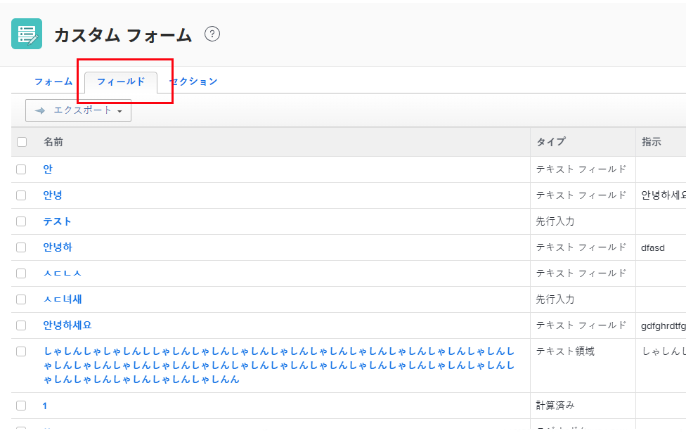

# 特定のカスタムフィールドまたはウィジェットを使用するすべてのレポートの表示

カスタムビューは、特定のカスタムフィールドまたはウィジェットを使用しているレポートを表示するカスタムフォームエリアに追加できます。フィールドやウィジェットは既に 1 つ以上のレポートに実装されている可能性があるので、これはフィールドやウィジェットを編集または削除する必要がある場合に役立ちます。これらのレポートが正しく機能し続けるために調整が必要かどうかを評価することが重要です。

カスタムフォームのカスタムフィールドとウィジェットについて詳しくは、[カスタムフォームにカスタムフィールドを追加](../../../administration-and-setup/customize-workfront/create-manage-custom-forms/add-a-custom-field-to-a-custom-form.md)および[カスタムフォームでのアセットウィジェットの追加または編集](../../../administration-and-setup/customize-workfront/create-manage-custom-forms/add-widget-or-edit-its-properties-in-a-custom-form.md)を参照してください。

## アクセス要件

この記事の手順を実行するには、以下を保有している必要があります。

<table style="table-layout:auto"> 
 <col> 
 <col> 
 <tbody> 
  <tr data-mc-conditions=""> 
   <td role="rowheader"> 
Adobe Workfront プラン*
 </td> 
   <td>任意</td> 
  </tr> 
  <tr> 
   <td role="rowheader">Adobe Workfront ライセンス*</td> 
   <td>プラン</td> 
  </tr> 
  <tr data-mc-conditions=""> 
   <td role="rowheader">アクセスレベル設定*</td> 
   <td> 
カスタムフォームへの管理アクセス権
 
Workfront 管理者がこのアクセス権を付与する方法について詳しくは、<a href="../../../administration-and-setup/add-users/configure-and-grant-access/grant-users-admin-access-certain-areas.md" class="MCXref xref">特定のエリアに対する管理者アクセス権をユーザーに付与</a>を参照してください。
 </td> 
  </tr> 
 </tbody> 
</table>

&#42;ご利用のプラン、ライセンスタイプまたはアクセスレベル設定を確認するには、Workfront 管理者にお問い合わせください。

## 特定のカスタムフィールドまたはウィジェットを使用するレポートのリストの表示

1. Adobe Workfront の右上隅にある&#x200B;**メインメニュー**&#x200B;アイコン  をクリックして、**設定**  をクリックします。

1. 左側のパネルで、「**カスタムフォーム**」をクリックします。
1. 「**フィールド**」タブを開くと、Workfront インスタンス内のすべてのカスタムフィールドとウィジェットをリストしたレポートが表示されます。

   

1. リスト上部のヘッダーにある&#x200B;**ビュー**&#x200B;ドロップダウンメニューをクリックし、リスト内に&#x200B;**レポート**&#x200B;列（このタブのデフォルト列でなはい）を含むカスタムビューがないか確認します。

   レポート列では、システム内のカスタムフォームに追加された各カスタムフィールドとウィジェットを使用しているレポートを確認できます。**レポート**&#x200B;列を含むビューが既に作成されている可能性があります。

1. **レポート**&#x200B;列を含むビューが表示されない場合、それを含む新しいビューを作成します。

   1. **表示**&#x200B;ドロップダウンメニューをクリックして、「**新規ビュー**」をクリックします。

   1. 表示された&#x200B;**新規ビュー**&#x200B;ページの左上隅付近のボックスで、「**新規パラメータービュー**」をビューのわかりやすい名前に変えます（例：*フィールドとウィジェット*）。

   1. 右下隅付近にある「**列を追加**」をクリックします。
   1. 左上隅近くに表示される「**この列に表示**」ボックスに、「*レポート*」と入力し始め、「**レポート**」がボックスの下のリストに表示されたら選択します。

   1. （条件付き）追加した&#x200B;**レポート**&#x200B;列を別の水平位置に移動する場合は、そのヘッダーをページ下部の&#x200B;**列プレビュー**&#x200B;エリアにドラッグします。

   1. 「**完了**」をクリックし、「**ビューを保存**」をクリックします。

1. **表示**&#x200B;ドロップダウンメニューをクリックして、作成したカスタムビューの名前を選択します。
1. **名前**&#x200B;列で、編集または削除するカスタムフィールドまたはウィジェットを探し、その行の&#x200B;**レポート**&#x200B;列を見て、どのレポートで使用されているか（使用されている場合）を確認します。

   この列の情報を検索するために、Workfront は、すべてのレポートフィルター、ビュー、グループでカスタムフィールドおよびウィジェットを検索します。

   プラス記号が表示された場合は、そのテキスト行をクリックすると、そのフィールドまたはウィジェットを使用するその他のすべてのレポートをリストするボックスが表示されます。

   >[!NOTE]
   >
   >このツールの初回読み込み時間は、システム内のデータ量に応じて、10 秒から 2.5 分の間です。

   >[!TIP]
   >
   >カスタムフィールドまたはウィジェットを使用しているレポートを調べる時間がない場合は、「書き出し」をクリックして、レポートの一覧を示すファイルを作成できます。このファイルをフィールドまたはウィジェットを使用しているレポートの所有者と共有し、必要な変更とそれがレポートに与える影響、レポートが引き続き正しく機能するようにするために何をする必要があるかについて話し合うことができます。
   >
   >このビューは、パラメーターレポートでも使用できます。
   >      
   > 1. メインメニューで、「**レポート**」をクリックします。
   > 1. 左上隅付近で、「**新規レポート**」を選択し、表示されるリストで「**パラメーター**」をクリックします。
   > 1. 右下隅付近にある「**列を追加**」をクリックします。
   > 1. 左上隅近くに表示される「**この列に表示**」ボックスに、「*レポート*」と入力し始め、「**レポート**」がボックスの下のリストに表示されたら選択します。
   > 1. （条件付き）追加した&#x200B;**レポート**&#x200B;列を別の水平位置に移動する場合は、そのヘッダーをページ下部の&#x200B;**列プレビュー**&#x200B;エリアにドラッグします。
   > 1. 「**完了**」をクリックして、「**保存して閉じる**」をクリックします。
   > 1. レポートのわかりやすい名前を入力します（*フィールドとウィジェット*&#x200B;など）。
