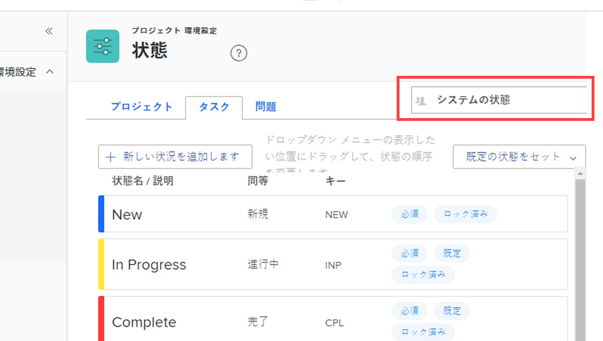
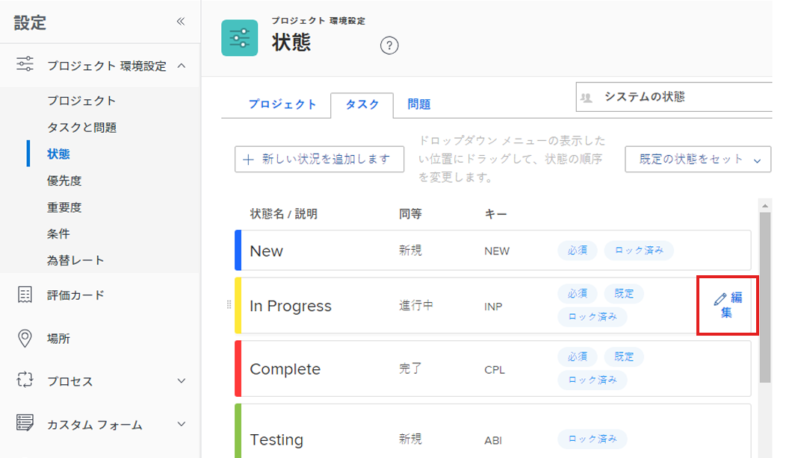
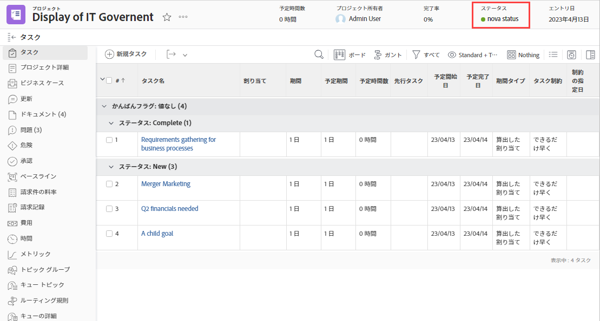

# ステータスの作成または編集

<!-- Audited: 1/2024 -->

<!--DON'T DELETE, DRAFT OR HIDE THIS ARTICLE. IT IS LINKED TO THE PRODUCT THROUGH CONTEXT SENSITIVE HELP LINKS.-->

Adobe Workfrontの管理者は、プロジェクト、タスクおよびイシューのカスタムステータスを作成できます。 これらは、Workfrontシステム全体のユーザーに対して、または特定のグループやサブグループに対して使用できます。 ステータスについて詳しくは、 [ステータスの概要](../../../administration-and-setup/customize-workfront/creating-custom-status-and-priority-labels/statuses-overview.md).

>[!NOTE]
>
>グループ管理者は、自分のグループでのみ使用する独自のグループステータスを作成することもできます。 詳しくは、 [グループのステータスの作成または編集](../../../administration-and-setup/manage-groups/manage-group-statuses/create-or-edit-a-group-status.md).

## アクセス要件

この記事の手順を実行するには、次のアクセス権が必要です。

<table style="table-layout:auto"> 
 <col> 
 <col> 
 <tbody> 
  <tr> 
   <td role="rowheader">Adobe Workfrontプラン</td> 
   <td>任意</td> 
  </tr> 
  <tr> 
   <td role="rowheader">Adobe Workfrontライセンス</td> 
   <td>
     
新規：標準

     
または

     
現在：プラン

   </td> 
  </tr> 
  <tr> 
   <td role="rowheader">アクセスレベル設定</td> 
   <td> 
Workfront管理者である。
  </td> 
  </tr> 
 </tbody> 
</table>

この表の情報の詳細については、 [Workfrontドキュメントのアクセス要件](/help/quicksilver/administration-and-setup/add-users/access-levels-and-object-permissions/access-level-requirements-in-documentation.md).

## カスタムステータスの作成または編集

組織全体または単一のグループで使用するカスタムステータスを追加できます。

組織全体のカスタムステータスを作成する場合、システム内のすべてのグループが編集せずにそのステータスを使用できるように、カスタムステータスを設定できます。 また、グループ管理者が自分のグループに対して変更を加えられるように設定することもできます。詳しくは、 [グループのステータスの作成または編集](../../../administration-and-setup/manage-groups/manage-group-statuses/create-or-edit-a-group-status.md).

1. 次をクリック： **[!UICONTROL メインメニュー]** アイコン  Adobe Workfrontの右上隅にある、または（使用可能な場合）、 **[!UICONTROL メインメニュー]** アイコン  左上隅で、「 **[!UICONTROL 設定]** .

1. 左側のパネルで、 **プロジェクト環境設定** > **ステータス**.

1. （条件付き）システム全体で使用するステータスを作成または編集する場合は、 **システムステータス** が右上隅のボックスで選択されている。

   

   または

   ステータスがグループまたはサブグループの場合は、右上隅にグループの名前を入力し、表示されたら選択します。

   

1. オブジェクトタイプの「 」タブを選択します (**プロジェクト**, **タスク**&#x200B;または **問題**) をクリックします。

1. 新しいステータスを作成する場合は、「 **新しいステータスの追加**.

   または

   既存のステータスを編集する場合は、そのステータスの上にマウスポインターを置いて、 **編集** 右端に表示されるアイコン。

   

1. 次のオプションを使用して、ステータスを設定します。

   <table style="table-layout:auto"> 
    <col> 
    <col> 
    <tbody> 
     <tr> 
      <td role="rowheader">状態名</td> 
      <td> 
ステータスの名前を入力します。 必須フィールドです。
 
ステータス名を作成する場合、システム内の他のユーザーは同じ名前のステータスを作成できます。 Workfrontでステータスを選択する際に混乱が生じないように、一意の名前を使用することをお勧めします。
 </td> 
     </tr> 
     <tr> 
      <td role="rowheader">説明</td> 
      <td>（オプション）ステータスの説明を入力します。 これは、その目的を使用する人々に伝えます。</td> 
     </tr> 
     <tr> 
      <td role="rowheader">色</td> 
      <td> 
カラーフィールドをクリックし、スウォッチパネルから色を選択して、ステータスの色をカスタマイズします。 また、「 」フィールドに 16 進数を入力することもできます。
 
ステータスの色は、ユーザーがオブジェクトを表示したときに、Workfrontの右上隅に表示されます。
  
 </td> 
     </tr> 
     <tr> 
      <td role="rowheader">同等</td> 
      <td> 
ステータスの機能に最も適したオプションをリストから 1 つ選択します。 例えば、ステータス名が「完了」の場合、「完了」と等しいオプションを指定する必要があります。
 
ステータスがどのように機能するかを決定するので、各ステータスは、これらのオプションのいずれかと同じにする必要があります。
 
ステータスの作成後は、このオプションを変更できません。
 </td> 
     </tr> 
     <tr> 
      <td role="rowheader">キー</td> 
      <td> 
新しいステータスを作成する場合は、ステータスのコードまたは省略形を入力するか、生成したステータスを使用します。 このキーは、レポート目的で使用できるので、Workfrontで一意である必要があります。 システムで既に使用されているキーを指定しようとすると、フィールドが赤に変わります。
 
使用するユーザーが認識可能な省略形を使用すると便利です。
 
ステータスの作成後は、このオプションを変更できません。
 
Planning、Current、Complete の各ステータスのキーコードは変更できません。 これは、テキストモードでレポートを作成する場合に重要です。
 </td> 
     </tr> 
     <tr> 
      <td role="rowheader">ステータスを非表示</td> 
      <td> 
（プロジェクトおよびタスクのステータスのみ）
 
ユーザーにステータスを表示しない場合は、このオプションを有効にします。 このオプションを無効にした場合（デフォルト設定）、システム内のすべてのユーザーがステータスを使用できます。
 
4 つの問題タイプ（バグレポート、変更管理、問題、リクエスト）すべてでこのオプションを無効にすると、問題ステータスを非表示にできます。
 </td> 
     </tr> 
     <tr> 
      <td role="rowheader">すべてのグループについてロック</td> 
      <td>
       
ステータスがロックされると、システム全体のユーザーがそのステータスを表示して使用でき、グループ管理者はそのステータスを自分のグループ用にカスタマイズすることはできません。
 
       
ステータスがロック解除されると、グループ管理者は個々のグループに合わせてカスタマイズできます。

   

       
システム承認プロセスでは、ロック済みステータスとロック解除済みステータスの両方を使用できます。 ロックが解除されたシステムステータスのシステム承認プロセスを作成すると、システム全体のユーザーは、承認プロセスをシステム内の任意のプロジェクト、タスクまたは問題に関連付けることができます。

       
 次のシナリオでは、警告メッセージが表示され、ステータスをロック解除した結果をユーザーとユーザーが理解しやすくなります。

       <ul>
       <li>管理者は、承認プロセスで使用されるシステムレベルのステータスのロックを解除します。 自分のグループのロック解除ステータスが削除される可能性があるというメッセージが表示され、グループメンバーが自分のグループに割り当てられたオブジェクトに対して、その承認プロセスを適切に使用できなくなります。</li>
       <li>ユーザーが、ロック解除済みのステータスを使用する承認プロセスの編集を開始します。 ロックが解除された状態に関する警告メッセージが表示され、再ロックするか置き換えるのが適切かどうかを評価できます。</li>
       <li>ロックが解除されたステータスを持つシステムレベルの承認プロセスがオブジェクトに添付され、そのオブジェクトに割り当てられたグループのステータスが削除されました。 グループメンバーがオブジェクトの「承認」セクションに移動すると、承認プロセスを開始できないことを示すメッセージが表示されます。</li>
       </ul>
       
ステータスのロックについて詳しくは、 <a href="../../../administration-and-setup/customize-workfront/creating-custom-status-and-priority-labels/lock-or-unlock-a-custom-system-level-status.md" class="MCXref xref">システムレベルのステータスのロックとロック解除</a>.

       

      </td>
     </tr> 
    </tbody> 
   </table>

1. 「**保存**」をクリックします。

   このステータスをデフォルトのステータスにする手順については、 [カスタムステータスをデフォルトのステータスとして使用](../../../administration-and-setup/customize-workfront/creating-custom-status-and-priority-labels/use-custom-statuses-as-default-statuses.md).

グループステータスの順序変更について詳しくは、 [システムレベルとグループのステータスの並べ替え](../../../administration-and-setup/customize-workfront/creating-custom-status-and-priority-labels/reorder-system-statuses.md).
