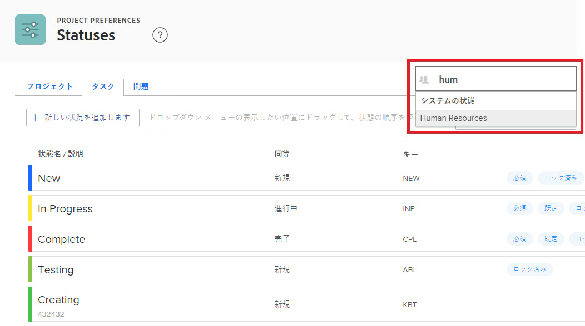

# ステータスの作成または編集

<!-- Audited: 1/2024 -->

<!--DON'T DELETE, DRAFT OR HIDE THIS ARTICLE. IT IS LINKED TO THE PRODUCT THROUGH CONTEXT SENSITIVE HELP LINKS.-->

Adobe Workfront の管理者は、プロジェクト、タスクおよびイシューのカスタムステータスを作成できます。これらは、Workfront システム全体のユーザーに対して、または特定のグループやサブグループに対して可能です。ステータスについて詳しくは、[ステータスの概要](../../../administration-and-setup/customize-workfront/creating-custom-status-and-priority-labels/statuses-overview.md)を参照してください。

>[!NOTE]
>
>グループ管理者も、自分のグループだけで使用するために、独自のグループステータスを作成できます。詳しくは、[グループステータスの作成または編集](../../../administration-and-setup/manage-groups/manage-group-statuses/create-or-edit-a-group-status.md)を参照してください。

## アクセス要件

+++ 展開すると、この記事の機能のアクセス要件が表示されます。

<table style="table-layout:auto"> 
 <col> 
 <col> 
 <tbody> 
  <tr> 
   <td>Adobe Workfront パッケージ</td> 
   <td>
任意
</td> 
  </tr> 
  <tr> 
   <td>Adobe Workfront プラン</td> 
   <td>
標準

       
プラン
</td>
  </tr> 
  <tr> 
   <td>アクセスレベル設定</td> 
   <td>システム管理者</td> 
  </tr> 
 </tbody> 
</table>

詳しくは、[Workfront ドキュメントのアクセス要件](/help/quicksilver/administration-and-setup/add-users/access-levels-and-object-permissions/access-level-requirements-in-documentation.md)を参照してください。

+++

## カスタムステータスの作成または編集

組織全体または単一のグループで使用するカスタムステータスを追加できます。

組織全体のカスタムステータスを作成すると、システム内のすべてのグループが編集なしで使用できるカスタムステータスを設定できます。または、グループ管理者が自分のグループ用に変更できるように設定することもできます。詳しくは、[グループステータスの作成または編集](../../../administration-and-setup/manage-groups/manage-group-statuses/create-or-edit-a-group-status.md)を参照してください。

{{step-1-to-setup}}

1. 左側のパネルで、**プロジェクト環境設定**／**ステータス**&#x200B;をクリックします。

1. （条件付き）システム全体で使用するステータスを作成または編集する場合は、右上隅のボックスで「**システムステータス**」が選択されていることを確認してください。

   

   または

   ステータスがグループまたはサブグループの場合は、右上隅にグループの名前を入力し始め、表示されたら選択します。

   

1. ステータスに関連付けるオブジェクトタイプ（**プロジェクト**、**タスク**、または&#x200B;**イシュー**）のタブを選択します。

1. 新しいステータスを作成する場合は、「**新しいステータスを追加**」をクリックします。

   または

   既存のステータスを編集する場合は、そのステータスの上にカーソルを合わせ、右端に表示される&#x200B;**編集**&#x200B;アイコンをクリックします。

   

1. 次のオプションを使用して、ステータスを設定します。

   <table style="table-layout:auto"> 
    <col> 
    <col> 
    <tbody> 
     <tr> 
      <td role="rowheader">状態名</td> 
      <td> 
ステータス名を入力します。必須フィールドです。
 
ステータス名を作成するときは、システム内の他の人が同じ名前のステータスを作成できることに注意してください。Workfront でステータスを選択する際に混乱が生じないように、一意の名前を使用することをお勧めします。
 </td> 
     </tr> 
     <tr> 
      <td role="rowheader">説明</td> 
      <td>（オプション）ステータスの説明を入力します。このステータスを使用する人たちに、その目的を伝えるためのものです。</td> 
     </tr> 
     <tr> 
      <td role="rowheader">色</td> 
      <td> 
ステータスの色をカスタマイズするには、カラーフィールドをクリックし、スウォッチパネルから色を選択します。色のフィールドに 16 進数を入力することもできます。
 
ステータスの色は、ユーザーがオブジェクトを表示したときに、Workfront の右上隅に表示されます。
  
 </td> 
     </tr> 
     <tr> 
      <td role="rowheader">同等</td> 
      <td> 
ステータスの機能に最も適したオプションをリストから 1 つ選択します。例えば、ステータス名が「終わり」の場合、それに相当するオプションは「完了」である必要があります。
 
ステータスがどのように機能するかを決定するので、各ステータスは、これらのオプションのいずれかと同じにする必要があります。
 
ステータスを作成した後は、このオプションを変更できません。
 </td> 
     </tr> 
     <tr> 
      <td role="rowheader">キー</td> 
      <td> 
新しいステータスを作成する場合は、ステータスのコードまたは略称を入力するか、生成されたステータスを使用します。このキーは、レポート目的で使用できるので、Workfront 内で一意である必要があります。システムで既に使用されているキーを指定しようとすると、フィールドが赤に変わります。
 
使用する人たちが認識できる略称を使用すると便利です。
 
ステータスを作成した後は、このオプションを変更できません。
 
計画中、進行中、完了の各ステータスのキーコードは変更できません。これは、テキストモードでレポートを作成する場合に重要です。
 </td> 
     </tr> 
     <tr> 
      <td role="rowheader">ステータスを非表示にする</td> 
      <td> 
（プロジェクトおよびタスクのステータスのみ）
 
ユーザーにステータスを表示しない場合は、このオプションを有効にします。このオプションを無効にした場合（デフォルト設定）、システム内のすべてのユーザーがそのステータスを使用できます。
 
4 つのイシュータイプ（バグレポート、変更依頼、イシュー、リクエスト）すべてに対してこのオプションを無効にすることで、イシューのステータスを非表示にできます。
 </td> 
     </tr> 
     <tr> 
      <td role="rowheader">すべてのグループについてロック</td> 
      <td>
       
ステータスがロックされると、システム全体のユーザーがそのステータスを表示して使用でき、グループ管理者はそのステータスを自分のグループ用にカスタマイズすることはできません。
 
       
ステータスのロックが解除されると、グループ管理者は個々のグループに合わせてカスタマイズできます。

   

       
システム承認プロセスでは、ロックされたステータスとロックが解除されたステータスの両方を使用できます。ロックが解除されたシステムステータスを使用してシステム承認プロセスを作成すると、システム全体のユーザーは、承認プロセスをシステム内の任意のプロジェクト、タスクまたはイシューに関連付けることができます。

       
 次のシナリオでは、警告メッセージが表示され、ステータスのロックを解除した場合の結果をユーザーが理解しやすくなります。

       <ul>
       <li>管理者は、承認プロセスで使用されるシステムレベルのステータスのロックを解除します。自分のグループのロック解除ステータスが削除される可能性があるというメッセージが表示され、グループメンバーが自分のグループに割り当てられたオブジェクトに対して、その承認プロセスを適切に使用できなくなります。</li>
       <li>ユーザーが、ロック解除済みのステータスを使用する承認プロセスの編集を開始します。ロック解除されたステータスに関する警告メッセージが表示され、再ロックするか置き換えるのが適切かどうかを評価できます。</li>
       <li>ステータスがロック解除された、システムレベルの承認プロセスがオブジェクトに添付され、そのオブジェクトに割り当てられたグループのステータスが削除されました。グループメンバーがオブジェクトの「承認」セクションに移動すると、オブジェクトの承認プロセスを開始できないことを説明するメッセージが表示されます。</li>
       </ul>
       
ステータスのロックについて詳しくは、<a href="../../../administration-and-setup/customize-workfront/creating-custom-status-and-priority-labels/lock-or-unlock-a-custom-system-level-status.md" class="MCXref xref">システムレベルのステータスのロックとロック解除</a>を参照してください。

       

      </td>
     </tr> 
    </tbody> 
   </table>

1. 「**保存**」をクリックします。

   このステータスをデフォルトのステータスにする手順については、[カスタムステータスをデフォルトのステータスとして使用](../../../administration-and-setup/customize-workfront/creating-custom-status-and-priority-labels/use-custom-statuses-as-default-statuses.md)を参照してください。

グループステータスの並べ替えについて詳しくは、[システムレベルとグループのステータスの並べ替え](../../../administration-and-setup/customize-workfront/creating-custom-status-and-priority-labels/reorder-system-statuses.md)を参照してください。
