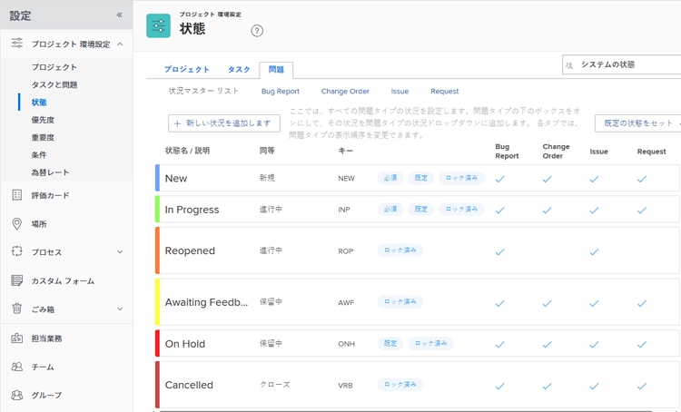

# システムの問題ステータスのリストへのアクセス

イシューのステータスを使用して、特定の時点でのイシューの開発段階で、システム内のユーザーを表示できます。

## アクセス要件

この記事の手順を実行するには、次のアクセス権が必要です。

<table style="table-layout:auto"> 
 <col> 
 <col> 
 <tbody> 
  <tr> 
   <td role="rowheader">Adobe Workfrontプラン</td> 
   <td>任意</td> 
  </tr> 
  <tr> 
   <td role="rowheader">Adobe Workfrontライセンス</td> 
   <td>計画</td> 
  </tr> 
  <tr> 
   <td role="rowheader">アクセスレベル設定</td> 
   <td> 
Workfront管理者である。
 
<b>注意</b>:まだアクセス権がない場合は、Workfront管理者に、アクセスレベルに追加の制限を設定しているかどうかを問い合わせてください。 Workfront管理者がアクセスレベルを変更する方法について詳しくは、 <a href="../../../administration-and-setup/add-users/configure-and-grant-access/create-modify-access-levels.md" class="MCXref xref">カスタムアクセスレベルの作成または変更</a>.
 </td> 
  </tr> 
 </tbody> 
</table>

## 問題ステータスへのアクセス

システムレベルの問題ステータスにアクセスして変更できます。 デフォルトのシステムステータスに関する情報を編集したり、新しいカスタムステータスを作成したりできます。 カスタムステータスの作成やシステムステータスの編集について詳しくは、 [ステータスの作成または編集](../../../administration-and-setup/customize-workfront/creating-custom-status-and-priority-labels/create-or-edit-a-status.md).

システムレベルの問題ステータスにアクセスするには：

1. 次をクリック： **メインメニュー** アイコン  Adobe Workfrontの右上隅で、 **設定** .

1. クリック **プロジェクト環境設定** > **ステータス**.

1. 次をクリック： **問題** タブをクリックして、Workfrontで使用可能な問題のステータスを確認します。

   

## システムの問題ステータス

Workfrontには、10 件の元の問題ステータスが用意されています。 以下の表の最初の 4 つは必須です。つまり、ロックの解除、名前の変更、並べ替えは可能ですが、非表示や削除はできません。

組織のニーズに合わせて、カスタムの問題ステータスを追加できます。 詳しくは、 [ステータスの作成または編集](../../../administration-and-setup/customize-workfront/creating-custom-status-and-priority-labels/create-or-edit-a-status.md).

ユーザーの場合、問題のステータスの変更は通常、手動のプロセスです。 ただし、システムで発生している他の要因に応じて、問題のステータスが自動的に変化する場合は、次のリストで概要を説明します。

Workfrontインスタンスには、次の問題ステータスが表示されます。

<table style="table-layout:auto"> 
 <col> 
 <col> 
 <col> 
 <thead> 
  <tr> 
   <th>システムの問題ステータス</th> 
   <th>ステータスの使用方法</th> 
   <th>ステータスでの処理</th> 
  </tr> 
 </thead> 
 <tbody> 
  <tr> 
   <td>新規（必須ステータス）</td> 
   <td>これは、新しく作成されたすべてのイシューのデフォルトのステータスです。</td> 
   <td>問題がプロジェクトのステータスが「現在」の場合、問題に割り当てられているユーザーの「作業要求」タブに問題が表示されます。 これで、問題の作業を開始できます。</td> 
  </tr> 
  <tr> 
   <td>処理中（必須ステータス）</td> 
   <td> 
このステータスで問題を配置して、その問題に関する作業が開始されたことを示すことができます。
 
問題の解決が別のオブジェクト（タスク、プロジェクト、または別の問題）に関連付けられている場合、解決オブジェクトのステータスを [ 進行中 ] に変更すると、問題のステータスが自動的に [ 進行中 ] に変わります。 
 
オブジェクトの解決の詳細については、 <a href="../../../manage-work/issues/convert-issues/resolving-and-resolvable-objects.md" class="MCXref xref">オブジェクトの解決と解決の概要 </a>.
 </td> 
   <td> 
問題が「現在」のステータスのプロジェクトにある場合、その問題は、その問題に割り当てられているユーザーの「作業中」タブに表示されます。
 
問題が進行中の場合、問題の「実際の開始日」に値が表示されます。
 
 
 </td> 
  </tr> 
  <tr> 
   <td>クローズ済み（必須ステータス）</td> 
   <td> 
イシューの作業が完了したら、手動でイシューを「クローズ済み」に設定することができます。 
 
問題の解決が別のオブジェクト（タスク、プロジェクト、または別の問題）に関連付けられている場合、解決オブジェクトのステータスを [ クローズ済 ] に変更すると、問題のステータスが自動的に [ クローズ済 ] に変わります。
 
オブジェクトの解決の詳細については、 <a href="../../../manage-work/issues/convert-issues/resolving-and-resolvable-objects.md" class="MCXref xref">オブジェクトの解決と解決の概要 </a>.
 </td> 
   <td> 
イシューが「クローズ済み」になると、そのイシューは担当者の作業リストから削除されます。 この場合、問題には「実際の完了日」の値が表示されます。 
 
すべてのタスクが完了し、プロジェクトでイシューが閉じられると、プロジェクトを完了できます。
 </td> 
  </tr> 
  <tr> 
   <td>保留中（必須ステータス）</td> 
   <td> 
問題の完了に遅れが生じたことを示すために、手動で問題を保留中としてマークすることができます。 
 </td> 
   <td> 
問題が「現在」のステータスのプロジェクトにある場合、その問題は、その問題に割り当てられているユーザーの「作業中」タブに表示されます。 
 
プロジェクトですべてのタスクが完了したが、プロジェクトに保留中の問題が 1 つ以上ある場合、プロジェクトは完了できません。 
 </td> 
  </tr> 
  <tr> 
   <td>再開済み (Equates with In Progress)</td> 
   <td> 
このステータスで問題を配置して、問題が以前に閉じられたときに、その問題に関する作業が完全に完了していなかったことを示し、作業を完了するために再度開く必要があったことを示すことができます。
 </td> 
   <td> 
問題がプロジェクトのステータスが「現在」の場合、問題に割り当てられているユーザーの「作業要求」タブに問題が表示されます。 これで、問題の作業を開始できます。
 
このステータスは、レポートで最初に開いた問題（通常は「新規」ステータス）と、以前に閉じた後に開いた問題（通常「再開」ステータス）を区別するために重要です。 
 </td> 
  </tr> 
  <tr> 
   <td>フィードバック待ち（保留中と同じ）</td> 
   <td>このステータスで問題を表示して、問題に取り組む前に ( 通常はプライマリの連絡先から ) フィードバックを受け取るのを待っていることを示すことができます。 </td> 
   <td> 
問題が「現在」のステータスのプロジェクトにある場合、その問題は、その問題に割り当てられているユーザーの「作業中」タブに表示されます。
 
問題が「フィードバック待ち」の場合は、プロジェクトを完了できません。
 
このステータスは、レポートで重要です。現在開いているが処理中の問題（通常は「処理中」ステータス）と、完了するためにより多くのフィードバックが必要なために現在開いているが処理中でない問題（通常は「フィードバック待ち」ステータス）を区別します。
 </td> 
  </tr> 
  <tr> 
   <td>複製できません（クローズ済みと等しい）</td> 
   <td>このステータスに問題を配置して、問題を解決しようとしているが、問題を開くトリガーの問題が見つからなかった場合があります。 問題はまだ存在する可能性がありますが、特定の時点では再現できません。 </td> 
   <td> 
このステータスは、レポートで重要です。このステータスは、完了した問題と解決された問題（通常は「クローズ」ステータス）、および特定の時点で問題が表示されない問題（通常「複製できません」ステータス）を区別するために使用します。
 
イシューが「複製できません」とマークされると、そのイシューは担当者の作業リストから削除されます。 この場合、問題は実際の完了日の値を表示します。
 
プロジェクトのすべてのタスクが完了し、一部の問題のステータスが「複製できません」の場合は、プロジェクトを完了できます。
 </td> 
  </tr> 
  <tr> 
   <td>解決済み（クローズ済みと等しい）</td> 
   <td>このステータスに問題を配置して、問題を閉じようとしていて、その問題を作成した問題が実際に解決されたことを示すことができます。</td> 
   <td> 
このステータスは、レポートで重要です。このステータスは、解決の有無に関わらず（通常は「クローズ済み」ステータスで）クローズされた問題と、実際の解決のために（通常は「解決済み」ステータスで）クローズされた問題を区別するために使用します。
 
問題が「解決済み」とマークされると、その問題は担当者の作業リストから削除されます。 この場合、問題には「実際の完了日」の値が表示されます。
 
プロジェクト上のすべてのタスクが完了し、少なくとも 1 つの問題が「解決済み」ステータスの場合は、プロジェクトを完了できます。 
 </td> 
  </tr> 
  <tr> 
   <td>検証済み完了（クローズ済みと等しい）</td> 
   <td>このステータスに問題を配置して、問題を閉じようとしていること、および問題を生成した問題が解決されたことを確認したことを示すことができます。</td> 
   <td> 
問題が「検証済みの完了」とマークされると、その問題は担当者の作業リストから削除されます。 この場合、問題には「実際の完了日」の値が表示されます。
 
プロジェクト上のすべてのタスクが完了し、問題の一部が検証済みステータスの場合は、プロジェクトを完了できます。
 </td> 
  </tr> 
  <tr> 
   <td>解決しません（クローズ済みと等しい）</td> 
   <td>このステータスに問題を配置して、問題を閉じようとしているが、その問題を生み出した問題は解決できないことを示すことができます。</td> 
   <td> 
このステータスは、レポートで重要です。解決の有無に関わらず（通常は「クローズ済み」ステータスで）クローズされた問題と、実際の解決のない（通常は「解決しません」ステータスで）クローズされた問題を区別するために使用します。
 
問題が「解決しません」とマークされると、その問題は担当者の作業リストから削除されます。 この場合、問題には「実際の完了日」の値が表示されます。
 
プロジェクトのすべてのタスクが完了し、少なくとも 1 つの問題が [ 解決しない ] ステータスにある場合は、プロジェクトを完了できます。
 </td> 
  </tr> 
 </tbody> 
</table>

## 問題ステータスのカスタマイズ

Workfrontの管理者は、システムレベルおよびグループレベルの問題ステータスをWorkfrontに追加し、ユーザーに表示する順序を変更できます。 詳しくは、 [ステータスの作成または編集](../../../administration-and-setup/customize-workfront/creating-custom-status-and-priority-labels/create-or-edit-a-status.md).

グループ管理者は、1 つのグループに固有のカスタムステータスを追加できます。 詳しくは、 [グループのステータスの作成または編集](../../../administration-and-setup/manage-groups/manage-group-statuses/create-or-edit-a-group-status.md).
