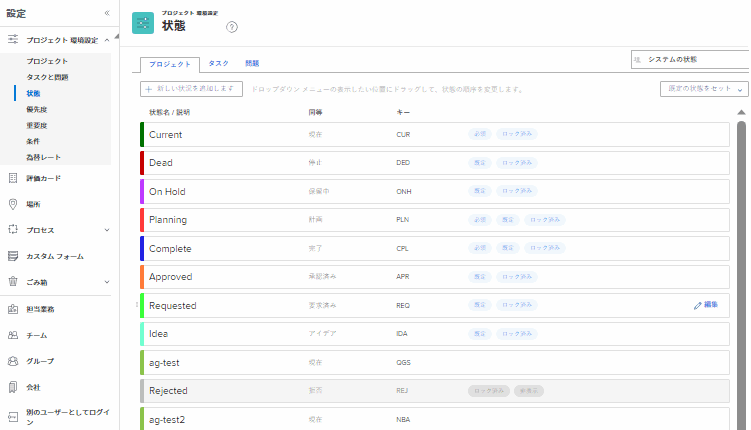

# システムプロジェクトステータスのリストへのアクセス

ユーザーは、プロジェクトのステータスを指定して、他のユーザーが特定の時点でプロジェクトの現在の開発ステージを表示できるようにします。

Workfrontには、9 つのシステムプロジェクトステータスが用意されています。 これらのステータスの名前は変更できますが、削除することはできません。

また、組織のニーズに合わせて、カスタムプロジェクトステータスを追加することもできます。

Workfront管理者は、システム内のすべての新規プロジェクトのデフォルトステータスを設定します。 手順については、 [システム全体のプロジェクト環境設定の指定](../../../administration-and-setup/set-up-workfront/configure-system-defaults/set-project-preferences.md).

## アクセス要件

この記事の手順を実行するには、次のアクセス権が必要です。

<table style="table-layout:auto"> 
 <col> 
 <col> 
 <tbody> 
  <tr> 
   <td role="rowheader">Adobe Workfrontプラン</td> 
   <td>任意</td> 
  </tr> 
  <tr> 
   <td role="rowheader">Adobe Workfrontライセンス</td> 
   <td>計画</td> 
  </tr> 
  <tr> 
   <td role="rowheader">アクセスレベル設定</td> 
   <td> 
Workfront管理者である。
 
<b>注意</b>:まだアクセス権がない場合は、Workfront管理者に、アクセスレベルに追加の制限を設定しているかどうかを問い合わせてください。 Workfront管理者がアクセスレベルを変更する方法について詳しくは、 <a href="../../../administration-and-setup/add-users/configure-and-grant-access/create-modify-access-levels.md" class="MCXref xref">カスタムアクセスレベルの作成または変更</a>.
 </td> 
  </tr> 
 </tbody> 
</table>

## プロジェクトのステータスへのアクセス

Workfront管理者は、システムレベルのプロジェクトステータスのリストにアクセスできます。

システムステータスの編集とカスタムステータスの作成について詳しくは、 [ステータスの作成または編集](../../../administration-and-setup/customize-workfront/creating-custom-status-and-priority-labels/create-or-edit-a-status.md).

1. 次をクリック： **メインメニュー** アイコン  Adobe Workfrontの右上隅で、 **設定** .

1. クリック **プロジェクト環境設定** > **ステータス**.

1. 次をクリック： **プロジェクト** タブをクリックします。

   Workfrontで使用できるプロジェクトステータスがこのタブに表示されます。

   

   組み込みの各システムプロジェクトのステータスについて詳しくは、 [システムプロジェクトのステータス](../../../administration-and-setup/customize-workfront/creating-custom-status-and-priority-labels/system-project-statuses.md).

## カスタムプロジェクトステータスの作成とシステムステータスのカスタマイズ

Workfront管理者は、システムプロジェクトのステータスをWorkfrontに追加できます。 グループの所有者は、1 つのグループに固有のカスタムステータスを追加できます。 カスタムステータスの作成やシステムステータスの編集について詳しくは、 [ステータスの作成または編集](../../../administration-and-setup/customize-workfront/creating-custom-status-and-priority-labels/create-or-edit-a-status.md).

カスタムプロジェクトステータスを作成する場合は、新しいステータスを既存のシステムステータスと同じにする必要があります。 カスタムのステータスとを同等にするのに適したステータスを知るには、システムのステータスの動作を理解する必要があります。 「等しい」ステータスを選択した後は、この選択を変更できません。 システムプロジェクトのステータスの詳細については、 [システムプロジェクトのステータス](../../../administration-and-setup/customize-workfront/creating-custom-status-and-priority-labels/system-project-statuses.md).
