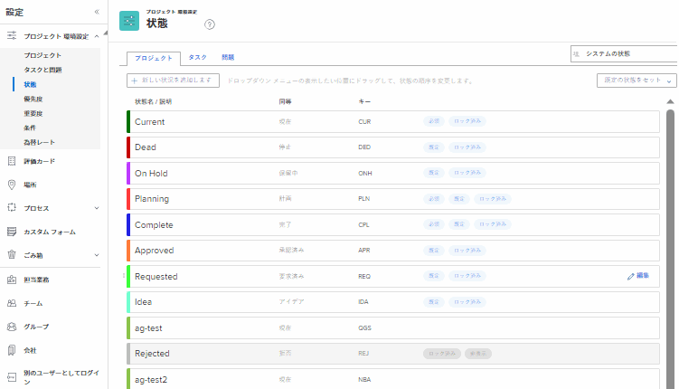

# システムプロジェクトステータスのリストへのアクセス

ユーザーはプロジェクトのステータスを指定して、他のユーザーが特定の時点でのプロジェクトの現在の開発ステージを表示できるようにします。

Workfront には、9 つのシステムプロジェクトステータスがあります。 これらのステータスの名前は変更できますが、削除はできません。

また、組織のニーズに合わせて、カスタムプロジェクトステータスを追加することもできます。

Workfront 管理者が、システム内のすべての新規プロジェクトのデフォルトステータスを設定します。 手順については、[システム全体のプロジェクト環境設定を指定](../../../administration-and-setup/set-up-workfront/configure-system-defaults/set-project-preferences.md)を参照してください。

## アクセス要件

+++ 展開すると、この記事の機能のアクセス要件が表示されます。

<table style="table-layout:auto"> 
 <col> 
 <col> 
 <tbody> 
  <tr> 
   <td>Adobe Workfront パッケージ</td> 
   <td>
任意
</td> 
  </tr> 
  <tr> 
   <td>Adobe Workfront プラン</td> 
   <td>
標準

       
プラン
</td>
  </tr> 
  <tr> 
   <td>アクセスレベル設定</td> 
   <td>システム管理者</td> 
  </tr> 
 </tbody> 
</table>

詳しくは、[Workfront ドキュメントのアクセス要件](/help/quicksilver/administration-and-setup/add-users/access-levels-and-object-permissions/access-level-requirements-in-documentation.md)を参照してください。

+++

## プロジェクトのステータスへのアクセス

Workfront 管理者は、システムレベルのプロジェクトステータスのリストにアクセスできます。

システムステータスの編集とカスタムステータスの作成について詳しくは、[ステータスを作成または編集](../../../administration-and-setup/customize-workfront/creating-custom-status-and-priority-labels/create-or-edit-a-status.md)を参照してください。

{{step-1-to-setup}}

1. **プロジェクト環境設定**／**ステータス**&#x200B;をクリックします。

1. 「**プロジェクト**」タブをクリックします。

   Workfront で使用できるプロジェクトステータスがこのタブに表示されます。

   

   ビルトインの各システムプロジェクトステータスについて詳しくは、[システムプロジェクトステータスの概要](../../../administration-and-setup/customize-workfront/creating-custom-status-and-priority-labels/system-project-statuses.md)を参照してください。

## カスタムプロジェクトステータスを作成およびシステムステータスをカスタマイズ

Workfront 管理者は、システムプロジェクトのステータスを Workfront に追加できます。 グループの所有者は、1 つのグループに固有のカスタムステータスを追加できます。 カスタムステータスの作成やシステムステータスの編集について詳しくは、[ステータスを作成または編集](../../../administration-and-setup/customize-workfront/creating-custom-status-and-priority-labels/create-or-edit-a-status.md)を参照してください。

カスタムプロジェクトステータスを作成する場合は、常に新規ステータスを既存のシステムステータスと同じにする必要があります。 カスタムステータスをどのステータスとみなすのが適切かを知るには、システムステータスの動作を理解する必要があります。 同じステータスを選択した後は、この選択を変更することはできません。 システムプロジェクトステータスについて詳しくは、[システムプロジェクトステータスの概要](../../../administration-and-setup/customize-workfront/creating-custom-status-and-priority-labels/system-project-statuses.md)を参照してください。
