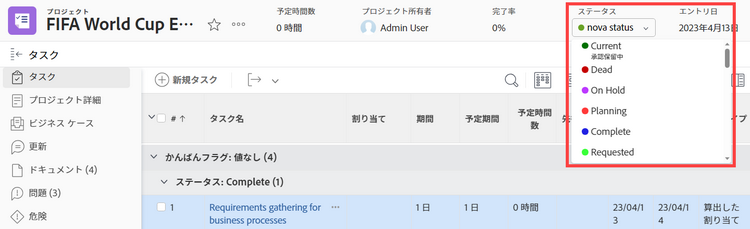
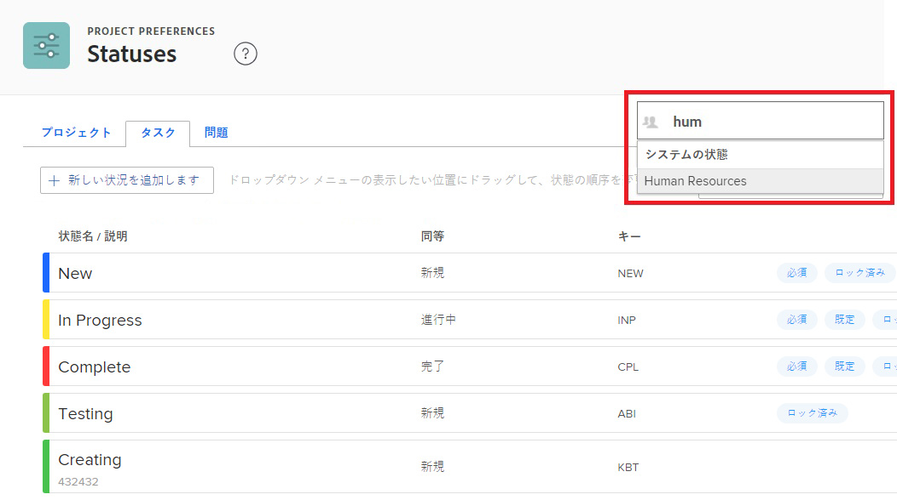
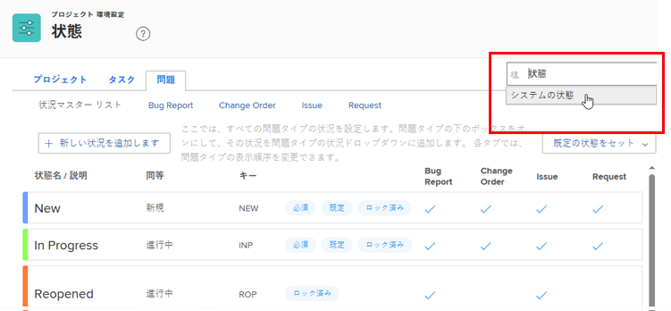

# システムレベルとグループのステータスの並べ替え

Workfront 管理者は、システム内の全員または 1 つのグループの全員に対して、プロジェクト、タスクおよびイシューのステータスの順序を変更できます。

<!--The system version of this snippet mentions a single group because a sysadmin call also reorder statuses there. Group admin version of this article is still needed.-->

>[!NOTE]
>
>* システムレベルでステータスを並べ替えても、グループ内のステータスの順序には影響しません。
>
>  ただし、新しく作成されたトップレベルグループ内のステータスは、システムレベルのステータスの順序を継承します。（新しいサブグループは、1 レベル上のグループ内のステータスの順序を継承します）。
>
>* ロックされたステータスは並べ替えることができます。ロックされたステータスについて詳しくは、[ステータスの作成または編集](../../../administration-and-setup/customize-workfront/creating-custom-status-and-priority-labels/create-or-edit-a-status.md)を参照してください。
>* グループ管理者は、グループで使用されるステータスを並べ替えることもできます。詳しくは、[グループステータスの並べ替え](../../../administration-and-setup/manage-groups/manage-group-statuses/reorder-group-statuses-from-groups-area.md)を参照してください。
>

## アクセス要件

この記事の手順を実行するには、以下を保有している必要があります。

<table style="table-layout:auto"> 
 <col> 
 <col> 
 <tbody> 
  <tr> 
   <td role="rowheader">Adobe Workfront プラン* </td> 
   <td>任意</td> 
  </tr> 
  <tr data-mc-conditions="SnippetConditions-wf-groups.system-level"> 
   <td role="rowheader">Adobe Workfront ライセンス*</td> 
   <td> 
プラン 
 
Workfront 管理者である必要があります。Workfront 管理者について詳しくは、<a href="../../../administration-and-setup/add-users/configure-and-grant-access/grant-a-user-full-administrative-access.md" class="MCXref xref">ユーザーへの完全な管理アクセス権の付与</a>を参照してください。
 </td> 
  </tr> 
 </tbody> 
</table>

&#42;保有するプランまたはライセンスの種類を確認する必要がある場合は、Workfront 管理者にお問い合わせください。

## デフォルトのステータス順序

デフォルトでは、ステータスは次の順序で表示されます。

<table style="table-layout:auto"> 
 <col> 
 <col> 
 <col> 
 <thead> 
  <tr> 
   <th width="33.33%">プロジェクト</th> 
   <th width="33.33%">タスク</th> 
   <th width="33.33%">イシュー</th> 
  </tr> 
 </thead> 
 <tbody> 
  <tr> 
   <td> 
    <ul> 
     <li>現在</li> 
     <li>停止</li> 
     <li> 保留中 </li> 
     <li> プラン </li> 
     <li> 完了 </li> 
     <li> リクエスト日 </li> 
     <li> 承認済み </li> 
     <li> 却下 </li> 
     <li> アイデア </li> 
    </ul> </td> 
   <td> 
    <ul> 
     <li>新規</li> 
     <li>処理中</li> 
     <li>完了</li> 
    </ul> </td> 
   <td> 
    <ul> 
     <li>新規</li> 
     <li>処理中</li> 
     <li>再オープン</li> 
     <li>フィードバック待ち</li> 
     <li>保留中</li> 
     <li>複製不可</li> 
     <li>クローズ</li> 
     <li>解決済み</li> 
     <li>完了確認</li> 
     <li>解決されない</li> 
    </ul> </td> 
  </tr> 
 </tbody> 
</table>

## タスクやプロジェクトのステータスをシステム全体またはグループ全体で並べ替える

1. Adobe Workfront の右上隅にある&#x200B;**メインメニュー**&#x200B;アイコン  をクリックして、**設定**  をクリックします。

1. 左側のパネルで、**プロジェクト環境設定／ステータス**&#x200B;をクリックします。
1. （条件付き）グループのステータスを並べ替える場合は、右上隅のボックスにグループの名前を入力し、表示される名前をクリックします。

   

1. 表示されるステータスリストの上にある、「**プロジェクト**」または「**タスク**」タブをクリックします。

1. ステータスを目的の順序でドラッグ＆ドロップします。

   新しいステータスの順序は自動的に保存されます。

1. 新しいステータスの順序をテストするには、タスクまたはプロジェクトに移動し、右上隅にあるステータスをクリックして、表示されるステータスが設定した順序になっていることを確認します。

## イシューのステータスを並べ替える

1. Adobe Workfront の右上隅にある&#x200B;**メインメニュー** アイコン  をクリックして、「**設定**」 をクリックします。

1. **プロジェクト環境設定／ステータス**&#x200B;をクリックします。
1. （条件付き）グループのステータスを並べ替える場合は、右上隅のボックスにグループの名前を入力し、表示される名前をクリックします。

   

1. 「**イシュー**」タブをクリックします。
1. （オプション）イシュータイプ（**バグレポート**、**変更依頼**、**イシュー**&#x200B;または **リクエスト**）を選択します。

   >[!NOTE]
   >
   >* メインリストのステータスの順序はカスタマイズできません。
   >* 各イシュータイプについては、同じ方法でステータスの順序を指定することをお勧めします。イシュータイプについて詳しくは、[リクエストタイプの設定](../../../administration-and-setup/set-up-workfront/configure-system-defaults/configure-request-types.md)を参照してください。

1. ステータスを目的の順序でドラッグ＆ドロップします。

   新しいステータスの順序は自動的に保存されます。

1. 新しいステータスの順序をテストするには、イシューに移動し、右上隅のステータスをクリックして、表示されるステータスが設定した順序になっていることを確認します。
