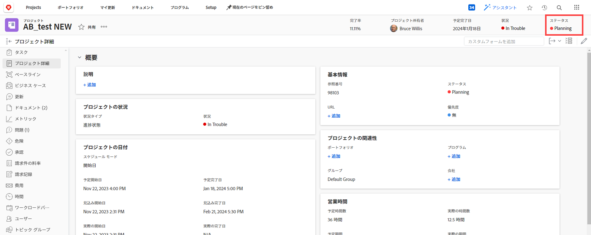

# ステータスの概要

プロジェクト、タスク、またはイシューの現在の開発状態を調べるには、ユーザーがそのステータスを表示します。

たとえば、このプロジェクトでは、[ 計画 ] ステータスは、プロジェクトの管理者が現在、タイムライン、タスクの割り当て、承認など、プロジェクトの側面を計画していることを示します。

通常、プロジェクト、タスク、またはイシューのステータスの変更は手動で行います。 ただし、システムで発生している他の要因に応じて、問題のステータスが自動的に変更される場合があります。

Workfrontには、9 つのプロジェクトステータス、3 つのタスクステータス、10 件のタスクステータスがあります。 これらの詳細については、次の記事を参照してください。

* [システムプロジェクトステータスのリストへのアクセス](../../../administration-and-setup/customize-workfront/creating-custom-status-and-priority-labels/project-statuses.md)
* [システムタスクステータスのリストへのアクセス](../../../administration-and-setup/customize-workfront/creating-custom-status-and-priority-labels/task-statuses.md)
* [システムの問題ステータスのリストへのアクセス](../../../administration-and-setup/customize-workfront/creating-custom-status-and-priority-labels/issue-statuses.md).

## カスタムステータス

Workfront管理者は、Workfrontに付属するデフォルトのステータスに加えて、カスタムプロジェクト、タスクおよび問題のステータスを組織のニーズに合わせて追加できます。 Workfrontインスタンスの全員が使用するシステムレベルのステータスや、特定のグループのみが使用するグループレベルのステータスを作成できます。 詳しくは、 [ステータスの作成または編集](../../../administration-and-setup/customize-workfront/creating-custom-status-and-priority-labels/create-or-edit-a-status.md).

## グループのステータス

グループ管理者は、グループのニーズに合わせて、グループレベルのカスタムステータスを作成できます。 詳しくは、 [グループステータスの管理](../../../administration-and-setup/manage-groups/manage-group-statuses/manage-group-statuses.md).
