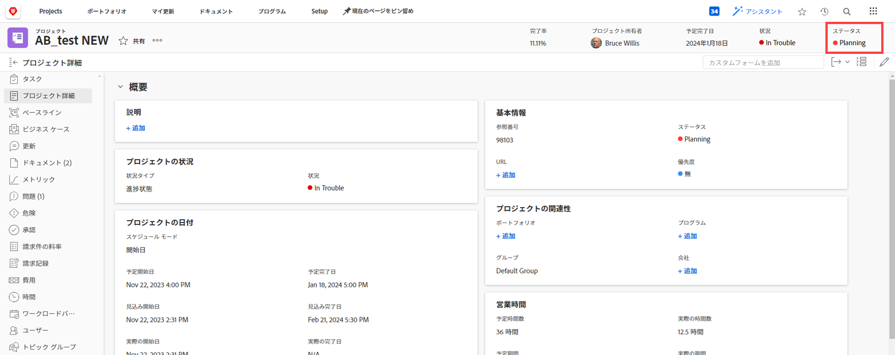

# ステータスの概要

<!-- Audited: 01/2024 -->

プロジェクト、タスクまたはイシューの現在の開発状況を確認するために、ユーザーはそのステータスを表示することができます。

例えば、このプロジェクトでは、「計画」ステータスは、プロジェクトマネージャーが現在、タイムライン、タスクの割り当て、承認などのプロジェクトの要素を計画中であることを示しています。

ステータスを表示するには、プロジェクト、タスク、イシューに対する次のアクセス権と権限が必要です。

* プロジェクト、タスク、イシューへのアクセスレベルでの表示または上位のアクセス
* オブジェクトに対する表示権限またはそれ以上の権限

ステータスを手動で変更するには、プロジェクト、タスク、イシューに対する次のアクセス権と権限が必要です。

* プロジェクト、タスク、イシューへのアクセスレベルでのアクセスの編集
* タスクまたは問題に対する権限の貢献度を上げます
* プロジェクトに対する権限を管理します。

プロジェクト、タスクまたはイシューのステータスの変更は通常、手動で行います。 ただし、システム内で発生する他の要因によっては、イシューのステータスが自動的に変更される場合があります。

Adobe Workfront には、9 つのプロジェクトのステータス、3 つのタスクスのステータスおよび 10 個のイシューのステータスがあらかじめ用意されています。 これらについて詳しくは、次の記事を参照してください。

* [システムプロジェクトステータスのリストへのアクセス](../../../administration-and-setup/customize-workfront/creating-custom-status-and-priority-labels/project-statuses.md)
* [システムタスクステータスのリストにアクセス](../../../administration-and-setup/customize-workfront/creating-custom-status-and-priority-labels/task-statuses.md)
* [システムのイシューステータスのリストへのアクセス](../../../administration-and-setup/customize-workfront/creating-custom-status-and-priority-labels/issue-statuses.md)

## カスタムステータス

Workfront 管理者は組織のニーズに合わせて、Workfront にあらかじめ用意されているデフォルトのステータスに加えて、カスタムのプロジェクト、タスクおよびイシューのステータスを追加できます。 Workfront インスタンス内のすべてのユーザーが使用するシステムレベルのステータスや、特定のグループのみが使用するグループレベルのステータスを作成することができます。 詳しくは、[ステータスの作成または編集](../../../administration-and-setup/customize-workfront/creating-custom-status-and-priority-labels/create-or-edit-a-status.md)を参照してください。

## グループステータス

グループ管理者は、グループのニーズに合わせて、グループレベルのカスタムステータスを作成できます。 詳しくは、[グループステータスの管理](../../../administration-and-setup/manage-groups/manage-group-statuses/manage-group-statuses.md)を参照してください。
