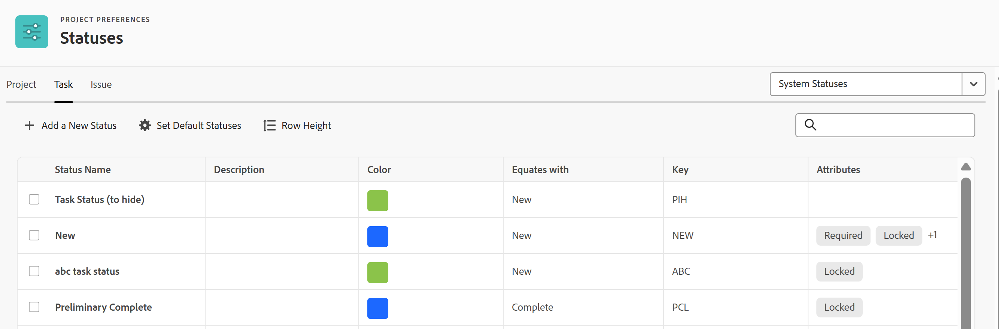

# システムタスクステータスのリストへのアクセス

タスクのステータスを使用して、タスクが特定の時点で開発のどのステージにあるかユーザーに示すことができます。

## アクセス要件

+++ 展開すると、この記事の機能のアクセス要件が表示されます。

<table style="table-layout:auto"> 
 <col> 
 <col> 
 <tbody> 
  <tr> 
   <td>Adobe Workfront パッケージ</td> 
   <td>
任意
</td> 
  </tr> 
  <tr> 
   <td>Adobe Workfront プラン</td> 
   <td>
標準

       
プラン
</td>
  </tr> 
  <tr> 
   <td>アクセスレベル設定</td> 
   <td>システム管理者</td> 
  </tr> 
 </tbody> 
</table>

詳しくは、[Workfront ドキュメントのアクセス要件](/help/quicksilver/administration-and-setup/add-users/access-levels-and-object-permissions/access-level-requirements-in-documentation.md)を参照してください。

+++

## タスクステータスへのアクセス

システムステータスの編集または新しいカスタムステータスの作成について詳しくは、[ステータスの作成または編集](../../../administration-and-setup/customize-workfront/creating-custom-status-and-priority-labels/create-or-edit-a-status.md)を参照してください。

{{step-1-to-setup}}

1. **プロジェクトの環境設定**／**ステータス**&#x200B;をクリックします。

1. 「**タスク**」タブをクリックします。

   Workfront で使用できるタスクステータスがこのタブに表示されます。

   

   ビルトインの各システムタスクステータスについて詳しくは、[システムタスクステータス](../../../administration-and-setup/customize-workfront/creating-custom-status-and-priority-labels/system-task-statuses.md)を参照してください。

## カスタムタスクステータスの作成について

Workfront 管理者は、カスタムのシステムタスクステータスを Workfront に追加できます。

グループの所有者は、グループにカスタムタスクステータスを追加できます。

カスタムタスクステータスを作成する場合は、新しいステータスと既存のシステムのステータスを同じにする必要があります。 カスタムステータスをどのステータスとみなすのが適切かを知るには、システムステータスの動作を理解する必要があります。 同じステータスを選択した後は変更できません。

カスタムステータスの作成、システムステータスの編集、タスクの新しいデフォルトステータスの選択について詳しくは、[ステータスの作成または編集](../../../administration-and-setup/customize-workfront/creating-custom-status-and-priority-labels/create-or-edit-a-status.md)を参照してください。
