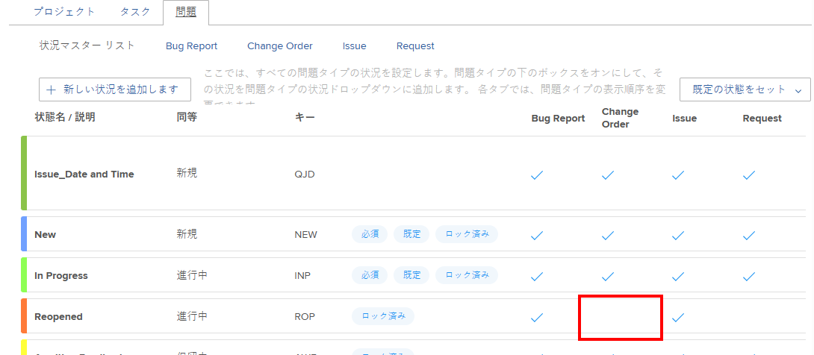

# カスタムステータスをデフォルトのステータスとして使用

カスタムステータスがデフォルトステータスとして設定されている場合、新しいデフォルトステータスは、様々な方法でシステム全体で使用されます。使用方法は、デフォルトのシステムレベルのステータスとして設定されているか、デフォルトのグループレベルのステータスとして設定されているかによって異なります。

## アクセス要件

この記事の手順を実行するには、次のアクセス権が必要です。

<table style="table-layout:auto"> 
 <col> 
 <col> 
 <tbody> 
  <tr> 
   <td role="rowheader">Adobe Workfront プラン</td> 
   <td>任意</td> 
  </tr> 
  <tr> 
   <td role="rowheader">Adobe Workfront ライセンス</td> 
   <td>プラン</td> 
  </tr> 
  <tr> 
   <td role="rowheader">アクセスレベル設定</td> 
   <td> 
Workfront 管理者である必要があります。
 
<b>メモ</b>：まだアクセス権がない場合は、Workfront 管理者に問い合わせて、アクセスレベルに追加の制限が設定されているかどうかを確認してください。Workfront 管理者がアクセスレベルを変更する方法について詳しくは、<a href="../../../administration-and-setup/add-users/configure-and-grant-access/create-modify-access-levels.md" class="MCXref xref">カスタムアクセスレベルの作成または変更</a>を参照してください。
 </td> 
  </tr> 
 </tbody> 
</table>

## カスタムのデフォルトシステムレベルステータス

カスタムステータスをデフォルトのシステムステータスとして設定すると、システムで作成された新しいグループはカスタムステータスを継承します。

新しいデフォルトのシステムステータスを設定したときに既に存在していたグループは、カスタムステータスを自動的には継承しません。

例えば、Adobe Workfront 環境に既に 2 つのグループ（マーケティングと販売）が作成済みだとします。デフォルトの「現在」に相当する新しいカスタムステータスを作成し、「処理中」という名前を付けます。ここで、「エンジニアリング」という名前の新しいグループを作成します。このシナリオでは、エンジニアリンググループは新しいデフォルトのステータスを継承します。マーケティンググループと販売グループは継承しません。

## カスタムのデフォルトグループレベルステータス

デフォルトのグループステータスとして設定したカスタムステータスは、次の状況で使用されます。

* **Workfront システムが自動的にステータスを選択する場合は、デフォルトのグループステータスが使用されます。** Workfront システムが自動的にオブジェクトにステータスを割り当てる場合、デフォルトのグループステータスとして設定したカスタムステータスが使用されます。

  例えば、完了率が 100％ に達すると、タスクは自動的に「完了」ステータスに変わるように設定できます。「完了」に相当するカスタムステータスを作成し、そのカスタムステータスをデフォルトのステータスとして設定した場合、Workfront はタスクのステータスを新しいデフォルトのステータスに変更します。

  カスタムステータスは、このように、タスクまたはイシューに関連付けられたグループステータスでのみ使用されます。プロジェクトに関連付けられたステータスにカスタムステータスを使用することはできません。

* **プロジェクトのステータスは、プロジェクトに関連付けられたグループによって決まります**。特定のプロジェクトに関連付けられているグループが変更された場合、プロジェクトのステータスは、そのグループに定義されているデフォルトのステータスに応じて変わります。（グループは、プロジェクトの編集時に「グループ」フィールドを使用してプロジェクトに関連付けることができます。）

  そのグループが変更されると、新しいグループにプロジェクトの現在のステータスと同等の別のデフォルトステータスが定義されていれば、プロジェクトのステータスも変わります。

  例えば、プロジェクトがマーケティンググループに関連付けられ、プロジェクトのステータスが計画に設定されているとします。プロジェクトが編集され、販売グループに関連付けられます。販売グループには、「検討」と呼ばれるカスタムのデフォルトグループステータスがあります（このステータスは計画と同等です）。プロジェクト上のグループが変更されたため、プロジェクトのステータスが「検討」に変わります。

グループ管理者の場合は、[カスタムステータスをグループのデフォルトのステータスとして設定](/help/quicksilver/administration-and-setup/manage-groups/manage-group-statuses/use-custom-statuses-as-default-statuses-group.md)を参照してください。

## イシューのステータス

カスタムステータスが「イシュー」ステータスの場合は、4 つのイシュータイプ（バグレポート、変更依頼、イシュー、リクエスト）をすべて有効にする必要があります。例えば、以下に示すイシューステータスでは、「再オープン」には変更依頼のイシュータイプが選択されていないので、デフォルトのステータスとして使用することはきません。

## カスタムステータスをデフォルトのステータスとして設定

1. Adobe Workfront の右上隅にある&#x200B;**メインメニュー**&#x200B;アイコン 、**設定**  の順にクリックします。
1. 左側のパネルで、**プロジェクト環境設定**／**ステータス**&#x200B;をクリックします。
1. （条件付き）グループにデフォルトのステータスを設定する場合は、右上隅のメニューにグループの名前を入力し、表示されたら選択します。
1. デフォルトのステータスとして設定するステータスのタイプに応じて、「**プロジェクト**」、「**タスク**」、または「**イシュー**」タブを開きます。
1. **デフォルトのステータスを設定**&#x200B;ドロップダウンメニューをクリックします。
1. 表示されるドロップダウンエリア（デフォルトのステータスを設定するステータスの横）で、デフォルトのステータスを選択します。
1. 「**保存**」をクリックします。
1. プロジェクトを、ステータスが存在するグループに関連付けます。

   >[!NOTE]
   >
   >グループのカスタムステータスを設定している場合、後でプロジェクトを別のグループに割り当てると、プロジェクトのステータスがリロードみされ、変更される可能性があります。

   1. カスタムステータスを使用するプロジェクトに移動します。
   1. その他メニュー  をクリックして、「**編集**」をクリックします。
   1. 表示される「**プロジェクトを編集**」ボックスの、「**プロジェクトの関連付け**」の「**グループ**」フィールドで、ステータスが存在するグループを選択します。
   1. 「**変更を保存**」をクリックします。
