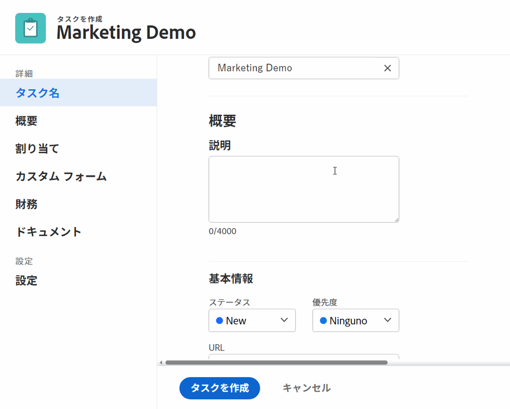
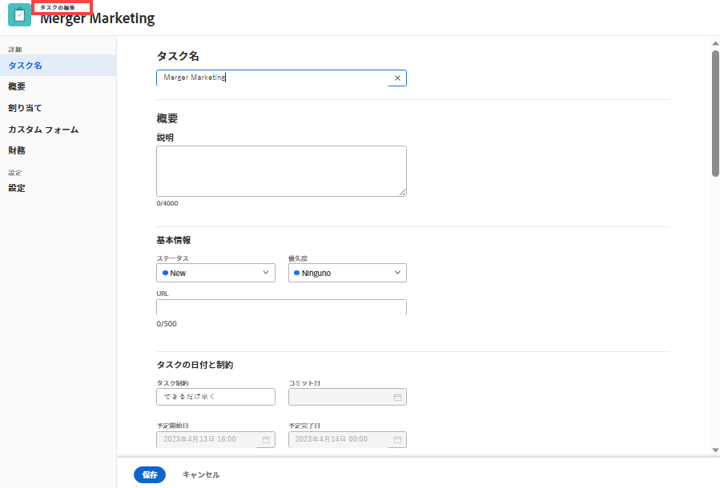
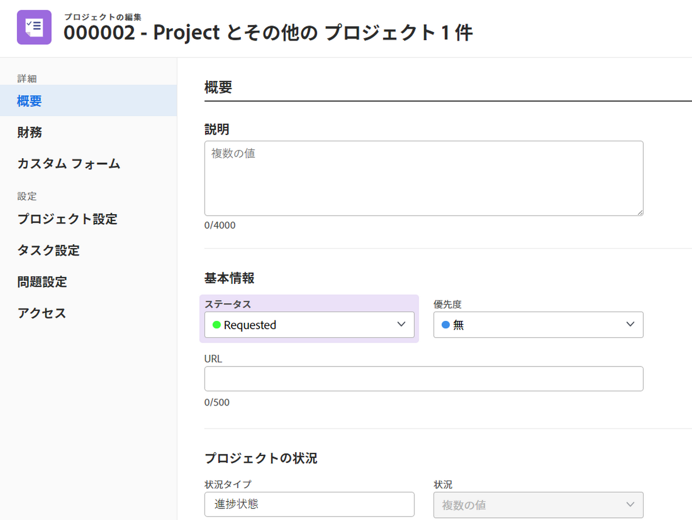
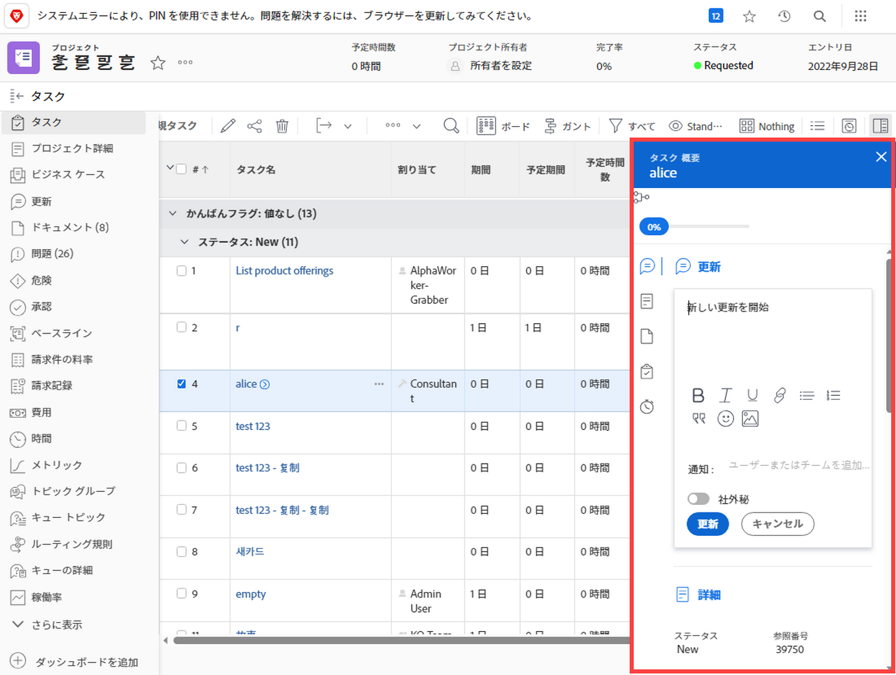
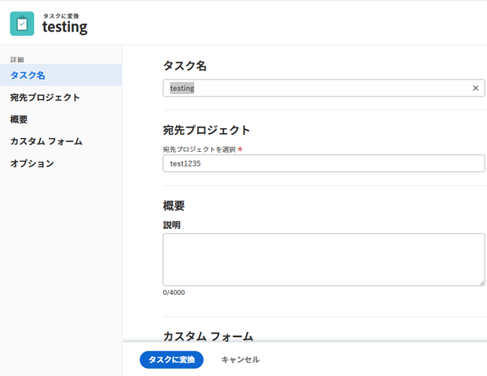

# レイアウトテンプレートを使用して詳細ビューをカスタマイズする

<!--The highlighted information on this page refers to functionality not yet generally available. It is available for all customers in the Preview environment and for a select group of customers in the Production environment.-->

Adobe Workfront管理者は、レイアウトテンプレートを使用して、ユーザーが「詳細」アイコンをクリックしたときに表示される情報を決定できます  タスク、イシュー、ドキュメント、プログラム、またはポートフォリオを表示しているときに左のパネルに表示されます。

<!--
or billing record
-->

また、この情報が表示される情報の順序を変更することもできます。 例えば、ユーザーに表示されるすべてのタスクについて、ユーザーに表示されるすべてのタスクのカスタムForms情報を詳細ビューの先頭に移動できます。

オブジェクトの [ 詳細 ] ビューに加えた変更は、次の領域でユーザーが表示するフィールドの使用可否と順序も決まります。

* 「新しいオブジェクト」ボックス（「新しいタスク」や「新しいイシュー」など）

   

* 「オブジェクトの編集」画面（タスクの編集、イシューの編集、プロジェクトの編集など）

   

* オブジェクトを一括編集する際の「オブジェクトの編集」画面 現在、これはプロジェクトの一括編集でサポートされています。

   

* 概要  タスクと問題のリストのパネル

   

   >[!NOTE]
   >
   >レイアウトテンプレートの変更は、ログインしたユーザーに割り当てられたタスクと問題に対してのみ、概要パネルのフィールドの順序と使用可能性に影響します。

* [ 懸案事項をタスクに変換する ] ボックスや [ 懸案事項をプロジェクトに変換する ] ボックスなどの変換ボックスを使用します。

   

グループのレイアウトテンプレートについて詳しくは、 [グループのレイアウトテンプレートの作成と変更](../../../administration-and-setup/manage-groups/work-with-group-objects/create-and-modify-a-groups-layout-templates.md).

## アクセス要件

この記事の手順を実行するには、次のアクセス権が必要です。

<table style="table-layout:auto"> 
 <col> 
 <col> 
 <tbody> 
  <tr> 
   <td role="rowheader">Adobe Workfrontプラン</td> 
   <td>任意</td> 
  </tr> 
  <tr> 
   <td role="rowheader">Adobe Workfrontライセンス</td> 
   <td>計画</td> 
  </tr> 
  <tr> 
   <td role="rowheader">アクセスレベル設定</td> 
   <td> 
これらの手順をシステムレベルで実行するには、システム管理者のアクセスレベルが必要です。
グループに対して実行するには、そのグループの管理者である必要があります
 
<b>注意</b>:まだアクセス権がない場合は、Workfront管理者に、アクセスレベルに追加の制限を設定しているかどうかを問い合わせてください。 Workfront管理者がアクセスレベルを変更する方法について詳しくは、 <a href="../../../administration-and-setup/add-users/configure-and-grant-access/create-modify-access-levels.md" class="MCXref xref">カスタムアクセスレベルの作成または変更</a>.
 </td> 
  </tr> 
 </tbody> 
</table>

## 詳細表示でユーザーに表示する内容をカスタマイズする

1. レイアウトテンプレートの使用を開始する ( [レイアウトテンプレートの作成と管理](../../../administration-and-setup/customize-workfront/use-layout-templates/create-and-manage-layout-templates.md).
1. 下向き矢印をクリックします。  under **ユーザーに表示する内容をカスタマイズ**&#x200B;を選択し、「 **プロジェクト**, **タスク**, **問題**, **プログラム**&#x200B;または **Portfolio。**
<!--
, or billing record
-->

1. 内 **詳細** 「 」セクションで、次のいずれかの操作を行って、詳細ビューに表示する内容をカスタマイズします。

   * 任意のセクションヘッダーをドラッグ  順序を変更する
   * 以下のオプションを有効または無効にします。 **概要** および **カスタムForms** 表示/非表示を切り替えます。

      これらのセクションの 1 つですべてのフィールドを非表示にした場合、セクション全体が非表示になります。

      すべてのフィールドは、デフォルトで有効になっています。

1. 引き続きレイアウトテンプレートをカスタマイズします。

   または

   カスタマイズが終了したら、 **保存**.

   >[!TIP]
   >
   >「保存」はいつでもクリックして進行状況を保存でき、後でテンプレートの変更を続行できます。
