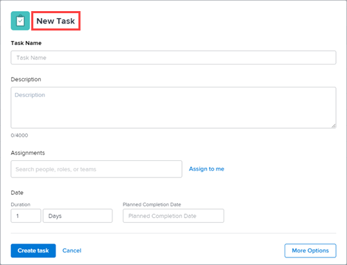
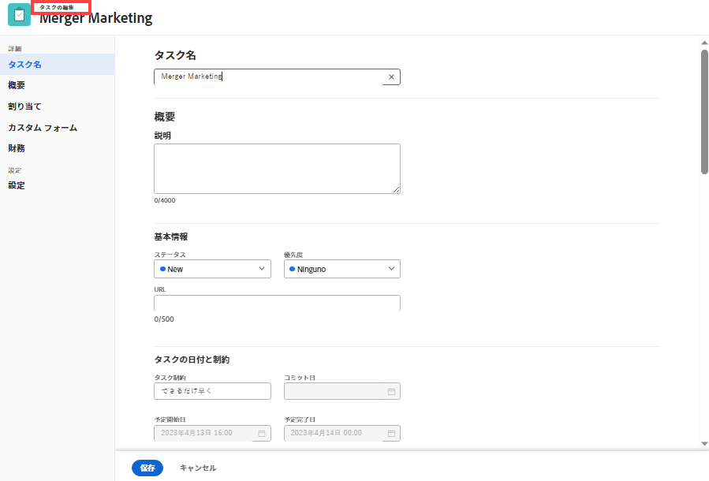
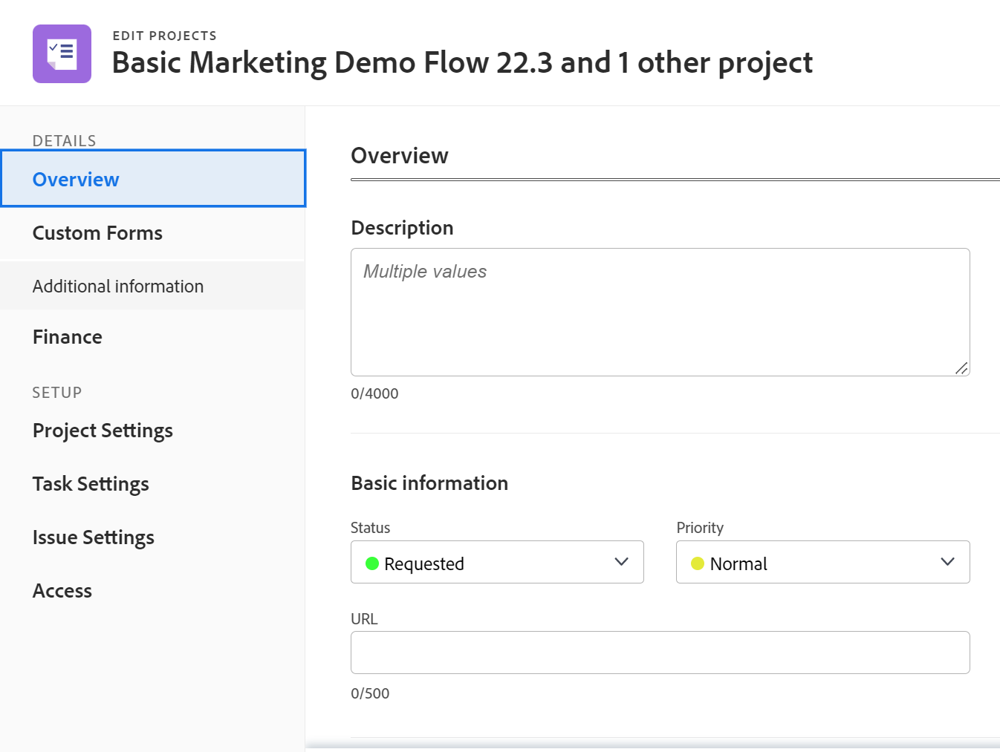
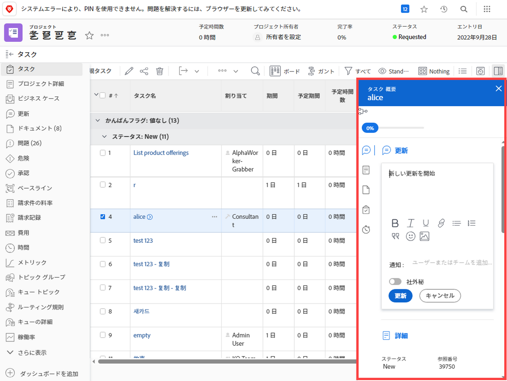
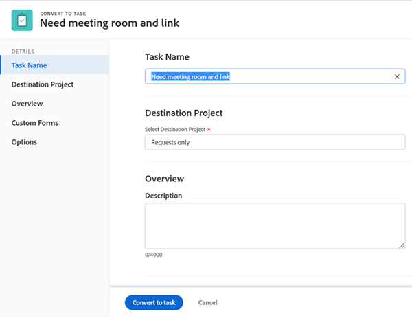
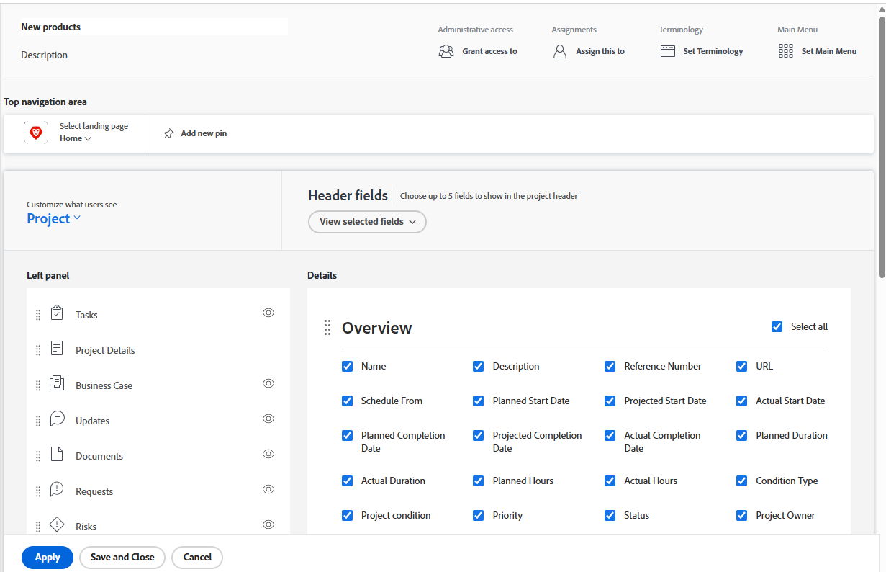

# レイアウトテンプレートを使用して詳細ビューをカスタマイズする

Adobe Workfront管理者は、レイアウトテンプレートを使用して、タスク、イシュー、ドキュメント、プログラムまたはポートフォリオを表示する際に、左側のパネルの詳細アイコン をクリックしたときに表示される情報を決定できます。

また、この情報が表示される情報の順序を変更することもできます。 例えば、ユーザーに表示されるすべてのタスクについて、カスタムフォーム情報をユーザーに表示されるすべてのタスクの詳細ビューの上部に移動できます。

レイアウトテンプレートの作成について詳しくは、[レイアウトテンプレートを作成および管理](../use-layout-templates/create-and-manage-layout-templates.md)を参照してください。

グループのレイアウトテンプレートについて詳しくは、[グループのレイアウトテンプレートの作成と変更](../../../administration-and-setup/manage-groups/work-with-group-objects/create-and-modify-a-groups-layout-templates.md)を参照してください。

レイアウトテンプレートを設定した後、変更を他のユーザーに表示するために、ユーザーに割り当てる必要があります。 レイアウトテンプレートのユーザーへの割り当てについて詳しくは、[ユーザーをレイアウトテンプレートに割り当てる](../use-layout-templates/assign-users-to-layout-template.md)を参照してください。

オブジェクトの詳細ビューに加えた変更により、次のエリアでユーザーに表示されるフィールドの可用性と順序も決まります。

* 「オブジェクトを作成」ボックス（「タスクを作成」など）

  

* タスクを編集、イシューを編集、プロジェクトを編集など、オブジェクトの編集時の「オブジェクトを編集」画面

  

* オブジェクトを一括編集する際の「オブジェクトを編集」画面。 現在、これはプロジェクトの一括編集でサポートされています。

  

* タスクと問題のリストの概要パネル 

  

  >[!NOTE]
  >
  >レイアウトテンプレートの変更は、ログインしたユーザーに割り当てられたタスクとイシューに対してのみ、概要パネルのフィールドの順序と可用性に影響します。

* 「イシューをタスクに変換」ボックスや「イシューをプロジェクトに変換」ボックスなどの変換ボックス。

  

グループのレイアウトテンプレートについて詳しくは、[グループのレイアウトテンプレートを作成および変更](../../../administration-and-setup/manage-groups/work-with-group-objects/create-and-modify-a-groups-layout-templates.md)を参照してください。

## アクセス要件

+++ 展開すると、この記事の機能のアクセス要件が表示されます。

<table style="table-layout:auto"> 
 <col> 
 <col> 
 <tbody> 
  <tr> 
   <td>Adobe Workfront パッケージ</td> 
   <td>
任意
</td> 
  </tr> 
  <tr> 
   <td>Adobe Workfront プラン</td> 
   <td>
標準

       
プラン
</td>
  </tr> 
  </tr> 
  <tr> 
   <td>アクセスレベル設定</td> 
   <td> 
これらの手順をシステムレベルで実行するには、システム管理者のアクセスレベルが必要です。

        
グループに対して実行するには、そのグループの管理者である必要があります。
 </td> 
  </tr> 
 </tbody> 
</table>

詳しくは、[Workfront ドキュメントのアクセス要件](/help/quicksilver/administration-and-setup/add-users/access-levels-and-object-permissions/access-level-requirements-in-documentation.md)を参照してください。

+++

## 詳細ビューでユーザーに表示する項目をカスタマイズする

1. [レイアウトテンプレートを作成と管理](../../../administration-and-setup/customize-workfront/use-layout-templates/create-and-manage-layout-templates.md)で説明されるように、レイアウトテンプレート上での作業を開始します。
1. **ユーザーに表示される内容をカスタマイズ**&#x200B;の下の下向き矢印をクリックし、**プロジェクト**、**タスク**、**イシュー**、**プログラム**、または&#x200B;**Portfolio**<!--, or billing record-->&#x200B;をクリックします。
1. 「**詳細**」セクションで、次のいずれかの操作を行って、詳細ビューに表示する項目をカスタマイズします。

   * 任意のセクション ヘッダーをドラッグして、順序を変更します。
   * 様々な領域（**Overview**、**Finance**、**カスタム Forms**&#x200B;など）でオプションを有効または無効にして、表示または非表示にします。

     これらのセクションの 1 つですべてのフィールドを非表示にした場合、セクション全体が非表示になります。

     すべてのフィールドはデフォルトで有効になっています。 領域の「**すべてを選択**」チェックボックスを選択またはオフにすると、その領域のすべてのフィールドを表示または非表示にできます。

     

1. レイアウトテンプレートのカスタマイズを続行します。 「**適用**」はいつでもクリックして、進行状況を保存できます。

   または

   カスタマイズが完了したら、**保存して閉じる**&#x200B;をクリックします。

