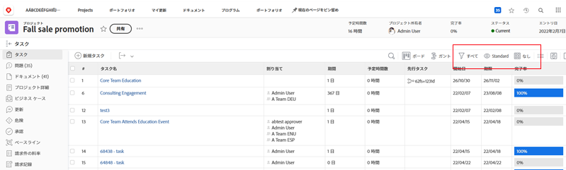
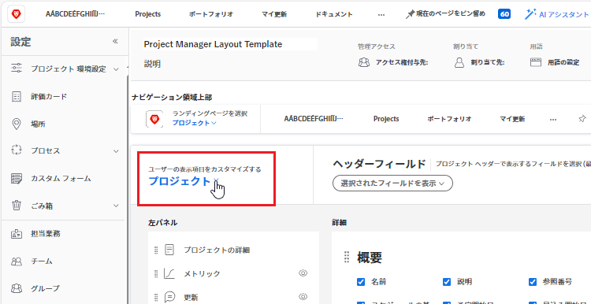
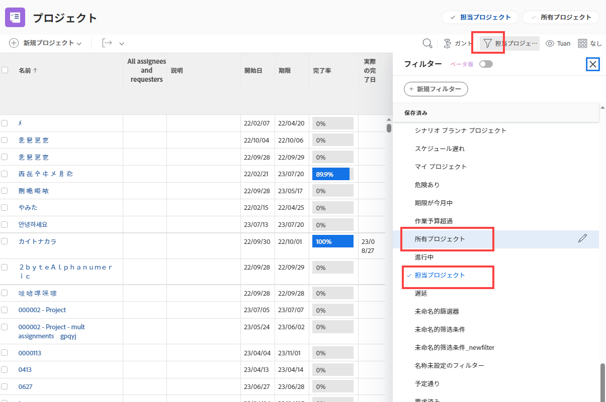
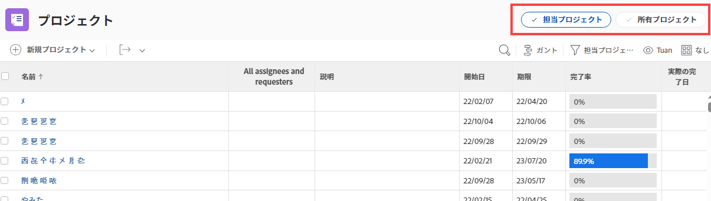

# レイアウトテンプレートを使用したフィルター、ビューおよびグループのカスタマイズ

Adobe Workfrontの管理者は、レイアウトテンプレートを使用して、フィルター、表示、グループ化の各ドロップダウンメニューに表示するリストコントロールを指定できます。 これらのメニューは、Workfront全体のリストの上に表示されます。例えば、プロジェクトのタスクのリストなどです。

レイアウトテンプレートについて詳しくは、 [レイアウトテンプレートの作成と管理](../../../administration-and-setup/customize-workfront/use-layout-templates/create-and-manage-layout-templates.md).

グループのレイアウトテンプレートについて詳しくは、 [グループのレイアウトテンプレートの作成と変更](../../../administration-and-setup/manage-groups/work-with-group-objects/create-and-modify-a-groups-layout-templates.md).

レイアウトテンプレートを設定した後、変更を他のユーザーに表示するために、ユーザーに割り当てる必要があります。 レイアウトテンプレートのユーザーへの割り当てについて詳しくは、 [レイアウトテンプレートにユーザーを割り当てる](../use-layout-templates/assign-users-to-layout-template.md).

## アクセス要件

この記事の手順を実行するには、次のアクセス権が必要です。

<table style="table-layout:auto"> 
 <col> 
 <col> 
 <tbody> 
  <tr> 
   <td role="rowheader">Adobe Workfrontプラン</td> 
   <td>任意</td> 
  </tr> 
  <tr> 
   <td role="rowheader">Adobe Workfrontライセンス</td> 
   <td>計画</td> 
  </tr> 
  <tr> 
   <td role="rowheader">アクセスレベル設定</td> 
   <td> 
これらの手順をシステムレベルで実行するには、システム管理者のアクセスレベルが必要です。
グループに対して実行するには、そのグループの管理者である必要があります。
 
<b>注意</b>：まだアクセス権がない場合は、Workfront管理者に問い合わせて、アクセスレベルに追加の制限が設定されているかどうかを確認してください。 Workfront管理者がアクセスレベルを変更する方法について詳しくは、 <a href="../../../administration-and-setup/add-users/configure-and-grant-access/create-modify-access-levels.md" class="MCXref xref">カスタムアクセスレベルの作成または変更</a>.
 </td> 
  </tr> 
 </tbody> 
</table>

## フィルター、表示およびグループ化リストのコントロールのカスタマイズ：

1. レイアウトテンプレートの使用を開始する ( [レイアウトテンプレートの作成と管理](../../../administration-and-setup/customize-workfront/use-layout-templates/create-and-manage-layout-templates.md).
1. 下向き矢印をクリックします。  under **ユーザーに表示する内容をカスタマイズする**&#x200B;を選択し、次に **リスト** をクリックします。

   

1. 下向き矢印をクリックします。  under **カスタマイズするリストを選択**&#x200B;次に、フィルター、表示およびグループ化リストコントロールをカスタマイズするWorkfrontオブジェクトのタイプを選択します。

   

   >[!NOTE]
   >
   >カスタマイズするプロジェクトを一覧として選択し、[ フィルタ ] セクションの [ 自分が所有するプロジェクト ] または [ 自分が所有するプロジェクト ] を無効にすると、ユーザーはそのフィルタを表示できなくなり、使用できなくなります。
   >
   >* フィルターアイコンをクリックしたときに表示されるフィルターのリスト  リストの上：
   >   
   >  
   >   
   >* 「プロジェクト」領域ヘッダーのヘッダーで、次の操作をおこないます。
   >   
   >  

1. （オプション）レイアウトテンプレートのデフォルトのフィルター、表示またはグループ化を変更する場合は、フィルター、表示またはグループ化にカーソルを合わせて、 **デフォルトとして設定**.

   選択したデフォルトによって、レイアウトテンプレートが割り当てられているときにWorkfront全体のリストに表示されるフィルター、表示、グループ化の各ユーザーが決まります。 これらのデフォルト値を変更しない場合、ユーザーは次のようにすべてのリストを表示します。

   * **フィルター**：すべて
   * **表示**：標準（該当する場合。一部のリストにはこのビューがありません）
   * **グループ化**：なし

   別のデフォルトを選択した後で、「すべて」、「標準」、「なし」の各オプションを非表示にすることができます（手順 5 を参照）が、削除できません。

   デフォルトとして使用されている他のオプションは削除できますが、最初に別のデフォルトを選択する必要があります。

   フィルター、ビュー、グループの削除について詳しくは、 [デフォルトのフィルター、ビュー、グループを作成、編集および共有します](../../../administration-and-setup/set-up-workfront/configure-system-defaults/create-and-share-default-fvgs.md).

1. 次のように、リストコントロールを非表示にして追加します。

   <table style="table-layout:auto"> 
    <col> 
    <col> 
    <tbody> 
     <tr> 
      <td role="rowheader">リストコントロールを非表示にする</td> 
      <td> 
表示または非表示にするリストコントロールの横にあるボックスをオフにするか、オンにします。
 
チェックボックスが淡色表示の場合は、そのリストコントロールを非表示にできません。 デフォルト  現在既定として構成されている設定を非表示にできないため、各リストコントロールの設定は淡色表示になります。
 </td> 
     </tr> 
     <tr> 
      <td role="rowheader">カスタムリストコントロールを追加</td> 
      <td> 
 
        <ol> 
         <li value="1"> クリック <strong>フィルターを追加</strong>, <strong>ビューを追加</strong>または <strong>グループを追加</strong> をクリックします。 表示されるボックスに、組織用に以前に作成した既存のカスタムリストコントロールの名前を入力し、表示されたら名前をクリックします。</li> 
         <li value="2"> 新しいカスタムリストコントロールをレイアウトテンプレートの既定のフィルタ、表示、またはグループ化として設定する場合は、 <strong>デフォルトとして設定</strong>. </li> 
         <li value="3"> 
クリック <strong>追加</strong> 完了したら、
 
<b>注意</b>: 
ユーザーは、独自のリストにカスタムリストコントロールを追加できます。 レイアウトテンプレートにカスタムリストコントロールを追加すると、リストコントロールが追加され、パネルの下部に移動します。置き換えは行われません。
 
これは、ユーザーがカスタムリストコントロールを持つ新しいレイアウトテンプレートに割り当てられる場合にも当てはまります。 
 
リストコントロールのカスタマイズについて詳しくは、 <a href="../../../reports-and-dashboards/reports/reporting-elements/filters-overview.md" class="MCXref xref">フィルターの概要</a>, <a href="../../../reports-and-dashboards/reports/reporting-elements/views-overview.md" class="MCXref xref">Adobe Workfrontの概要を表示</a>、および <a href="../../../reports-and-dashboards/reports/reporting-elements/groupings-overview.md" class="MCXref xref">Adobe Workfrontでのグループ化の概要</a>.
 
 </li> 
        </ol> 
 </td> 
     </tr> 
    </tbody> 
   </table>

1. 引き続きレイアウトテンプレートをカスタマイズします。

   または

   カスタマイズが終了したら、 **保存**.

   >[!TIP]
   >
   >「保存」はいつでもクリックして進行状況を保存でき、後でテンプレートの変更を続行できます。
