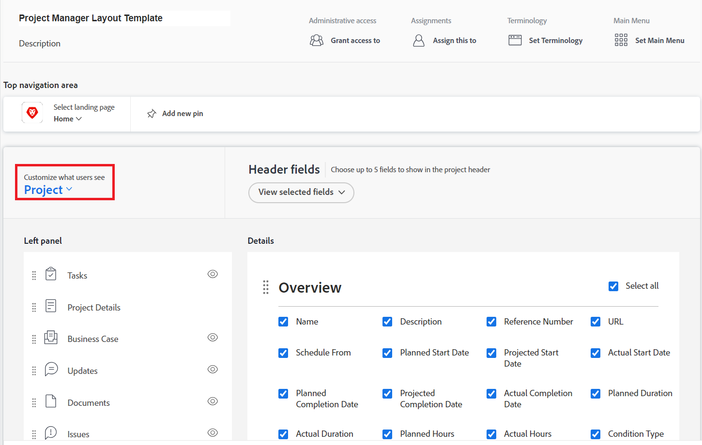

# レイアウトテンプレートを使用したフィルター、表示およびグループ化のカスタマイズ

Adobe Workfront の管理者は、レイアウトテンプレートを使用して、フィルター、表示、グループ化の各ドロップダウンメニューに表示するリストコントロールを指定できます。これらのメニューは、プロジェクトのタスクリストなど、Workfront 全体のリストの上に表示されます。

レイアウトテンプレートに関して詳しくは、[レイアウトテンプレートの作成と管理](../../../administration-and-setup/customize-workfront/use-layout-templates/create-and-manage-layout-templates.md)を参照してください。

グループのレイアウトテンプレートについて詳しくは、[グループのレイアウトテンプレートの作成と変更](../../../administration-and-setup/manage-groups/work-with-group-objects/create-and-modify-a-groups-layout-templates.md)を参照してください。

レイアウトテンプレートを設定した後、変更を他のユーザーに表示するために、ユーザーに割り当てる必要があります。レイアウトテンプレートのユーザーへの割り当てについて詳しくは、[ユーザーのレイアウトテンプレートへの割り当て](../use-layout-templates/assign-users-to-layout-template.md)を参照してください。

## アクセス要件

この記事の手順を実行するには、次のアクセス権が必要です。

<table style="table-layout:auto"> 
 <col> 
 <col> 
 <tbody> 
  <tr> 
   <td role="rowheader">Adobe Workfront プラン</td> 
   <td>任意</td> 
  </tr> 
  <tr> 
   <td role="rowheader">Adobe Workfront ライセンス</td> 
   <td>プラン</td> 
  </tr> 
  <tr> 
   <td role="rowheader">アクセスレベル設定</td> 
   <td> 
これらの手順をシステムレベルで実行するには、システム管理者のアクセスレベルが必要です。
グループに対して実行するには、そのグループの管理者である必要があります。
 
<b>メモ</b>：まだアクセス権がない場合は、アクセスレベルに追加の制限が設定されていないかどうか Workfront 管理者にお問い合わせください。Workfront 管理者がアクセスレベルを変更する方法について詳しくは、<a href="../../../administration-and-setup/add-users/configure-and-grant-access/create-modify-access-levels.md" class="MCXref xref">カスタムアクセスレベルの作成または変更</a>を参照してください。
 </td> 
  </tr> 
 </tbody> 
</table>

## フィルター、表示およびグループ化のリストコントロールをカスタマイズ：

1. [レイアウトテンプレートを作成および管理](../../../administration-and-setup/customize-workfront/use-layout-templates/create-and-manage-layout-templates.md)で説明されているように、レイアウトテンプレートの使用を開始します。
1. **ユーザーに表示する内容のカスタマイズ**&#x200B;の下にある下向き矢印をクリックし、次に&#x200B;**リスト**&#x200B;をクリックします。

   

1. **カスタマイズするリストの選択**&#x200B;の下にある下向き矢印をクリックし、次に、フィルター、表示およびグループ化のリストコントロールをカスタマイズする Workfront オブジェクトのタイプを選択します。

   

   >[!NOTE]
   >
   >カスタマイズするプロジェクトをリストとして選択し、フィルタセクションにある、自分が所属するプロジェクト、または自分が所有するプロジェクトを無効にすると、ユーザーはそのフィルターを表示したり使用したりすることができなくなります。
   >
   >* リストの上にあるフィルターアイコン  をクリックしたときに表示されるフィルターのリスト内で、以下のように行います。
   >   
   >  
   >   
   >* プロジェクトエリアヘッダーの上にあるヘッダーで、以下のように行います。
   >   
   >  

1. （オプション）レイアウトテンプレートのデフォルトのフィルター、表示またはグループ化を変更する場合は、フィルター、表示またはグループ化にポインタを合わせて、**デフォルトとして設定**&#x200B;をクリックします。

   選択したデフォルトによって、レイアウトテンプレートがユーザーに割り当てられたときに、Workfront 全体のリストにユーザーに対して表示されるフィルター、表示、およびグループ化が決まります。これらのデフォルトを変更しない場合、以下のようにすべてのリストがユーザーに表示されます。

   * **フィルター**：すべて
   * **表示**：標準（該当する場合。一部のリストにはこの表示がありません）
   * **グループ化**：なし

   別のデフォルトを選択した後で、「すべて」、「標準」、「なし」の各オプションを非表示にすることができます（手順 5 を参照）が、削除はできません。

   デフォルトとして使用されているすべての他のオプションは削除できますが、最初に別のデフォルトを選択する必要があります。

   フィルター、表示、グループ化の削除について詳しくは、[デフォルトのフィルター、表示、グループ化を作成、編集および共有](../../../administration-and-setup/set-up-workfront/configure-system-defaults/create-and-share-default-fvgs.md)を参照してください。

1. 以下のように、リストコントロールを非表示にして追加します。

   <table style="table-layout:auto"> 
    <col> 
    <col> 
    <tbody> 
     <tr> 
      <td role="rowheader">リストコントロールを非表示にする</td> 
      <td> 
表示または非表示にするリストコントロールの横にあるボックスをオフ、またはオンにします。
 
チェックボックスがグレー表示の場合は、そのリストコントロールを非表示にできません。現在デフォルトとして指定されている設定を非表示にできないため、各リストコントロールのデフォルト設定はグレー表示されます。
 </td> 
     </tr> 
     <tr> 
      <td role="rowheader">カスタムリストコントロールの追加</td> 
      <td> 
 
        <ol> 
         <li value="1"> フィルター、表示、またはグループ化リストの下部にある<strong>フィルターの追加</strong>、<strong>表示の追加</strong>、または<strong>グループ化の追加</strong>をクリックします。表示されるボックスに、組織用に以前に作成した既存のカスタムリストコントロールの名前を入力し、表示されたら名前をクリックします。</li> 
         <li value="2"> 新しいカスタムリストコントロールをレイアウトテンプレートのデフォルトのフィルター、表示、またはグループとして設定する場合は、「<strong>デフォルトとして設定</strong>」をクリックします。 </li> 
         <li value="3"> 
完了したら「<strong>追加</strong>」をクリックします。
 
<b>メモ</b>: 
ユーザーは、独自のリストにカスタムリストコントロールを追加できます。Adobe Workfront 管理者がレイアウトテンプレートにカスタムリストコントロールを追加すると、リストコントロールが追加され、ユーザーのリストコントロールはパネルの下部に移動します。置き換えは行われません。
 
カスタムリストコントロールを持つ新しいレイアウトテンプレートにユーザーを割り当てる場合にも、これが当てはまります。 
 
リストコントロールのカスタマイズについて詳しくは、 <a href="../../../reports-and-dashboards/reports/reporting-elements/filters-overview.md" class="MCXref xref">フィルターの概要</a>, <a href="../../../reports-and-dashboards/reports/reporting-elements/views-overview.md" class="MCXref xref">Adobe Workfrontの概要を表示</a>、および <a href="../../../reports-and-dashboards/reports/reporting-elements/groupings-overview.md" class="MCXref xref">Adobe Workfrontでのグループ化の概要</a>.
 
 </li> 
        </ol> 
 </td> 
     </tr> 
    </tbody> 
   </table>

1. 引き続きレイアウトテンプレートをカスタマイズします。

   または

   カスタマイズが完了したら、「**保存**」をクリックします。

   >[!TIP]
   >
   >いつでも「保存」をクリックして進行状況を保存して、後でテンプレートの変更を続行できます。
