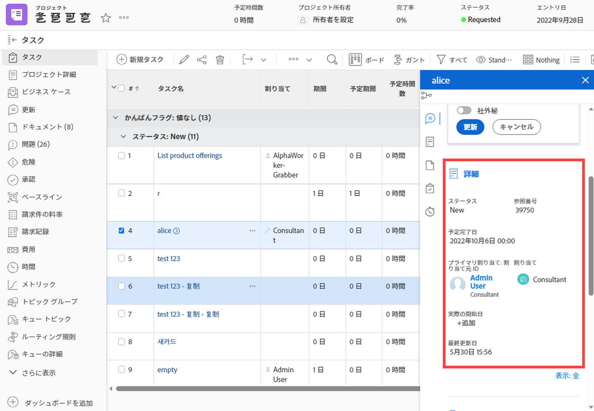
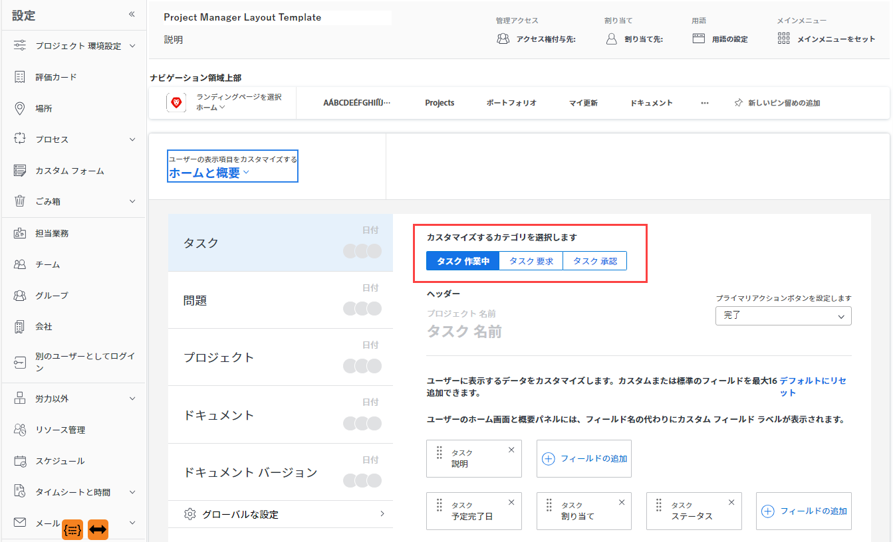
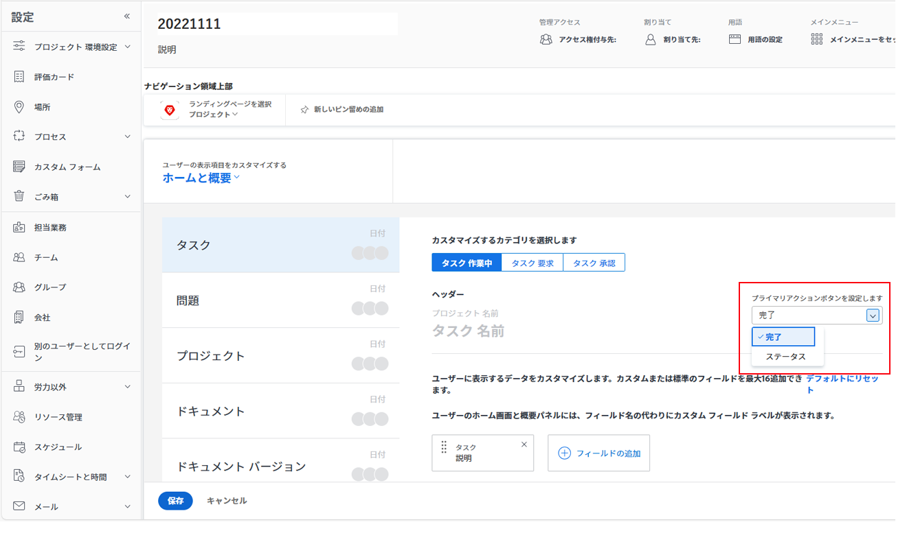

# レイアウトテンプレートを使用したホームと概要のカスタマイズ

レイアウトテンプレートを使用して、「ホーム」および「概要」でタスクやイシューをクリックした際にユーザーに表示する内容を設定できます。以下の手順を使用して行った各設定は、「ホーム」および「概要」パネルにも反映されます。ただし、これらのカスタマイズは「ドキュメントの概要」パネルには適用されません。

以下を設定できます。

* 「詳細」でタスクまたはイシューに対して表示されるフィールドおよび順序
* 選択したタスクまたはイシューに対して、更新、ログに記録された時間、添付されたドキュメント、タイムスタンプを表示するかどうか

ユーザーに割り当てられているプロジェクトの承認、ドキュメントの承認、ドキュメントのバージョンの承認をクリックする際に、「ホーム」に表示されるフィールドをカスタマイズすることもできます。

「ホーム」について詳しくは、[ホームエリアの使用](../../../workfront-basics/using-home/using-the-home-area/use-the-home-area.md)を参照してください。「概要」パネルについて詳しくは、[概要について](../../../workfront-basics/the-new-workfront-experience/summary-overview.md)を参照してください。

レイアウトテンプレートの作成について詳しくは、[レイアウトテンプレートの作成と管理](../use-layout-templates/create-and-manage-layout-templates.md)を参照してください。

グループのレイアウトテンプレートについて詳しくは、[グループのレイアウトテンプレートを作成および変更](../../../administration-and-setup/manage-groups/work-with-group-objects/create-and-modify-a-groups-layout-templates.md)を参照してください。

レイアウトテンプレートを設定した後、変更を他のユーザーに表示するために、ユーザーに割り当てる必要があります。レイアウトテンプレートのユーザーへの割り当てについて詳しくは、[ユーザーのレイアウトテンプレートへの割り当て](../use-layout-templates/assign-users-to-layout-template.md)を参照してください。

## アクセス要件

この記事の手順を実行するには、次のアクセス権が必要です。

<table style="table-layout:auto"> 
 <col> 
 <col> 
 <tbody> 
  <tr> 
   <td role="rowheader">Adobe Workfront プラン</td> 
   <td>任意</td> 
  </tr> 
  <tr> 
   <td role="rowheader">Adobe Workfront ライセンス</td> 
   <td>プラン</td> 
  </tr> 
  <tr> 
   <td role="rowheader">アクセスレベル設定</td> 
   <td> 
これらの手順をシステムレベルで実行するには、システム管理者のアクセスレベルが必要です。
グループに対して実行するには、そのグループの管理者である必要があります。
 
<b>メモ</b>：まだアクセス権がない場合は、アクセスレベルに追加の制限が設定されていないかどうか Workfront 管理者にお問い合わせください。Workfront 管理者がアクセスレベルを変更する方法について詳しくは、<a href="../../../administration-and-setup/add-users/configure-and-grant-access/create-modify-access-levels.md" class="MCXref xref">カスタムアクセスレベルの作成または変更</a>を参照してください。
 </td> 
  </tr> 
 </tbody> 
</table>

## レイアウトテンプレートを使用したホームと概要のカスタマイズ

1. [レイアウトテンプレートの作成と管理](../../../administration-and-setup/customize-workfront/use-layout-templates/create-and-manage-layout-templates.md)で説明されるように、レイアウトテンプレート上での作業を開始します。

1. 「**ユーザーの表示項目をカスタマイズする**」の下にある下向き矢印 、「**ホームと概要**」の順にクリックします。

1. 左側に表示されるリストから「ホームと概要」でカスタマイズするオブジェクトタイプ（**タスク**、**イシュー**、**プロジェクト**、**ドキュメント**&#x200B;または&#x200B;**ドキュメントのバージョン**）をクリックします。

   <table style="table-layout:auto"> 
    <col> 
    <col> 
    <tbody> 
     <tr> 
      <td role="rowheader">タスク</td> 
      <td> 
「ホーム」でこの設定は、ユーザーがタスクをクリックした際にタスクの右側のエリアに反映されます。また、タスクのリストでは、ユーザーがタスクを選択して概要を開くアイコン  をクリックした際に、ページの右側に表示される「概要」パネルに反映されます。
 
例えば、ユーザーが「ホーム」でタスクを選択したときに「詳細」エリアに表示されるフィールドを指定できます。
 

 
また、概要でタスクを選択した場合は、次のようになります。
 
  
 </td> 
     </tr> 
     <tr> 
      <td role="rowheader">イシュー</td> 
      <td> 
「ホーム」でこの設定は、ユーザーがイシューをクリックした際に、イシューの右側のエリアに反映されます。
 
イシューのリストでこの設定は、ユーザーがイシューを選択して概要を開くアイコン  をクリックした際に、ページの右側に表示される「概要」パネルに反映されます。
 </td> 
     </tr> 
     <tr> 
      <td role="rowheader">プロジェクト</td> 
      <td>「ホーム」でこの設定は、ユーザーが自分に割り当てられたプロジェクト承認をクリックした際に、承認の右側のエリアに反映されます。</td> 
     </tr> 
     <tr> 
      <td role="rowheader">ドキュメント</td> 
      <td>「ホーム」でこの設定は、ユーザーが自分に割り当てられたドキュメントの承認をクリックした際に、承認の右側のエリアに反映されます。</td> 
     </tr> 
     <tr> 
      <td role="rowheader">ドキュメントバージョン</td> 
      <td>「ホーム」でこの設定は、ユーザーが特定のバージョンのドキュメントの自分に割り当てられた承認をクリックした際に、承認の右側のエリアに反映されます。</td> 
     </tr> 
    </tbody> 
   </table>

   >[!IMPORTANT]
   >
   >タスクが未割り当ての場合、レイアウトテンプレートに割り当てられたユーザーには、「概要」にフィールドのカスタマイズが表示されません。

1. （条件付き）前の手順で「タスク」または「イシュー」をクリックした場合は、カスタマイズするタスクまたはイシューのカテゴリを選択します。

   

1. （条件付き）「**「プライマリアクションボタンを設定します**」ドロップダウンメニューが表示される場合、（左側のリストの「**タスク**」または「**イシュー**」を選択した場合）、タスクまたはイシューを表示する際に、ユーザーが「ホーム」エリアおよび「概要」パネルで使用できるプライマリアクション（「**完了**」または「**ステータス**」）をクリックします。

   

1. 選択したオブジェクトタイプでフィールドを追加  非表示  にします。

   

1. 手順 3 ～ 6 を繰り返して、他のオブジェクトタイプのホームエリアと概要パネルをカスタマイズします。
1. 左下隅付近にある「**グローバル設定**」をクリックして、ホームと概要で Adobe Workfront オブジェクトに関連する次のオプションを有効または無効にします。

   <table style="table-layout:auto"> 
    <col> 
    <col> 
    <tbody> 
     <tr> 
      <td role="rowheader">作業の更新を表示</td> 
      <td>選択したタスクまたはイシューに対して行われた更新をホームまたは概要に表示します。これには、システム更新とユーザーによる更新の両方が含まれます。ユーザーは、システムの更新をフィルターして除外できます（<a href="../../../workfront-basics/updating-work-items-and-viewing-updates/update-work.md" class="MCXref xref">作業を更新</a>の<a href="../../../workfront-basics/updating-work-items-and-viewing-updates/update-work.md#enable" class="MCXref xref">システムアップデートを有効化または無効化</a>の節を参照）。</td> 
     </tr> 
     <tr> 
      <td role="rowheader">作業に対する時間を記録する</td> 
      <td>タスクまたはイシューが選択されている場合に「作業に対する時間を記録する」オプションを表示し、ホームエリアと概要エリアから作業アイテムに対する時間を直接記録できます。</td> 
     </tr> 
     <tr> 
      <td role="rowheader">作業に関連付けられたドキュメントを表示</td> 
      <td>タスクまたはイシューを選択すると、ホームおよび概要にドキュメント領域が表示され、タスクまたはイシューに添付されているドキュメントがリストされます。ユーザーは、ドキュメントをクリックして、プレビューウィンドウに表示できます。</td> 
     </tr> 
     <tr> 
      <td role="rowheader">タイムスタンプを非表示</td> 
      <td>ホームおよび概要の次の日付フィールドのタイムスタンプを非表示にします。
       <ul>
        <li>予定完了日</li>
        <li>コミット日</li>
        <li>送信日</li>
       </ul>
<b>メモ</b>：このオプションを有効にすると、期限が過ぎた作業アイテムは、時間ではなく、日付に基づいてホームワークリストの遅延グループに移動されます。
</td> 
     </tr> 
    </tbody> 
   </table>

1. 引き続きレイアウトテンプレートをカスタマイズします。

   または

   カスタマイズが終了したら、「**保存**」をクリックします。

レイアウトテンプレートについて詳しくは、[レイアウトテンプレートの作成と管理](../../../administration-and-setup/customize-workfront/use-layout-templates/create-and-manage-layout-templates.md)を参照してください。
