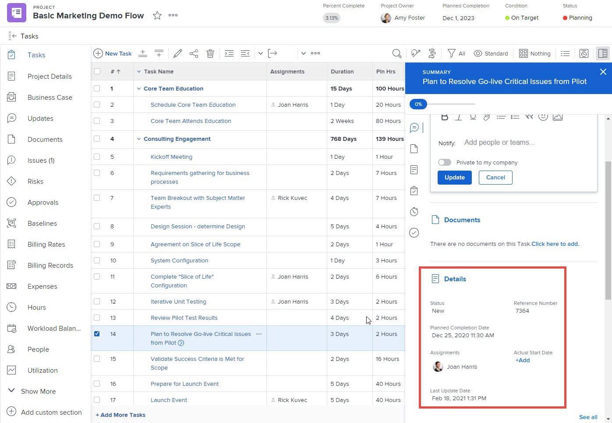
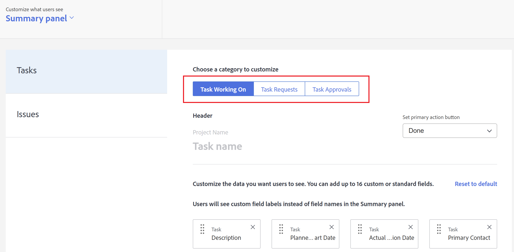
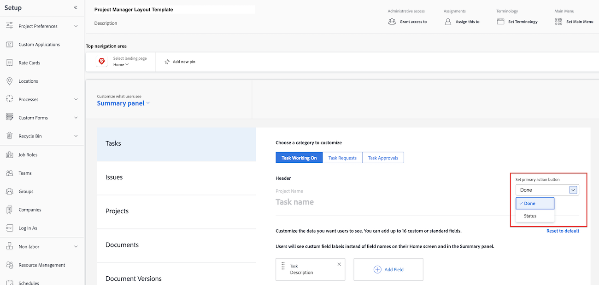
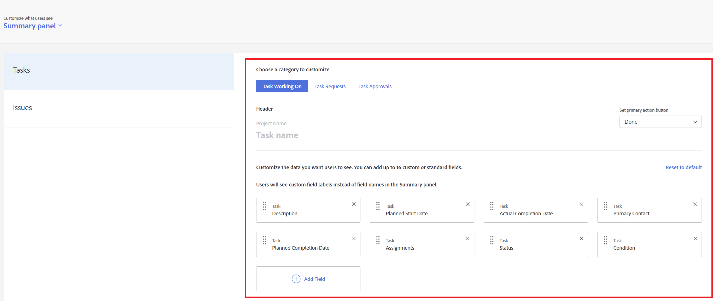

# レイアウトテンプレートを使用した概要パネルのカスタマイズ

<!--Audited: 11/2024-->

レイアウトテンプレートを使用すると、ユーザーがタスクまたはイシューをクリックしたときに概要パネルに表示される内容を設定できます。 次の手順を使用して行った各設定は、概要パネルに影響します。 ただし、これらのカスタマイズは「ドキュメントの概要」パネルには適用されません。

以下を設定できます。

* 「詳細」でタスクまたはイシューに対して表示されるフィールドおよび順序
* 選択したタスクまたはイシューに対して、更新、ログに記録された時間、添付されたドキュメント、タイムスタンプを表示するかどうか

ユーザーに割り当てられているプロジェクトの承認、ドキュメントの承認、ドキュメントのバージョンの承認をクリックする際に、「ホーム」に表示されるフィールドをカスタマイズすることもできます。

「概要」パネルについて詳しくは、[概要について](../../../workfront-basics/the-new-workfront-experience/summary-overview.md)を参照してください。

レイアウトテンプレートの作成について詳しくは、[レイアウトテンプレートの作成と管理](../use-layout-templates/create-and-manage-layout-templates.md)を参照してください。

グループのレイアウトテンプレートについて詳しくは、[グループのレイアウトテンプレートを作成および変更](../../../administration-and-setup/manage-groups/work-with-group-objects/create-and-modify-a-groups-layout-templates.md)を参照してください。

レイアウトテンプレートを設定した後、変更を他のユーザーに表示するために、ユーザーに割り当てる必要があります。レイアウトテンプレートのユーザーへの割り当てについて詳しくは、[ユーザーのレイアウトテンプレートへの割り当て](../use-layout-templates/assign-users-to-layout-template.md)を参照してください。

## アクセス要件

+++ 展開すると、この記事の機能のアクセス要件が表示されます。

<table style="table-layout:auto"> 
 <col> 
 <col> 
 <tbody> 
  <tr> 
   <td>Adobe Workfront パッケージ</td> 
   <td>
任意
</td> 
  </tr> 
  <tr> 
   <td>Adobe Workfront プラン</td> 
   <td>
標準

       
プラン
</td>
  </tr> 
  </tr> 
  <tr> 
   <td>アクセスレベル設定</td> 
   <td> 
これらの手順をシステムレベルで実行するには、システム管理者のアクセスレベルが必要です。

        
グループに対して実行するには、そのグループの管理者である必要があります。
 </td> 
  </tr> 
 </tbody> 
</table>

詳しくは、[Workfront ドキュメントのアクセス要件](/help/quicksilver/administration-and-setup/add-users/access-levels-and-object-permissions/access-level-requirements-in-documentation.md)を参照してください。

+++

## レイアウトテンプレートを使用した概要パネルのカスタマイズ

1. [レイアウトテンプレートを作成と管理](../../../administration-and-setup/customize-workfront/use-layout-templates/create-and-manage-layout-templates.md)で説明されるように、レイアウトテンプレート上での作業を開始します。

1. の下の下向き矢印&#x200B;**下向き矢印**&#x200B;をクリックし、**概要パネル**&#x200B;をクリックします。

1. 下に表示されるリストで、概要パネルをカスタマイズするオブジェクトタイプをクリックします。

   以下の表は、各オブジェクトに対してカスタマイズできる内容を示しています

   <table style="table-layout:auto"> 
    <col> 
    <col> 
    <tbody> 
     <tr> 
      <td role="rowheader">タスク</td> 
      <td> 
タスクのリストでは、この設定は、ユーザーがタスクを選択してから「概要を開く」アイコン をクリックすると、ページの右側に表示される概要パネルに影響します。

   
  
 </td> 
     </tr> 
     <tr> 
      <td role="rowheader">イシュー</td> 
      <td>
イシューのリストでこの設定は、ユーザーがイシューを選択して概要を開くアイコン  をクリックした際に、ページの右側に表示される「概要」パネルに反映されます。
 </td> 
     </tr> 
    </tbody> 
   </table>

<!--
These were removed with the new Home: 

<tr> 
      <td role="rowheader">Projects</td> 
      <td><ul><li>
In Home, when a user clicks a project approval assigned to them, your configuration for this setting affects the area to the right of the approval.

      
<b>IMPORTANT:</b> 

This is a deprecated feature. Any changes you make to this area are related to a feature that Workfront has removed. This option will be removed from Workfront with a later maintenance update.
</li>
      </ul> 
      </td> 
     </tr> 
     <tr> 
      <td role="rowheader">Documents</td> 
      <td>
     <ul><li>
In Home, when a user clicks a document approval assigned to them, your configuration for this setting affects the area to the right of the approval.

      
<b>IMPORTANT:</b> 

 This is a deprecated feature. Any changes you make to this area are related to a feature that Workfront has removed. This option will be removed from Workfront with a later maintenance update.
</li>
      </ul>
      </td> 
     </tr> 
     <tr> 
      <td role="rowheader">Document Versions</td> 
      <td><ul><li>
In Home, when a user clicks an approval assigned to them for a particular version of a document, your configuration for this setting affects the area to the right of the approval.

      

<b>IMPORTANT:</b>
 This is a deprecated feature. Any changes you make to this area are related to a feature that Workfront has removed. This option will be removed from Workfront with a later maintenance update.
</li>
      </ul>
      </td> 
     </tr>
     -->

>[!IMPORTANT]
>
>タスクが未割り当ての場合、レイアウトテンプレートに割り当てられたユーザーには、「概要」にフィールドのカスタマイズが表示されません。

1. （条件付き）前の手順で「タスク」または「イシュー」をクリックした場合は、カスタマイズするタスクまたはイシューのカテゴリを選択します。

   

1. （条件付き）「**プライマリアクションを設定」ボタン** ドロップダウンメニューが表示された場合（左側のリストで&#x200B;**タスク**&#x200B;または&#x200B;**イシュー**&#x200B;を選択した場合）、ユーザーがタスクまたはイシューを表示するときに概要パネルで使用したいプライマリアクション （**完了**&#x200B;または&#x200B;**ステータス**）をクリックします。

   

1. 選択したオブジェクトタイプのするか、 フィールドを非表示にします。

   

1. 手順3 ～ 6を繰り返して、その他のオブジェクトタイプの概要パネルをカスタマイズします。
1. 左下隅付近の「**グローバル設定**」をクリックし、「概要」でAdobe Workfront オブジェクトに関連する次のオプションのいずれかを有効または無効にします。

   <table style="table-layout:auto"> 
    <col> 
    <col> 
    <tbody> 
     <tr> 
      <td role="rowheader">作業の更新を表示</td> 
      <td>選択したタスクまたはイシューに対して行われた更新を概要パネルに表示します。 これには、システム更新とユーザーによる更新の両方が含まれます。ユーザーは、システムの更新をフィルターして除外できます（<a href="../../../workfront-basics/updating-work-items-and-viewing-updates/update-work.md" class="MCXref xref">作業を更新</a>の<a href="../../../workfront-basics/updating-work-items-and-viewing-updates/update-work.md#enable" class="MCXref xref">システムアップデートを有効化または無効化</a>の節を参照）。</td> 
     </tr> 
     <tr> 
      <td role="rowheader">作業に対する時間を記録する</td> 
      <td>タスクまたはイシューが選択されている場合に「作業に対する時間を記録する」オプションを表示し、ホームエリアと概要エリアから作業アイテムに対する時間を直接記録できます。</td> 
     </tr> 
     <tr> 
      <td role="rowheader">作業に関連付けられたドキュメントを表示</td> 
      <td>タスクまたはイシューが選択されている場合は、概要パネルに「ドキュメント」領域が表示され、タスクまたはイシューに添付されているドキュメントが一覧表示されます。 ユーザーは、ドキュメントをクリックして、プレビューウィンドウに表示できます。</td> 
     </tr> 
     <tr> 
      <td role="rowheader">タイムスタンプを非表示</td> 
      <td>概要パネルで、次の日付フィールドのタイムスタンプを非表示にします。
       <ul>
        <li>予定完了日</li>
        <li>コミット日</li>
        <li>送信日</li>
       </ul></td> 
     </tr> 
    </tbody> 
   </table>

1. レイアウトテンプレートのカスタマイズを続行します。 「**適用**」はいつでもクリックして、進行状況を保存できます。

   または

   カスタマイズが完了したら、**保存して閉じる**&#x200B;をクリックします。

レイアウトテンプレートに関して詳しくは、[レイアウトテンプレートの作成と管理](../../../administration-and-setup/customize-workfront/use-layout-templates/create-and-manage-layout-templates.md)を参照してください。
