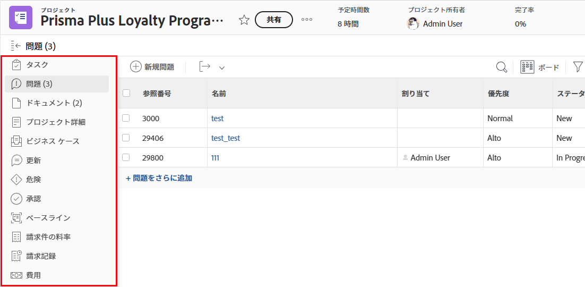

# レイアウトテンプレートを使用して左のパネルをカスタマイズする

レイアウトテンプレートでは、 [!DNL Adobe Workfront].

例えば、ユーザーがタスクを表示する際に左のパネルに表示される次の項目を決定できます。

>[!IMPORTANT]
>
>順序および表示に対する変更は、モバイルアプリに反映されます。

グループのレイアウトテンプレートについて詳しくは、 [グループのレイアウトテンプレートの作成と変更](../../../administration-and-setup/manage-groups/work-with-group-objects/create-and-modify-a-groups-layout-templates.md).

## アクセス要件

この記事の手順を実行するには、次のアクセス権が必要です。

<table style="table-layout:auto"> 
 <col> 
 <col> 
 <tbody> 
  <tr> 
   <td role="rowheader">[!DNL Adobe Workfront] 計画</td> 
   <td>任意</td> 
  </tr> 
  <tr> 
   <td role="rowheader">[!DNL Adobe Workfront] ライセンス</td> 
   <td>[!UICONTROL プラン ]</td> 
  </tr> 
  <tr> 
   <td role="rowheader">アクセスレベル設定</td> 
   <td> これらの手順をシステムレベルで実行するには、[!UICONTROL システム管理者 ] のアクセスレベルが必要です。
グループに対して実行するには、そのグループの管理者である必要があります。
 
<b>注意</b>:まだアクセス権がない場合は、 [!DNL Workfront] 管理者（アクセスレベルに追加の制限を設定している場合） を参照してください。 [!DNL Workfront] 管理者はアクセスレベルを変更できます。詳しくは、 <a href="../../../administration-and-setup/add-users/configure-and-grant-access/create-modify-access-levels.md" class="MCXref xref">カスタムアクセスレベルの作成または変更</a>.
 </td> 
  </tr> 
 </tbody> 
</table>

## の領域用に左側のパネルをカスタマイズする [!DNL Workfront]:

1. レイアウトテンプレートの使用を開始する ( [レイアウトテンプレートの作成と管理](../../../administration-and-setup/customize-workfront/use-layout-templates/create-and-manage-layout-templates.md).
1. 下向き矢印をクリックします。  under **[!UICONTROL ユーザーに表示する内容をカスタマイズ]**&#x200B;をクリックし、カスタマイズする左側のパネルをクリックします。

   >[!NOTE]
   >
   >詳しくは、 [!UICONTROL ホーム] オプションを選択します。 [カスタマイズ [!UICONTROL ホーム] および [!UICONTROL 概要] レイアウトテンプレートの使用](../../../administration-and-setup/customize-workfront/use-layout-templates/customize-home-summary-layout-template.md). リストオプションについて詳しくは、 [レイアウトテンプレートを使用したフィルター、ビューおよびグループのカスタマイズ](../../../administration-and-setup/customize-workfront/use-layout-templates/customize-fvg-list-controls-layout-template.md).

1. 内 **[!UICONTROL 左パネル]** リストで、次のいずれかの操作を行って、ユーザーがオプションの左側のパネルに何を表示するかを決定します ([!DNL Workfront] 領域またはオブジェクトタイプ ) を選択します。

   * 表示  または非表示  項目。 次の項目がない項目  または  は非表示にできません。

   * 項目をドラッグ  をクリックして、左側のパネルで順序を変更します。

   <table style="table-layout:auto"> 
    <col> 
    <col> 
    <col> 
    <thead> 
     <tr> 
      <th>オプション</th> 
      <th>ユーザーが次をクリックすると、</th> 
      <th>次の中から選択した左側のパネル項目が表示されます。</th> 
     </tr> 
    </thead> 
    <tbody> 
     <tr> 
      <td>[!UICONTROL プロジェクト ]</td> 
      <td>プロジェクトの名前</td> 
      <td>[!UICONTROL タスク ]、[!UICONTROL プロジェクトの詳細 ]、[!UICONTROL ビジネスケース ]、[!UICONTROL 更新 ]、[!UICONTROL ドキュメント ]、[!UICONTROL 問題 ]、[!UICONTROL リスク ]、[!UICONTROL 承認 ]、[!UICONTROL[!UICONTROL 請求レート ]、[!UICONTROL 請求レコード ]、[!UICONTROL 費用 ]、[!UICONTROL 時間 ]、[!UICONTROL ワークロードバランサー ]、[!UICONTROL ユーザー ]、[!UICONTROL キュー使用率 ]、[!UICONTROL キュー詳細 ]、!UICONTROL ルーティングルール ]、[!UICONTROL キュートピック ]、[!UICONTROL トピックグループ ]、[!UICONTROL 指標 ]</td> 
     </tr> 
     <tr> 
      <td>[!UICONTROL タスク ]</td> 
      <td>タスクの名前</td> 
      <td> [!UICONTROL 更新 ]、[!UICONTROL ドキュメント ]、[!UICONTROL タスクの詳細 ]、[!UICONTROL サブタスク ]、[!UICONTROL 問題 ]、[!UICONTROL 承認 ]、[!UICONTROL 承認 ]、[!UICONTROL Predecontrol Expenses タスク ]</td> 
     </tr> 
     <tr> 
      <td>[!UICONTROL の問題 ]</td> 
      <td>イシューの名前</td> 
      <td> [!UICONTROL 更新 ]、[!UICONTROL ドキュメント ]、[!UICONTROL 問題の詳細 ]、[!UICONTROL 時間 ]、[!UICONTROL 承認 ]</td> 
     </tr> 
     <tr> 
      <td>[!UICONTROLPortfolio]</td> 
      <td>ポートフォリオの名前</td> 
      <td>[!UICONTROL プロジェクト ]、[!UICONTROL プログラム ]、[!UICONTROLPortfolioの詳細 ]、[!UICONTROLPortfolio]、[!UICONTROL 最適化 ]、[!UICONTROL ドキュメント ]、[!UICONTROL 更新 ]</td> 
     </tr> 
     <tr> 
      <td>[!UICONTROL プログラム ]</td> 
      <td>プログラムの名前</td> 
      <td>[!UICONTROL プロジェクト ]、[!UICONTROL プログラムの詳細 ]、[!UICONTROL 更新 ]、[!UICONTROL ドキュメント ]</td> 
     </tr> 
     <tr> 
      <td>[!UICONTROL テンプレート ]</td> 
      <td>プロジェクトテンプレートの名前</td> 
      <td>[!UICONTROL テンプレートタスク ]、[!UICONTROL テンプレート詳細 ]、[!UICONTROL 更新 ]、[!UICONTROL ドキュメント ]、[!UICONTROL Expenses]、[!UICONTROL People]、[!UICONTROL 承認 ]、[!UICONTROL 請求率 ]、[!UICONTROL Queue Details]、[!UICONTROL Routing Rules]、[!UICONTROL Queue Topic]、[!UICONTROL Topic Group]</td> 
     </tr> 
     <tr> 
      <td>[!UICONTROL テンプレートタスク ]</td> 
      <td>テンプレートタスクの名前</td> 
      <td>[!UICONTROL 更新 ]、[!UICONTROL ドキュメント ]、[!UICONTROL テンプレートタスクの詳細 ]、[!UICONTROL サブタスク ]、[!UICONTROL Expenses]、[!UICONTROL Approvals]、[!UICONTROL Predecessors]</td>
     </tr>
     <!--
      <tr> 
       <td>Document</td> 
       <td>Document Details (for a document uploaded to Workfront)</td> 
       <td>Updates, Approvals, All Versions, Custom Forms</td> 
      </tr>
     --> 
     <tr> 
      <td> [!UICONTROL 請求レコード ]</td> 
      <td>プロジェクトの請求レコードの名前</td> 
      <td>[!UICONTROL 請求レコード詳細 ]、[!UICONTROL 請求可能時間 ]、[!UICONTROL 請求可能費用 ]、[!UICONTROL 固定収益 ]</td> 
     </tr> 
     <tr> 
      <td>[!UICONTROL プロジェクト ]</td> 
      <td>プロジェクト  （[!UICONTROL メインメニュー ]） </td> 
      <td>[!UICONTROL プロジェクト ]</td> 
     </tr> 
     <tr> 
      <td>[!UICONTROL リクエスト ]</td> 
      <td>リクエストの名前</td> 
      <td>[!UICONTROL 新規リクエスト ]、[!UICONTROL 送信済みリクエスト ]、[!UICONTROL すべてのリクエスト ]、[!UICONTROL ドラフト ]</td> 
     </tr> 
     <tr> 
      <td>[!UICONTROL ダッシュボード ]</td> 
      <td>ダッシュボードの名前</td> 
      <td>[!UICONTROL マイダッシュボード ]、[!UICONTROL 共有ダッシュボード ]、[!UICONTROL すべてのダッシュボード ]
<b>注意</b>:[!UICONTROL レポート ] 領域用のカスタムタブを作成した場合は、 [!DNL Adobe Workfront Classic]の場合は、リストの下部に表示されます。 ユーザーの場合は、左側のパネルの下部（[!UICONTROL ダッシュボード ] 領域）に表示されます。
 </td> 
     </tr> 
     <tr> 
      <td>[!UICONTROL スクラムチーム ]</td> 
      <td>スクラムチームの名前</td> 
      <td>
[!UICONTROL 反復 ]、[!UICONTROL 現在の反復 ]、[!UICONTROL バックログ ]、[!UICONTROL ワークロードバランサー ]、[!UICONTROL 更新 ]、[!UICONTROL チーム設定 ]
 
<strong>注意：</strong> この <strong>[!UICONTROL 現在の反復 ]</strong> アイテムは、少なくとも 1 つのタスクまたはイシューがイテレーションにある場合に、左側のパネルにのみ表示されます。
</td> 
     </tr> 
     <tr> 
      <td>[!UICONTROL かんばんチーム ]</td> 
      <td>かんばんチームの名前</td> 
      <td>[!UICONTROL Workload Balancer]、[!UICONTROL Kanban board]、[!UICONTROL Backlog]、[!UICONTROL Updates]、[!UICONTROL Team Settings]</td> 
     </tr> 
     <tr> 
      <td>[!UICONTROL Waterfal Team]</td> 
      <td>ウォーターフォールチームの名前</td> 
      <td>[!UICONTROL ワークロードバランサー ]、[!UICONTROL 更新 ]、[!UICONTROL チームリクエスト ]、[!UICONTROL チーム設定 ]</td> 
     </tr> 
     <tr> 
      <td>[!UICONTROL 反復 ]</td> 
      <td>反復の名前</td> 
      <td>[!UICONTROL Stories]、[!UICONTROL Issues]、[!UICONTROL Story Board]、[!UICONTROL Overview]、[!UICONTROL Custom Forms]、[!UICONTROL Updates] </td> 
     </tr> 
     <!--
      <tr> 
       <td>Company</td> 
       <td>The name of the company</td> 
       <td> 
People (cannot be hidden), Billing Rates, Custom Forms 
 </td> 
      </tr>
     --> 
     <!--
      <tr> 
       <td>Timesheets</td> 
       <td>The name of the timesheet</td> 
       <td>My Timesheets, Timesheets I Approve, All Timesheets (cannot be hidden) </td> 
      </tr>
     --> 
     <!--
      <tr> 
       <td>Resourcing</td> 
       <td>The name of the resource</td> 
       <td>Planner (cannot be hidden), Workload Balancer, Utilization, Resource Pools </td> 
      </tr>
     --> 
     <!--
      <tr> 
       <td>User Details</td> 
       <td>____________</td> 
       <td>Details (cannot be hidden), Org Chart, Time Off, Custom Forms </td> 
      </tr>
     --> 
    </tbody> 
   </table>

   >[!NOTE]
   >
   >内の最後の 3 項目 **[!UICONTROL ユーザーに表示する内容をカスタマイズ]** ドロップダウンリスト ([!UICONTROL リスト], [!UICONTROL ホームと概要]、および [!UICONTROL ブランディング]) は、左パネル以外の領域を設定するためのものです。 詳しくは、次の記事を参照してください。
>   * [レイアウトテンプレートを使用したフィルター、ビューおよびグループのカスタマイズ](../../../administration-and-setup/customize-workfront/use-layout-templates/customize-fvg-list-controls-layout-template.md)
>* [カスタマイズ [!UICONTROL ホーム] および [!UICONTROL 概要] レイアウトテンプレートの使用](../../../administration-and-setup/customize-workfront/use-layout-templates/customize-home-summary-layout-template.md)
* [ブランドAdobe [!DNL Workfront] レイアウトテンプレートの使用](../../../administration-and-setup/customize-workfront/use-layout-templates/brand-wf-using-a-layout-template.md)

1. （オプション）組織のダッシュボードの 1 つにリンクする左側のパネル項目を追加する場合は、 **[!UICONTROL カスタムセクションを追加]**, type **[!UICONTROL カスタムセクションのタイトル]** 項目の場合は、ダッシュボードを追加します。

   左側のパネルの下部にダッシュボード項目が表示されます。 ユーザーが左側のパネルにマウスポインターを置くと、ダッシュボード項目の横に入力したカスタムセクションタイトルが表示されます。

   >[!NOTE]
   ユーザーは、カスタムダッシュボードの項目を独自の左パネルに追加できます。 レイアウトテンプレートにカスタムダッシュボード項目を追加すると、項目が上書きまたはリセットされずに、項目と結合されます。 これは、ユーザーをカスタムのダッシュボード項目を含む新しいレイアウトテンプレートに割り当てる場合にも当てはまります。 ユーザーが左側のパネルをカスタマイズする方法について詳しくは、 [カスタムタブまたはセクションの作成](../../../workfront-basics/manage-your-account-and-profile/configuring-your-user-profile/create-custom-tabs.md).

   ダッシュボードについて詳しくは、 [ダッシュボード](../../../reports-and-dashboards/dashboards/dashboards-overview.md).

1. 引き続きレイアウトテンプレートをカスタマイズします。

   または

   カスタマイズが終了したら、 **[!UICONTROL 保存]**.

   >[!TIP]
   次をクリックできます。 [!UICONTROL 保存] 作業内容を保存した後、後でテンプレートの変更を続行します。
