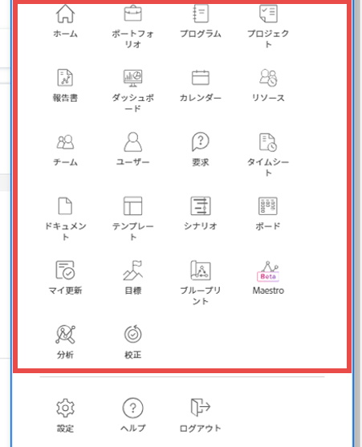

# レイアウトテンプレートを使用したメインメニューのカスタマイズ

<!--Audited: 01/2024-->

Adobe Workfrontの管理者またはグループ管理者は、レイアウトテンプレートを使用して、Workfrontでメインメニューを開いたときに表示されるオプションを設定できます。

>[!NOTE]
>
>ユーザーに表示されるメインメニューオプションは、ライセンスの種類と、アクセスレベルで設定されている設定によって異なります。 このレイアウトテンプレートを使用する一部のユーザーは、ここで選択するすべてのオプションが表示されない場合があります。 詳しくは、 [アクセスレベルと権限の連携](../../../administration-and-setup/add-users/access-levels-and-object-permissions/how-access-levels-permissions-work-together.md) および [各オブジェクトタイプの機能への設定可能なアクセス](../../../administration-and-setup/add-users/access-levels-and-object-permissions/configurable-functionality-in-each-access-level-by-object-type.md).

レイアウトテンプレートの作成について詳しくは、 [レイアウトテンプレートの作成と管理](../use-layout-templates/create-and-manage-layout-templates.md).

グループのレイアウトテンプレートについて詳しくは、 [グループのレイアウトテンプレートの作成と変更](../../../administration-and-setup/manage-groups/work-with-group-objects/create-and-modify-a-groups-layout-templates.md).

レイアウトテンプレートを設定した後、変更を他のユーザーに表示するために、ユーザーに割り当てる必要があります。 レイアウトテンプレートのユーザーへの割り当てについて詳しくは、 [レイアウトテンプレートにユーザーを割り当てる](../use-layout-templates/assign-users-to-layout-template.md).

## アクセス要件

この記事の手順を実行するには、次のアクセス権が必要です。

<table style="table-layout:auto"> 
 <col> 
 <col> 
 <tbody> 
  <tr> 
   <td role="rowheader"><strong>Adobe Workfrontプラン</strong></td> 
   <td>任意</td> 
  </tr> 
  <tr> 
   <td role="rowheader"><strong>Adobe Workfront license*</strong></td> 
   <td>
現在：プラン

   または
   
新規：標準
</td> 
  </tr> 
  <tr> 
   <td role="rowheader"><strong>アクセスレベルの設定</strong></td> 
   <td> 
これらの手順をシステムレベルで実行するには、システム管理者のアクセスレベルが必要です。

    
グループに対して実行するには、そのグループの管理者である必要があります。
 
     </td> 
  </tr> 
 </tbody> 
</table>

*アクセス要件について詳しくは、 [Workfrontドキュメントのアクセス要件](/help/quicksilver/administration-and-setup/add-users/access-levels-and-object-permissions/access-level-requirements-in-documentation.md).

## メインメニューのカスタマイズ

1. レイアウトテンプレートの使用を開始する ( [レイアウトテンプレートの作成と管理](../../../administration-and-setup/customize-workfront/use-layout-templates/create-and-manage-layout-templates.md).
1. クリック **メインメニューの設定** をクリックします。

   「メインメニュー」(Main Menu) ボックスが開き、テンプレートの「メインメニュー」(Main Menu) に現在表示されている領域と、追加可能な項目が表示されます。 次に、追加できるすべての項目を示します。
   * ホーム

     >[!TIP]
     >
     >既定では、メインメニューの [ 更新 ] 領域と [ ホーム ] 領域を含むレイアウトテンプレートがプロファイルに関連付けられている場合を除き、[ メインメニュー ] の [ ホーム ] アイコンには、[ レビューライセンスユーザ ] の [ 更新 ] 領域が表示されます。

   * ポートフォリオ
   * プログラム
   * プロジェクト
   * レポート
   * ダッシュボード
   * カレンダー
   * リソース
   * シナリオ

     >[!NOTE]
     >
     >シナリオ・プランナには、追加のライセンスが必要です。 Workfront Scenario Planner の詳細は、 [シナリオプランナーの概要](../../../scenario-planner/scenario-planner-overview.md).

   * チーム
   * ユーザー

     >[!NOTE]
     >
     >（現在のライセンスモデルの）Plan ライセンスを持つユーザ、または（新しいライセンスモデルの）Standard ライセンスを持つユーザのみが、[ ユーザ ] 領域を表示できます  」をクリックします。

   * リクエスト
   * タイムシート
   * ドキュメント
   * テンプレート
   * 分析
   * 校正
   * 目標

     >[!NOTE]
     >
     >目標には追加のライセンスが必要です。 Workfront目標について詳しくは、 [Adobe Workfront目標の概要](../../../workfront-goals/goal-management/wf-goals-overview.md).

   * マイ更新
   * ボード
   * ブループリント

1. 次のいずれかの操作を行います。

   * 非表示  **アクティブな項目** 表示したくない
   * 表示  **利用可能な項目** を選択します。
   * ドラッグ  **アクティブな項目** をクリックして、メインメニューの表示順を変更します。

1. クリック **完了**.

   また、 **キャンセル** 変更を破棄する場合は、いつでも変更を破棄できます。

1. 引き続きレイアウトテンプレートをカスタマイズします。

   または

   カスタマイズが終了したら、 **保存**.

   >[!TIP]
   >
   >「保存」はいつでもクリックして進行状況を保存でき、後でテンプレートの変更を続行できます。

レイアウトテンプレートについて詳しくは、 [レイアウトテンプレートの作成と管理](../../../administration-and-setup/customize-workfront/use-layout-templates/create-and-manage-layout-templates.md).
