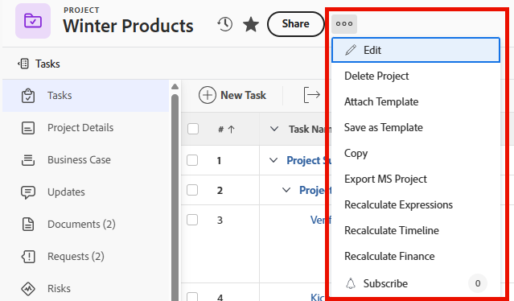

# レイアウトテンプレートを使用して詳細メニューをカスタマイズする

レイアウトテンプレートを使用すると、Adobe Workfrontでプロジェクト、タスク、イシュー、ポートフォリオ、プログラムの次のオブジェクトを表示する際に、ユーザーが「その他」メニュー（3 ドットメニュー）をクリックしたときに表示されるオプションを指定できます。

レイアウトテンプレートの作成について詳しくは、[レイアウトテンプレートを作成および管理](../use-layout-templates/create-and-manage-layout-templates.md)を参照してください。

グループのレイアウトテンプレートについて詳しくは、[グループのレイアウトテンプレートの作成と変更](../../../administration-and-setup/manage-groups/work-with-group-objects/create-and-modify-a-groups-layout-templates.md)を参照してください。

レイアウトテンプレートを設定した後、変更を他のユーザーに表示するために、ユーザーに割り当てる必要があります。 レイアウトテンプレートのユーザーへの割り当てについて詳しくは、[ユーザーのレイアウトテンプレートへの割り当て](../use-layout-templates/assign-users-to-layout-template.md)を参照してください。

## アクセス要件

+++ 展開すると、この記事の機能のアクセス要件が表示されます。

<table style="table-layout:auto"> 
 <col> 
 <col> 
 <tbody> 
  <tr> 
   <td>Adobe Workfront パッケージ</td> 
   <td>任意</td> 
  </tr> 
  <tr> 
   <td>Adobe Workfront プラン</td> 
   <td>
標準

       
プラン
</td>
  </tr> 
  </tr> 
  <tr> 
   <td>アクセスレベル設定</td> 
   <td> 
これらの手順をシステムレベルで実行するには、システム管理者のアクセスレベルが必要です。

        
グループに対して実行するには、そのグループの管理者である必要があります。
 </td> 
  </tr> 
 </tbody> 
</table>

詳しくは、[Workfront ドキュメントのアクセス要件](/help/quicksilver/administration-and-setup/add-users/access-levels-and-object-permissions/access-level-requirements-in-documentation.md)を参照してください。

+++

## Workfrontの領域のその他のメニューのカスタマイズ

1. [レイアウトテンプレートを作成および管理](../../../administration-and-setup/customize-workfront/use-layout-templates/create-and-manage-layout-templates.md)で説明されるように、レイアウトテンプレート上での作業を開始します。
1. 「**ユーザーに表示される内容をカスタマイズする**」ドロップダウンメニューで、オブジェクトタイプの名前または「その他」メニューをカスタマイズするWorkfront領域をクリックします。
1. **メニューオプションを選択**&#x200B;をクリックします。
1. 「**メニューオプションを選択**」ボックスで、次のいずれかの操作を行って、選択したWorkfront領域またはオブジェクトタイプのその他のメニューに表示されるユーザーの表示を決定します。

   * **表示** または&#x200B;**非表示**  アイコンをクリックして、左側のパネルでセクションを表示または非表示にします。 **表示**&#x200B;または&#x200B;**非表示** アイコンがない項目を非表示にすることはできません。

   * 項目をドラッグして、左側のパネルで順序を変更します。

1. 「**完了**」をクリックします。
