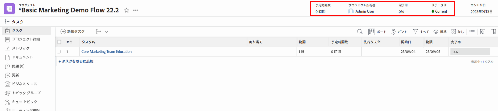
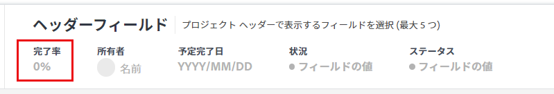
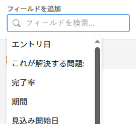

# レイアウトテンプレートを使用したオブジェクトヘッダーのカスタマイズ

Adobe Workfrontの管理者またはグループ管理者は、レイアウトテンプレートを使用して、ユーザーがオブジェクトのページを開く際にオブジェクトヘッダーに表示されるフィールドを設定できます。

>[!IMPORTANT]
>
>オブジェクトヘッダーのカスタマイズは、現在、プロジェクト、タスクおよび問題に対して使用できます。

グループのレイアウトテンプレートについて詳しくは、 [グループのレイアウトテンプレートの作成と変更](../../manage-groups/work-with-group-objects/create-and-modify-a-groups-layout-templates.md).

## アクセス要件

この記事の手順を実行するには、次のアクセス権が必要です。

<table>
  <tr>
   <td><strong>Adobe Workfrontプラン</strong>
   </td>
   <td>任意
   </td>
  </tr>
  <tr>
   <td><strong>Adobe Workfrontライセンス</strong>
   </td>
   <td>計画
   </td>
  </tr>
  <tr>
   <td><strong>アクセスレベル設定</strong>
   </td>
   <td>Workfrontまたはグループ管理者である必要があります。

   </td>
  </tr>
</table>

まだアクセス権がない場合は、Workfront管理者に、アクセスレベルに追加の制限を設定しているかどうかを問い合わせてください。 Workfront管理者がアクセスレベルを変更する方法について詳しくは、 [カスタムアクセスレベルの作成または変更](../../add-users/configure-and-grant-access/create-modify-access-levels.md).

## オブジェクトヘッダーのカスタマイズ

1. レイアウトテンプレートの使用を開始する ( [レイアウトテンプレートの作成と管理](../../customize-workfront/use-layout-templates/create-and-manage-layout-templates.md).
1. 内 **ユーザーに表示する内容をカスタマイズ** ドロップダウンメニューで、「 **プロジェクト**, **タスク** または **問題**.

   <!--when this will be possible for more than 3 objects, at production, make this more general: update the sentence above to say "select an object you want to customize in the Customize what users see drop-down menu). -->

1. 内 [!UICONTROL ヘッダーフィールド] セクションで、表示されたフィールドにマウスを移動して、次のいずれかの操作を行います。
   * 次をクリック： **x** フィールドを削除するアイコン

      または

   * クリック&amp;ホールド **つかむ** アイコンを使用して、フィールドを新しい場所にドラッグ&amp;ドロップします。

   <!--(NOTE: make sure the default names of these fields have not changed; otherwise, update screen shot)-->

   

1. 1 つのオブジェクトのヘッダーには、最大 5 つのフィールドを含めることができます。
既に 5 つのフィールドが選択されている場合、新しいフィールドを追加する前に、1 つのフィールドを削除する必要があります。
1. 内 **フィールドを追加** ボックスに、追加する編集不可能なWorkfrontフィールドの名前を入力し、リストに表示されたら選択します。 このフィールドは「フィールドを追加」ボックスのすぐ右に追加され、オブジェクトのヘッダーの左上隅にある最初のフィールドとして表示されます。

   >[!TIP]
   >
   >* オブジェクトの「詳細」セクションの「概要」領域に表示され、編集できないフィールドのみを追加できます。 編集不可のフィールドは、ユーザーが手動で編集できないフィールドです。 これらはWorkfrontで自動的に計算されます。
   >
   >* 既に既定のヘッダーに含まれている編集可能フィールド（プロジェクト所有者、ステータス、完了率、割り当てなど）を追加できます。
   >
   >* 問題のヘッダーに「解決者」フィールドを追加すると、問題に関連付けられた解決オブジェクトがある場合、そのフィールドは「問題の解決、タスク、またはプロジェクト」に変わります。

   

1. （オプション）追加したフィールドを別の順序でドラッグ&amp;ドロップします。

1. 引き続きレイアウトテンプレートをカスタマイズします。

   または

   カスタマイズが終了したら、 **保存**.

   >[!TIP]
   >
   >「保存」はいつでもクリックして進行状況を保存でき、後でテンプレートの変更を続行できます。
