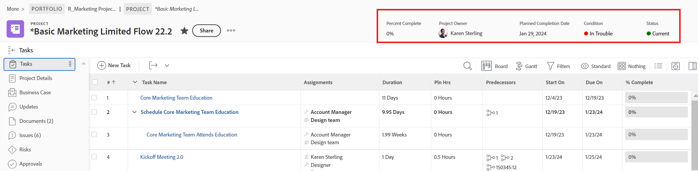
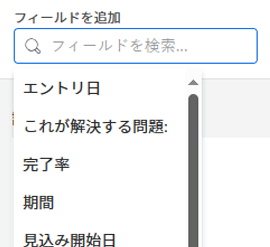

# レイアウトテンプレートを使用したオブジェクトヘッダーのカスタマイズ

{{highlighted-preview}}

Adobe Workfront 管理者またはグループ管理者は、レイアウトテンプレートを使用して、ユーザーがオブジェクトのページを開いた際にオブジェクトヘッダーに表示されるフィールドを設定できます。

>[!IMPORTANT]
>
>オブジェクト ヘッダーのカスタマイズは、現在、プロジェクト、タスク、イシュー、 ポートフォリオ、プログラム、テンプレート、請求記録、チーム、グループ、ユーザー、企業、グループ、レート カードで使用できます。

レイアウトテンプレートの作成について詳しくは、[レイアウトテンプレートを作成および管理](../use-layout-templates/create-and-manage-layout-templates.md)を参照してください。

グループのレイアウトテンプレートについて詳しくは、[グループのレイアウトテンプレートを作成および変更](../../../administration-and-setup/manage-groups/work-with-group-objects/create-and-modify-a-groups-layout-templates.md)を参照してください。

レイアウトテンプレートを設定した後、変更を他のユーザーに表示するために、ユーザーに割り当てる必要があります。レイアウトテンプレートのユーザーへの割り当てについて詳しくは、[ユーザーのレイアウトテンプレートへの割り当て](../use-layout-templates/assign-users-to-layout-template.md)を参照してください。

## アクセス要件

+++ 展開すると、この記事の機能のアクセス要件が表示されます。

<table style="table-layout:auto"> 
 <col> 
 <col> 
 <tbody> 
  <tr> 
   <td>Adobe Workfront パッケージ</td> 
   <td>
任意
</td> 
  </tr> 
  <tr> 
   <td>Adobe Workfront プラン</td> 
   <td>
標準

       
プラン
</td>
  </tr> 
  </tr> 
  <tr> 
   <td>アクセスレベル設定</td> 
   <td> 
これらの手順をシステムレベルで実行するには、システム管理者のアクセスレベルが必要です。

        
グループに対して実行するには、そのグループの管理者である必要があります。
 </td> 
  </tr> 
 </tbody> 
</table>

詳しくは、[Workfront ドキュメントのアクセス要件](/help/quicksilver/administration-and-setup/add-users/access-levels-and-object-permissions/access-level-requirements-in-documentation.md)を参照してください。

+++

## オブジェクトヘッダーをカスタマイズ

1. [レイアウトテンプレートの作成と管理](../../customize-workfront/use-layout-templates/create-and-manage-layout-templates.md)で説明されるように、レイアウトテンプレート上での作業を開始します。
1. **ユーザーに表示される内容をカスタマイズする** ドロップダウンメニューで、ヘッダーをカスタマイズするオブジェクトを選択します。
1. 「[!UICONTROL  ヘッダーフィールド ]」セクションで、現在のフィールドにカーソルを合わせて、次のいずれかの操作を行います。
   * **x** アイコンをクリックしてフィールドを削除

     または

   * **つかむ**&#x200B;アイコンをクリックしたまま、そのフィールドを新しい場所にドラッグ＆ドロップ

   

1. オブジェクトのヘッダーには、最大5つのフィールドを指定できます。

   既に 5 つのフィールドが選択されている場合、新しいフィールドを追加する前に、1 つのフィールドを削除する必要があります。

1. 「**フィールドを追加**」ボックスで、追加するカスタムフィールドまたはネイティブのWorkfront フィールドの名前を入力し始め、リストに表示されたら選択します。 フィールドは、「フィールドを追加」ボックスのすぐ右に追加され、オブジェクトのヘッダーの右上隅に最初のフィールドとして表示されます。

   >[!TIP]
   >
   >* 任意のカスタムフィールド、またはオブジェクトの「詳細」セクションの「概要」領域で使用可能な任意のネイティブフィールドを追加できます。 例えば、「重要度」フィールドを持つイシューのみが表示され、そのフィールドはプロジェクトまたはタスクに追加できません。
   >
   >* ユーザーがヘッダー内のカスタムフィールドを編集し、そのフィールドがオブジェクトに添付されていないカスタムフォームに含まれている場合、カスタムフォームがオブジェクトに自動的に追加されます。
   >
   >* 「解決済みユーザー」フィールドをイシューのヘッダーに追加すると、イシューに関連付けられた解決オブジェクトがある場合、フィールドは「イシュー、タスク、またはプロジェクトの解決」に変わります。

   

1. （オプション）フィールドを別の順序でドラッグ&amp;ドロップします。

1. レイアウトテンプレートのカスタマイズを続行します。 「**適用**」はいつでもクリックして、進行状況を保存できます。

   または

   カスタマイズが完了したら、**保存して閉じる**&#x200B;をクリックします。

