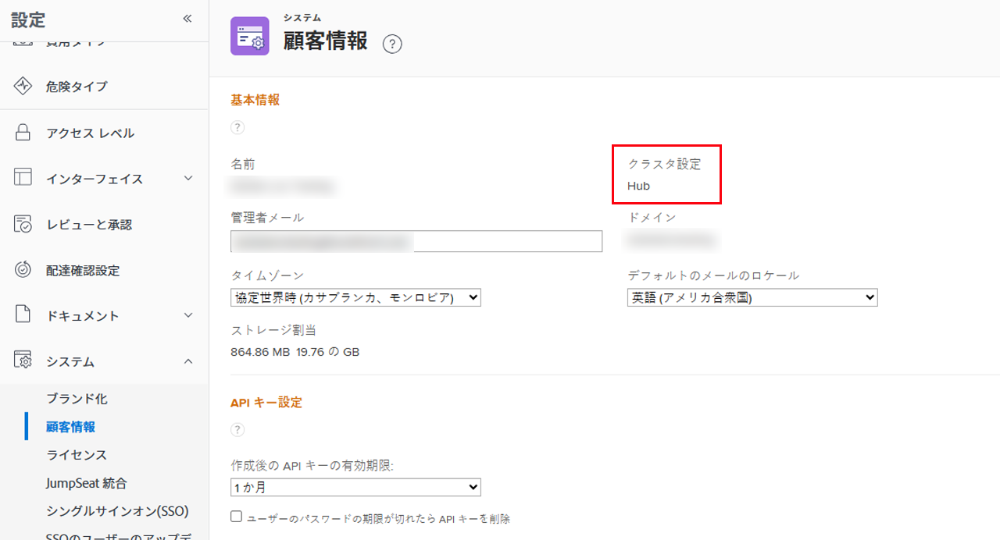
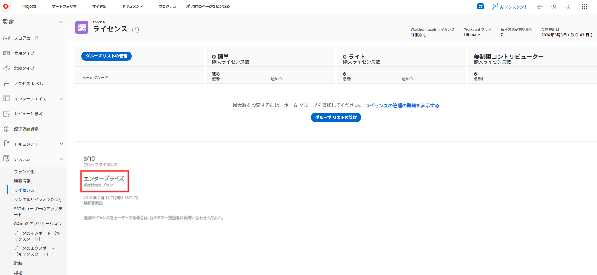

# ファイアウォールの概要

Adobe Workfrontは組織のネットワークと通信するので、組織のファイアウォールがその通信を許可するように設定されている必要があります。 ファイアウォールは、組織のネットワークをインターネットから分離することによって機能する、非常に効果的なセキュリティ対策です。 これにより、選択したデータとネットワークトラフィックのみが組織のネットワークに出入りできるようになります。 ファイアウォールは、データの送受信を行うサイトに基づいて、データを許可またはブロックします。 Adobe Workfrontの管理者は、Workfrontとの間で送信されるデータが組織のファイアウォールを通過できることを確認する必要があります。

これは、ファイアウォールを通じてデータを送受信できる「許可された」サイトの「リスト」である許可リストに加える「リスト」を通じて実行されます。 サイトは、次の 2 つの方法のいずれかで識別できます。

* **IP アドレス**:52.31.132.175などの一連の数値
* **ドメイン**:URL の一部 (www.thisdomain.comの「thisdomain」など )

Workfrontは、Web 通信に特定の IP アドレスおよびドメインを使用します。 組織でWorkfrontを使用するには、事前にこれらを組織の許可リストに加えるに追加しておく必要があります。

通常、ネット許可リストに加えるワーク管理者が設定します。 組織のネットワーク管理者と協力して、ファイアウォールでこれらの IP アドレスが許可されていることを確認します。 ネットワーク管理者が不明な場合は、組織の IT 部門が適切な方向に向かうことができます。

>[!IMPORTANT]
>
>Workfront管理者は、これらの IP アドレスとドメインが組織の管理者に必ず追加されていることを確認する必要があり許可リストに加えるます。 これは、自分で追加しない場合でも当てはまります。 Workfrontは組織の設定を構成できま許可リストに加えるせん。

## ファイアウォールを構成するための情報を収集します

Workfront用のファイアウォールを設定するには、追加する IP アドレスとドメインをネットワーク管理者が知っておく必要があります。 この情報の一部は、Workfront管理者のみが使用できます。 Workfront管理者は、この情報を探してネットワーク管理者に提供する必要があります。

>[!NOTE]
>
>セキュリティのベストプラクティスは、組織が積極的に使用している機能に接続する IP アドレスとドメインのみを追加することです。 この情報を指定することで、このベストプラクティスに確実に従うことができます。

ネットワーク管理者に次の情報を提供してください。

<table style="table-layout:auto"> 
 <col> 
 <col> 
 <tbody> 
  <tr> 
   <td role="rowheader">許可する特定の IP アドレスおよびドメイン</td> 
   <td> 
記事 <a href="../../administration-and-setup/get-started-wf-administration/configure-your-firewall.md" class="MCXref xref">ファイアウォールの設定を許可リストに加える行う</a> には、組織が追加する必要がある IP アドレスとドメインのリストが含まれていま許可リストに加えるす。 
 
ネットワーク管理者が「ファイアウォールの設定」の記事にアクセスできない可能性があります。 その場合は、指定する必要があります。 ハード（紙）コピーは印刷しないことをお勧めします。 デジタルコピーを使用すると、ネットワーク管理者はアドレスをコピーして貼り付けることができます。これは、ハードコピーから入力するよりも迅速かつ正確です。
 </td> 
  </tr> 
  <tr> 
   <td role="rowheader">クラスター</td> 
   <td>組織のクラスターを検索するには、 <a href="#view-your-organization-s-cluster-and-workfront-plan" class="MCXref xref">組織のクラスターとWorkfrontプランを表示</a></td> 
  </tr> 
  <tr> 
   <td role="rowheader">Workfrontプラン</td> 
   <td> 
組織のプランを見つけるには、 <a href="#view-your-organization-s-cluster-and-workfront-plan" class="MCXref xref">組織のクラスタープランとWorkfrontプランを表示します。</a>
 </td> 
  </tr> 
  <tr> 
   <td role="rowheader">ドメイン</td> 
   <td> 
ドメインを見つけるには、Workfrontに接続するために使用する Web アドレスを確認します。
 
例： Web アドレス内 <code>greatcompany.my.workfront.com</code>の場合、ドメインは「大企業」です。
 </td> 
  </tr> 
  <tr> 
   <td role="rowheader">その他のAdobe Workfront製品</td> 
   <td> 
次のいずれかのライセンスを持っている場合は、ネットワーク管理者に通知します。
 
    <ul> 
     <li> 
Adobe Workfront Proof
 </li> 
     <li> 
Adobe Workfront Fusion 
 </li> 
    </ul> </td> 
  </tr> 
  <tr> 
   <td role="rowheader">Adobe Workfront統合</td> 
   <td>次のいずれかを使用する場合は、ネットワーク管理者に通知します。
    <ul>
     <li>

Workfront for Jira

</li>
     <li>
Workfront for G Suite
</li>
     <li>
Workfront forMicrosoft Teams
</li>
     <li>
Workfront for Outlook
</li>
     <li>
Workfront for Salesforce
</li>
    </ul></td> 
  </tr> 
  <tr> 
   <td role="rowheader">その他の機能</td> 
   <td> 
次のいずれかを使用する場合は、ネットワーク管理者に通知します。
 
    <ul> 
     <li> 
Workfrontのテストドライブ
 </li> 
     <li> 
Workfront Ascent
 </li> 
    </ul> </td> 
  </tr> 
 </tbody> 
</table>

>[!IMPORTANT]
>
>後日、これらの製品、統合、機能のいずれかを追加する場合は、ネットワーク管理者に問い合わせて、それらの管理者がを調整できるようにする必要があり許可リストに加えるます。

### 組織のクラスターとWorkfrontプランを表示 {#view-your-organization-s-cluster-and-workfront-plan}

1. 次をクリック： **メインメニュー** アイコン  Adobe Workfrontの右上隅で、 **設定** .

1. クリック **システム** 左パネル内
1. クラスターを表示するには、「 」を選択します。 **顧客情報**.

   クラスターがの右上付近に表示されます **基本情報** 」セクションに入力します。

   

1. Workfrontプランを表示するには、 **ライセンス**.

   プランがページの下部に表示されます。

   
