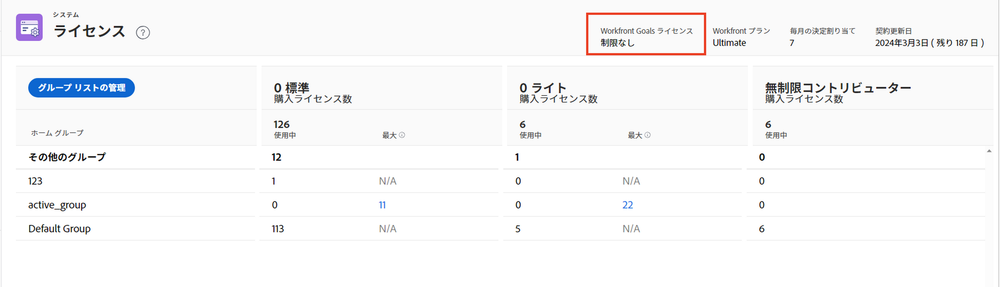
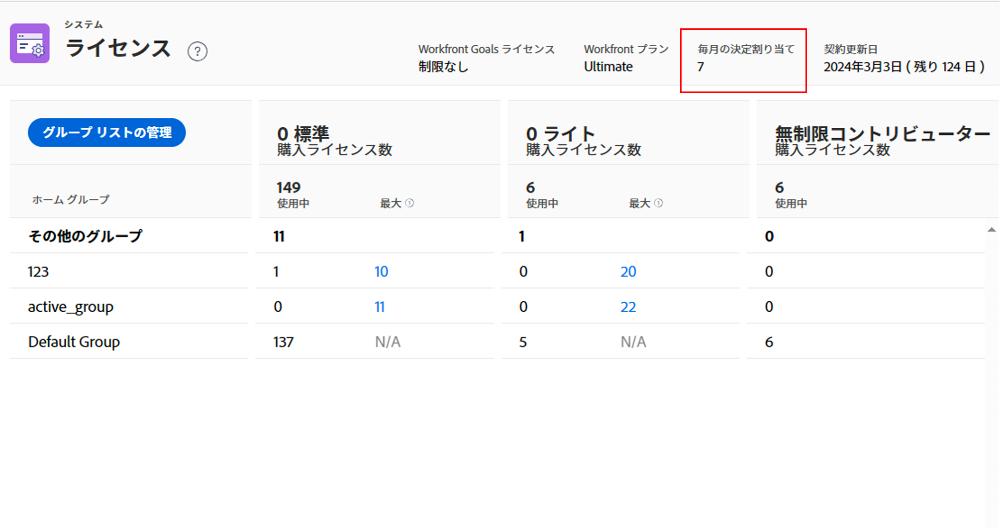
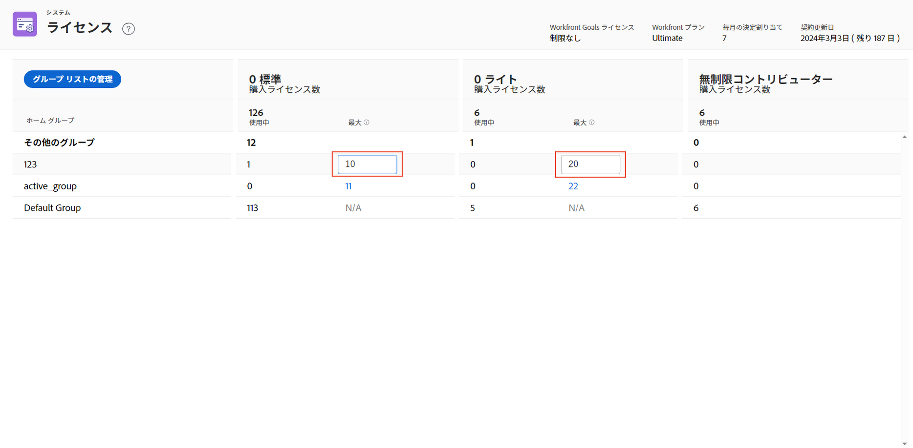

# システムで使用可能なライセンスを管理

Adobe Workfront管理者は、組織で購入されたライセンスの数や、現在使用中のライセンスの数など、Workfrontアカウントに関する情報にアクセスできます。

## アクセス要件

この記事の手順を実行するには、次のアクセス権が必要です。

<table style="table-layout:auto">
 <col> 
 <col> 
 <tbody> 
  <tr> 
   <td role="rowheader">Adobe Workfrontプラン</td> 
   <td>任意</td> 
  </tr> 
  <tr> 
   <td role="rowheader">Adobe Workfrontライセンス</td> 
   <td>計画</td> 
  </tr> 
  <tr> 
   <td role="rowheader">アクセスレベル設定</td> 
   <td> 
Workfront管理者である。 詳しくは、 <a href="../../administration-and-setup/add-users/configure-and-grant-access/grant-a-user-full-administrative-access.md" class="MCXref xref">ユーザーに完全な管理アクセス権を付与する</a>.
 
<b>注意</b>:まだアクセス権がない場合は、Workfront管理者に、アクセスレベルに追加の制限を設定しているかどうかを問い合わせてください。 Workfront管理者がアクセスレベルを変更する方法について詳しくは、 <a href="../../administration-and-setup/add-users/configure-and-grant-access/create-modify-access-levels.md" class="MCXref xref">カスタムアクセスレベルの作成または変更</a>.
 </td> 
  </tr> 
 </tbody> 
</table>

## 組織のライセンスを表示

使用中のライセンスの数は、Workfrontに追加するユーザーにアクセスレベルを割り当てると、自動的に更新されます。 詳しくは、 [ユーザーを追加](../../administration-and-setup/add-users/create-and-manage-users/add-users.md).

システムのライセンス情報を表示するには、次の手順に従います。

1. 次をクリック： **メインメニュー** アイコン  Adobe Workfrontの右上隅で、 **設定** .

1. 左側のパネルの下部で、 **システム** > **ライセンス**.

   このページに記載されているライセンスの詳細については、 [ライセンスの概要](../../administration-and-setup/add-users/access-levels-and-object-permissions/wf-licenses.md).

   >[!NOTE]
   >
   >配達確認ライセンスは、Workfrontライセンスに加えて有料Workfront Proof アドオンを購入したお客様のみが利用できます。 このアドオンについて詳しくは、 [Workfront Proof](../../workfront-proof/workfront-proof.md).

1. （条件付き）メッセージが表示された場合 **最大値を設定するには、ホームグループを追加する必要があります**&#x200B;を使用して、の節で説明されている方法で、システムにホームグループを追加します。 [[ ライセンス ] ページにホームグループを追加または削除する](#add-or-remove-a-home-group-to-the-licenses-page) 」を参照してください。

## Workfrontアドオンのライセンスに関する情報を表示

下のスクリーンショットで **5/10 個の配達確認ライセンス** この組織が有料Workfront Proof アドオンを持ち、現在購入した 10 個のWorkfront Proof ライセンスのうち 5 個を使用していることを示します。

お客様の組織がWorkfront Goals を購入している場合は、この製品のライセンス情報もここに表示されます。 この場合、次の情報を表示できます。

* 会社が購入したWorkfront Goals ライセンスの合計数
* ユーザーに関連付けられているWorkfront Goals ライセンスの数です。 これは、少なくとも目標に対する表示アクセス権をアクセスレベルで付与するユーザーの数です。

Workfront目標について詳しくは、 [Adobe Workfront目標の概要](../../workfront-goals/goal-management/wf-goals-overview.md). Workfront Goals へのアクセスについて詳しくは、 [Adobe Workfront目標へのアクセス権の付与](../../administration-and-setup/add-users/configure-and-grant-access/grant-access-goals.md)

>[!NOTE]
>
>Workfrontでは、購入したWorkfront Goals ライセンスをさらに割り当てることができます。 ただし、Workfront Goals 契約で許可されている数を超えるライセンスを割り当てると、Workfrontのアカウントマネージャーから連絡があり、契約上の数を超えたことが通知されます。

<!--
If an organization has other paid add-on products, their license information also displays here. If the organization doesn't have any paid add-on products, nothing displays here. (Drafted this because not sure this is accurate: Scenario Planner is an add-on product and its licenses are not displayed there.)
-->

>[!TIP]
>
>管理アクセス権を持たないユーザーは、グループレポートを使用してライセンス数を表示できます。 「レポート」タブで、新しいグループレポートを作成し、次の列を追加します。>
>* ライセンスの種類制限：作業者制限
>* ライセンスの種類制限：プランナーの制限
>
>レポートの作成について詳しくは、 [カスタムレポートの作成](../../reports-and-dashboards/reports/creating-and-managing-reports/create-custom-report.md).

## 月次配達確認とドキュメントの決定割り当てに関する情報を表示します

>[!IMPORTANT]
>
>配達確認とドキュメントの決定制限は、新しいライセンスのユーザーにのみ適用されます。 詳しくは、 [新しいライセンスの概要](/help/quicksilver/administration-and-setup/add-users/how-access-levels-work/licenses-overview.md).

配達確認とドキュメントの決定は、有料Workfrontライセンスのすべてに対して制限されます。 制限は、ユーザーごとに 1 ヶ月ごとにリセットされます。

各ライセンスの決定制限は、使用するプランによって異なります。 毎月の割り当ては、[ セットアップ ] > [ ライセンス ] で確認できます。

配達確認とドキュメントの決定制限について詳しくは、 [非有料ユーザーに対する限定的なドキュメントおよび配達確認の決定の概要](/help/quicksilver/review-and-approve-work/proof-doc-decision-limits.md).

## [ ライセンス ] ページにホームグループを追加または削除する {#add-or-remove-a-home-group-to-the-licenses-page}

この機能を使用するには、ビジネスまたはエンタープライズWorkfrontプランが必要です。 利用可能な様々なプランについて詳しくは、 [Workfrontプラン](https://www.workfront.com/plans)

各ユーザーは 1 つのホームグループにのみ割り当てることができます。 Workfrontは、各ホームグループで割り当てられ、現在使用されているライセンス数を計算することで、グループ指向のライセンス数を提供します。

メッセージが表示された場合 **最大値を設定するには、ホームグループを追加する必要があります** [ ライセンス ] ページで、[ ライセンス ] ページに 1 つ以上のホームグループを追加する必要があります。

>[!IMPORTANT]
>
>* ホームグループのライセンスを効果的に管理するには、ビジネスユニットに対して特定のホームグループを設定してから、最大ライセンス数を更新することをお勧めします。 詳しくは、 [ホームグループの概要](../../administration-and-setup/manage-groups/groups-overview/home-groups.md).
>* 最上位のグループのみをホームグループとして追加でき、サブグループは追加できません。 ユーザがホームグループとして割り当てられたサブグループを持つ場合、そのライセンスはそのサブグループの上の最上位グループのライセンス数に追加されます。
>

[ ライセンス ] ページにホームグループを追加または削除するには、次の手順に従います。

1. 次をクリック： **メインメニュー** アイコン  Adobe Workfrontの右上隅で、 **設定** .

1. 左側のパネルの下部で、 **システム** > **ライセンス**.

1. クリック **グループリストを管理**.
1. 最上位グループの名前を **ホームグループ** ボックス
1. グループを追加するには、表示されたらその名前をクリックします。

   または

   グループを削除するには、名前の右にある X アイコンをクリックします。

1. 「**保存**」をクリックします。

Workfrontの管理者は、ホームグループの最大ライセンス数を設定して、ビジネスユニットが他のビジネスユニットに購入したWorkfrontライセンスを使用するのを防ぐことができます。 手順については、 [ホームグループの最大ライセンス数を設定する](#set-the-maximum-license-count-for-a-home-group) 」を参照してください。

## ホームグループの最大ライセンス数を設定する {#set-the-maximum-license-count-for-a-home-group}

Workfront管理者は、システムの最上位のホームグループに対して最大ライセンス数を設定できます。 これにより、ビジネスユニットが組織内の他のビジネスユニット用に購入したWorkfrontライセンスを使用するのを防ぐことができます。

デフォルトでは、最大ライセンス数は「N/A」に設定されています。これは、制限がないことを意味します。

グループ管理者は、管理するホームグループで割り当てられ、使用されたライセンス数を表示できます。 詳しくは、 [新しいAdobe Workfrontエクスペリエンスで、グループに割り当てられ、使用されたライセンス数を表示します](../../administration-and-setup/manage-groups/create-and-manage-groups/view-number-licenses-allocated-used-group.md).

ホームグループの最大ライセンス数を設定するには、次の手順に従います。

1. 次をクリック： **メインメニュー** アイコン  Adobe Workfrontの右上隅で、 **設定** .

1. 左側のパネルの下部で、 **システム** > **ライセンス**.

1. リスト内でホームグループを探します。
1. 内 **最大** グループの列で、最大値を設定する値をクリックします。
1. 最大数を入力し、Enter キーを押します。

   

   >[!NOTE]
   >
   >グループの最大ライセンス値をデフォルトに戻すには、0 を入力しないでください。 代わりに、ボックス内の数字を削除します。 最大ライセンス値を 0 に設定すると、そのグループに割り当てられたライセンスがないことを示します。
