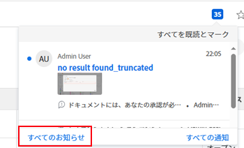

# お知らせの送信

Adobe Workfront 管理者は、お知らせページを使用してユーザーにお知らせを送信できます。

Workfront からのお知らせメッセージには通常、新機能とリリース、プロセスの変更などに関する情報が含まれています。

お知らせの表示については、[アプリ内通知の表示と管理](../../workfront-basics/using-notifications/view-and-manage-in-app-notifications.md)を参照してください。

## アクセス要件

この記事の手順を実行するには、次のアクセス権が必要です。

<table style="table-layout:auto"> 
 <col> 
 <col> 
 <tbody> 
  <tr> 
   <td role="rowheader">Adobe Workfront プラン</td> 
   <td>任意</td> 
  </tr> 
  <tr> 
   <td role="rowheader">Adobe Workfront ライセンス</td> 
   <td>プラン</td> 
  </tr> 
  <tr> 
   <td role="rowheader">アクセスレベル設定</td> 
   <td> 
Workfront 管理者である必要があります。詳しくは、<a href="../../administration-and-setup/add-users/configure-and-grant-access/grant-a-user-full-administrative-access.md" class="MCXref xref">ユーザーへの完全な管理アクセス権の付与</a>を参照してください。
 
<b>メモ</b>：まだアクセス権がない場合は、アクセスレベルに追加の制限が設定されていないかどうか Workfront 管理者にお問い合わせください。Workfront 管理者がユーザーのアクセスレベルを変更する方法については、<a href="../../administration-and-setup/add-users/configure-and-grant-access/create-modify-access-levels.md" class="MCXref xref">カスタムアクセスレベルの作成または変更</a>を参照してください。
 </td> 
  </tr> 
 </tbody> 
</table>

## ユーザーへのお知らせの送信

**お知らせ**&#x200B;ページを使用して、Workfront から送信されたお知らせを転送したり、新しいお知らせを作成したりすることで、Workfront システム内のユーザーとコミュニケーションを取ることができます。Workfront システム内の特定のユーザー、グループ、チームまたは会社にお知らせを送信できます。

* [Workfront のお知らせをユーザーに転送](#forward-workfront-announcements-to-users)
* [新しいお知らせを作成](#compose-new-announcements)

### Workfront のお知らせをユーザーに転送 {#forward-workfront-announcements-to-users}

Workfront から受け取ったメッセージを、システム内のユーザーに簡単に転送できます。

1. Workfront インターフェイスの右上隅にある&#x200B;**通知**&#x200B;アイコンをクリックしてお知らせページに移動したあと、「**すべてのお知らせ**」をクリックします。

   

1. **お知らせ**&#x200B;ページで、転送するメッセージを選択します。
1. 「**転送**」をクリックします。
1. 「**送信先**」ボックスに、お知らせメッセージを受信するユーザー、グループ、チームまたは会社の名前を入力していき、名前がドロップダウンリストに表示されたらクリックします。複数のユーザー、グループ、チームまたは会社を追加するには、このプロセスを繰り返します。

   または

   システム内のすべてのユーザーにお知らせを転送するには、**全員**&#x200B;と入力していき、ドロップダウンリストに表示されたらクリックします。

1. [新しいお知らせを作成](#compose-new-announcements)の手順 3 に進みます。

### 新しいお知らせを作成 {#compose-new-announcements}

1. Workfront インターフェイスの右上隅にある&#x200B;**通知**&#x200B;アイコンをクリックしてお知らせページに移動したあと、「**すべてのお知らせ**」をクリックします。

   

1. **お知らせ**&#x200B;ページで、「**新規お知らせ**」をクリックします。

1. 「**送信先**」ボックスに、お知らせメッセージを受信するユーザー、グループ、チームまたは会社の名前を入力していき、名前がドロップダウンリストに表示されたらクリックします。複数のユーザー、グループ、チームまたは会社を追加するには、このプロセスを繰り返します。

   デフォルトでは、新規お知らせメッセージを送信する場合、このフィールドには、**全員**&#x200B;が事前に入力されています。システム内のすべてのユーザーにお知らせメッセージが届くのを望まない場合は、リストから&#x200B;**全員**&#x200B;を削除します。

1. 次の追加情報を指定します。

   | 件名 | お知らせの件名を指定します。 |
   |---|---|
   | ここにメッセージを入力... | メッセージのコンテンツを指定します。メッセージエディターでは、太字、斜体、下線、箇条書きリスト、番号付きリスト、ハイパーリンクなどの、一般的なマークアップを含めることができます。 |
   | 添付ファイル | 「**添付ファイルを追加**」をクリックしたあと、メッセージに添付するファイルを参照して選択します。 |

   {style="table-layout:auto"}

1. （オプション）「**下書きとして保存**」をクリックして、メッセージ（受信者リスト、件名および添付ファイルを含む）をドラフトとして保存します。

1. （オプション）ドラフトを表示するには、**お知らせ**&#x200B;エリアで、「**ドラフト**」をクリックします。

1. 「**送信**」をクリックします。

   ユーザーがお知らせメッセージを表示できるようになりました（[アプリ内通知の表示および管理](../../workfront-basics/using-notifications/view-and-manage-in-app-notifications.md)を参照）。

## 受け取る Workfront のお知らせのタイプを制限

Workfront の管理者は、特定のタイプのメッセージの受信を登録解除できます。

デフォルトでは、Workfront から送信されたすべてのメッセージを受信します。これは推奨される設定です。

1. **お知らせ**&#x200B;ページで、**設定**&#x200B;をクリックします。
1. メッセージの受信を停止するトピックを選択します。
1. 「**設定を保存**」クリックします。
