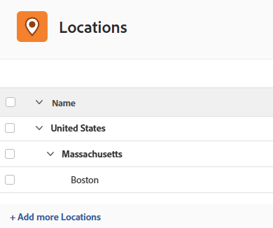

# 場所を設定

{{highlighted-preview-article-level}}

レートカードの担当業務に属性として割り当てることができるデフォルトの場所を設定できます。 これにより、評価カードが各場所の市場評価を正確に反映します。

評価カードを使用すると、組織でプロジェクトの請求レートを簡単に管理できます。詳しくは、[レートカードの管理](/help/quicksilver/administration-and-setup/manage-enterprise-operations/manage-rate-cards.md)を参照してください。

## アクセス要件

+++ 展開すると、この記事の機能のアクセス要件が表示されます。

<table style="table-layout:auto"> 
 <col> 
 <col> 
 <tbody> 
  <tr> 
   <td>[!DNL Adobe Workfront] パッケージ</td> 
   <td>ワークフロー Ultimate</td> 
  </tr> 
  <tr> 
   <td>[!DNL Adobe Workfront] ライセンス</td> 
   <td>[!UICONTROL Standard]</td>
  </tr> 
  <tr> 
   <td>アクセスレベル設定</td> 
   <td>[!UICONTROL System Administrator]</td> 
  </tr> 
 </tbody> 
</table>

詳しくは、[Workfront ドキュメントのアクセス要件](/help/quicksilver/administration-and-setup/add-users/access-levels-and-object-permissions/access-level-requirements-in-documentation.md)を参照してください。

+++

## 場所を追加

{{step-1-to-setup}}

1. 左パネルで、「[!UICONTROL **場所**]」をクリックします。
1. リストの下部にある「[!UICONTROL **さらに場所を追加**]」をクリックします。
1. 場所の名前と説明を入力します。
1. 入力領域の外側をクリックして、場所を保存します。
1. 場所を削除するには、リストで場所を選択し、**削除**&#x200B;アイコン  をクリックします。

>[!NOTE]
>
>評価カード上の担当業務に関連付けられている場所は削除できません。

## サブロケーションの追加

既存の場所にサブロケーションを追加できます。 例えば、既に英国のロケーションがある場合、ロンドンはサブロケーションになる可能性があります。

3つのレベルのサブロケーションが許可されています。 国、州または都道府県、および都市は、サブロケーションの一般的な用途です。

各サブロケーションは、トップレベルのロケーションと同じようにレートカードの属性として追加して、そのロケーションの特定のジョブロールのレートを定義できます。

{{step-1-to-setup}}

1. 左パネルで、「[!UICONTROL **場所**]」をクリックします。
1. リスト内の既存の場所を選択し、**サブ場所を追加**&#x200B;をクリックします。
1. 場所の名前と説明を入力します。
1. 入力領域の外側をクリックして、場所を保存します。

   サブロケーションは、トップレベルのロケーションの下にインデントされます。

   

