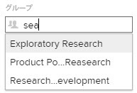

# グループの作成

<!--
DON'T DELETE, DRAFT, OR HIDE THIS ARTICLE. IT IS LINKED TO THE PRODUCT THROUGH CONTEXT-SENSITIVE HELP LINKS.
-->

Adobe Workfront 管理者は、ユーザーやプロジェクトを整理し、Workfront 内でアクセス権を割り当てるためのグループを作成できます。詳しくは、[グループの概要](../../../administration-and-setup/manage-groups/groups-overview/groups.md)を参照してください。

各サブグループには 1 人以上のグループ管理者が必要です。グループ管理者は、グループページを使用して、自分のグループを 1 か所で管理できます。

グループ管理者または Workfront 管理者の場合は、グループの下にサブグループを作成することもできます。手順について詳しくは、[サブグループの作成](../../../administration-and-setup/manage-groups/create-and-manage-subgroups/create-a-subgroup.md)を参照してください。

## アクセス要件

この記事の手順を実行するには、以下を保有している必要があります。

<table style="table-layout:auto"> 
 <col> 
 <col> 
 <tbody> 
  <tr> 
   <td role="rowheader">Workfront プラン*</td> 
   <td>任意</td> 
  </tr> 
  <tr> 
   <td role="rowheader">Adobe Workfront ライセンス*</td> 
   <td> 
プラン 
 
グループのグループ管理者または Workfront 管理者である必要があります。詳しくは、<a href="../../../administration-and-setup/manage-groups/group-roles/group-administrators.md" class="MCXref xref">グループ管理者</a>と<a href="../../../administration-and-setup/add-users/configure-and-grant-access/grant-a-user-full-administrative-access.md" class="MCXref xref">ユーザーへの完全な管理アクセス権の付与</a>を参照してください。
 </td> 
  </tr> 
 </tbody> 
</table>

&#42;ご利用のプラン、ライセンスの種類を確認するには、Workfront 管理者にお問い合わせください。

## トップレベルのグループを最初から作成

次の手順では、新しいグループを最初から作成する方法を説明します。既存のグループまたはサブグループをコピーして作成する方法については、[既存のグループまたはサブグループをコピーしてトップレベルグループを作成](#create-a-top-level-group-by-copying-an-existing-group-or-subgroup)を参照してください。

トップレベルグループを作成するには、Workfront 管理者である必要があります。

1. Adobe Workfront の右上隅にある&#x200B;**メインメニュー**&#x200B;アイコン  をクリックして、**設定**  をクリックします。

1. 左側のパネルで、**グループ**  をクリックします。

1. グループのリストの上の&#x200B;**新しいグループ**&#x200B;をクリックします。

   >[!TIP]
   >
   >グループのリストの下部で、「**さらにグループを追加**」をクリックして、インラインでグループを追加して、グループ情報の追加が終了したら、「**入力**」をクリックします。

1. 表示される「**新規グループ**」ボックスに、グループの名前を入力します。
1. 次の情報を指定します。

   <table style="table-layout:auto"> 
    <col> 
    <col> 
    <tbody> 
     <tr> 
      <td role="rowheader">グループ名</td> 
      <td>グループの名前を変更します。</td> 
     </tr> 
     <tr> 
      <td role="rowheader">説明</td> 
      <td>グループの説明を入力します。512 文字まで入力できます。</td> 
     </tr> 
     <tr> 
      <td role="rowheader">アクティブ</td> 
      <td> 
（デフォルトで有効）Workfront インスタンスでグループをアクティブ化します。
 
下図のような先行入力フィールドでは、オブジェクトの関連付けやオブジェクトの共有のために、標準ユーザーがグループを検索しようとすると、アクティブなグループのみがリストに表示されます。
 
  
 
これをユーザーが効率的に利用できるようにするには、現在使用していないグループの「アクティブ」オプションを無効にします。
 
このフィールドを使用すると、ステータスがアクティブか非アクティブかに基づいて、グループリストを簡単に表示、フィルタリング、グループ化できます。リストでのビュー、フィルターまたはグループ化の使用について詳しくは、<a href="../../../reports-and-dashboards/reports/reporting-elements/reporting-elements-filters-views-groupings.md" class="MCXref xref">レポート要素：フィルター、ビューおよびグループ化</a>を参照してください。
 </td> 
     </tr> 
     <tr> 
      <td role="rowheader">このグループとそのサブグループを公開</td> 
      <td> 
（サブグループではなく、トップレベルグループの詳細を表示している場合にのみ使用可能です）。このオプションを有効にすると、編集ユーザーのアクセス権を持つグループ内のユーザー（グループ管理者ではないユーザー）が、このグループとそのサブグループを他のユーザーのユーザープロファイルに追加できます。
 
パブリックグループの場合、編集ユーザー権限のあるユーザー（グループの内外を問わない）は、他のユーザーのプロファイルにグループを追加できます。これは、プライベートグループに対しては実行できません。
 
このオプションは、複数のレベルを持つグループの最上位階層の親グループでのみ編集できます。すべてのサブグループは親グループの設定を継承します。
 
<b>メモ</b>：  
        <ul> 
         <li>サブグループを単独での公開はできませんが、トップレベルの親グループを公開することは可能で、これにより親のサブグループもすべて公開できます。</li> 
         <li>パブリックグループに属するサブグループは、デフォルトで公開になっているので、編集ユーザーアクセス権を持つユーザーは、そのサブグループを他のユーザーにも追加できます。</li> 
        </ul> 
 
ユーザーの編集に必要なアクセスに関する情報が必要な場合は、<a href="../../../administration-and-setup/add-users/configure-and-grant-access/grant-access-other-users.md" class="MCXref xref">ユーザーにアクセス権を付与</a>を参照してください。ユーザーの編集について詳しくは、<a href="../../../administration-and-setup/add-users/create-and-manage-users/edit-a-users-profile.md" class="MCXref xref">ユーザーのプロファイルの編集</a>を参照してください。
 </td> 
     </tr> 
     <tr> 
      <td role="rowheader">ビジネスリーダー </td> 
      <td> 
管理するグループに対して、1 人のユーザーをビジネスリーダーに割り当てることができます。ビジネスリーダーとは、グループのビジネス上の決定を行う人物のことです。詳しくは、<a href="../../../administration-and-setup/manage-groups/group-roles/business-leader-overview.md" class="MCXref xref">ビジネスリーダーの概要</a>を参照してください。
 
ユーザーがまだグループのメンバーでない場合は、このフィールドに名前を追加すると、そのユーザーもグループに追加されます。
 
<b>メモ</b>：  
        <ul> 
         <li>グループからビジネスリーダーを削除する前に、「ビジネスリーダー」フィールドから名前を削除する必要があります。</li> 
         <li>ビジネスリーダーフィールドから名前を削除した場合、そのユーザーはグループから削除されない限り、グループのメンバーのままでいます。グループからユーザーを削除する手順については、<a href="../../../administration-and-setup/manage-groups/create-and-manage-groups/manage-a-group.md" class="MCXref xref">グループの管理</a>の記事にある<a href="../../../administration-and-setup/manage-groups/create-and-manage-groups/manage-a-group.md#manage" class="MCXref xref">グループのメンバーシップの管理</a>の節を参照してください。</li> 
        </ul> 
 
詳しくは、<a href="../../../administration-and-setup/manage-groups/group-roles/business-leader-overview.md" class="MCXref xref">ビジネスリーダーの概要</a>を参照してください。
 </td> 
     </tr> 
     <tr> 
      <td role="rowheader">グループのメンバーおよびグループ管理者</td> 
      <td> 
       <ul> 
        
グループメンバーを追加するには、追加する既存のユーザーまたはグループの名前を入力し、表示されたら名前を選択します。
 
        
追加したユーザーとグループは、そのグループと共有されるすべてのオブジェクトにアクセスできます。

        
最上位のグループには、1 人以上のグループ管理者が必要です。 
 
       </ul> </td> 
     </tr> 
     <tr> 
      <td role="rowheader">リスト内でユーザーとグループを検索する</td> 
      <td> 既にこのグループに割り当てられているユーザーまたはグループを検索する必要がある場合は、ここに名前を入力し、表示されたときに選択できます。</td> 
     </tr> 
    </tbody> 
   </table>

1. 「**グループを作成**」をクリックします。

## 既存のグループまたはサブグループをコピーして最上位グループを作成 {#create-a-top-level-group-by-copying-an-existing-group-or-subgroup}

Workfront 管理者は、既存のグループまたはサブグループをコピーして、新しい最上位グループを作成できます。

これを行う場合は、以下の点に注意してください。

* 既存のグループに属するすべてのメンバーとサブグループが、新しい最上位グループにコピーされます。
* コピーされたグループのメンバーは、元のグループでの割り当てを保持します。したがって、元のグループのグループ管理者は、コピーされたグループのグループ管理者にも指定されます。

グループまたはサブグループをコピーして新しい最上位グループを作成するには、以下のようにします。

1. Adobe Workfront の右上隅で&#x200B;**メインメニュー**&#x200B;アイコンをクリックし、次に「**設定**」をクリックします。

1. 左側のパネルで、**グループ**  をクリックします。

   表示されるリストで、管理しているグループと、その中のサブグループを確認できます。Adobe Workfront 管理者は、すべてのグループを表示できます。

1. コピーするグループを選択し、コピーアイコン  をクリックします。
1. 表示される&#x200B;**グループのコピー**&#x200B;ボックスに、コピーしたグループの&#x200B;**グループ名**&#x200B;を入力します。

1. 次の情報を指定します。

   <table style="table-layout:auto"> 
    <col> 
    <col> 
    <tbody> 
     <tr> 
      <td role="rowheader">グループ名</td> 
      <td>グループの名前を変更します。</td> 
     </tr> 
     <tr> 
      <td role="rowheader">説明</td> 
      <td>グループの説明を入力します。512 文字まで入力できます。</td> 
     </tr> 
     <tr> 
      <td role="rowheader">アクティブ</td> 
      <td> 
（デフォルトで有効）Workfront インスタンスでグループをアクティブ化します。
 
下図のような先行入力フィールドでは、オブジェクトの関連付けやオブジェクトの共有のために、標準ユーザーがグループを検索しようとすると、アクティブなグループのみがリストに表示されます。
 
  
 
これをユーザーが効率的に利用できるようにするには、現在使用していないグループの「アクティブ」オプションを無効にします。
 
このフィールドを使用すると、ステータスがアクティブか非アクティブかに基づいて、グループリストを簡単に表示、フィルタリング、グループ化できます。リストでの表示、フィルター、グループ化の使用について詳しくは、<a href="../../../reports-and-dashboards/reports/reporting-elements/reporting-elements-filters-views-groupings.md" class="MCXref xref" data-mc-variable-override="">レポート要素：フィルター、表示およびグループ化</a>を参照してください。
  </td> 
     </tr> 
     <tr> 
      <td role="rowheader">このグループとそのサブグループを公開</td> 
      <td> 
（サブグループではなく、トップレベルグループの詳細を表示している場合にのみ使用可能です）。このオプションを有効にすると、編集ユーザーのアクセス権を持つグループ内のユーザー（グループ管理者ではないユーザー）が、このグループとそのサブグループを他のユーザーのユーザープロファイルに追加できます。
 
パブリックグループの場合、編集ユーザー権限のあるユーザー（グループの内外を問わない）は、他のユーザーのプロファイルにグループを追加できます。これは、プライベートグループに対しては実行できません。
 
このオプションは、複数のレベルを持つグループの最上位階層の親グループでのみ編集できます。すべてのサブグループは親グループの設定を継承します。
 
<b>メモ</b>：  
        <ul> 
         <li>サブグループを単独での公開はできませんが、トップレベルの親グループを公開することは可能で、これにより親のサブグループもすべて公開できます。</li> 
         <li>パブリックグループに属するサブグループは、デフォルトで公開になっているので、編集ユーザーアクセス権を持つユーザーは、そのサブグループを他のユーザーにも追加できます。</li> 
        </ul> 
 
ユーザーの編集に必要なアクセスに関する情報が必要な場合は、<a href="../../../administration-and-setup/add-users/configure-and-grant-access/grant-access-other-users.md" class="MCXref xref" data-mc-variable-override="">ユーザーにアクセス権を付与</a>を参照してください。ユーザーの編集について詳しくは、<a href="../../../administration-and-setup/add-users/create-and-manage-users/edit-a-users-profile.md" class="MCXref xref" data-mc-variable-override="">ユーザーのプロファイルの編集</a>を参照してください。
 </td> 
     </tr> 
     <tr> 
      <td role="rowheader">ビジネスリーダー </td> 
      <td> 
管理するグループに対して、1 人のユーザーをビジネスリーダーに割り当てることができます。ビジネスリーダーとは、グループのビジネス上の決定を行う人物のことです。詳しくは、<a href="../../../administration-and-setup/manage-groups/group-roles/business-leader-overview.md" class="MCXref xref" data-mc-variable-override="">ビジネスリーダーの概要</a>を参照してください。
 
ユーザーがまだグループのメンバーでない場合は、このフィールドに名前を追加すると、そのユーザーもグループに追加されます。
 
<b>メモ</b>：  
        <ul> 
         <li>グループからビジネスリーダーを削除する前に、「ビジネスリーダー」フィールドから名前を削除する必要があります。</li> 
         <li>ビジネスリーダーフィールドから名前を削除した場合、そのユーザーはグループから削除されない限り、グループのメンバーのままでいます。グループからユーザーを削除する手順については、<a href="../../../administration-and-setup/manage-groups/create-and-manage-groups/manage-a-group.md" class="MCXref xref" data-mc-variable-override="">グループの管理</a>の記事にある<a href="../../../administration-and-setup/manage-groups/create-and-manage-groups/manage-a-group.md#manage" class="MCXref xref" data-mc-variable-override="">グループのメンバーシップの管理</a>の節を参照してください。</li> 
        </ul> 
 
詳しくは、<a href="../../../administration-and-setup/manage-groups/group-roles/business-leader-overview.md" class="MCXref xref" data-mc-variable-override="">ビジネスリーダーの概要</a>を参照してください。
 </td> 
     </tr> 
     <tr> 
      <td role="rowheader">グループのメンバーおよびグループ管理者</td> 
      <td> 
       <ul> 
        <li> 
グループメンバー：グループにユーザーとグループを追加するには、追加する既存のユーザーまたはグループの名前を入力し、表示されたら名前を選択します。
 
追加したユーザーとグループは、そのグループと共有されるすべてのオブジェクトにアクセスできます。
 </li> 
        <li> 
グループ管理者：元のグループのグループ管理者は、コピーしたグループのグループ管理者にも指定されます。ユーザー名の右にあるドロップダウンメニューを使用して、グループメンバーをグループの管理者として割り当てることができます。
 
トップレベルのグループには、1 人以上のグループ管理者が必要です。
 </li> 
       </ul> </td> 
     </tr> 
     <tr> 
      <td role="rowheader">リスト内でユーザーとグループを検索する</td> 
      <td> 既にこのグループに割り当てられているユーザーまたはグループを検索する必要がある場合は、ここに名前を入力し、表示されたときに選択できます。</td> 
     </tr> 
    </tbody> 
   </table>

   >[!NOTE]
   >
   >* 元のグループにサブグループが含まれている場合、サブグループは新しいグループに追加され、その名前はデフォルトで「元のサブグループ名（コピー）」になります。
   >* ユーザーまたはサブグループの名前の右側にある X をクリックすると、元のグループからユーザーまたはサブグループを削除できます。

1. 「**グループを作成**」をクリックします。
